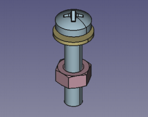
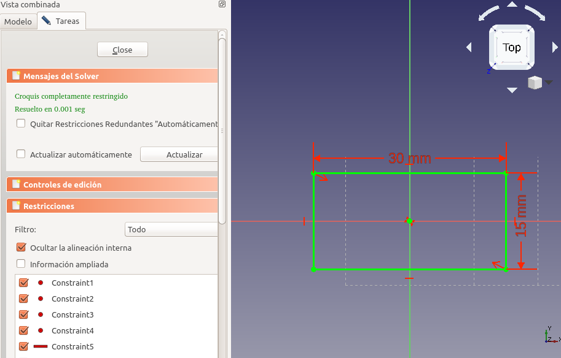
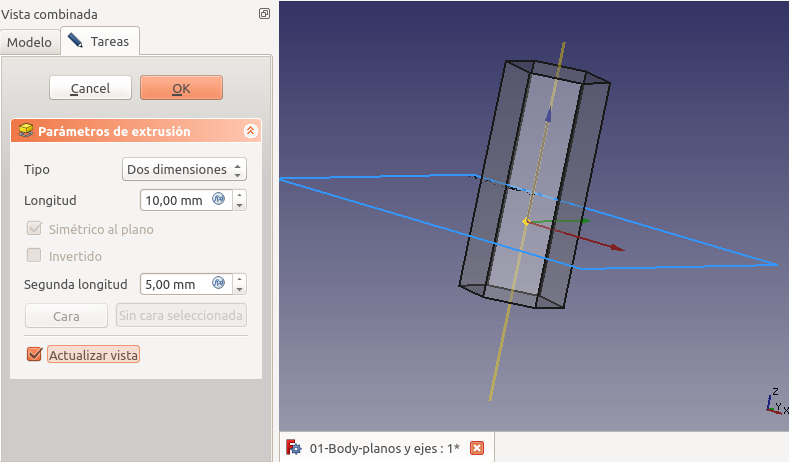
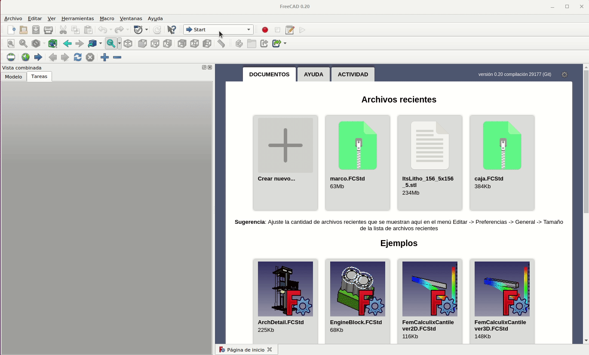

#  2. Banco de trabajo PartDesign

En este apartado usaremos diferentes métodos en los que crearemos un 'cuerpo o Body' usando los bancos de trabajo 'PartDesign' y 'Sketcher o croquizador'. Las técnicas son un poco más complejas que en el apartado 1, pero nos dan mucho más control sobre nuestros diseños.

A partir de la versión 0.17 de FreeCAD para trabajar con bocetos desde el banco de trabajo PartDesign es necesario que exista al menos un cuerpo o body, veamos el concepto de cuerpo en que consiste:

>Un cuerpo PartDesign está diseñado para modelar un solo sólido continuo. El significado de "continuo" hace referencia a un elemento hecho en una sola pieza, sin partes móviles o sólidos desconectados. Ejemplos de sólidos continuos son una tuerca, una arandela y un tornillo (Figura 2.1) en que cada uno es una sola pieza sólida sin partes móviles, por lo que cada uno puede ser modelado por un cuerpo PartDesign.  
Una vez que estos sólidos continuos se unen en algún tipo de disposición, se convierten en un "ensamblaje", como se observa en la Figura 2.2. En un ensamblaje, los objetos no se fusionan, sino que simplemente se "apilan" o se colocan uno al lado del otro, y siguen siendo partes individuales. 

  
*Figura 2.1. Tres sólidos continuos, cada uno de ellos modelado por un cuerpo PartDesign*

  
*Figura 2.2. Los tres cuerpos individuales ensamblados*

Al crear un Body se crea un objeto Origin que incluye los ejes X, Y y Z, y los planos estándar que delimitan el espacio. En la Figura 2.3 vemos estos elementos.

  
*Figura 2.3. Elementos añadidos cuando se crea un Body*

Estos elementos se pueden utilizar como referencias para bocetos y objetos primitivos.

Cuando hablamos de un cuerpo como un sólido continuo significa que lo podemos mover como una unidad sin variar las características individuales. Podemos crear múltiples cuerpos para poder crear ensambles. En la Figura 2_4 vemos el entorno inicial con una figura simple incluida.

  
*Figura 2.4. Sólido, ejes y planos*

## **2.1. Creación de un boceto. Restricciones**
Si estando en el banco de trabajo PartDesign creamos directamente un boceto se creará de forma automática un cuerpo que lo contenga. En cualquier caso se nos va a mostrar la opción de escoger en que plano queremos crear nuestro boceto, como vemos en la Figura 2.5, donde se ha seleccionado el plano XY.

  
*Figura 2.5. Selección de plano XY al crear boceto*

Una vez creado el boceto dibujamos un rectángulo de forma que el origen de coordenadas quede en su interior. Esto se hace simplemente seleccionando la herramienta, haciendo clic en la ventana 3D y arrastrando el cursor del ratón.

A medida que aprendamos a aplicar restricciones, nos daremos cuenta de que hay muchas formas diferentes de lograr los mismos resultados. Vamos a aplicar una primera restricción de simetría de dos vértices diagonales respecto al origen de coordenadas. Este tipo de restricción diagonal hace que nuestro rectángulo esté centrado al origen de coordenadas. Para restringir los lados del rectángulo, vamos a seleccionar primero un lado horizontal haciendo clic con el botón izquierdo sobre el mismo, ahora nos dirigimos al icono de cota horizontal y al hacer clic nos aparecerá el dialogo 'Insertar longitud' donde escribimos los 30 mm que queremos. Ahora vamos a realizar un acotado vertical, para ello seleccionamos el icono de cota vertical y hacemos clic sobre uno de los lados verticales, apareciendo de nuevo el diálogo 'Insertar longitud' que vamos a establecer en 15 mm. En la animación de la Figura 2.6 observamos estos procesos y como van disminuyendo los grados de libertad hasta llegar a boceto 100% restringido.

  
*Figura 2.6. Dibujo y restricción de un rectángulo*

***

> **- Consejo:**

***

Todas las restricciones aplicadas hacen que nuestro boceto tenga cero grados de libertad, o sea que está totalmente restringido y por ello se muestra en color verde.Si deseamos cambiar alguno de estos valores, hacemos doble clic en la restricción de cota en la ventana del visor 3D y se volverá a abrir el cuadro de diálogo. Cuando creamos el rectángulo vemos que el solucionador de bocetos agrega automáticamente algunas restricciones, por ejemplo, que una línea sea vertical u horizontal. En la F2_7 tenemos el resultado final.

  
*Figura 2.7. Boceto completamente restringido*

Ya podemos salir de la tarea y proceder a extruir nuestro boceto una determinada longitud, por ejemplo 5 cm, obteniendo el resultado que vemos en la Figura 2.8.

  
*Figura 2.8. Sólido a partir de extrusión de boceto*

## **2.2. La normal de un plano**
Cada plano tiene sus propios ejes de coordenadas X, Y, Z que se conocen como ejes locales y que vemos en la Figura 2.9.

  
*Figura 2.9. Plano y sus ejes de coordenadas locales*

La normal a un plano es un vector perpendicular al mismo que coincide con el eje Z local. En la Figura 2.10 vemos representado el vector perpendicular al plano XY y se observa como coincide con el eje Z local.

  
*Figura 2.10. Vector normal al plano XY*

Cuando creamos un boceto FreeCAD nos sitúa en una vista en la que el vector normal al plano escogido apunta hacia nosotros, como se observa en la Figura 2.11, donde hemos rotado mínimamente la vista original para que se aprecie el vector normal.

  
*Figura 2.11. Visualización del vector normal al crear boceto*

## **2.3. Tipos de extrusión**
La extrusión tipo cota de un boceto se realiza siguiendo la trayectoria del vector normal al plano y puede ser de tres formas posibles, como vemos en la Figuras 2.12a, 2.12b y 2.12c.

  
*Figura 2.12a. Extrusión tipo cota en plano XY: valores positivos*

  
*Figura 2.12b. Extrusión tipo cota en plano XY: valores negativos*

  
*Figura 2.12c. Extrusión tipo cota en plano XY: simétrico al plano*

Uno de los tipos de extrusión interesante que vemos aplicado en este ejemplo y que en particular resulta útil es el de 'dos dimensiones' que vemos en la Figura 2.13.

  
*Figura 2.13. Extrusión de tipo dos dimensiones*

Esto mismo va a ocurrir con el plano de referencia XZ y su vector normal que coincide con el eje Y, como vemos en la Figuras 2_14a, 2.14b y 2.14c con un sólido triangular.

  
*Figura 2.14a. Extrusión tipo cota en plano XZ: valores positivos*

  
*Figura 2.14b. Extrusión tipo cota en plano XZ: valores negativos*

  
*Figura 2.14c. Extrusión tipo cota en plano XZ: simétrico al plano*

En las Figuras 2.15a, 2.15b y 2.15c vemos el proceso para el plano YZ y su vector normal, que lógicamente coincide con el eje X. En este caso usamos un cilindro como sólido.

  
*Figura 2.15a. Extrusión tipo cota en plano YZ: valores positivos*

  
*Figura 2.15b. Extrusión tipo cota en plano YZ: valores negativos*

  
*Figura 2.15c. Extrusión tipo cota en plano YZ: simétrico al plano*

Con los tres sólidos creados podemos hacer una operación booleana de unión y obtener un modelo 3D en el que se ven los cuerpos, los planos de referencia, los vectores normales y por supuesto la cruz de ejes de referencia del sistema. En la Figura 2.16 lo vemos claramente.

  
*Figura 2.16. Modelo 3D resultado de la unión de tres sólidos*

En la animación de la Figura 2.17 vemos el resultado de aplicar la herramienta 'Ver torno' al objeto de la Figura 2.16.

  
*Figura 2.17. Ver torno*

En la animación de la Figura 2.18 podemos observar el funcionamiento de la opción 'Dos dimensiones' con los ángulos de afilado para tener una nueva opción de creación de piezas.

  
*Figura 2.18. Angulos de afilado en extrusión de dos dimensiones*

## **2.4. Banco de trabajo Sketcher (croquizador)**
Además de la forma descrita de crear un boceto existe otra muy similar, aunque no idéntica, que está disponible desde el banco de trabajo Sketcher.

Podemos crear un croquis a partir del menú Sketch o a través del icono correspondiente.

Si no hemos seleccionado nada, se preguntará por la orientación del croquis, tal y como vemos en la Figura 2.18.

  
*Figura 2.19. Selección de la orientación del croquis*

Tenemos que seleccionar el plano dónde queremos que descanse el croquis que estamos creando.

Si seleccionamos 'Reverse direction', el croquis se creará en la parte posterior del plano seleccionado, o sea, como dibujar en la parte trasera de la hoja de papel. El Offset o desplazamiento moverá el croquis perpendicularmente al plano seleccionado en la magnitud establecida.

## **2.5. Diseño completo de una pieza 3D**
Vamos a diseñar paso a paso una pieza 3D siguiendo el [Tutorial básico de Part Design 0.17](https://wiki.freecadweb.org/Basic_Part_Design_Tutorial_017/es). La pieza a crear es la de la Figura 2.20. En el enlace anterior se dan todas las dimensiones necesarias para completar la tarea. Vamos a comenzar por crear una forma central a partir de un boceto base y luego construir sobre esa forma, agregando lo que se conoce como "Características". Estas características agregarán material o eliminarán material del sólido mediante el uso de bocetos adicionales y las operaciones de funciones que lo acompañan. Aunque no vamos a usar todas las características y herramientas disponibles dentro del banco de trabajo 'Part Design', si vamos a usar lo suficiente para obtener una base mínima sobre la cual desarrollar mas conocimientos y habilidades.

  
*Figura 2.20. Aspecto final de la pieza a diseñar y plano acotado*

Básicamente se trata de seguir el tutorial y lo haremos exactamente en el mismo orden y con los mismos pasos a partir de animaciones que nos indiquen visualmente como se hace cada paso.

### 2.5.1. Comienzo
La animación de la Figura 2.21 muestra el proceso inicial de creación del body y el boceto con elección del plano YZ como plano de trabajo.

  
*Figura 2.21. Creación del boceto y archivado del trabajo*

### 2.5.2. Dibujar y restringir el boceto
En la animación de la Figura 2.22 vemos el proceso.

  
*Figura 2.22. Dibujo y acotado*

### 2.5.3. Extrusión del boceto
Las cotas del dibujo muestran que la pieza mide 53 mm de largo. Podemos extruir nuestro boceto en dos dimensiones haciendo la extrusión simétrica al plano del boceto, para ello introducimos una longitud de 26,5 (53/2) mm para cada sentido. También podemos introducir una longitud única de 53 mm y hacer una extrusión normal o simétrica al plano. Una vez realizada la extrusión tenemos nuestro sólido al que vamos a agregar características adicionales para construir nuestra pieza. En la animación de la Figura 2.23 vemos como hacer la extrusión en dos dimensiones. Para mejora de la visualización se pone visible el plano YZ.

  
*Figura 2.23. Extrusión simétrica al plano YZ*

### 2.5.4. Creación de los huecos laterales
Giramos el modelo para poder ver su cara posterior y hacemos clic sobre esta cara posterior para que quede seleccionada. Ahora hacemos clic sobre el icono de nuevo boceto y lo que ocurre es que se crea un nuevo boceto teniendo como plano de referencia la cara posterior del objeto. Dibujamos un rectángulo en el nuevo boceto y procedemos a restringirlo según las dimensiones que establece el ejercicio de 5 y 11 mm. Finalmente utilizamos la herramienta de geometría externa para seleccionar el vértice superior derecho y seleccionando este vèrtice y el mas cercano al mismo del rectángulo establecemos una restricción de coincidencia para esos puntos y cerramos el boceto haciendo clic en OK. Ahora localizamos la herramienta Pocket (hueco), que es la opuesta a la herramienta extrusión, y eliminamos el material correspondiente al boceto creado escogiendo 'A través de todos' del menú desplegable. En la animación de la Figura 2.24 vemos todo el proceso.

  
*Figura 2.24. Eliminación de material de la pieza con la herramienta Pocket*

Para crear el hueco del extremo opuesto podríamos proceder de manera similar a la anterior, pero vamos a aprovechar la situación de simetría para utilizar la herramienta de creación de simetrias del banco de trabajo PartDesign. Esta operación se realiza seleccionando el objeto Pocket en el árbol de objetos para dirigirnos a la herramienta de simetría seleccionando el plano YZ como eje para la misma, tal y como vemos en la animación de la Figura 2.25. Esto crea un nuevo objeto con nombre Mirrored

  
*Figura 2.25. Eliminación de material por simetría*

### 2.5.5. Creación de los resaltes laterales
Procediendo de una forma muy similar a la vista para los rebajes pero utilizando la herramienta de extrusión creamos los dos resaltes que tiene la pieza atendiendo a sus dimensiones de 16,6 x 7 mm con una longitud de extrusión de 26 mm en sentido inverso al plano de creación del boceto. En la animación de la Figura 2.26 vemos el proceso completo.

  
*Figura 2.26. Creación de extrusiones por simetría*

### 2.5.6. Creación del hueco frontal
En los datos dele ejercicio nos dan las dimensiones de este hueco sobre la cara inclinada de la parte frontal de la pieza. En la animación de la Figura 2.27 tenemos el proceso de creación del hueco frontal de 17 x 17 mm creando las restricciones de igualdad y cotas necesarias.

  
*Figura 2.27. Creación del hueco frontal inicial*

Observamos que la dirección del hueco es perpendicular al plano inclinado, lógicamente, pero la dirección del hueco que pretendemos crear es perpendicular a la cara posterior del pieza. Es evidente que por geometría descriptiva podríamos calcular las dimensiones de la proyección y hacer la operación desde la cara posterior, pero FreeCAD nos ofrece herramientas que nos permiten hacer lo mismo sin necesidad de recurrir a esos conocimientos.

Para continuar lo primero que haremos será eliminar la operación de ahuecado pero sin eliminar el boceto creado. Ahora hacemos visible la cara posterior de la pieza, la seleccionamos y creamos un nuevo boceto sobre esta. El objeto 3D nos impide ver el boceto que tenemos en la cara inclinada y que tiene las dimensiones deseadas. Para hacerlo visible nos cambiamos en la ventana 'Vista combinada' y utilizando la barra espaciadora ocultamos la pieza. Ahora creamos dos aristas auxiliares sobre el boceto de la cara inclinada y hacemos coincidir los puntos del nuevo cuadrado con estas aristas auxiliares. Ya podemos proceder a crear un Pocket a través de todos y obtendremos la pieza final. En la animación de la Figura 2.28 vemos este proceso.

  
*Figura 2.28. Creación del hueco frontal final*

En la figura 2.29 vemos el aspecto final de la pieza creada con algunos retoques y a la que hemos puesto como nombre 2-Pieza-1.

  
*Figura 2.29. Pieza final final*

## **2.6. Archivos y resultados finales**
En la tabla siguiente tenemos los enlaces para descargar el archivo del diseño que hemos realizado como ejemplo de la sección, otros formatos de archivo y una imagen del resultado impreso de la pieza diseñada.

| Archivos | Captura del laminador | Imagen del resultado final |
|-:-|-:-|-:-|
|  [Diseño](../img/designs/2/2-Pieza-1.FCStd)  [STL](../img/designs/2/2-Pieza-1.stl)  [3MF](../img/designs/2/2-Pieza-1.3mf)  [STEP](../img/designs/2/2-Pieza-1.step)  |  |  |

## **2.7. Ejercicio propuesto**
A partir de los datos indicados en los bocetos de la Figura 2.30 diseñar la pieza que se propone. En el enlace está disponible el [archivo de diseño o fuente](../img/designs/2/2-Pieza-2.FCStd) por si necesitamos consultar algún detalle.

  
*Figura 2.30. Cotas para la pieza del ejercicio propuesto*

