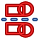
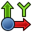
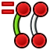
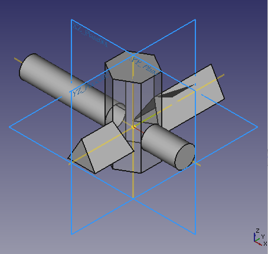

#  2. Banco de trabajo PartDesign

En este apartado usaremos diferentes métodos en los que crearemos un 'cuerpo o Body' usando los bancos de trabajo 'PartDesign' y 'Sketcher o croquizador'. Las técnicas son un poco más complejas que en el apartado 1, pero nos dan mucho más control sobre nuestros diseños.

A partir de la versión 0.17 de FreeCAD para trabajar con bocetos desde el banco de trabajo PartDesign es necesario que exista al menos un cuerpo o body, veamos el concepto de cuerpo en que consiste:

>Un cuerpo PartDesign está diseñado para modelar un solo sólido continuo. El significado de "continuo" hace referencia a un elemento hecho en una sola pieza, sin partes móviles o sólidos desconectados. Ejemplos de sólidos continuos son una tuerca, una arandela y un tornillo (Figura 2.1) en que cada uno es una sola pieza sólida sin partes móviles, por lo que cada uno puede ser modelado por un cuerpo PartDesign.  
Una vez que estos sólidos continuos se unen en algún tipo de disposición, se convierten en un "ensamblaje", como se observa en la Figura 2.2. En un ensamblaje, los objetos no se fusionan, sino que simplemente se "apilan" o se colocan uno al lado del otro, y siguen siendo partes individuales. 

  
*Figura 2.1. Tres sólidos continuos, cada uno de ellos modelado por un cuerpo PartDesign*

  
*Figura 2.2. Los tres cuerpos individuales ensamblados*

Al crear un Body se crea un objeto Origin que incluye los ejes X, Y y Z, y los planos estándar que delimitan el espacio. En la Figura 2.3 vemos estos elementos.

  
*Figura 2.3. Elementos añadidos cuando se crea un Body*

Estos elementos se pueden utilizar como referencias para bocetos y objetos primitivos.

Cuando hablamos de un cuerpo como un sólido continuo significa que lo podemos mover como una unidad sin variar las características individuales. Podemos crear múltiples cuerpos para poder crear ensambles. En la Figura 2_4 vemos el entorno inicial con una figura simple incluida.

  
*Figura 2.4. Sólido, ejes y planos*

## **2.1. Creación de un boceto. Restricciones**
Si estando en el banco de trabajo PartDesign creamos directamente un boceto se creará de forma automática un cuerpo que lo contenga. En cualquier caso se nos va a mostrar la opción de escoger en que plano queremos crear nuestro boceto, como vemos en la Figura 2.5, donde se ha seleccionado el plano XY.

  
*Figura 2.5. Selección de plano XY al crear boceto*

Cuando iniciamos un boceto es conveniente mantener seleccionadas las opciones de la Figura 2.5b para que las restricciones redundantes se eliminen de forma automática y para que los cambios en el boceto se reflejen en la ventana gráfica sin necesidad de pulsar el botón señalado.

  
*Figura 2.5b. Opciones que es conveniente tener seleccionadas*

Una vez creado el boceto dibujamos un rectángulo de forma que el origen de coordenadas quede en su interior. Esto se hace simplemente seleccionando la herramienta, haciendo clic en la ventana 3D y arrastrando el cursor del ratón.

En la animación siguiente vemos el efecto que tiene seleccionar o no las opciones indicadas en la Figura 2.5b cuando intentamos aplicar una restricción de perpendicularidad a dos líneas que se cruzan, una vertical y la otra horizontal.

  
*Ventaja de tener seleccionadas las opciones de la Figura 2.5b*

A medida que aprendamos a aplicar restricciones, nos daremos cuenta de que hay muchas formas diferentes de lograr los mismos resultados. Vamos a aplicar una primera restricción de simetría de dos vértices diagonales respecto al origen de coordenadas. Este tipo de restricción diagonal hace que nuestro rectángulo esté centrado al origen de coordenadas. Para restringir los lados del rectángulo, vamos a seleccionar primero un lado horizontal haciendo clic con el botón izquierdo sobre el mismo, ahora nos dirigimos al icono de cota horizontal y al hacer clic nos aparecerá el dialogo 'Insertar longitud' donde escribimos los 30 mm que queremos. Ahora vamos a realizar un acotado vertical, para ello seleccionamos el icono de cota vertical y hacemos clic sobre uno de los lados verticales, apareciendo de nuevo el diálogo 'Insertar longitud' que vamos a establecer en 15 mm. En la animación de la Figura 2.6 observamos estos procesos y como van disminuyendo los grados de libertad hasta llegar a boceto 100% restringido.

  
*Figura 2.6. Dibujo y restricción de un rectángulo*

***

> **- Consejo:**

***

Todas las restricciones aplicadas hacen que nuestro boceto tenga cero grados de libertad, o sea que está totalmente restringido y por ello se muestra en color verde.Si deseamos cambiar alguno de estos valores, hacemos doble clic en la restricción de cota en la ventana del visor 3D y se volverá a abrir el cuadro de diálogo. Cuando creamos el rectángulo vemos que el solucionador de bocetos agrega automáticamente algunas restricciones, por ejemplo, que una línea sea vertical u horizontal. En la F2_7 tenemos el resultado final.

  
*Figura 2.7. Boceto completamente restringido*

***

> **- Consejo:**

***

En la animación de la Figura 2.7b vemos, a partir de las líneas ya creadas, una forma interesante de acotar distancias que simplifica la selección. Consiste en seleccionar una línea inclinada a la que aplicamos restricciones de dimensión vertical y horizontal sin necesidad de seleccionar los vértices de la línea.

  
*Figura 2.7b. Acotar distancias de forma sencilla*

Ya podemos salir de la tarea y proceder a extruir nuestro boceto una determinada longitud, por ejemplo 5 cm, obteniendo el resultado que vemos en la Figura 2.8.

  
*Figura 2.8. Sólido a partir de extrusión de boceto*

### Utilidad de poner nombre a las cotas
Cuando activamos la herramienta cota sobre, por ejemplo, una línea, además de la opción de poner la dimensión de la cota podemos ponerle un nombre con el que posteriormente podremos hacer referencia a esa cota. En la animación de la figura siguiente vemos como funciona esto y además se ve para que sirve la casilla de selección ‘Referencia’, que es convertir la cota en cota de referencia o auxiliar.

  
*Como poner nombre a una cota*

En la animación siguiente vemos como utilizar este nombre para dar una altura del cuadrado en función de una fórmula y la cota nombrada Horizontal y de la misma forma para la altura de la parte triangular.

  
*Como usar nombre de una cota*

El color naranja de las cotas nos indica que no son acotaciones directas del elemento sino dependiente de un cálculo con otro elemento.

### Flujo de trabajo con bocetos

* Un boceto o croquis siempre tiene dos dimensiones (2D) o lo que es lo mismo, es bidimensional. Para crear un sólido, se crea un boceto 2D de una úníca área cerrada y luego se extruye o revoluciona para agregar la tercera dimensión, creando así un sólido 3D a partir del boceto 2D.
* Si un croquis tiene segmentos que se cruzan entre sí, lugares donde un punto no está directamente en un segmento o lugares donde hay espacios entre los puntos finales de segmentos adyacentes, Las herramientas de extrusión y revolución no crearán un sólido. Es por tanto muy conveniente evitar cruzar las líneas salvo, logicamente, si se trata de líneas de construcción o auxiliares (color azul) a las que no se aplica esta regla.
* Dentro de un área cerrada podemos tener áreas más pequeñas, también cerradas,  que no se superpongan. Estas áreas se convertirán en vaciados cuando se crea el sólido 3D.
* Una vez que un boceto está completamente restringido se pone de color verde y por lo general se puede dar por "terminado" y es adecuado para la creación de un sólido 3D.

### Herramientas
Las herramientas para bocetos se encuentran en el banco de trabajo Sketcher que se carga automáticamente cuando se está editando un boceto.

* <b>Generales</b>

|Icono|Uso|Descripción|
|:-:|---|---|
||Crear boceto|Crea un nuevo boceto en la cara o plano seleccionado. Si no seleccionamos nada se solicitará la selección de un plano de los mostrados|
||Editar boceto|Edita el boceto seleccionado|
||Salir del boceto|Sale del modo edición del boceto|
||Ver boceto|Establece la vista del modelo perpendicular al plano del boceto|
||Vista en sección|Crea una sección que oculta temporalmente todo lo que esté por encima del boceto|
||Asignar boceto a cara|Asigna el boceto a la cara previamente seleccionada de un sólido|
||Reorientar boceto|Permite orientar el boceto a uno de los planos principales|
||Validar boceto|Verifica la tolerancia y ajuste de diferentes puntos|
||Combinar bocetos|Combina dos o mas bocetos|
||Reflejar boceto|Refleja un boceto respecto a los ejes X o Y o al origen|
||Detener operación|Detiene la operación actual en modo edición|

* <b>De Dibujo</b>

Son todas las herramientas que se utilizan para crear bocetos que no vamos a exponer de forma individualizada pues las estaremos usando de manera continua. No obstante, en el [enlace a la wiki](https://wiki.freecad.org/Sketcher_Workbench) las podemos consultar.

* <b>Restricciones geométricas</b>

Se trata de restricciones no asociadas a datos numéricos.

|Icono|Uso|Descripción|
|:-:|---|---|
||Coincidente|Coloca un punto en coincidencia con uno o más puntos. Si los puntos son centros de círculos, elipses o arcos crea una restricción concéntrica|
||Punto en objeto|Coloca un punto sobre otro objeto como una línea, un arco o un eje|
||Vertical|Se aplica una restricción de verticalidad a la línea o líneas seleccionadas|
||Horizontal|Se aplica una restricción de horizontalidad a la línea o líneas seleccionadas|
||Paralelo|Restringe a dos o mas lineas a ser paralelas entre si|
||Perpendicular|Restringe a dos líneas a ser penpendiculares entre si o a una línea al punto final de un arco|
||Tangente|Crea una restricción tangente entre dos entidades selecionadas o una restricción colineal entre dos segmentos de línea. Un segmento no tiene que estar sobre un arco o círculo para ser tangente a ese arco o cículo|
||Igual|Restringe a dos entidades seleccionadas a ser iguales entre si. Si se trata de arcos o círculos se igualan los radios|
||Simétrico|Restringe dos puntos simétricamente sobre una línea o los dos primeros puntos seleccionados sobre un tercer punto seleccionado|
||Bloquear|Bloquea el movimiento de una arista evitando que sus vértices cambien sus posiciones actuales|

* <b>Restricciones dimensionales</b>

Estas son restricciones asociadas con datos numéricos, para las cuales se pueden usar expresiones. Los datos pueden ser obtenidos de una hoja de cálculo.

|Icono|Uso|Descripción|
|:-:|---|---|
||Bloquear|Restringe el elemento seleccionado al establecer distancias verticales y horizontales en relación con el origen, bloqueando así la ubicación del elemento. Estas distancias se pueden editar posteriormente|
||Distancia horizontal|Fija la distancia horizontal entre dos puntos o entre los puntos finales de una línea. Si solo se selecciona un elemento, la distancia se establece al origen|
||Distancia vertical|Fija la distancia vertical entre dos puntos o entre los puntos finales de una línea. Si solo se selecciona un elemento, la distancia se establece al origen|
||Distancia|Define restringiendo la longitud de una línea seleccionada o la distancia entre dos puntos|
||Radio|Define el radio de un arco o círculo seleccionado mediante la restricción del radio|
||Diámetro|Define el diámetro de un arco o círculo seleccionado mediante la restricción del radio|
||RadioDiámetro|Automáticamente define el diámetro/radio de un círculo/arco seleccionado mediante la restricción del diámetro/radio|
||Ángulo|Define el ángulo interno en grados entre dos líneas seleccionadas|

* <b>Restricciones especiales</b>

|Icono|Uso|Descripción|
|:-:|---|---|
||[Ley de Snell](https://es.wikipedia.org/wiki/Ley_de_Snell)|Obliga a dos líneas a obedecer una ley de refracción para simular la luz que atraviesa una interfaz|
||Alineación interna|Alinea los elementos seleccionados con la forma seleccionada (por ejemplo, una línea para convertirse en el eje principal de una elipse)|

* <b>Herramientas de restricción</b>

Se pueden utilizar para cambiar el efecto de las restricciones.

|Icono|Uso|Descripción|
|:-:|---|---|
||Alternar entre dibujo y referencia|Alterna las restricciones dimensionales entre de dibujo y auxiliares|
||Activar/desactivar restricción|Habilita o desabilita una restricción existente|

* <b>Herramientas de boceto</b>

|Icono|Uso|Descripción|
|:-:|---|---|
||Seleccionar DoF sin restricciones|Resalta en verde la geometría con grados de libertad (DOF), es decir, no totalmente restringida|
||Cerrar forma|Cierra los puntos finales con coincidencia. Herramienta obsoleta que desaparecerá en versión 1.0 y posteriores|
||Conectar bordes|Conecta elementos del boceto aplicando restricciones coincidentes a los puntos finales. Herramienta obsoleta que desaparecerá en versión 1.0 y posteriores|
||Seleccionar restricciones asociadas|Selecciona las restricciones de un boceto|
||Seleccionar geometría asociada|Selecciona los elementos del boceto asociados con las restricciones|
||Selecciona restricciones redundantes|Selecciona las restricciones redundantes de un boceto|
||Selecciona restricciones en conflicto|Selecciona las restricciones en conflicto de un boceto|
||Mostrar/ocultar geometría interna|Muestra las líneas auxiliares de una elipse, arco de elipse/hipérbola/parábola o B-spline seleccionada|
||Seleccionar origen|Seleccionar el origen de un boceto|
||Selecciona el eje vertical|Selecciona el eje vertical de un boceto|
||Selecciona el eje horizontal|Selecciona el eje horizontal de un boceto|
||Simetria|Copia los elementos seleccionados de un boceto de forma simétrica a una línea elegida|
||Clonar|Clona los elementos seleccionados de un boceto|
||Copiar|Copia los elementos seleccionados de un boceto|
||Mover|Mueve la geometría seleccionada tomando como referencia el último punto seleccionado|
||Matriz rectangular|Crea una matriz lineal de los elementos seleccionados de un boceto|
||Quitar la alineación de los ejes|Quita la alineación de los ejes al intentar conservar la relación de restricción de la selección|
||Eliminar toda la geometria|Elimina toda la geometría del boceto|
||Eliminar todas las restricciones|Elimina todas las restricciones del boceto|

* <b>Herramientas B-apline de boceto</b>

Mas adelante estudiaremos este tipo de líneas con mas detalle.

|Icono|Uso|
|:-:|---|
||Grado|
||Mostrar/ocultar el polígono de control B-spline|
||Mostrar/ocultar el peine de curvatura B-spline|
||Mostrar/ocultar multiplicidad de nudos B-spline|
||Mostrar/ocultar el peso del punto de control B-spline|
||Convertir geometría a B-spline|
||Aumentar el grado B-spline|
||Disminuir el grado B-spline|
||Aumentar la multiplicidad de nudos|
||Disminuir la multiplicidad de nudos|
||Insertar nudo|
||Unir curvas , introducido en la versión 1.0|

* <b>Espacio virtual</b>

|Icono|Uso|Descripción|
|:-:|---|---|
||Cambiar a espacio virtual|Permite ocultar todas las restricciones de un boceto y hacerlas visibles nuevamente|

### Mejores prácticas
Con el tiempo, cada usuario de software CAD desarrolla su propia forma de trabajar, pero hay algunos principios generales útiles que todos deberiamos seguir.

* Una serie de bocetos simples es más fácil de manejar que uno solo muy complejo. Por ejemplo, se puede crear un primer croquis para la función 3D base (ya sea una plataforma o una revolución), mientras que un segundo puede contener agujeros o recortes (bolsillos). Se pueden omitir algunos detalles, para realizarlos más adelante.
* Es conveniente evitar filetes en el boceto si hay demasiados y agregarlos como una función 3D.
* Crear siempre un perfil cerrado, o el boceto no producirá un sólido, sino un conjunto de caras abiertas. Si no queremos que algunos de los objetos se incluyan en la creación sólida, podemos convertirlos en elementos de construcción.
* Utilizar la función de restricciones automáticas para limitar la cantidad de restricciones que agregamos manualmente.
* Como regla general, se aplican primero las restricciones geométricas, luego las restricciones dimensionales y el bloquo del boceto en último lugar. Pero debemos recordar: las reglas están hechas para romperse. Si tenemos problemas para manipular el boceto, puede ser útil restringir algunos objetos primero antes de completar su perfil.
* Si es posible, centramos el boceto en el origen (0,0) con la restricción de bloqueo. Si el boceto no es simétrico, ubicamos uno de sus puntos en el origen o elegimos números enteros para las distancias de bloqueo.
* Si se tiene la posibilidad de elegir entre la restricción de longitud y las restricciones de distancia horizontal o vertical, elegiremos esta última. Las restricciones de distancia horizontal y vertical son computacionalmente más simples.
* En general, las mejores restricciones para usar son:

    * Restricciones Horizontales y Verticales
    * Restricciones de longitud horizontal y vertical
    * Tangencia punto a punto

* Si es posible, limitamos el uso de estas:

    *  Restricción de longitud general
    *  Restricción de tangencia de borde a borde
    *  Fijar punto en una restricción de línea
    *  Restricción de simetría.

### Como crear una restricción de intersección
No existe, al menos cuando se realiza esta web, la restricción de intersección pero podemos hacerla a partir de la restricción de un punto en un objeto. Partimos de la situación de la figura siguiente:

  
*Planteamiento para restricción de intersección*

Lo que pretendemos es crear una restricción en la intersección mostrada. Ahora podemos apreciar como llevar a cabo dicha restricción observando la animación de la Figura siguiente:

  
*Creación de la  para restricción de intersección*

Para trabajar este aspecto vamos a realizar el diseño de una hoja de sierra circular para metales que tiene 136mm de diámetro, un orificio central de 20mm de diámetro, un espesor de 1,2mm y dispone de 48 dientes con la forma que vemos en la Figura siguiente:

  
*Aspecto y tamaño del diente de la hoja de sierra*

Comenzamos por dibujar el disco base de la sierra creando un body y un boceto y acontadolo tal y como vemos en la Figura siguiente:

  
*Boceto del disco base de la sierra*

Una vez terminado el boceto lo cerramos y extruimos una longitud de 1,2mm.

Sobre el plano de la cara superior creamos un nuevo boceto y en el mismo seleccionamos el círculo exterior del disco como arista de referencia y creamos las líneas y círculos auxiliares con la forma y cotas que vemos en la Figura siguiente:

  
*Preparativos para dibujar el diente*

Ahora procedemos a dibujar el perfil del diente aplicando la forma de crear restricciones de intersección y con el aspecto de la Figura siguiente:

*Boceto final del diente*

Finalizado el boceto del diente cerramos el mismo y creamos un vaciado, obteniendo el resultado siguiente:

*Disco con un solo diente*

Con el vaciado seleccionados escogemos 'Patron polar' de la barra de iconos y configuramos con las opciones que vemos a la izquierda de la Figura siguiente, donde vemos el disco final realizado.

*Disco de sierra final*

En los enlaces siguiente están disponibles los archivos de la hoja de sierra circular para metal con una añadido final mediante B-spline no visto anteriormente.

|Archivo|Tipo|Descripción|
|---|:-:|---|
|[src.FCStd](../img/designs/2/hoja-sierra-metal/src.FCStd)|FreeCAD|Archivo fuente de diseño en FreeCAD|
|[hoja-sierra-circular.stl](../img/designs/2/hoja-sierra-metal/hoja-sierra-circular.stl)|STL|Archivo en formato stl|
|[hoja-sierra-circular.step](../img/designs/2/hoja-sierra-metal/hoja-sierra-circular.step)|STEP|Archivo en formato step|

### Herramientas empalme, recorte, alarga y divide
Se trata del grupo de herramientas que vemos en la Figura siguiente:

  
*Iconos de las herramientas empalme, recorte, alarga y divide*

<b>Empalme</b>

La herramienta empalme dispone de las dos opciones que vemos en la figura siguiente:

  
*Opciones de la herramienta empalme*

Para usarla simplemente hacemos clic sobre el icono en la que queramos usar, observando como esta queda enganchada al cursor, y ahora simplemente es hacer un clic en una de las líneas y otro en la otra para que se realice el empalme. El radio del arco va a depender un poco de los puntos donde hacemos clic en las líneas, pero en cualquier caso no es muy importante pues no queda restringido de forma automática a ningún valor, por lo que tendremos que hacerlo nosotros.

La funcionalidad de ambas herramientas es la misma, crear un arco de un determinado radio para empalmar mediante el mismo dos líneas que se cortan entre si o que se interseccionan, y la diferencia entre ambas es que una lo hace conservando las restricciones previamente creadas y la otra no. Vemos el funcionamiento de ambos tipos en la animación de la Figura siguiente.

  
*Funcionamiento de las opciones de la herramienta empalme*

La herramienta también funciona entre línea y arco y entre arco y arco. Cuando se trata de líneas que se interseccionan se puede simplificar el procedimiento pues basta con hacer clic en el punto de intersección para que se produzca el empalme. Vemos este funcionamiento en la animación de la Figura siguiente.

  
*Funcionamiento de empalme entre arcos y líneas que se interseccionan*

<b>Recorte</b>

La herramienta recortar es también sencilla de utilizar y su uso es similar al de la de empalme. Vamos a partir de un cruce de líneas y arcos como el de la figura siguiente, en el que se han marcado las zonas que pretendemos eliminar.

  
*Ejemplo para usar la herramienta recortar*

Siendo la idea obtener el reesultado que vemos en la figura siguiente:

  
*Ejemplo tras aplicar recortar*

Vemos el funcionamiento de la herramienta para realizar el ejemplo anterior en la animación de la Figura siguiente, donde podemos apreciar como se marca el trozo que se va a eliminar mediante unos pequeños círculos verdes en sus extremos.

  
*Funcionamiento de la herramienta recorte*

<b>Alargar</b>

El funcionamiento de alargar o extender borde es sencillo, basta con seleccionar que se quiere extender y hasta donde, pero hay que tener cuidado porque si los elementos que intervienen no están restringidos es posible que sufran modificaciones porque el programa entienda que son necesarias. En la animación siguiente vemos el efecto de alargar dos líneas diferentes hasta un arco y como la segunda, que no está restringida inicialmente, se mueve de posición. Cuando creamos una restricción del vértice de la línea por el que no se alargará vemos como ya no se mueve, lógicamente, aunque ahora es el arco el que lo hace porque si no es imposible que la línea llegue al arco.

  
*Funcionamiento de la herramienta alargar*

También es posible extender arcos.

<b>Dividir</b>

Esta herramienta divide una arista en dos y las restricciones aplicables existentes se copian en la nueva arista. La posición del punto donde se encuentran los bordes no está restringida. Las curvas periódicas (círculos, elipses y B-splines periódicos) se convierten en curvas no periódicas (respectivamente, arcos de círculos, arcos de elipses y B-splines no periódicos).

Seleccionamos la herramienta y hacemos clic en el borde en el lugar donde deseamos dividirlo. A partir de los bordes de la línea y el arco, se crearán dos nuevos, conectados en el punto en el que se hizo clic. Un círculo se convierte en un arco con el mismo punto central y otras restricciones que tuviese el círculo original. En la animación siguiente vemos el funcionamiento.

  
*Funcionamiento de la herramienta dividir*

## **2.2. La normal de un plano**
Cada plano tiene sus propios ejes de coordenadas X, Y, Z que se conocen como ejes locales y que vemos en la Figura 2.9.

  
*Figura 2.9. Plano y sus ejes de coordenadas locales*

La normal a un plano es un vector perpendicular al mismo que coincide con el eje Z local. En la Figura 2.10 vemos representado el vector perpendicular al plano XY y se observa como coincide con el eje Z local.

  
*Figura 2.10. Vector normal al plano XY*

Cuando creamos un boceto FreeCAD nos sitúa en una vista en la que el vector normal al plano escogido apunta hacia nosotros, como se observa en la Figura 2.11, donde hemos rotado mínimamente la vista original para que se aprecie el vector normal.

  
*Figura 2.11. Visualización del vector normal al crear boceto*

## **2.3. Tipos de extrusión**
La extrusión tipo cota de un boceto se realiza siguiendo la trayectoria del vector normal al plano y puede ser de tres formas posibles, como vemos en la Figuras 2.12a, 2.12b y 2.12c.

  
*Figura 2.12a. Extrusión tipo cota en plano XY: valores positivos*

  
*Figura 2.12b. Extrusión tipo cota en plano XY: valores negativos*

  
*Figura 2.12c. Extrusión tipo cota en plano XY: simétrico al plano*

Uno de los tipos de extrusión interesante que vemos aplicado en este ejemplo y que en particular resulta útil es el de 'dos dimensiones' que vemos en la Figura 2.13.

  
*Figura 2.13. Extrusión de tipo dos dimensiones*

Esto mismo va a ocurrir con el plano de referencia XZ y su vector normal que coincide con el eje Y, como vemos en la Figuras 2_14a, 2.14b y 2.14c con un sólido triangular.

  
*Figura 2.14a. Extrusión tipo cota en plano XZ: valores positivos*

  
*Figura 2.14b. Extrusión tipo cota en plano XZ: valores negativos*

  
*Figura 2.14c. Extrusión tipo cota en plano XZ: simétrico al plano*

En las Figuras 2.15a, 2.15b y 2.15c vemos el proceso para el plano YZ y su vector normal, que lógicamente coincide con el eje X. En este caso usamos un cilindro como sólido.

  
*Figura 2.15a. Extrusión tipo cota en plano YZ: valores positivos*

  
*Figura 2.15b. Extrusión tipo cota en plano YZ: valores negativos*

  
*Figura 2.15c. Extrusión tipo cota en plano YZ: simétrico al plano*

Con los tres sólidos creados podemos hacer una operación booleana de unión y obtener un modelo 3D en el que se ven los cuerpos, los planos de referencia, los vectores normales y por supuesto la cruz de ejes de referencia del sistema. En la Figura 2.16 lo vemos claramente.

  
*Figura 2.16. Modelo 3D resultado de la unión de tres sólidos*

En la animación de la Figura 2.17 vemos el resultado de aplicar la herramienta 'Ver torno' al objeto de la Figura 2.16.

  
*Figura 2.17. Ver torno*

En la animación de la Figura 2.18 podemos observar el funcionamiento de la opción 'Dos dimensiones' con los ángulos de afilado para tener una nueva opción de creación de piezas.

  
*Figura 2.18. Angulos de afilado en extrusión de dos dimensiones*

## **2.4. Banco de trabajo Sketcher (croquizador)**
Además de la forma descrita de crear un boceto existe otra muy similar, aunque no idéntica, que está disponible desde el banco de trabajo Sketcher.

Podemos crear un croquis a partir del menú Sketch o a través del icono correspondiente.

Si no hemos seleccionado nada, se preguntará por la orientación del croquis, tal y como vemos en la Figura 2.18.

  
*Figura 2.19. Selección de la orientación del croquis*

Tenemos que seleccionar el plano dónde queremos que descanse el croquis que estamos creando.

Si seleccionamos 'Reverse direction', el croquis se creará en la parte posterior del plano seleccionado, o sea, como dibujar en la parte trasera de la hoja de papel. El Offset o desplazamiento moverá el croquis perpendicularmente al plano seleccionado en la magnitud establecida.

## **2.5. Diseño completo de una pieza 3D**
Vamos a diseñar paso a paso una pieza 3D siguiendo el [Tutorial básico de Part Design 0.17](https://wiki.freecadweb.org/Basic_Part_Design_Tutorial_017/es). La pieza a crear es la de la Figura 2.20. En el enlace anterior se dan todas las dimensiones necesarias para completar la tarea. Vamos a comenzar por crear una forma central a partir de un boceto base y luego construir sobre esa forma, agregando lo que se conoce como "Características". Estas características agregarán material o eliminarán material del sólido mediante el uso de bocetos adicionales y las operaciones de funciones que lo acompañan. Aunque no vamos a usar todas las características y herramientas disponibles dentro del banco de trabajo 'Part Design', si vamos a usar lo suficiente para obtener una base mínima sobre la cual desarrollar mas conocimientos y habilidades.

  
*Figura 2.20. Aspecto final de la pieza a diseñar y plano acotado*

Básicamente se trata de seguir el tutorial y lo haremos exactamente en el mismo orden y con los mismos pasos a partir de animaciones que nos indiquen visualmente como se hace cada paso.

### 2.5.1. Comienzo
La animación de la Figura 2.21 muestra el proceso inicial de creación del body y el boceto con elección del plano YZ como plano de trabajo.

  
*Figura 2.21. Creación del boceto y archivado del trabajo*

### 2.5.2. Dibujar y restringir el boceto
En la animación de la Figura 2.22 vemos el proceso.

  
*Figura 2.22. Dibujo y acotado*

### 2.5.3. Extrusión del boceto
Las cotas del dibujo muestran que la pieza mide 53 mm de largo. Podemos extruir nuestro boceto en dos dimensiones haciendo la extrusión simétrica al plano del boceto, para ello introducimos una longitud de 26,5 (53/2) mm para cada sentido. También podemos introducir una longitud única de 53 mm y hacer una extrusión normal o simétrica al plano. Una vez realizada la extrusión tenemos nuestro sólido al que vamos a agregar características adicionales para construir nuestra pieza. En la animación de la Figura 2.23 vemos como hacer la extrusión en dos dimensiones. Para mejora de la visualización se pone visible el plano YZ.

  
*Figura 2.23. Extrusión simétrica al plano YZ*

### 2.5.4. Creación de los huecos laterales
Giramos el modelo para poder ver su cara posterior y hacemos clic sobre esta cara posterior para que quede seleccionada. Ahora hacemos clic sobre el icono de nuevo boceto y lo que ocurre es que se crea un nuevo boceto teniendo como plano de referencia la cara posterior del objeto. Dibujamos un rectángulo en el nuevo boceto y procedemos a restringirlo según las dimensiones que establece el ejercicio de 5 y 11 mm. Finalmente utilizamos la herramienta de geometría externa para seleccionar el vértice superior derecho y seleccionando este vèrtice y el mas cercano al mismo del rectángulo establecemos una restricción de coincidencia para esos puntos y cerramos el boceto haciendo clic en OK. Ahora localizamos la herramienta Pocket (hueco), que es la opuesta a la herramienta extrusión, y eliminamos el material correspondiente al boceto creado escogiendo 'A través de todos' del menú desplegable. En la animación de la Figura 2.24 vemos todo el proceso.

  
*Figura 2.24. Eliminación de material de la pieza con la herramienta Pocket*

Para crear el hueco del extremo opuesto podríamos proceder de manera similar a la anterior, pero vamos a aprovechar la situación de simetría para utilizar la herramienta de creación de simetrias del banco de trabajo PartDesign. Esta operación se realiza seleccionando el objeto Pocket en el árbol de objetos para dirigirnos a la herramienta de simetría seleccionando el plano YZ como eje para la misma, tal y como vemos en la animación de la Figura 2.25. Esto crea un nuevo objeto con nombre Mirrored

  
*Figura 2.25. Eliminación de material por simetría*

### 2.5.5. Creación de los resaltes laterales
Procediendo de una forma muy similar a la vista para los rebajes pero utilizando la herramienta de extrusión creamos los dos resaltes que tiene la pieza atendiendo a sus dimensiones de 16,6 x 7 mm con una longitud de extrusión de 26 mm en sentido inverso al plano de creación del boceto. En la animación de la Figura 2.26 vemos el proceso completo.

  
*Figura 2.26. Creación de extrusiones por simetría*

### 2.5.6. Creación del hueco frontal
En los datos dele ejercicio nos dan las dimensiones de este hueco sobre la cara inclinada de la parte frontal de la pieza. En la animación de la Figura 2.27 tenemos el proceso de creación del hueco frontal de 17 x 17 mm creando las restricciones de igualdad y cotas necesarias.

  
*Figura 2.27. Creación del hueco frontal inicial*

Observamos que la dirección del hueco es perpendicular al plano inclinado, lógicamente, pero la dirección del hueco que pretendemos crear es perpendicular a la cara posterior del pieza. Es evidente que por geometría descriptiva podríamos calcular las dimensiones de la proyección y hacer la operación desde la cara posterior, pero FreeCAD nos ofrece herramientas que nos permiten hacer lo mismo sin necesidad de recurrir a esos conocimientos.

Para continuar lo primero que haremos será eliminar la operación de ahuecado pero sin eliminar el boceto creado. Ahora hacemos visible la cara posterior de la pieza, la seleccionamos y creamos un nuevo boceto sobre esta. El objeto 3D nos impide ver el boceto que tenemos en la cara inclinada y que tiene las dimensiones deseadas. Para hacerlo visible nos cambiamos en la ventana 'Vista combinada' y utilizando la barra espaciadora ocultamos la pieza. Ahora creamos dos aristas auxiliares sobre el boceto de la cara inclinada y hacemos coincidir los puntos del nuevo cuadrado con estas aristas auxiliares. Ya podemos proceder a crear un Pocket a través de todos y obtendremos la pieza final. En la animación de la Figura 2.28 vemos este proceso.

  
*Figura 2.28. Creación del hueco frontal final*

En la figura 2.29 vemos el aspecto final de la pieza creada con algunos retoques y a la que hemos puesto como nombre 2-Pieza-1.

  
*Figura 2.29. Pieza final final*

## **2.6. Ejemplo derivación Y de tubo con cambio de sección**
Vamos a desarrollar paso a paso una derivación en Y para tubo de entrada rectangular de 300x200mm y dos salidas circulares de 200mm de diámetro. El espesor de las paredes será de 10mm y la forma básica vista en alzado tendrá el aspecto que vemos en la figura 2.30. El ángulo del eje para crear la adición tiene 120º de abertura.

  
*Figura 2.30. Alzado de partida para realizar el ejercicio*

Comenzamos por dibujar un boceto como el de la figura 2.31. Este boceto representa al eje que se ve en la figura de partida y nos va a servir para crear dos planos de referencia que pasen por los puntos finales y sean perpendiculares a las aristas respectivas. Sobre estos planos crearemos los bocetos rectangulares y circulares para crear entre ello una 'Proyección aditiva' y así poder obtener la mitad de la Y.

  
*Figura 2.31. Boceto del eje*

En la animación de la figura figura 2.32 vemos como se crean los planos de referencia citados.

  
*Figura 2.32. Creación de los planos de referencia*

En la figura 2.33 vemos el boceto de la parte rectangular que se hace sobre el plano inferior.

  
*Figura 2.33. Boceto de la parte rectangular*

En la figura 2.34 vemos el boceto de la parte circular que se hace sobre el plano inclinado superior.

  
*Figura 2.34. Boceto de la parte circular*

En la animación de la figura 2.35 vemos como crear la proyección aditiva a partir de los bocetos creados y con el resto de elementos utilizados ocultos desde el árbol de objetos. Una vez cerrada la tarea observamos que la proyección, aunque está bien, no tiene las proyecciones de las cuatro caras del rectángulo divididas de forma regular en el círculo, y esto es debido a que en el cículo no hay cuatro puntos de referencia y el programa los ha escogido como ha querido.

  
*Figura 2.35. Creación de la Proyección aditiva*

Si queremos solucionar el problema planteado tenemos que dividir los círculos en 4 arcos que describan la misma figura, lo que originará tantos puntos como vértices tiene el rectángulo. En la animación de figura 3.36 vemos la parte final de como hacer el boceto modificado con arcos.

  
*Figura 2.36. Mejora de la creación de la Proyección aditiva*

Para recortar la parte sobrante y poder realizar una simetría vamos a crear un boceto en el plano XZ de un rectángulo y con el mismo un vaciado a través de todos y simétrico al plano. Vemos el proceso completo en la animación de la figura 2.37, donde observamos que las dimensiones del rectángulo no son importante, tan solo que sobrepase al sólido y que coincida su lado con el origen.

  
*Figura 2.37. Corte de la Proyección aditiva*

Para crear la Y final basta con duplicar el body existente, rotarlo 180º y crear una operación de unión booleana entre ambas partes, tal y como vemos en la animación de la figura 2.38.

  
*Figura 2.38. Creación de la Y final*

## **2.7. Archivos y resultados finales**
En la tabla siguiente tenemos los enlaces para descargar el archivo del diseño que hemos realizado como ejemplo de la sección, otros formatos de archivo y una imagen del resultado impreso de la pieza diseñada.

| Archivos | Captura del laminador | Imagen del resultado final |
|-:-|-:-|-:-|
|  [Diseño](../img/designs/2/2-Pieza-1.FCStd)  [STL](../img/designs/2/2-Pieza-1.stl)  [3MF](../img/designs/2/2-Pieza-1.3mf)  [STEP](../img/designs/2/2-Pieza-1.step)  |  |  |

El archivo de diseño [Y.FCStd](../img/designs/2/Y/Y.FCStd) lo podemos descargar para ver el diseño completo.

## **2.8. Ejercicio propuesto**
A partir de los datos indicados en los bocetos de la Figura 2.39 diseñar la pieza que se propone. En el enlace está disponible el [archivo de diseño o fuente](../img/designs/2/2-Pieza-2.FCStd) por si necesitamos consultar algún detalle.

  
*Figura 2.39. Cotas para la pieza del ejercicio propuesto*

