#  2bis. Ampliaciones sobre el banco de trabajo PartDesign
Con el fin de no desordenar el apartado 2 en este se irán introduciendo funcionalidades no vistas o mejoras sobre el banco de trabajo.

## **Descripción del árbol de objetos**
Saber que es cada elemento que aparece en el árbol de objetos es importante para identificar el flujo de trabajo seguido y resolver problemas en nuestros diseños. Vamos a describir muy brevemente que es cada cosa a partir de la Figura siguiente:

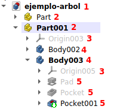  
*Árbol de objetos*

<b>1.</b> En el momento que guardamos el trabajo y le ponemos nombre aparece este como cabecera del árbol.

<b>2.</b> El siguiente nivel del árbol es la pieza aunque este no es un elemento obligatorio.

<b>3.</b> Origen de coordenadas que permite mostrar los ejes y planos de la pieza o body. Se crea automáticamente al crear cualquiera de los dos elementos.

<b>4.</b> Dentro de cada pieza se pueden poner tantos bodys o cuerpos como sean necesarios. Estos a su vez tendrán su propio origen de coordenadas local con sus ejes y planos. Cada body representa la parte del total (pieza) que corresponda. Por ejemplo, imaginemos una caja (pieza) que construimos con la base, paredes y tapa encajando unas piezas con otras. Las partes base, pared y tapa con bodys que al unirlos formas la pieza. Solamente uno de los cuerpos puede ser el activo y es sobre el que se aplican las operaciones sobre sus elementos. Las piezas se hacen realmente necesarias cuando se trabaja con ensambles, pues estos se realizan con piezas y no con bodys.

<b>5.</b> Diferentes operaciones realizadas con los bocetos que se han ido creando.

## **Revolución**
La herramienta 'Revolución' crea un sólido al girar un croquis u objeto 2D seleccionado alrededor de un eje dado. En la Figura siguiente ([obtenida en la wiki de FreeCAD](https://wiki.freecad.org/PartDesign_Revolution)) al boceto A se le hace girar 270º alrededor del eje B resultando el sólido C.

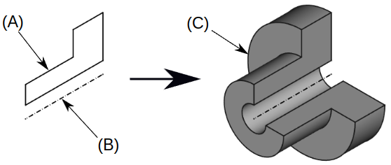  
*Ejemplo de revolución*

Para usar la herramienta seleccionamos el boceto o cara de un sólido existente, se pulsa el botón revolución y se establecen los parámetros de la misma en la ventana de opciopnes, donde debemos escoger el eje o la línea de referencia y el ángulo que se revolucionará el boceto. Marcvar o no marcar las opciones disponibles de "Simétrico al plano, Invertido y Actualizar vista" hacen que estas se realicen o no.

Vamos a desarrollar un ejemplo para usar la herramienta, se trata de diseñar inicialmente la pieza que vemos en la figura siguiente.

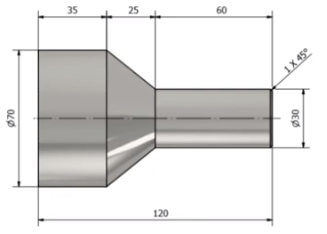  
*Pieza de referencia*

Esta pieza en principio va a ser sólida pero le vamos a añadir una derivación o empalme de un trozo de tubo y finalmente la ahuecaremos para crear una especie de embudo con una pared de 2mm de espesor. Creamos un boceto con la mitad de la pieza que respete las medidas, tal y como vemos en la figura siguiente.

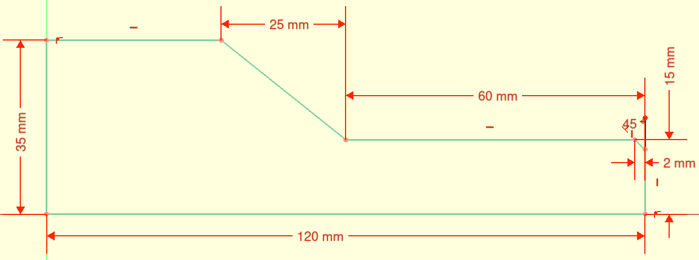  
*Boceto de la mitad de la pieza de referencia*

En la animación siguiente vemos como crear la revolución para obtener el sólido inicial.

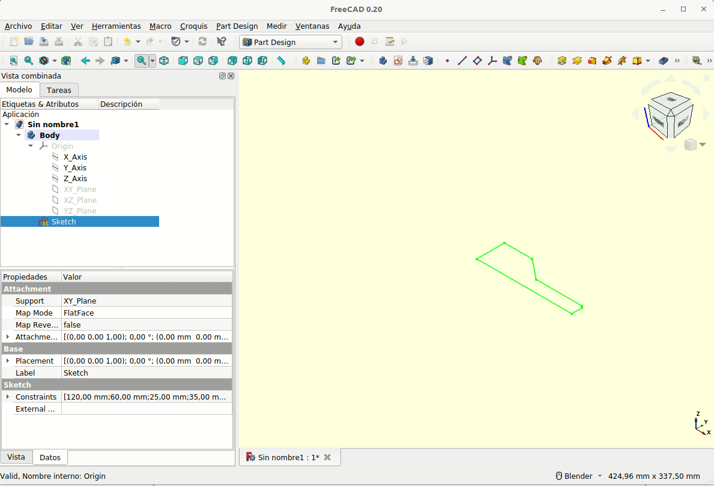  
*Revolucionando el boceto de la mitad de la pieza de referencia*

Ahora creamos un nuevo boceto en el plano XZ como el que vemos en la figura siguiente:

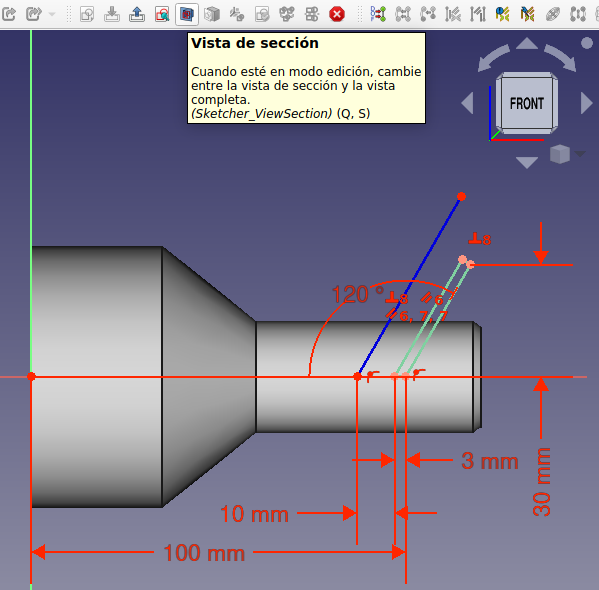  
*Boceto para añadir el tubo*

La herramienta 'Vista de sección' destacada permite ver al completo el boceto que estamos creando sin alterar la pieza original ni ocultarla.

En la animación siguiente vemos como crear la revolución del nuevo boceto seleccionando como eje la línea auxiliar dibujada.

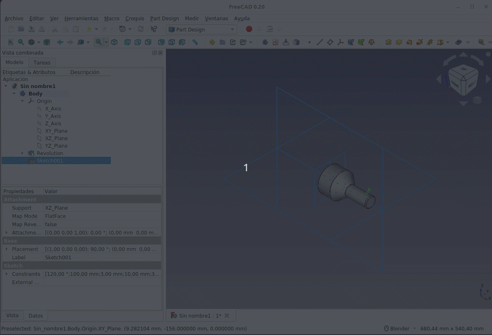  
*Revolucionando el boceto del tubo añadido*

Ahora nos queda crear el vaciado y configurarlo tal y como vemos en la animación siguiente.

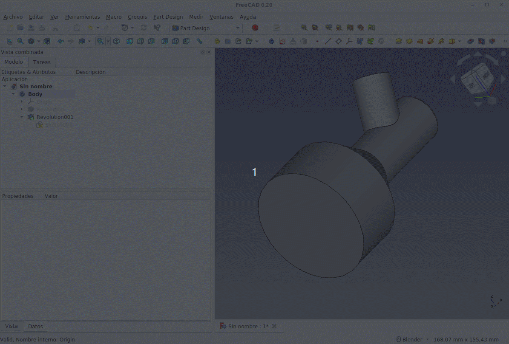  
*Creación del embudo por vaciado*

En el enlace tenemos disponible el archivo [embudo.FCStd](../img/designs/2bis/embudo.FCStd) para descargarlo y ver como está realizado. Se ha añadido un redondeo a modo de soldadura entre el tubo y el cuerpo del embudo.

## Vaciado por revolución
Vamos a explicar una forma de diseño concreta utilizando para ello la idea de crear una bañera con el vaso centrado en una primera versión y con el vaso descentrado en la segunda. Nos vamos a basar en dimensiones reales de una bañera comercial a escala 1:10 para acercar nuestro modelo a la realidad. Las dimensiones la iremos viendo según avanzamos en el diseño, pero se pueden seguir otras medidas si lo deseamos.

* <b>Vaso centrado</b>

Comenzamos por crear el boceto de la Figura siguiente con todas sus restricciones, siendo estas las medidas exteriores de la bañera vista en planta.

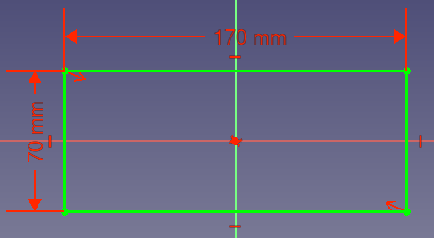  
*Boceto de partida para la bañera*

Extruimos el boceto 40mm o mas, como veremos posteriormente esta longitud no es determinante salvo por el hecho de que debe ser mayor que la profundidad exterior del vaso. Sobre el plano de la cara superior del sólido creamos un nuevo boceto como el que vemos en la figura siguiente.

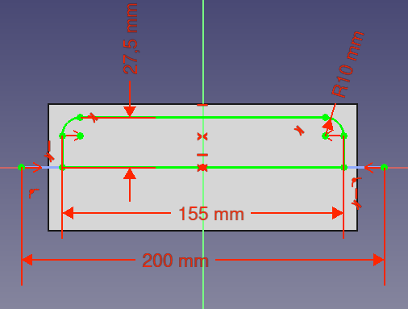  
*Boceto para crear el vaso*

Como vemos el boceto lo hemos dibujado centrado sobre el eje pero también hemos creado una línea auxiliar para crear la revolución de vaciado utilizándola como eje de rotación.

En este punto vamos a indicar que un diseño como este hay muchas formas de llevarlo a cabo y que siempre debemos buscar aquella que resulte lo mas sencilla posible y que genere un árbol de objetos también lo mas simple posible. Evidentemente lo hagamos como lo hagamos la pieza final debe tener la forma y dimensiones correctas.

***

> **- Consejo:**

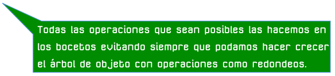

***

La línea auxiliar se ha restringido simplemente con el objetivo de que el boceto quede totalmente restringido, pero no es necesario hacerlo ni tiene que ser como está en el ejemplo. La única cosa importante de esta línea es que sea horizontal y coincidente con el eje para que el vaso salga centrado. Con el boceto seleccionado en el árbol nos dirigimos a la herramienta 'Ranura' (Groove) y se nos muestra una ventana como la de la figura siguiente:

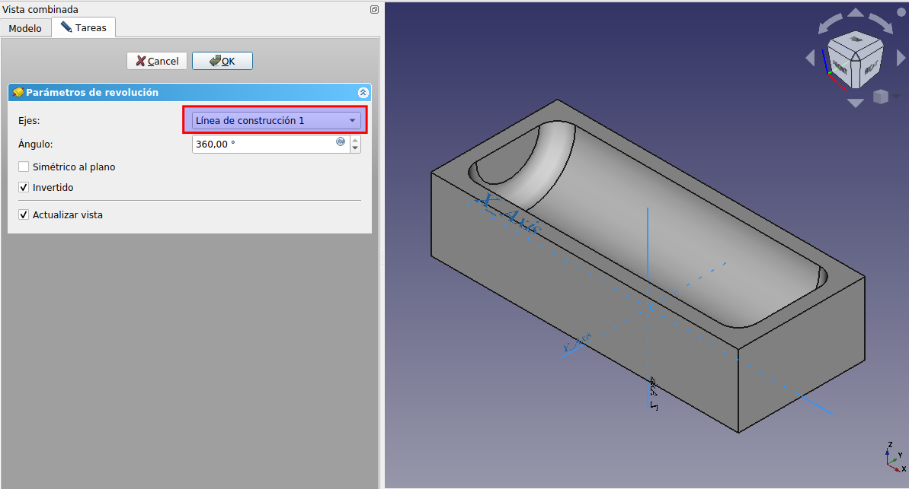  
*Ventana de configuración de Ranura*

Para este caso si dejamos los 360º se creará el vaso y no es necesario tener marcada la opción 'Invertido', pero si lo será si ponemos un ángulo de 180º. Se ha destacado la elección del eje de giro utilizado, que es nuestra línea de construcción. Nuestro diseño en este momento tendrá el aspecto que vemos en la figura anterior.

La siguiente tarea que tenemos que realizar es eliminar todo el material exterior sobrante para crear el vaso. Para ello vamos a utilizar la herramienta 'Espesor (Thickness) y lo podemos hacer de dos formas, o bien seleccionando todas las caras exteriores o bien seleccionando una cara, haciendo clic en la herramientsa y en la ventana que nos aparece añadir el resto de caras y dando el espesor que necesitemos. En la animación siguiente vemos ambas formas de hacerlo.

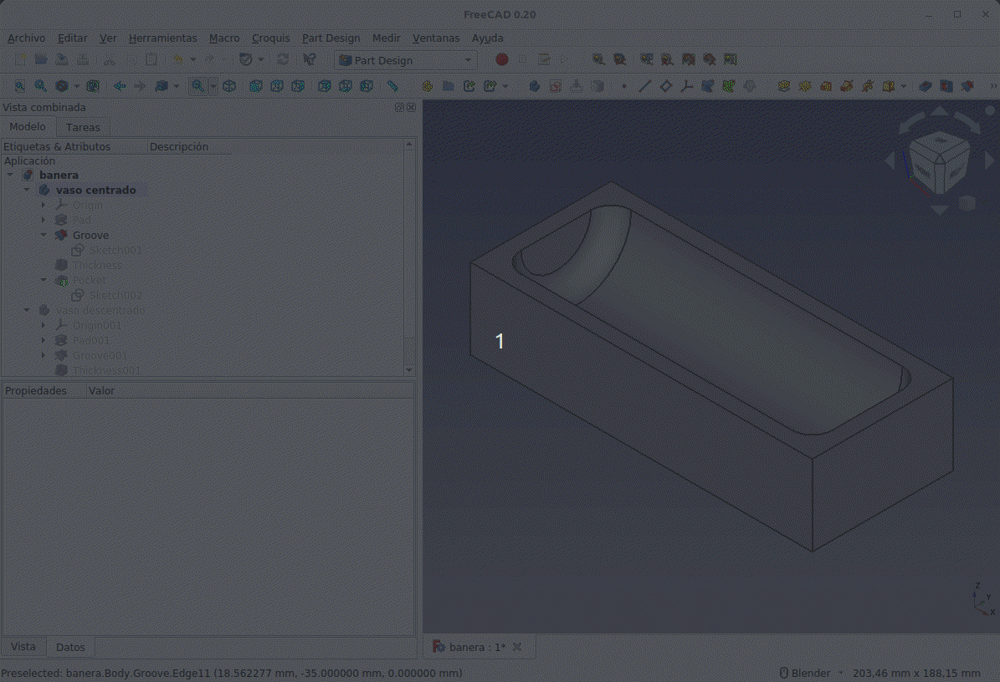  
*Eliminación del material exterior*

Para crear el orificio de vaciado vamos a aprovechar lo que hicimos al principio que no es otra cosa que realizar la primera extrusión invertida, con lo que el objeto queda por debajo del eje X. Simplemente debemos situar un círculo de las dimensiones apropiadas en la situación que corresponde y crear un vaciado 'A través de todos'. Seleccionamos la cara superior y creamos el boceto de la figura siguiente.

  
*Boceto para el orificio de vaciado*

Procedemos a crear el vaciado y tenemos el diseño de la bañera con el vaso centrado respecto al eje siguiente:

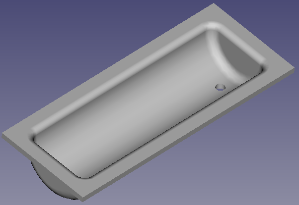  
*Bañera con vaso centrado*

* <b>Vaso descentrado</b>

Partimos del mismo boceto y extrusión que en el otro caso pero ahora creamos el boceto que vemos en la figura siguiente. Debemos crear todas las restricciones que aparecen y las tres líneas auxiliares marcadas. Una de las líneas horizontales la utilizaremos como eje de giro del vaciado pues está en el eje horizontal del vaso.

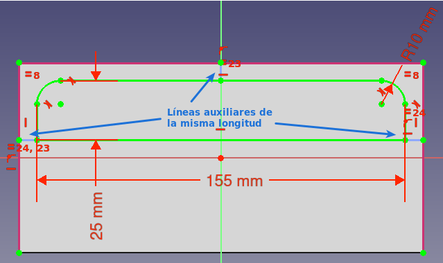  
*Boceto para el vaso descentrado*

Siguiendo el mismo proceso que en el caso del vaso centrado llegamos al diseño final de la bañera que vemos en la figura siguiente, donde se observa claramente como el vaso queda descentrado creando una plataforma en uno de los lados de mayor longitud.

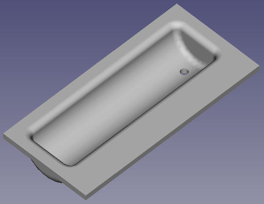  
*Bañera con vaso descentrado*

Hemos vuelto a aplicar la técnica de las líneas auxiliares para centrar el agujero en el vaso, tal y como vemos en la figura siguiente.

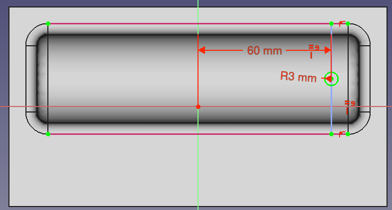  
*Centrado del agujero en el vaso*

Tenemos disponible para descargar el archivo [banera.FCStd](../img/designs/2bis/banera.FCStd) por si necesitamos consultar el diseño.

## Crear agujero o taladro
La herramienta 'Crear Agujero' o 'Hole' crea uno o más agujeros o taladros a partir de círculos y arcos de un croquis seleccionado. Los arcos deben ser parte de contornos cerrados. Todas las entidades que no sean de arco/círculo se ignoran.

Antes de describir el uso de la herramienta vamos a describir las opciones disponibles en la ventana de parámetros del agujero. Esta ventana, que aparece cuando se invoca la herramienta, es la que vemos en la figura siguiente.

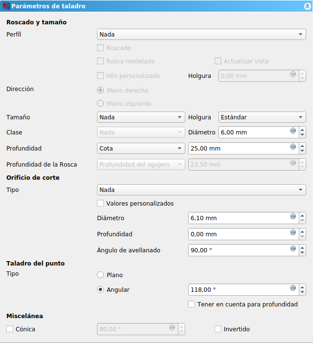  
*Parámetros de taladro*

**Roscado y tamaño (Threading and size)**

  * **Perfil**: Si se define en 'Nada', no definimos información de subprocesamiento. Podemos elegir entre [perfil de rosca ISO](https://en.wikipedia.org/wiki/ISO_metric_screw_thread) regular y fino usado internacionalmente y [UTS](https://es.wikipedia.org/wiki/Est%C3%A1ndar_de_rosca_unificado) o estándar de rosca unificado, en inglés: *Unified Thread Standard* que se usa en EEUU y Canada, entre perfiles grueso, fino y extrafino. Si activamos uno de los perfiles que no sea 'Nada' se activa la opción 'Roscado' que si se marca permite a su vez modificar las opciones del mismo.
  * **Roscado**: Si está seleccionado, veremos los datos de roscado y si no se marca se considera como no roscado el taladro.
  * **Modelo de hilo de rosca**: cuando está marcado se modela un hilo de rosca real, lo que consume mucha potencia informática, razón por la que no se usa para modelos excepto si se utiliza con fines de visualización o impresión 3D. Si activamos la opción se pondrán disponibles las opciones de 'Hilo personalizado', 'Actualizar vista' y 'Profundidad del agujero'.
  * **Dirección**: establece la dirección del hilo de rosca como mano derecha o mano izquierda.
  * **Tamaño**: Si hemos establecido un perfil ISO o UTS nos permite establecer el tamaño del hilo.
  * **Clearance o espacio libre**: establece el diámetro del orificio de espacio libre estándar, cerrado o ancho. Para roscas ISO los diámetros son de acuerdo a la norma ISO 273, para UTS se calculan de forma empírica porque no existe una norma que los defina. Solo disponible para agujeros no roscados.
  * **Clase**: define la clase de la tolerancia.
  * **Diámetro**: Si en perfil escogemos 'Nada' nos define el diámetro del agujero.
  * **Profundidad**: profundidad del agujero desde el plano del boceto. Si se elige 'Cota' el campo de al lado permite ingresar un valor. Y ' A través de todos' hará una agujero pasante. Por razones técnicas, 'A través de todos' es en realidad un agujero de 10 metros de profundidad. Si necesitamos agujeros más profundos, usaremos 'Cota'.

* **Orificio de corte (Hole cut)**

  * **Tipo**: establece el tipo de corte del orificio: 'None' o 'Ninguno' significa que no hay corte. El resto son los diversos tipos de normas para tornillos y los tipos genéricos Counterbore (Abocardado) , Countersink (Avellanado) y Counterdrill (Contrataladro).
  * **Diámetro**: establece el diámetro superior (en el plano del croquis) para el corte del agujero.
  * **Profundidad**: La profundidad se define de manera diferente según el tipo:
      - Para un abocardado, es la profundidad del corte del agujero, medida desde el plano del croquis;
      - para un avellanado, es la profundidad de la parte superior de la cabeza del tornillo por debajo del plano de croquis
      - para un contrataladro es la profundidad de la parte cilíndrica del agujero cortado.
* **Ángulo de avellanado**: ángulo del corte del agujero cónico. Sólo aplicable para avellanados.

* **Punto de perforación (Drill point)**

  * **Tipo**: define el final del agujero si 'Profundidad' se establece en 'cota'.
    * **Plano** produce un fondo plano.
    * **Angulado** establece un punto cónico.

* **Varios (Miscdelanea)**

  * **Tapered o cónico**: establece un ángulo de inclinación en el agujero. El valor se calcula a partir de la normal del plano del boceto. 90º establece un agujero recto. Un valor inferior genera un radio de agujero más pequeño en la parte inferior; mientras que un valor superior aumenta el radio del agujero en la parte inferior.
  * **Invertido**: invierte la dirección de extrusión del agujero.

### Ejemplo 1. Pletina con taladros
Para hacer el ejercicio vamos a partir de un paralelepípedo cuadrangular de 50mm de lado y una altura de 10mm. Sobre la cara superior del mismo vamos a crear un boceto como el de la figura siguiente, donde podemos observar que no se ha restringido el radio de los círculos y que además son todos diferentes.

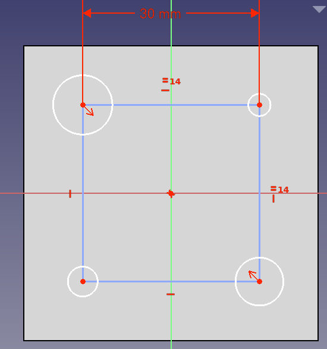  
*Boceto para crear taladros*

En la animación siguiente vemos el uso de la herramienta para crear un agujero roscado de una métrica dada. Al final de la misma se observa perfectamente como al activar la visualización de la rosca el sistema se ralentiza mucho y eso que se está ejecutando en un buen ordenador con bastante memoria RAM.

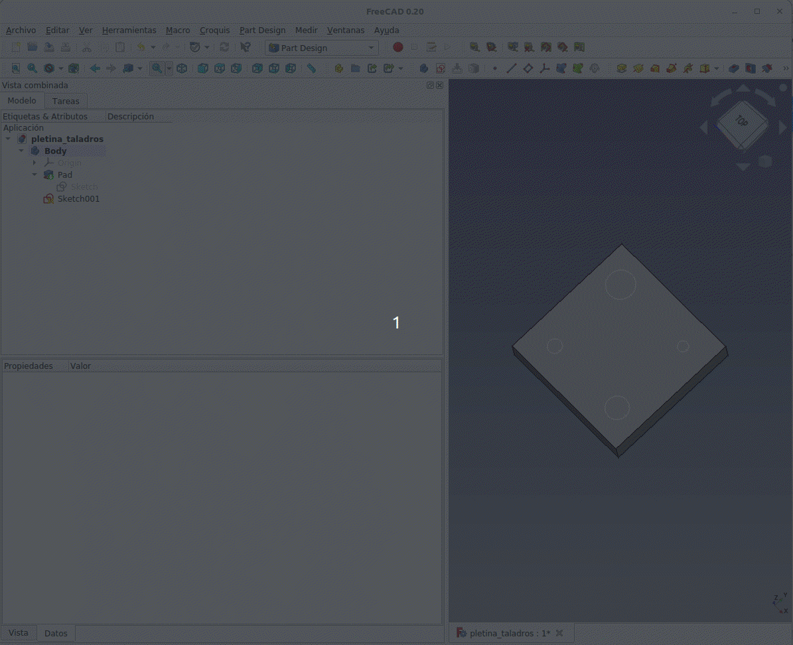  
*Uso de la herramienta Hole*

La pieza la tenemos en formato original en [este enlace](../img/designs/8/pletina_taladros.FCStd) por si necesitamos descargarla para realizar alguna consulta en el diseño.

### Ejemplo 2. Pieza simétrica
Vamos a diseñar de tres modos diferentes la pieza que vemos en la figura siguiente.

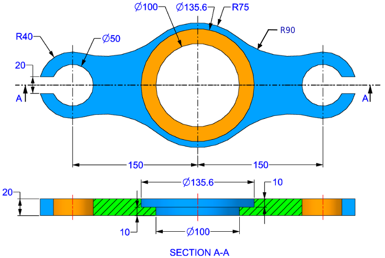  
*Boceto para crear taladros*

La figura ha sido obtenida del archivo [AUTODESK FUSION 360 EXERCISES.pdf](https://www.pdfdrive.com/autodesk-fusion-360-exercises-e188748050.html) localizado con el buscador PDFDrive.

<b>- Modo 1</b>

Vamos a crear la pieza a partir de dibujar un boceto completo de la misma a excepción del agujero central que crearemos con la herramienta Hole. Dibujar el boceto de la pieza completa es porque como ya hemos visto, al menos hasta el momento de la creación de esta web, la herramienta simetria en bocetos no funciona del todo bien.

En la figura siguiente tenemos el modelo completo a excepción del agujero central.

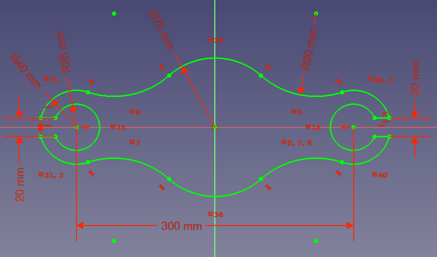  
*Boceto para diseñar la pieza del ejemplo 2*

Procedemos a extruir el boceto anterior una longitud de 20mm y en la cara superior creamos un nuevo bocento en el que dibujamos un circulo con centro en el centro de coordenadas sin importar su radio, ya que haremos el orificio de 100mm de diámetro con un abocardado de 135,6mm de diámetro y una profundidad de 10mm, tal y como marca la imagen de partida, utilizando la herramienta agujero. En la figura siguiente vemos el resultado final y la ventana con los parámetros del taladro.

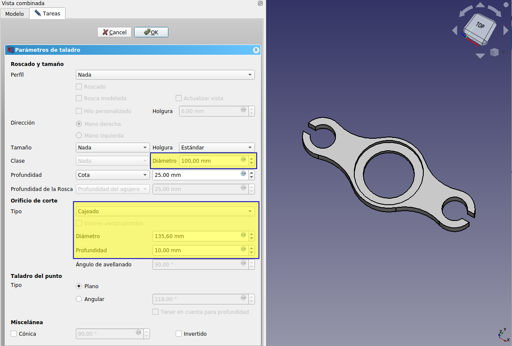  
*Resultado final de la pieza del ejemplo 2*

<b>- Modo 2</b>

Vamos a crear solamente 1/4 del boceto de la pieza que incluya la mayor parte del diseño posible. En este caso va a ser algo como lo de la figura siguiente, en la que se incluye el orificio central a falta del abocardado que lo haremos una vez realizada la extrusión.

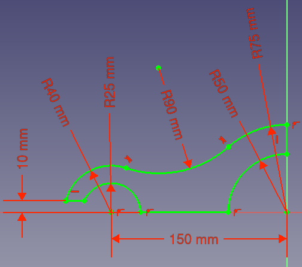  
*Boceto de 1/4 de pieza*

Realizamos la extrusión y vamos a utilizar la herramienta Hole a partir de un arco pero siempre formado un boceto cerrado, tal y como vemos que se hace con la línea de la figura siguiente. Es evidente que se podía hacer con un círculo o simplemente haciendo un vaciado, pero se ha realizado así para ver como funciona con arcos siempre que sean superfies cerradas.

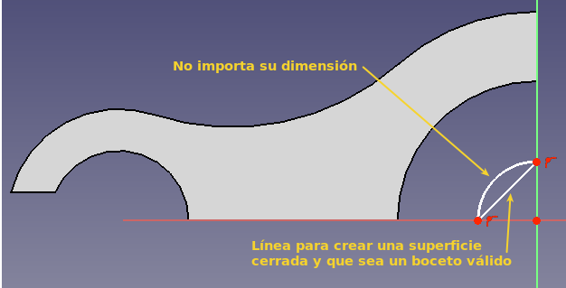  
*Boceto arco sobre 1/4 de pieza*

Activamos la herramienta Hole y configuramos la ventana de parámetros como vemos en la figura siguiente.

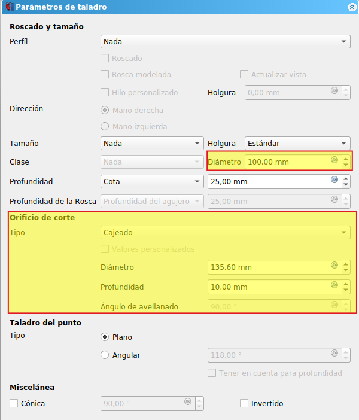  
*Ventana de parámetros para agujero en 1/4 de pieza*

El resultado final para 1/4 de la pieza lo vemos en la figura siguiente.

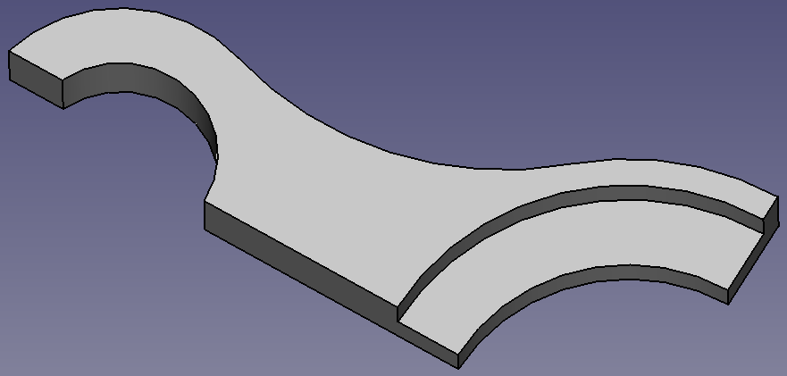  
*1/4 de pieza finalizado*

***

<b>NOTA:

En el modo 4 se explica como continuar a partir de la pieza sin el agujero,

en esta ocasión utilizando la herramienta multitransformación</b>

***

Vamos a intentar aplicar la herramienta simetria de PartDesign a este sólido y tal y como vemos en la animación siguiente todo parece funcionar a excepción de que no aparece la parte simétrica del objeto.

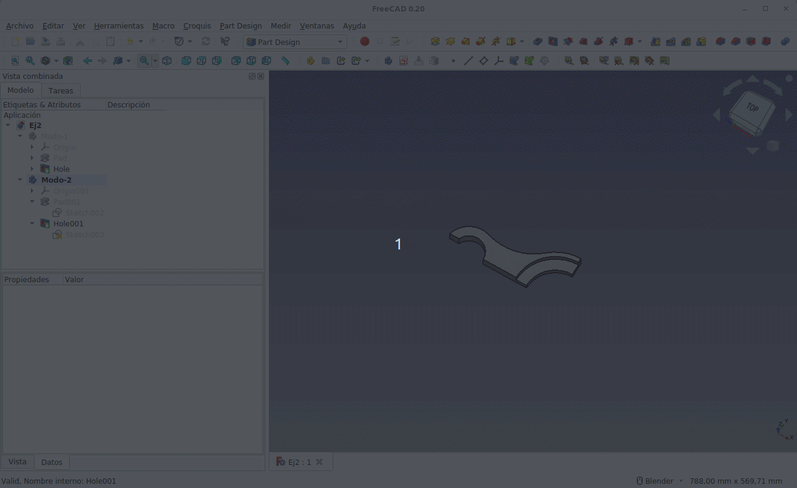  
*Intento de simetria sobre 1/4 de pieza tipo Hole*

Observamos que se llega a crear el objeto reflejado pero no con el resultado esperado sea cual sea el plano o eje que escojamos para hacerlo. El problema radica en las limitaciones de la operación 'Simetría'. Comencemos por ver que nos dice la propia herramientsa en su ayuda rápida que hace, tal y como vemos en la figura siguiente.

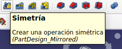  
*Ayuda rápida operación Simetría*

Nos dice que crea una operación de simetría pero no exactamente una simetria, con lo que tampoco nos aclara demasiado el tema. Indaguemos en la limitaciones de la herramienta descritas en la wiki de FreeCAD, que nos redirigen a [ver las del patrón polar](https://wiki.freecad.org/PartDesign_PolarPattern#Limitations). En estas se indica que:

* Se excluirá cualquier forma en el patrón que no se superponga a la entidad principal. Esto asegura que un body siempre es un cuerpo solido único conectado.
* Se aconseja usar las herramientas disponibles en Draf y Part dado que en PartDesign no están áun optimizadas. Es decir, que se puede decir que si lo estarán en un futuro.
* Un patrón no es aplicable directamente a otro patrón ya sea lineal o polar. Para hacer esto hay que recurrir a la herramienta 'Multitransformación' que veremos posteriormente.

Podemos concluir diciendo que 'Simetría' funciona con operaciones aditivas pero no con sustractivas por lo que tendremos que retomar el tema del diseño de nuestra pieza en el Pad antes de aplicar la herramienta Hole y aplicar esta al final. Procedemos entonces como vemos en la animación siguiente.

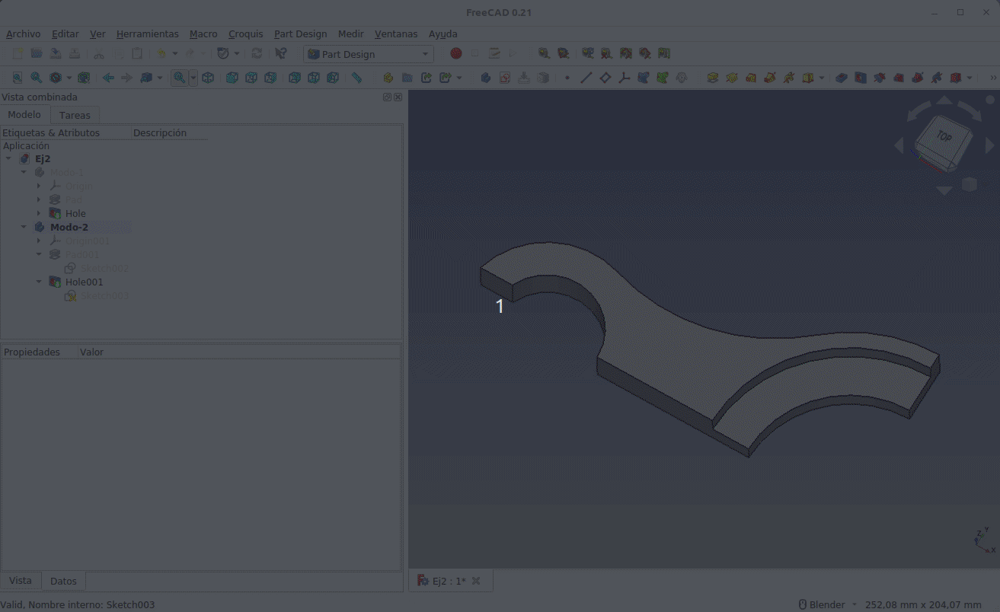  
*Operación de simetria sobre 1/4 de pieza tipo Pad*

A partir de aquí ya no podemos usar la herramienta de simetria así que vamos a recurrir a duplicar el objeto desde el menú Editar y girar 180º la copia. Pero antes de hacerlo vamos a crear el abocardado con la herramienta Hole de forma totalmente similar a la descrita antes. En la animación siguiente vemos como hacer esto.

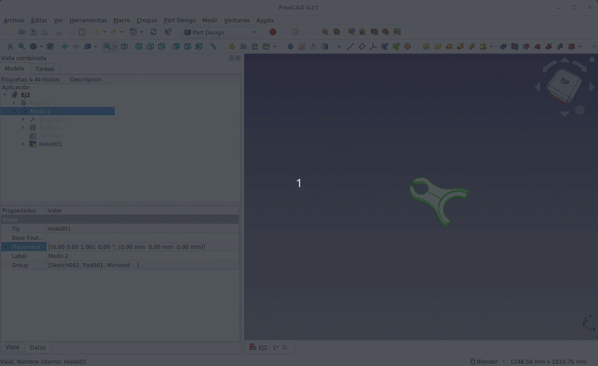  
*Pieza final con el modo 2*

Finalmente hemos realizado una operación booleana de unión siguiendo el siguiente proceso: seleccionamos el body original y hacemos clic en la herramienta, hacemos clic en ‘Añadir cuerpo’ y clic en la zona gráfica sobre el objeto que se verá (el cuerpo creado y girado) y nos aparecerá la pieza completa en pantalla. Hacemos clic en OK y la pieza final tendrá como nombre por defecto Boolean.

<b>- Modo 3</b>

Vamos a ver una última alternativa de creación de la pieza a partir de crear un boceto que revoluionaremos para crear el agujero en la pieza sólida que no lo tiene. La idea es crear un boceto en uno de los planos perpendiculares al de creación de la pieza (XZ o YZ) y crear una 'Ranura' por revolución. En la animación siguiente vemos como está realizado el boceto y como crear el vaciado con la forma final de la pieza.

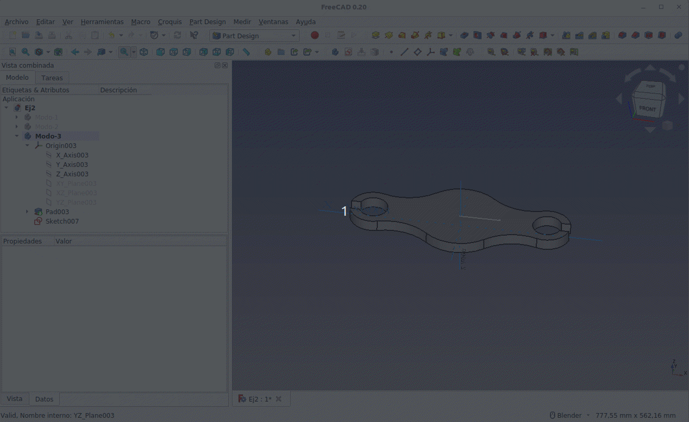  
*Pieza final con el modo 3*

Este método resulta especialmente útil si en lugar de un escalón hubiese varios, pues se realiza toda la operación con un único boceto.

<b>- Modo 4</b>

La situación de partida es la que vemos en la figura siguiente.

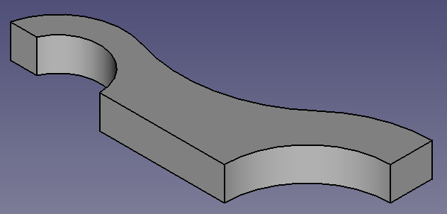  
*Situación de partida para modo 4*

Antes de nada vamos a introducir la herramienta 'MultiTransformación'. La herramienta crea un patrón de una o más funciones. El patrón puede incluir varias transformaciones en las que cada transformación posterior se aplica al resultado de la transformación anterior. La herramienta tiene las mismas limitaciones que las ya descritas para la 'Simetría'. En la figura siguiente vemos las opciones que tenemos disponibles al aplicar la herramienta.

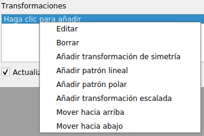  
*Opciones disponibles para MultiTransformación*

En la imagen vemos que la herramienta permite diferentes opciones que ya están disponibles de manera individual. Nos vamos a centrar en la de 'Añadir transformación de simetría' y como aplicarla de forma recurrente. En la animación siguiente vemos el proceso para obtener la pieza completa sin el agujero.

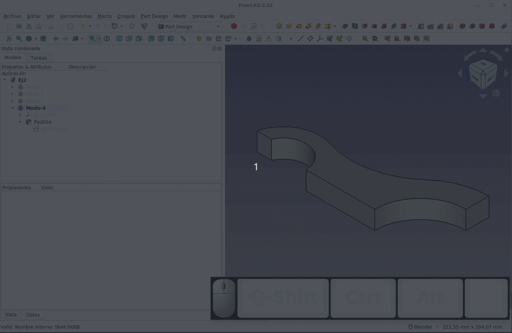  
*Pieza final sin agujero con el modo 4*

Al resultado ya le podemos aplicar cualquiera de los procesos para crear el agujero. En la naimación siguiente vemos como hacerlo con la herramienta Hole.

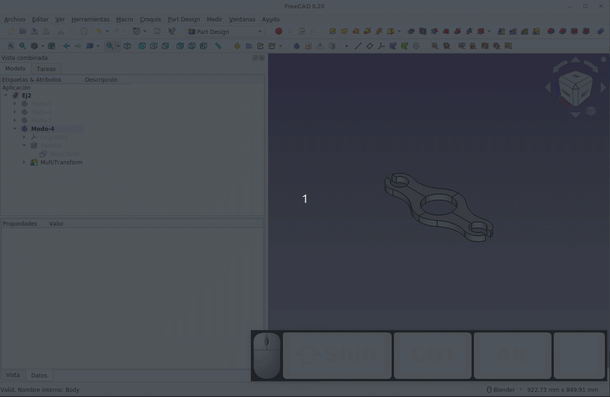  
*Pieza final con el modo 4*

El archivo [Ej2.FCStd](../img/designs/8/Ej2.FCStd) contiene el diseño de los cuatro pasos.

## **Repaso/descripción de algunas herramientas**
En este apartado vamos a tratar los siguientes aspectos:

* La herramienta polilinea en Sketcher
* Herramientas copiar, clonar y mover
* Herramienta matriz rectangular
* Como cambiar un boceto de plano

### La herramienta polilinea en Sketcher
Esta herramienta funciona como la herramienta 'Linea', pero crea una sucesión de segmentos y arcos conectados en sus puntos finales. Podemos alternar entre líneas y arcos con la tecla M, que tiene la siguiente secuencia de modos a partir de un primer segmento de línea recta:

* Pulsar la tecla M: el nuevo segmento es una línea que es perpendicular al segmento anterior.
* Pulsar de nuevo la tecla M: el nuevo segmento es una recta tangente al segmento anterior. Si partimos de una línea el siguiente segmento será colineal con el anterior.
* Pulsar de nuevo la tecla M: el nuevo segmento es un arco tangente al segmento anterior.
* Pulsar de nuevo la tecla M: el nuevo segmento es un arco perpendicular (hacia la izquierda) al segmento anterior.
* Pulsar de nuevo la tecla M: el nuevo segmento es un arco perpendicular (hacia la derecha) al segmento anterior.
* Pulsar de nuevo la tecla M: vuelve al estado inicial; la línea está conectada solo con una coincidencia con el segmento anterior.

Cada vez que hacemos clic se crea el segmento de polilínea y se inicia de nuevo la acción de la letra M.

En la animación siguiente vemos un proceso de creación de una polilínea con la utilización de la tecla M.

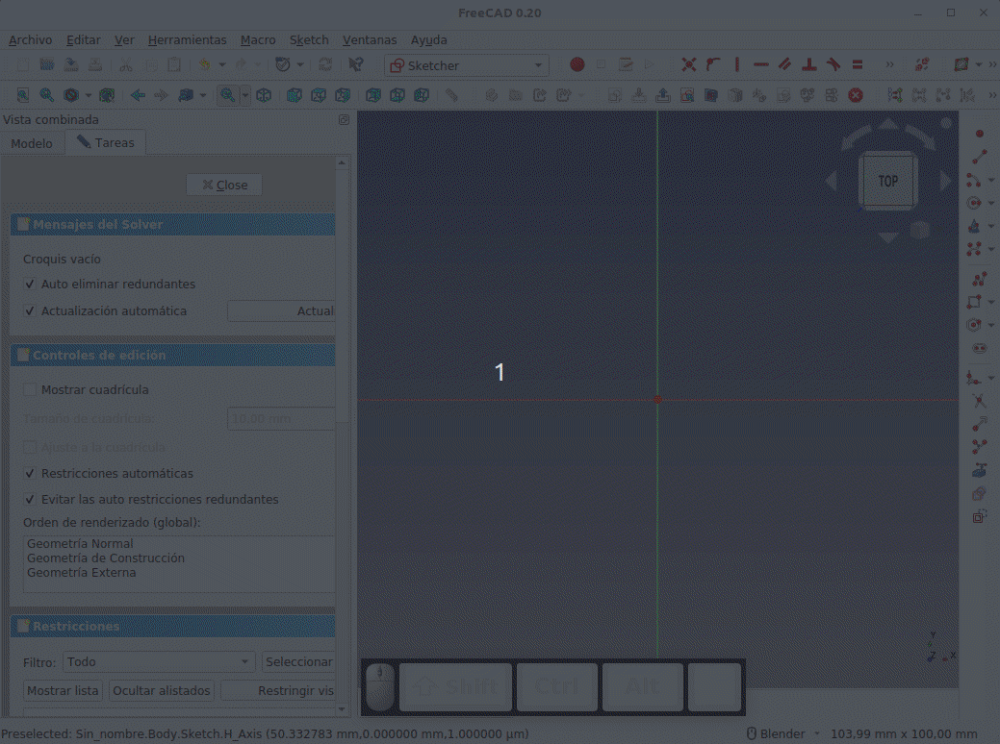  
*Uso de la letra M en Sketcher*

### Herramientas copiar, clonar y mover
Vamos a partir de un cuadrado con sus lados iguales y de 10 mm de longitud.  En la animación siguiente vemos como se seleccionan y utilizan las herramientas, estando la principal diferencia entre copiar y clonar en que la copia se realiza integra, incluida la cota y en el clon esta restricción no se copia pero sus dimensiones y restricciones quedan relacionadas con las del original y permanecen inalterables en el clon. Esto se aprecia perfectamente cuando eliminamos las restricciones de igualdad en el original y modificamos sus dimensiones.

  
*Uso de copiar, clonar y mover en Sketcher*

### Herramienta matriz rectangular
Seguimos trabajando con el mismo cuadrado que antes pero ahora hacemos clic en la herramienta matriz rectangular y se nos mostrará la ventana emergente siguiente:

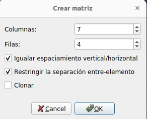  
*Ventana de opciones de 'Crear matriz' en Sketcher*

En la ventana anterior seleccionamos el número de filas y columnas que queremos que tenga nuestra matriz poniendo a cero las columnas si queremos solamente una fila y las filas si queremos solamente una columna. La opción seleccionable ‘Igualar espaciamiento …’ permite igualar el espacio entre filas y columnas con un solo clic para seleccionarlo. Seleccionando la opción ‘Restringir la separación …’ hacemos que cada elemento de la matriz sea restringido respecto a otros utilizando líneas de construcción. La opción clonar hace que las restricciones de cota se conviertan en restricciones geométricas en la copia, por lo que un cambio en el elemento original queda reflejado en las copias. En la animación siguiente vemos su funcionamiento.

  
*Uso de matriz rectangular en Sketcher*

### Cambiar un boceto de plano
Hay veces, cuando creamos un boceto utilizando como plano de referencia una cara plana, que al acabar la operación nos damos cuenta de que hemos seleccionado la cara equivocada. Pues bien, si el boceto es sencillo puede bastar con eliminarlo y hacerlo en la cara correcta, pero si este es mas complejo esta tarea ya es bastante desoladora, por lo que poderlo cambiar de cara sería una magnifica solución y disponemos de herramientas para ello. Vamos a demostrarlo sobre una pieza de forma rápida para ver como funciona. En la animación siguiente se demuestra el uso de la herramienta.

  
*Cambiar boceto de plano*

## **Calado o hacer inclinación de una cara**
Vamos a describir el uso de la herramienta [PartDesign Draft](https://wiki.freecad.org/PartDesign_Draft) 

Esta herramienta agrega un objeto Draft o borrador al documento en la estructura de árbol del mismo. Para aplicar la herramienta primero hay que seleccionar una cara o un cuerpo si existen varios. Como ejemplo vamos a partir de un cubo (no importan sus dimensiones) en el que seleccionamos su cara derecha y hacemos clic en la herramienta. Se nos mostrará la ventana de diálogo de la figura siguiente.

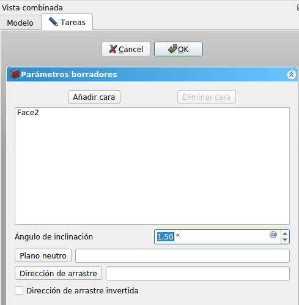  
*Ventana de parámetros*

Aunque aparentemente no ocurre nada si observamos la pieza en una vista inferior o superior observamos como la cara que habíamos seleccionado se ha inclinado los 1,5º que por defecto aparecen en el ángulo de inclinación de la ventana anterior. Podemos cambiar el valor y observar como la cara va girando el ángulo indicado y tomando como referencia la arista posterior de esa cara seleccionada. En la animación siguiente vemos estos efectos. El valor del ángulo de giro no puede tomar valores negativos. Si necesitamos que el giro se realice en un ángulo negativo debemos marcar la opción ‘Dirección de arrastre invertida’.

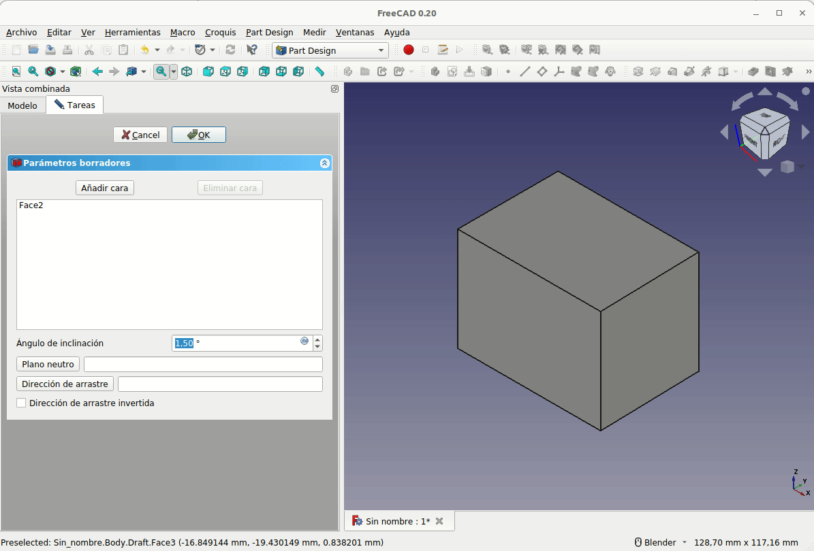  
*Utilizando Calado con un cubo*

Si queremos cambiar la arista que actúa como bisagra para el giro debemos seleccionar un plano neutro y su arista mas próxima a la cara original será la que actúa ahora de bisagra, tal y como observamos en la animación siguiente.

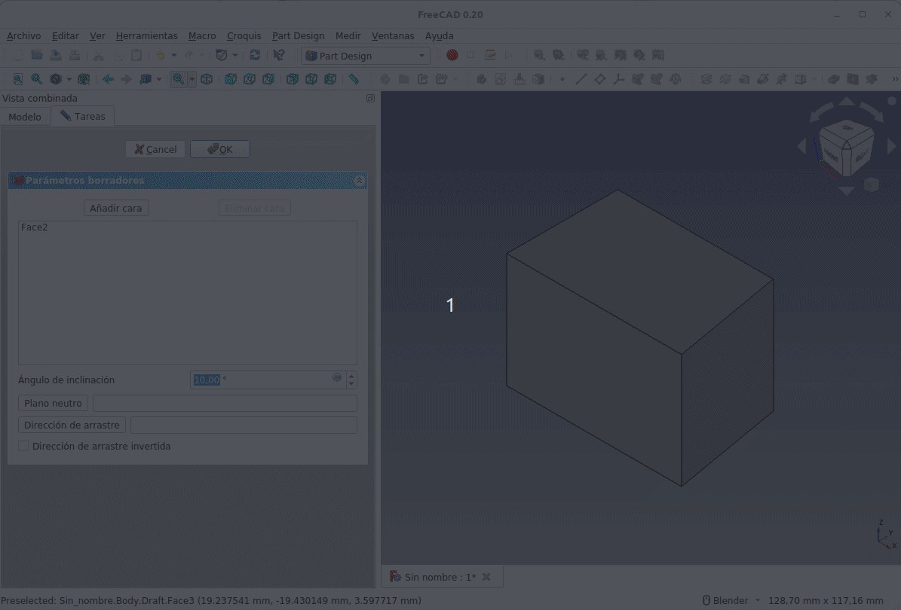  
*Utilizando Calado con un cubo*

Si seleccionamos dos o mas caras y hacemos clic en la herramienta en un primer momento nos puede parecer que es exactamente lo mismo que lo que pasaba con una cara, pero esto es así porque no tenemos seleccionado ningún plano neutro que marque que aristas deben actuar como bisagra. En la animación siguiente vemos el caso aplicado a dos caras.

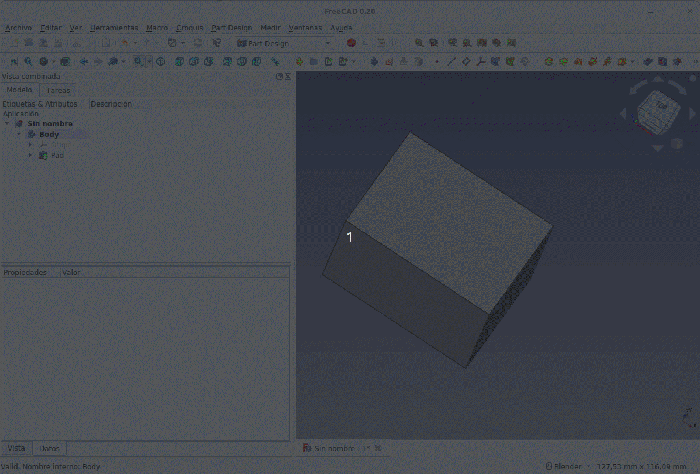  
*Utilizando Calado con un cubo*

Vamos a desarrollador el ejemplo de creación de un modelo de asiento de sillón mediante esta técnica. Partimos de un boceto como el de la imagen sigujiente que extruiremos una longitud de 50mm.

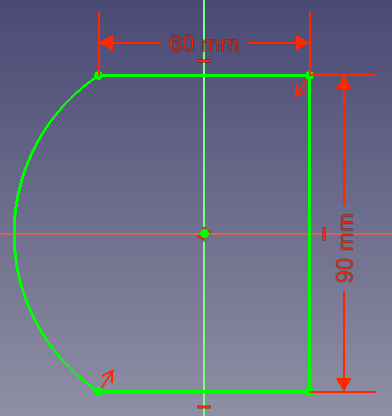  
*Boceto inicial del asiento de sillón*

Vamos a dar una inclinación de 9º a la cara redondeada aplicando como plano neutro la cara superior del sólido. En la figura siguiente vemos la ventana de opciones de Calado y como queda en este momento el sólido.

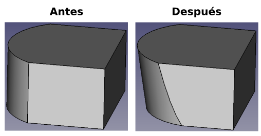  
*Antes y después de inclinar la cara curva*

Ahora aplicamos la herramienta espesor para obtener el resultado que vemos en la figura siguiente.

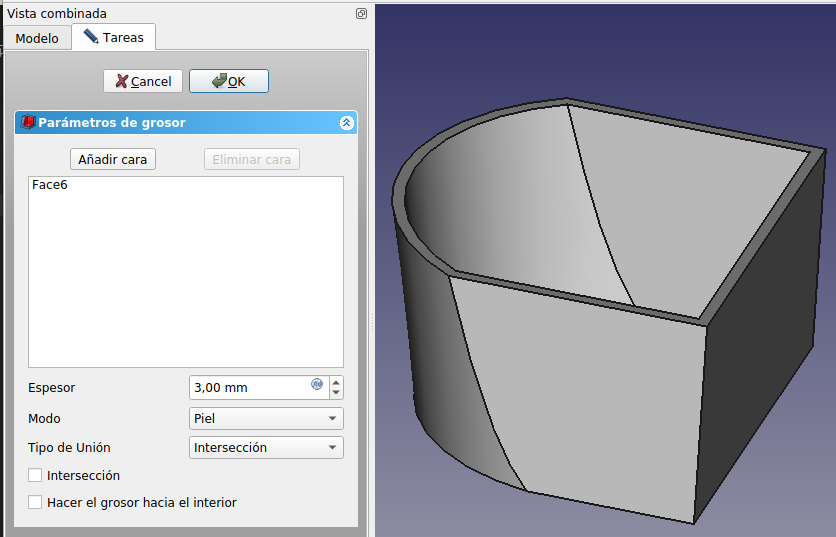  
*Herramienta espesor aplicada*

Vamos a eliminar la parte delantera para dejar abierto el asiento creando un boceto como el de la figura siguiente. El boceto se realiza seleccionando la cara superior del asiento como plano. Con el boceto anterior realizamos un vaciado a través de todos. En la figura siguiente vemos el proceso.

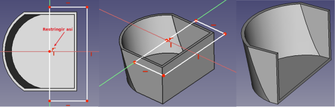  
*Herramienta vaciado*

Para dar un mejor aspecto de acabado vamos a aplicar dor operaciones de calado y un redonde tal y como vemos en la animación de la figura siguiente.

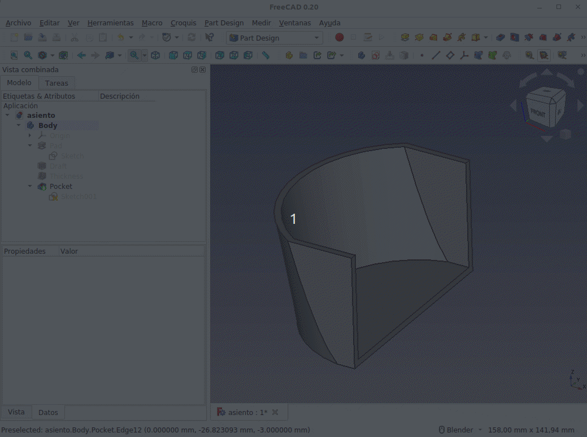  
*Obtención del asiento final*

El archivo de diseño original [asiento.FCStd](../img/designs/2bis/asiento.FCStd) lo tenemos disponible para descargar si lo necesitamos.

La herramienta también funciona a partir de cilindros y nos permite de forma muy sencilla crear troncos de cono. Para ilustrar el tema vamos a crear un cubilete en el que el diámetro exterior mayor o de la boca sea de 80mm y las paredes tengan una inclinación de 8º respecto a la normal al plano delimitado por esa cara. La altura del cubilete será de 100mm y la pared tendrá un espesor de 3mm. En la animación de la figura siguiente vemos el proceso de creación a partir del boceto. Podemos observar que una vez creado el boceto solamente hemos tenido que hacer tres operaciones para crear el objeto final.

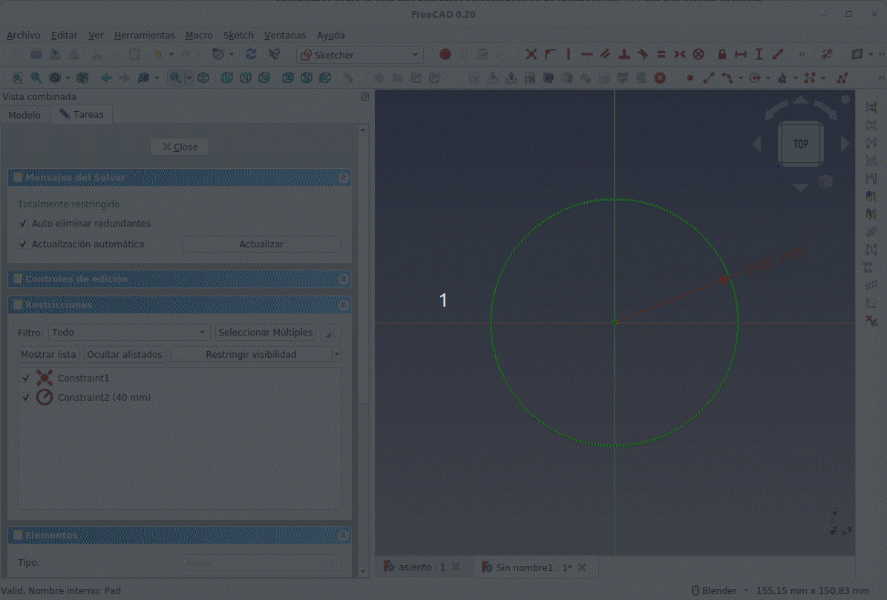  
*Creación de un cubilete*

## **Duplicar, copiar y clonar objetos 3D**
Vamos a ver las diferencias entre estas herramientas a partir de un boceto cualquiera que extruiremos para tener un sólido con el que trabajar. En este caso vamos a utilizar el de la figura siguiente, al que se han colocado dos cotas para realizar cambios posteriormente y ver el efecto que tienen.

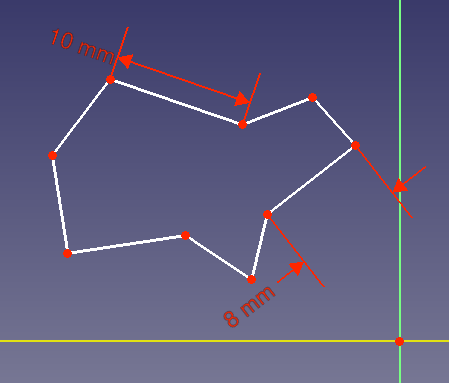  
*Boceto para crear el objeto 3D*

En la animación 10-1 vemos como crear un duplicado, una copia, una copia simple y un clon del objeto en tres dimensiones. Al final de la misma se puede apreciar como la única copia que refleja los cambios que se realizan en el original es el clon, tal y como era de esperar. Los cuerpos se han creado con la finalidad de que cada objeto se pueda mover para verlo claramente en pantalla.

  
*Duplicar, copiar y clonar un objeto 3D*

## **Cortes, secciones y texturas**
En este apartado vamos a ver la utilización de las opciones '*Plano de recorte*' ('*Clipping Plane*'), '*Corte de sección persistente*' ('*Persistent section cut*') y '*Mapeo de textura*' ('*Texture mapping*') del menú 'Ver'.

### Plano de recorte
Herramienta que permite **ocultar temporalmente** objetos y partes de objetos en una cara con hasta tres planos virtuales de la vista 3D activa actualmente. El panel de tareas lo vemos en la Figura siguiente.

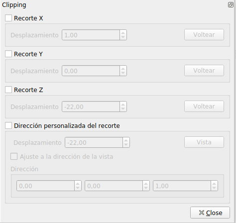  
*Panel de tareas de Plano de recorte*

Cuando hagamos clic en el botón 'Cerrar' ('Close') la vista generada se pierde y no se guarda ningún dato de la misma porque, como hemos indicado, la ocultación de partes es temporal.

Antes de continuar vamos a realizar un ajuste de preferencias para visualizar mejor el trabajo. Abrimo Editar --> Preferencias y configuramos como vemos en la Figura siguiente. Cuando activemos la herramienta veremos el efecto que tiene esta configuración.

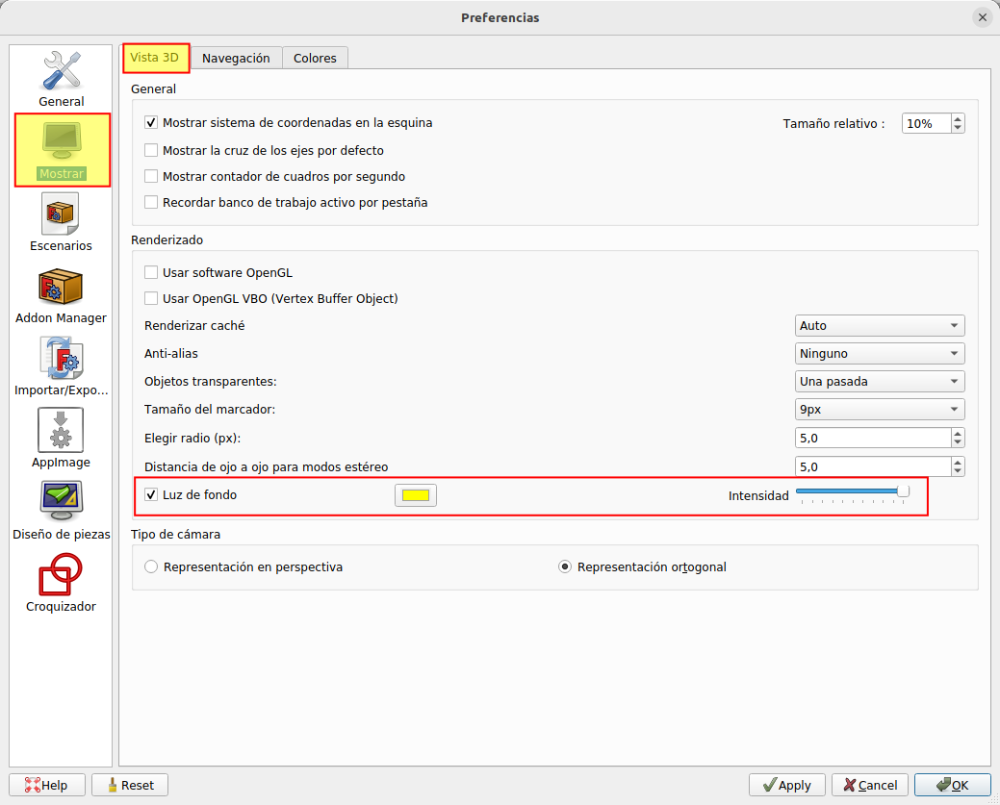  
*Configuración de Vista 3D para Plano de recorte*

El proceso de utilización de la herramienta es el siguiente:

1. Desde el menú Ver seleccionamos la opción Plano de recorte.
2. En el panel de tareas Recorte, realizamos una de las siguientes acciones:

    - Marcar una o más de las opciones: Recorte X, recorte Y y/o Recorte Z para seleccionar el plano de recorte normal al eje indicado.
    - Opcionalmente podemos cambiar el lado del plano en el que se ocultan los objetos haciendo clic en Voltear.
    - Opcionalmente podemos cambiar la situación del plano cambiando el valor de Desplazamiento.

3. Activar la dirección personalizada del recorte. Por defecto se activa en Z.

    - Opcionalmente podemos cambiar la distancia de Desplazamiento del plano.

4. Hacemos alguna de las siguientes:

    - Presionar el botón Vista para usar la dirección de la vista actual.
    - Seleccionar Ajuste a la dirección de la vista  para que la visualización se adapta dinámicamente y ver así los cambios.
    - Podemos indicar una dirección introduciendo en Dirección las coordenadas X, Y y Z del vector normal.

5. Para salir hacemos clic en el botón Close (Cerrar) cerrando el panel de tareas y finalizando el comando.

En la animación siguiente vemos el funcionamiento de la herramienta en distintas opciones.

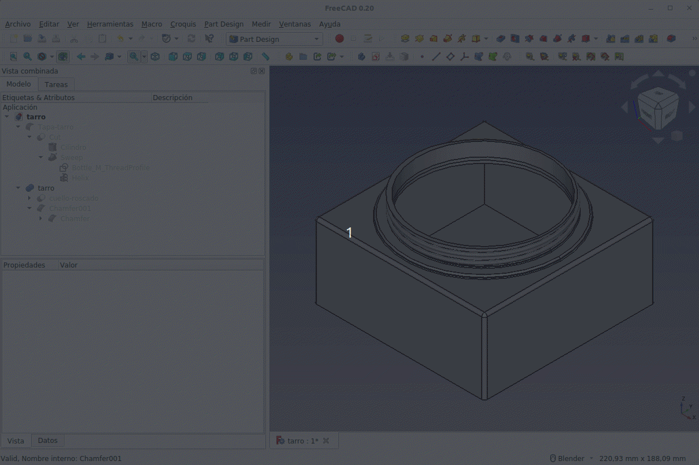  
*Acciones en Plano de recorte*

El color amarillo elegido en la configuración nos destaca claramente las zonas cortadas.

### Corte de sección
La herramienta de corte de sección está disponible para todos los bancos de trabajo, pero **solo funciona para objetos Part y PartDesign y ensamblajes de estos**. Sirve para crear un corte persistente de objetos y ensamblajes. Dado que el resultado del corte es un objeto de corte booleano normal, es modificable. Mas adelante veremos las posibles aplicaciones.

En la figura siguiente vemos el panel de tareas de la herramienta.

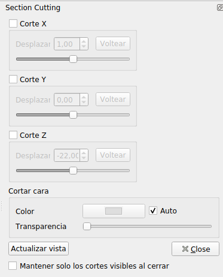  
*Panel de tareas de Corte de sección*

El Panel Corte de sección se abre desde el menú Ver → Corte de sección persistente. Se puede separar de su posición de apertura haciendo clic en la parte superior de la ventana y arrastralo a donde nos interese. El botón de la esquina superior derecha hace que el panel semuestre en primer plano sobre la zona de visualización 3D o se organice en vertical con la misma. Vemos estas funcionalidades en la animación siguiente.

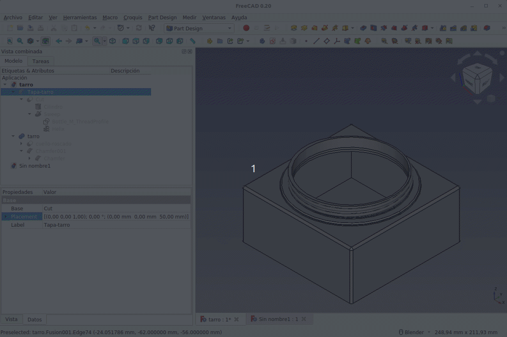  
*Mostrar y visualización del Panel de tareas de Corte de sección*

La herramienta 'Corte de sección' se aplica a todos los objetos visibles en el momento de aplicarla, por lo que podemos controlar facilmente que se corta y que no haciendo esa parte visible o no. Una vez iniciada la herramienta el sistema de ocultar y mostrar objetos puede no darnos los resultados esperados, pero tiene fácil solución, como veremos mas adelante. Al marcar una de las opciones de corte en el cuadro de diálogo es cuando se activa la función y aparece en el árbol de objetos el nombre del objeto cortado que se va a crear. Se puede establecer la posición bien con coordenadas o utilizando los controles deslizantes. Es totalmente posible combinar cortes en las direcciones que necesitemos. Los botones 'Voltear' cambian el lado que está cortado. En la animación siguiente vemos el funcionamiento de la herramienta en estos aspectos.

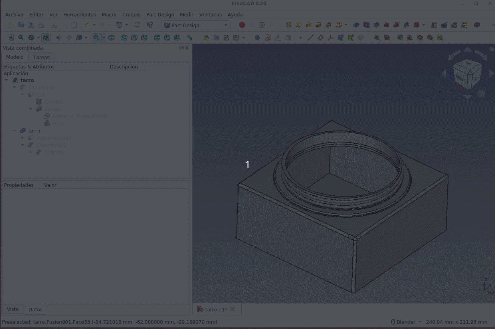  
*Trabajo con la herramienta Corte de sección*

La opción 'Mantener visibles solo los cortes al cerrar' oculta todo en la vista de árbol excepto el objeto cortado cuando se hace clic en el botón 'Cerrar' para salir de la ventana de opciones del corte.

Para eliminar el objeto cortado de la lista de objetos del árbol basta con desactivar **todas** las opciones de corte. En este momento el botón 'Actualizar vista' se pone activo. Al hacer clic en este botón FreeCAD captura los objetos Part actualmente visibles, lo que será utilizado para una prima opción de Corte.

Si la opción 'Auto' en la sección 'Cortar cara' está marcada, el color y la transparencia de los objetos cortados se tomarán de forma automática. Si no está marcada haciendo clic sobre el botón que muestra el color podemos configurar el color de la zona cortada y el nivel de transparencia.

Nota: Para ensamblajes, los controles deslizantes del cuadro de diálogo están desactivados (excepto el de la transparencia). La razón es que un movimiento deslizante da como resultado muchas operaciones de corte en poco tiempo. Para ensamblajes, esto consume muchos recursos de procesador y no resulta nada útil.

Vemos estas opciones en la animación siguiente.

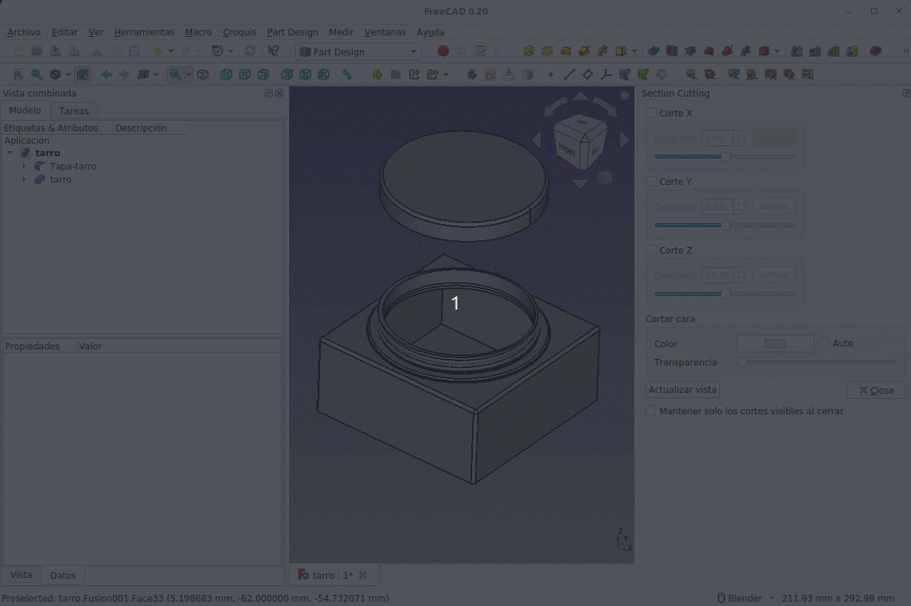  
*Trabajo con la herramienta Corte de sección*

También es posible buscar zonas de corte trabajando con los objetos internos que configuran el corte una vez establecido. En la animación siguiente vemos como modificar el corte en Y original a partir del objeto 'SectionCutBoxY' interno para hacer un corte totalmente diferente.

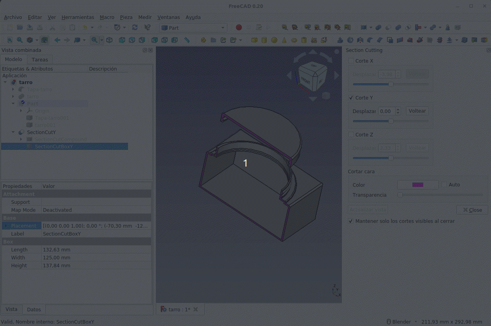  
*Trabajo con la herramienta Corte de sección*

### Mapeo de textura
El comando asigna **temporalmente** una textura a todos los objetos que tengamos en la vista 3D.

Para utilizarla seguimos el siguiente proceso:

1. Seleccionamos la opción Mapeo de textura del menú Ver.
2. En el panel de tareas podemos, de manera opcional, seleccionar Entorno.
3. Presionamos el botón ... diéresis. Las imágenes se localizan por defecto en el directorio del archivo del diseño con el que estamos trabajando.
4. Seleccione un archivo de imagen desde la ventana de diálogo.
5. Clic en el botón Cerrar (Close) para cerrar el panel de tareas y finalizar el comando.

En la animación siguiente vemos como se aplican dos texturas diferentes al objeto 3D.

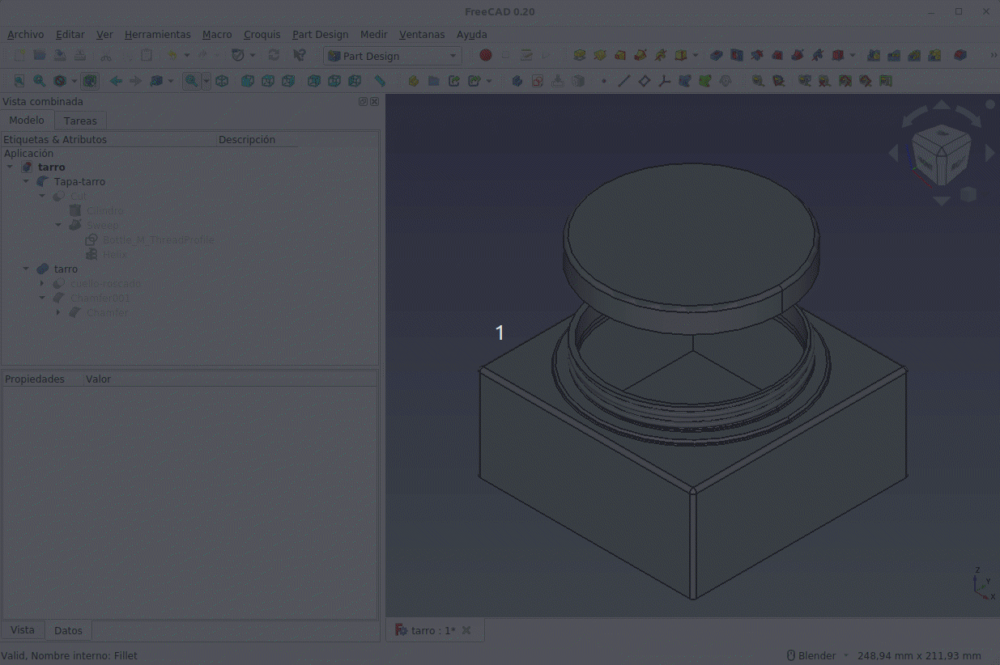  
*Aplicando texturas*

Los archivos de textura han sido descargados de [freepik](https://www.freepik.es/) de forma gratuita.

## **Reutilización de partes del diseño**
Hay veces en las que tenemos diferentes piezas que tienen cosas que son idénticas o muy parecidas a otras que ya hemos diseñado con anterioridad. En estos casos es muy útil poder copiar objetos o geometrias de unos sitios a otros. Ya hemos trabajado algo con mas de un body en nuestro diseño, e incluso hemos mezclado cosas de diferentes bancos de trabajo, y lo que vamos a ver a continuación son herramientas que nos van a permitir llevar geometrias u operaciones de un body a otro e incluso de un archivo de diseño a otro. Para ver el uso de las herramientas vamos a utilizar la caja diseñada en el apartado 7bis [Banco de trabajo ThreadProfile](./bt_ThreadProfile.md).

Vamos a partir de la tapa de la caja ya diseñada y para comenzar el diseño de la caja lo primero que observamos es que el diseño de partida es exactamente igual que el de la tapa, por lo que hacer una copia del mismo simplificará el diseño. Tenemos la situación que se observa en la Figura siguiente, un diseño con un único body.

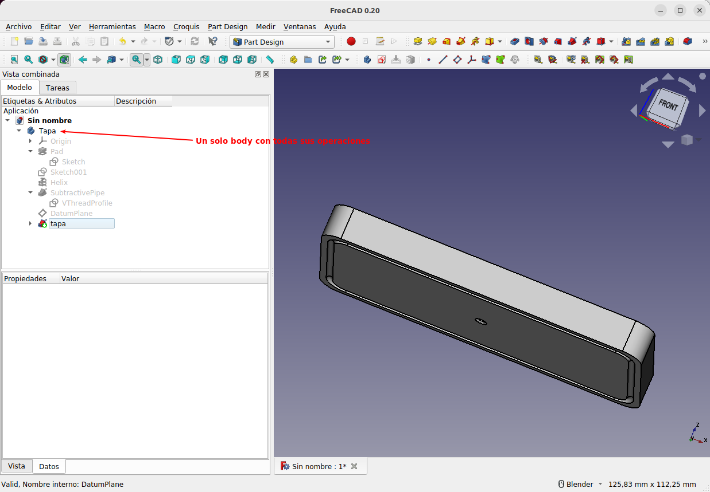  
*Diseño con un único body*

### Diseño con copia normal
El diseño de la caja va a comenzar por exactamente el mismo boceto que el de la tapa, por lo que podemos o bien copiar ese boceto en un nuevo body o bien extruirlo en ese nuevo body.

Vamos a realizar un nuevo diseño de la caja y como la tapa no va a sufrir ningún cambio simplemente la copiamos completa del diseño original {[caja_con_tapa.FCStd](../img/designs/7/caja_con_tapa.FCStd)} a un archivo nuevo que vamos a archivar como caja_machihembrada. A este nuevo diseño le vamos a realizar algunas modificaciones que van a ser modificar su tamaño, eliminar el tornillo y crear un vaciado de la tapa.

Procedemos a realizar la copia de la tapa de la forma que vemos en la animación siguiente.

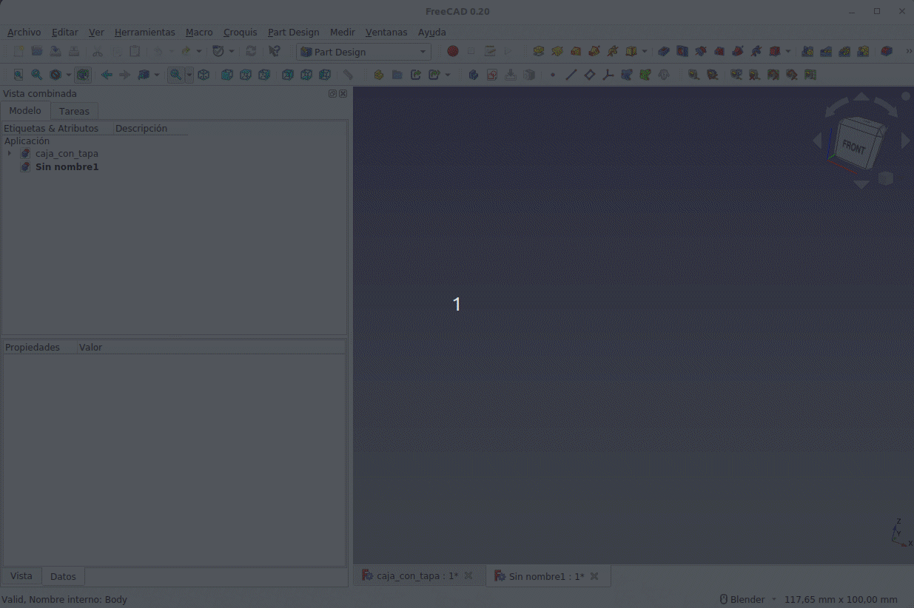  
*Copia del body de la tapa completo*

En la animación podemos observar como todos los elementos del body están marcados para ser copiados por lo que la copia será exacta, pero podemos deseleccionar los elementos que necesitemos para copiar solamente lo necesario. Como hemos dicho que vamos a eliminar el tornillo y que vaciaremos la tapa es evidente que no vamos a necesitar todos los elementos por lo que vamos a seleccionar según vemos en la Figura siguiente.

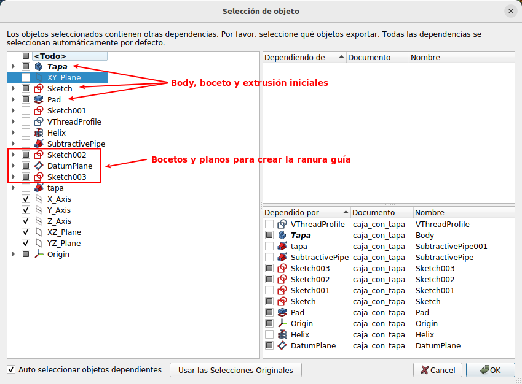  
*Copia de los elementos del body seleccionados*

Cambiamos las dimensiones del boceto inicial de la tapa para que coincidan con las que aparecen en la imagen siguiente.

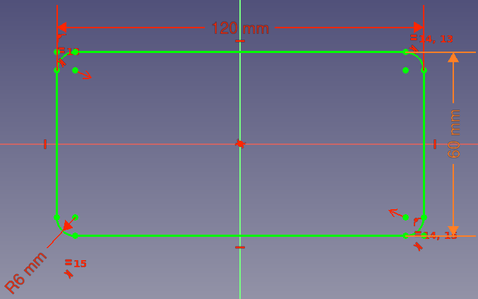  
*Modificación de dimensiones iniciales*

Si mostramos con la barra espaciadora todos los elementos podemos observar como el boceto de la trayectoria no se ha actualizado en sus dimensiones, esto es simplemente porque no están enlazadas con las del original porque hay referencias intermedias que se han perdido. Podemos relacionarlas de nuevo modificando el boceto para la nueva situación. Si intentamos editar el Sketch002 nos va a dar el error que vemos en la Figura siguiente.

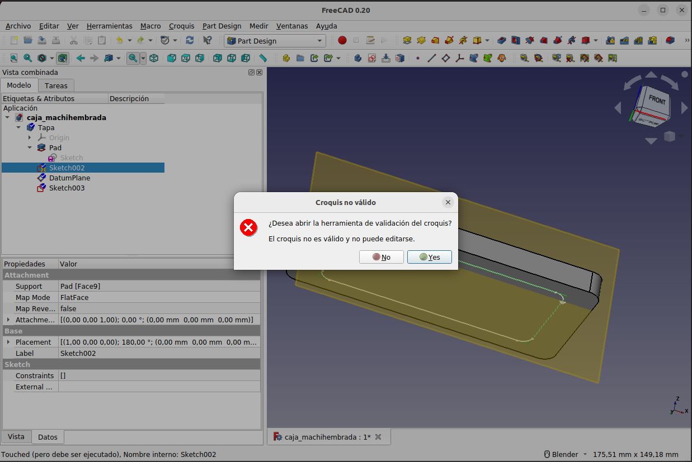  
*Error en boceto*

Se nos indica que debemos abrir la herramienta de validación del croquis, lo que hacemos pulsando el botón Yes que no despliega la ventana que vemos en la animación siguiente donde se realiza el proceso de validación y se pone el boceto como editable.

  
*Corrección del error en boceto*

En la Figura siguiente vemos el boceto de la trayectoria corregido y con todas las nuevas restricciones realizadas.

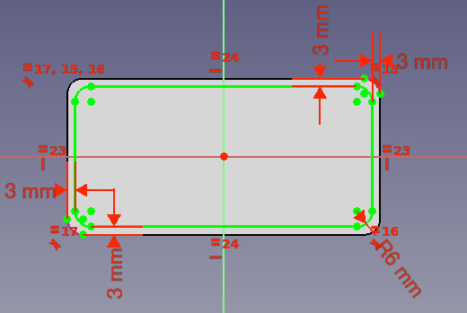  
*Trayectoria para la ranura corregida*

El plano y el boceto de la ranura han seguido las modificaciones puesto que están enlazados al croquis corregido. Podemos entonces proceder con la creación del tubo sustractivo y obtener el resultado que vemos en la Figura siguiente.

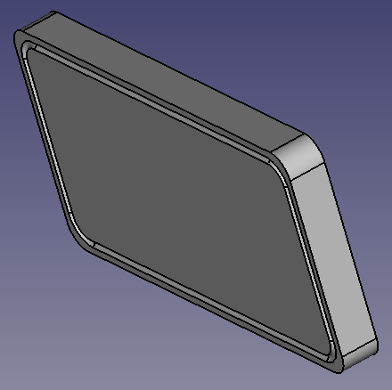  
*Tapa con ranura*

Procedemos a crear el boceto para el vaciado esta vez de la siguiente forma: seleccionamos el boceto de la trayectoria, nos dirigimos al menú Editar y escogemos 'Duplicar el objeto seleccionado' y marcamos según la Figura siguiente.

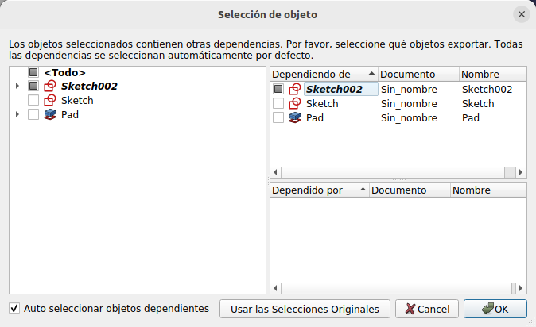  
*Opciones para duplicar el boceto de trayectoria*

Modificamos las restricciones de cota como en la Figura siguiente.

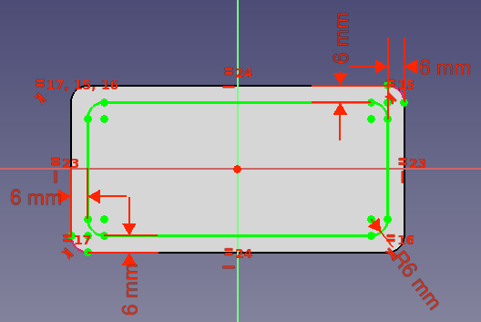  
*Boceto para el vaciado*

Aplicamos la herramienta de vaciado con una cota de 7mm para dejar una pared de 3mm y tenemos el resultado final de la tapa que vemos en la Figura siguiente.

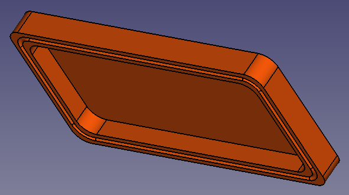  
*Tapa final*

### La herramienta copi de carbón
Antes de continuar con el diseño vamos a describir la herramienta ['Sketcher CarbonCopy'](https://wiki.freecad.org/Sketcher_CarbonCopy) o 'Copia de carbón del croquizador' que sirve para copiar toda la geometría y las restricciones de un boceto de otro cuerpo en el cuerpo activo.

Las restricciones de dimensiones que existan antes de realizar la copia permanecen vinculadas a las restricciones dimensionales del boceto original a través de expresiones que se crean.

La utilización es seguir el procedimiento siguiente:

1. Nos aseguramos de estar en el modo edición de un boceto existente que es el objetivo de la operación.
2. Hacemos clic en el botón Copia carbón.
3. Hacemos clic en un borde del otro croquis que es el origen de la operación.
4. Los elementos geométricos y las restricciones se copian en el croquis activo.
5. Pulsdamos la tecla Esc o el botón derecho del ratón para finalizar la operación.

Y tenemos las siguientes condiciones:

* Cuando se utilizan bocetos en PartDesign, normalmente el boceto a copiar debe estar en el mismo Body que el boceto actualmente activo. Si el boceto a copiar no está en el cuerpo activo, el puntero del mouse no permitirá la selección. Si queremos copiar bocetos de **otros cuerpos** debemos mantener **presionada la tecla Ctrl** para permitir la selección.
* Normalmente, el croquis a seleccionar debe estar en un plano paralelo al croquis actualmente activo. Si el boceto que se va a copiar no es paralelo al boceto activo actualmente, mantenga presionadas las teclas Ctrl + Alt para permitir la selección de bocetos no paralelos. A continuación, el objeto se ajustará al plano del boceto activo. Nota: es posible que sea necesario guardar y volver a cargar el documento para que sea visible. Esto también funciona para bocetos ubicados fuera del cuerpo actualmente activo.
* Dado que las restricciones dimensionales copiadas usan expresiones, se representan en un color diferente.
* Si el modo Sketcher se ha cambiado al modo de construcción utilizando 'Alternar geometría de construcción', toda la geometría copiada se creará en el modo de construcción.
* Se copia el boceto completo, no es posible seleccionar solo una parte. Sin embargo, después de copiar, se pueden eliminar elementos no deseados del boceto copiado.

### Diseño con copia de carbón
Una vez finalizada la tapa podríamos proceder de forma similar con la caja, pero en esta ocasión vamos a reutilizar el boceto inicial para crear una extrusión diferente y además en otro body.

El proceso a seguir, que lo vemos en la animación siguiente, es:

* Ocultar los elementos 3D y poner visible el boceto que queremos copiar.
* Crear un nuevo body y ponerle el nombre que queramos.
* Crear un boceto en el nuevo body, que logicamente estará vacio.
* Nos aseguramos de estar en modo edición de este último boceto.
* Activamos la herramienta 'Copia de carbón' y manteniendo pulsada la tecla Ctrl hacemos clic en alguna de las líneas del boceto que queremos copiar.
* Ya podemos soltar la herramienta y comprobar como se ha realizado la copia del boceto.

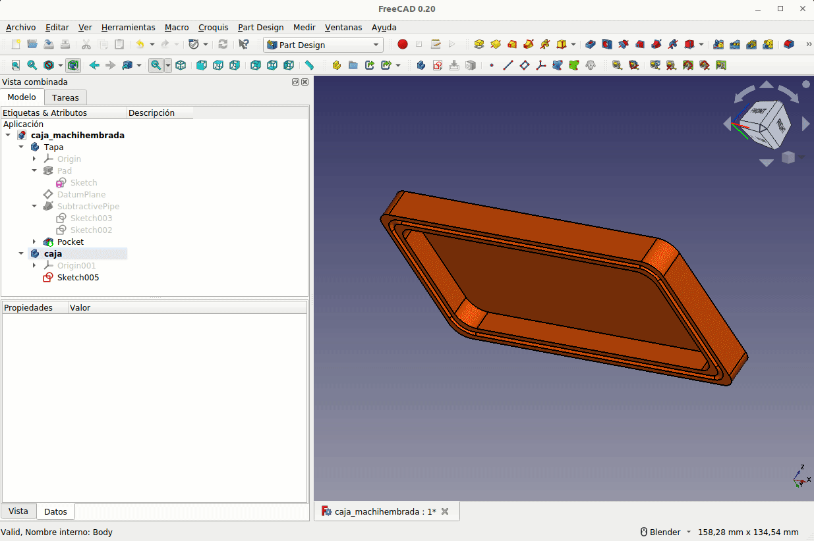  
*Proceso para realizar una Copia de carbón*

Ya podemos extruir el boceto copiado y obtener el sólido para la caja, al que procedemos a realizar la ranura con tubo aditivo y crearle el vaciado de forma similar a la realizada en el modelo con tornillo. En la animación siguiente vemos el resultado final.

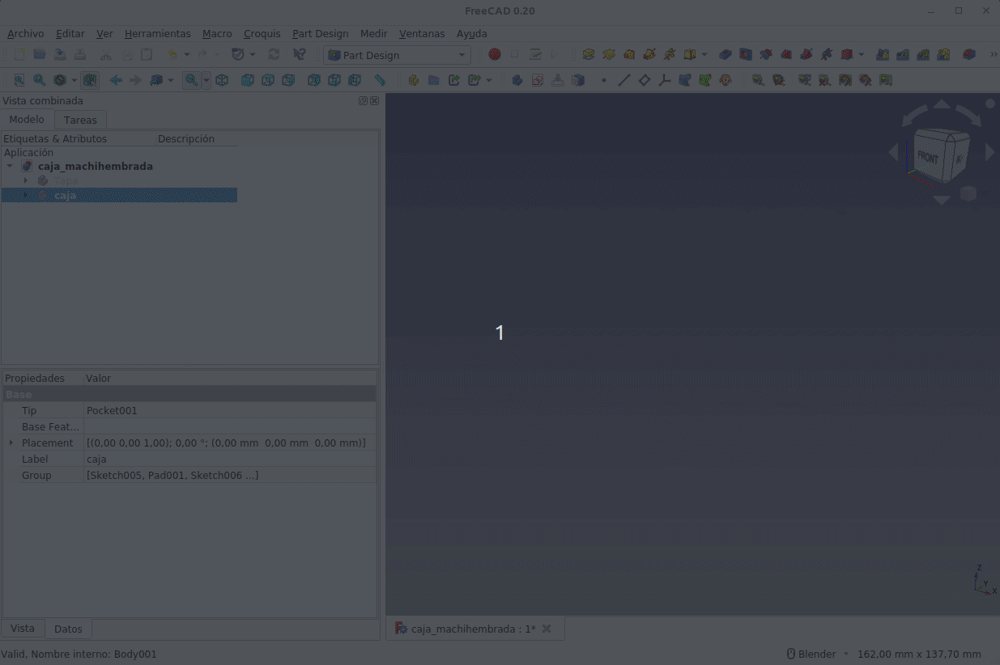  
*Resultado final de la caja con tapa*

A continuación tenemos los enlaces a los archivos de la caja.

- Archivo fuente de diseño: [caja_machihembrada.FCStd](../img/designs/2bis/caja_machihembrada.FCStd)
- Asrchivos STL: [Tapa.stl](../img/designs/2bis/caja_machihembrada-Tapa.stl) y [Caja.stl](../img/designs/2bis/caja_machihembrada-caja.stl)
- Archivos STEP: [Tapa.step](../img/designs/2bis/caja_machihembrada-Tapa.step) y [Caja.step](../img/designs/2bis/caja_machihembrada-caja.step)

En la imagen siguiente vemos la apariencia de la caja impresa en 3D.

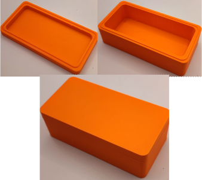  
*Fotografías de la caja impresa en 3D*

