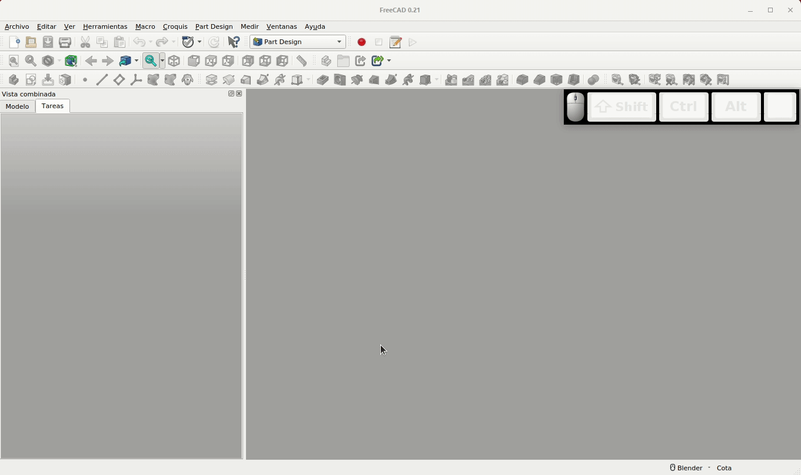
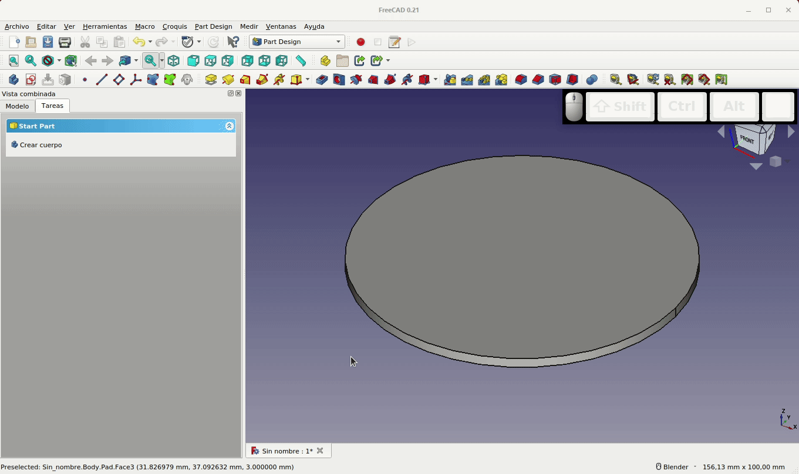

# 3.4. Plano de referencia fijado a cara plana
Vamos a crear una figura 3D aparentemente compleja pero que en realidad no lo es tanto. Partiremos de los datos de un plano como el de la Figura 3.4.1 e iremos viendo poco a poco como hacer el objeto final.

  
*Figura 3.4.1. Plano para el diseño de la pieza*

El plano se ha generado siguiendo los conceptos explicados en el apartado [6. Dibujo técnico. Banco de trabajo TechDraw](6-TD.md) y en esta aocasión vamos a utilizar la versión 0.21 de FreeCAD.

Comenzamos por crear una base apoyada en el plano XY de 100 mm de diámetro y un espesor de 3 mm, tal y como se aprecia en la Figura 3.4.2.

  
*Figura 3.4.2. Creamos la base de de la pieza*

El siguiente paso que vamos a realizar es crear un plano de referencia que va a estar fijado a la cara superior del cilindro y para ello procedemos como vemos en la animación de la Figura 3.4.3 para crear un nuevo boceto sobre este plano. Cabría pensar que es más rápido y sencillo dibujar el boceto sobre la cara del cilindro, pero esto no es una buena práctica y nos puede conducir a tener problemas en nuestros diseños derivados de los problemas que plantea la [denominación topológica de objetos](8-topologia.md) tal y como podemos ver en el apartado enlazado.

  
*Figura 3.4.3. Creamos el plano fijado a la cara superior de la base*

Seleccionamos el plano creado y dibujamos sobre el mismo un boceto según vemos en la Figura 3.4.4, donde además vemos el uso de la herramienta 'Recortar arista' del banco de trabajo 'Sketcher'.

  
*Figura 3.4.4. Creamos un nuevo boceto sobre el plano fijado a la cara superior de la base*

El paso siguiente es crear un nuevo plano que va a quedar anclado al primero y que lo vamos a girar 15º en el eje Z y lo vamos a elevar 60 mm también en Z, tal y como podemos apreciar en la Figura 3.4.5, donde podemos observar que al anclarlo al primer plano en realidad lo hace a una cara plana.

  
*Figura 3.4.5. Creamos un segundo plano que anclamos al primero*

Sobre este plano vamos a dibujar un boceto idéntico al realizado en la Figura 3.4.4. Este boceto va a tener el aspecto que vemos en la Figura 3.4.6 y va a estar girado 15º en Z respecto al boceto creado en el primer plano. Este giro se debe a que el plano sobre el que se apoya está girado ese ángulo.

  
*Figura 3.4.6. Creamos un segundo boceto apoyado en el plano que anclamos al primero*

Ahora repetimos el proceso para situar un nuevo plano a 120 mm del primero (60 mm del segundo plano), tomando el segundo como referencia y girado también 15º (30º respecto del primer plano). Apoyado en el nuevo plano dibujamos otro boceto igual a los anteriores. En la Figura 3.4.7 vemos la situación final de planos y bocetos.

  
*Figura 3.4.7. Creamos un tercer boceto apoyado en el plano que anclamos al segundo*

El siguiente paso que vamos a realizar es crear una proyección aditiva partiendo del primer boceto y siguiendo a los otros dos. Este proceso que vemos en la Figura 3.4.8 nos va a crear una especie de aspa torsionada que es con la que vamos a jugar para crear una forma compleja mediante una matriz polar.

  
*Figura 3.4.8. Creamos la proyección aditiva*

Con el 'AdditiveLoft' creado vamos a formar un patrón de repeticiones polar con un ángulo de 180º y 9 repeticiones. En la Figura 3.4.9 vemos el proceso y el resultado final.

  
*Figura 3.4.9. Creamos el patrón polar*

Vamos a crear un recipiente tipo jarrón a partir de estas aletas, para ello creamos un cilindro apoyado en el primer plano y que tenga una altura total de 120 mm. El proceso lo vemos en la Figura 3.4.10.

  
*Figura 3.4.10. Añadimos un cilindro apoyado en el primer plano*

Finalmente creamos un plano anclado a la cara superior del nuevo cilindro, dibujamos un boceto apoyado en el mismo y con este creamos una operación de 'Vaciado' que nos deja el recipiente final que vemos en la Figura 3.4.11.

  
*Figura 3.4.11. Pasos finales para crear el jarrón*

¡Y bueno! no es el jarrón mas bonito del mundo pero nos ha servido para aprender a usar este tipo de planos y aprender a utilizar algunas herramientas muy útiles de las que disponemos en FreeCAD.

## **Archivos y resultados finales**
En la tabla siguiente tenemos los enlaces para descargar los archivos del diseño que hemos realizado en la versión 0.21 de FreeCAD, otros formatos de archivo, una imagen de como se ve en el laminado y otra imagen del resultado impreso de la pieza diseñada. 

| Archivos | Captura del laminador | Imagen del resultado final |
|-:-|-:-|-:-|
|  [Diseño](../img/designs/3/3_4-Pieza-1.FCStd)  [STL](../img/designs/3/3_4-Pieza-1.stl)  [AMF](../img/designs/3/3_4-Pieza-1.amf)  [STEP](../img/designs/3/3_4-Pieza-1.step)  |  |  |

En el [enlace](../img/designs/3/3_4-Pieza-1_0_20.FCStd) tenemos el archivo fuente correspondiente a la versión 0.20 de FreeCAD donde se ha dibujado el plano técnico utilizado como dibujo de referencia para realizar el modelo 3D.

## **Ejercicio propuesto**
A partir de la idea del tutorial, realizar el diseño de un jarrón que tenga las mismas dimensiones en todas sus partes excepto en su base cuyo diámetro se reducirá a los 2/3 del central y en la boca superior el diámetro será la mitad del central.
