# 3.2. Plano de referencia fijado a objetos
Vamos a explicar como crear planos de referencia fijados a los objetos denominados “Plano XY, Plano XZ y Plano YZ” representados en la Figura 3.2.1 que son los planos coordenados que configuran el triedro trirectángulo de cada uno de los cuadrantes. Ya hemos vistos que cuando creamos un cuerpo o body se crea un elemento denominado “Origin” que contiene los tres planos y los tres ejes de referencia del sistema de coordenadas.

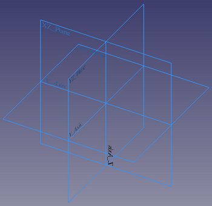  
*Figura 3.2.1. Planos de referencia*

Si hacemos clic en el icono de crear un nuevo objeto plano de referencia, se va a mostrar por defecto el nuevo plano en el plano de referencia XY y se abrirá la ventana de parámetros para seleccionar y con los modos de fijación, pero lógicamente sin tener ninguna referencia seleccionada, como vemos en la Figura 3.2.2.

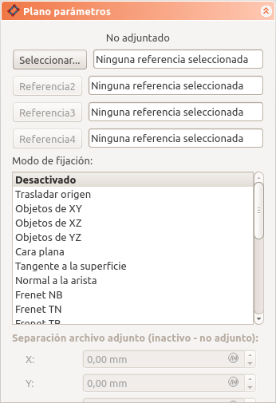  
*Figura 3.2.2. Ventana de parámetros y plano de referencia*

Si situamos el cursor durante un par de segundos, por ejemplo, sobre la opción de “Objetos de XY” se mostrarán los tipos de fijación que estarán disponibles y que vemos en la Figura 3.2.3.

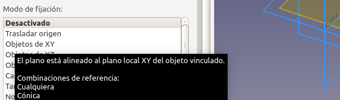  
*Figura 3.2.3. Tipos de fijación disponibles*

Si en esta situación cerramos la tarea haciendo clic en OK se nos mostrará una advertencia como la que vemos en la Figura 3.2.4.

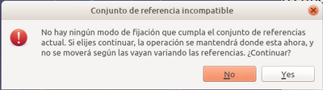  
*Figura 3.2.4. Creación de plano de referencia inamovible*

Si hacemos clic en “Yes” se nos crea un plano en XY pero que estará fijado al plano XY de referencia y no podremos moverlo, como vemos en la Figura 3.2.5.

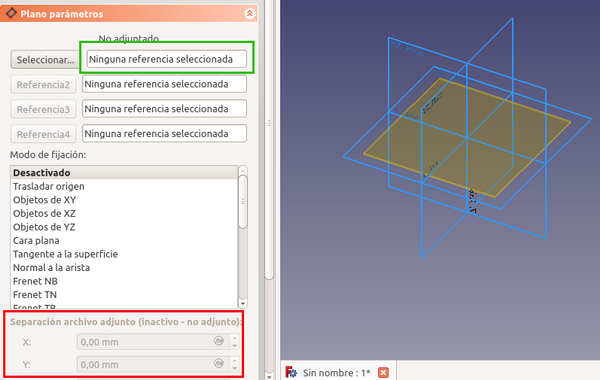  
*Figura 3.2.5. Plano re referencia inamovible fijado al de referencia*

Vamos a repetir la operación de crear un plano de referencia pero esta vez vamos a seleccionar uno de los planos de referencia del sistema y podemos observar como el plano que se va a crear queda atado al plano de referencia seleccionado y además con valores de movimiento editables, como se observa en la Figura 3.2.6.

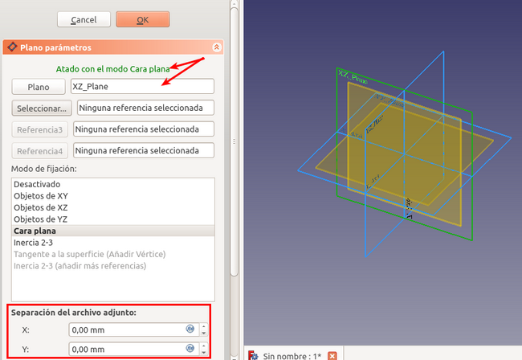  
*Figura 3.2.6. Plano re referencia movible fijado al de referencia*

Pues bien, lo que vamos a ver a continuación es como fijar el plano de referencia a “Objetos de XY, de XZ o de YZ”. Vamos a diseñar la pieza que vemos en la figura 3.2.7 utilizando un plano de referencia para ello.

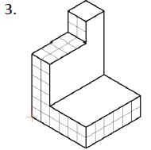  
*Figura 3.2.7. Pieza a diseñar*

Realizamos un croquis sobre el plano XZ de las dimensiones que vemos en boceto y lo extruimos 30 mm para obtener algo similar a lo de la Figura de la derecha.

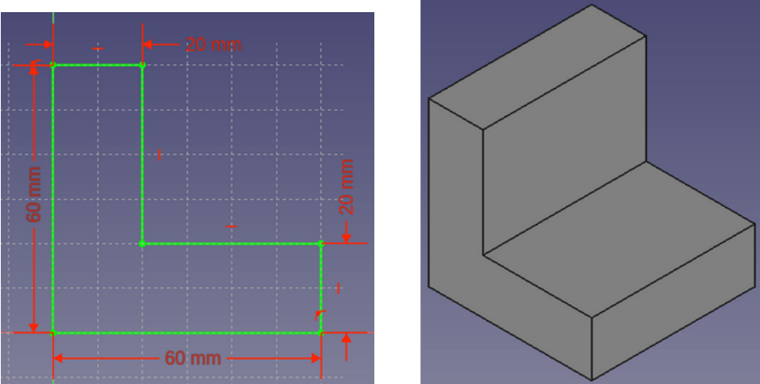  
*Figura 3.2.8. Croquis inicial pieza pieza a diseñar y su extrusión*

Para crear el saliente que falta vamos a utilizar un plano de referencia que crearemos seleccionado el plano XY de referencia y que desplazaremos 30mm en el eje Z para situarlo a la altura del rectángulo superior. Esto lo vemos en la Figura 3.2.9. Es evidente que se puede hacer creando el croquis directamente sobre la cara, pero para ver el funcionamiento de este tipo de planos resulta perfectamente válido.

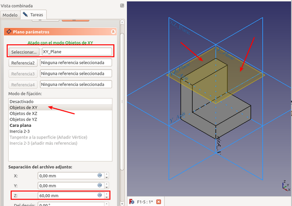  
*Figura 3.2.9. Plano de referencia fijado a XY y desplazado*

Seleccionando el plano creado y hacemos clic en boceto para tener uno nuevo. Creamos y dimensionamos un cuadrado siguiendo el proceso de la animación que tenemos en la Figura 3.2.10.

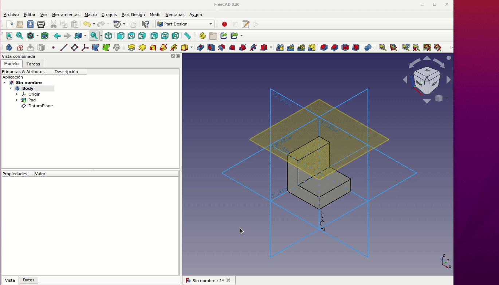  
*Figura 3.2.10. Creación del nuevo boceto*

Simplemente queda extruirlo y tenemos finalizada la pieza con una parte creada a partir de un plano de referencia, tal y como vemos en la Figura 3.2.11.

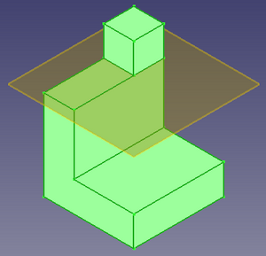  
*Figura 3.2.11. 3_2-Pieza-1*

Es evidente que esta misma situación podemos conseguirla de otras formas incluso más sencillas, pero la ventaja que tiene hacerlo mediante un plano es que el trozo creado puede recibir tareas independiente del objeto global relativas por ejemplo a la orientación del plano. En la animación de la Figura 3.2.12 vemos como hemos rotado el plano en dos ejes y como lo hace la figura. Al final de la animación podemos observar el uso del botón actualizar para que todos los cambios efectuados se reflejen en la vista 3D.

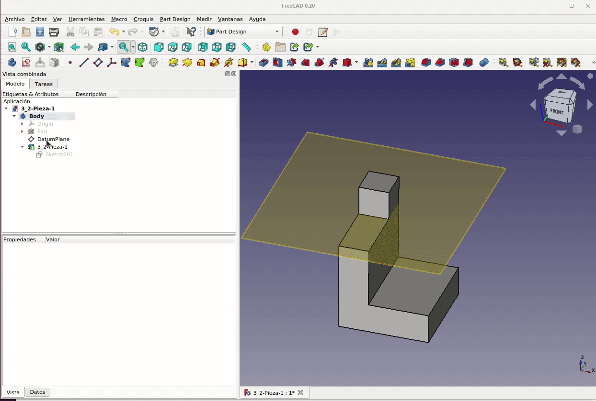  
*Figura 3.2.12. Rotación del plano de referencia y sus consecuencias*

Otro aspecto importante a tener en cuenta cuando trabajamos con planos de referencia es la forma de selección y hay que saber que no es lo mismo seleccionar objetos desde la ventana 3D que desde la vista combinada. Si hacemos un clic en alguna parte de un boceto en la ventana 3D solamente seleccionamos una parte del objeto, pero en cambio si hacemos clic sobre el objeto en 'Vista combinada' el objeto se selecciona entero. Esto lo observamos en la animación de la Figura 3.2.13.

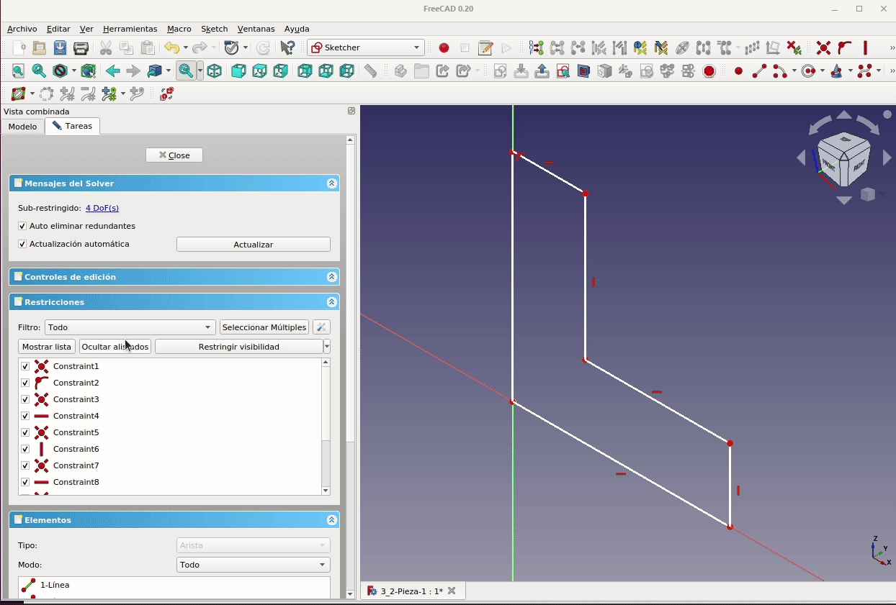  
*Figura 3.2.13. Selección desde ventana 3D y desde vista combinada*

Aunque si podemos hacer un clic sobre un objeto en la vista 3D y una vez seleccionado otro clic (doble clic sobre un objeto) sobre el mismo objeto y quedará seleccionado completo.

Si escogemos una arista del boceto y hacemos clic en crear plano de referencia tendremos la situación de la animación de la Figura 3.2.14.

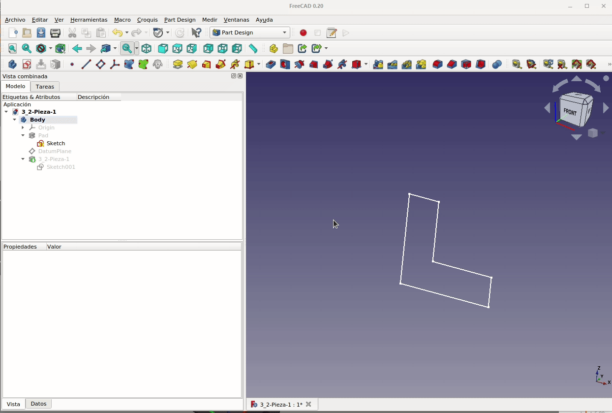  
*Figura 3.2.14. Creación de plano de referencia a partir de selección de arista*

En cambio si seleccionamos el boceto entero (un objeto) y hacemos lo mismo tendremos la situación que vemos en la Figura 3.2.15.

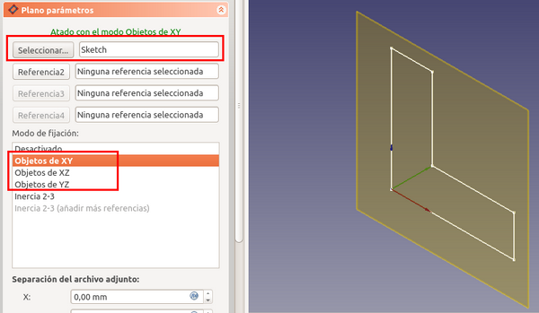  
*Figura 3.2.15. Creación de plano a partir de seleccionar el objeto boceto*

Esto mismo ocurre cuando tenemos un sólido y seguimos los mismos procedimientos.

Cuando hemos visto los tipos de referencia las combinaciones de referencia posibles (Figura 3.2.16) eran “Cualquiera” que es lo visto hasta ahora y “Cónica” que vamos a tratar a continuación.

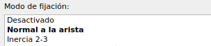  
*Figura 3.2.16. Tipos de combinaciones de referencia*

Recodemos que una sección cónica o simplemente cónica es la curva resultante de la intersección entre un cono y un plano y que pueden ser una de las cuatro que vemos en la Figura 3.2.17.

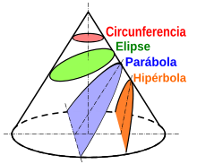  
*Figura 3.2.17. Cónicas*

Vamos a crear por ejemplo el boceto de una elipse y un círculo y lo hacemos creando un nuevo body, como vemos en la Figura 3.2.18.

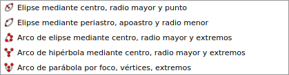  
*Figura 3.2.18. Boceto de cónicas*

Vamos a ver las diferencias entre seleccionar desde la ventana 3D y desde la ventana 'Vista combinada'. Si hacemos clic en la elipse, por ejemplo, y creamos un nuevo plano de referencia la tarea que se nos abre nos muestra opciones de fijación relacionadas con curvas (Frenet, Concéntrico,...), aunque también nos muestra las opciones vistas hasta ahora de Objetos XY, XZ e YZ. En la Figura 3.2.19 se muestra lo dicho.

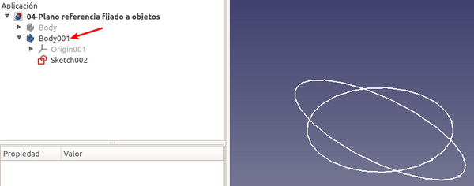  
*Figura 3.2.19. Opciones de fijación a curvas*

Esto ocurre así porque no están seleccionados todos los objetos (lo vemos en “Seleccionar”) sino solo la elipse. Si ahora hacemos la selección del boceto desde la vista combinada quedarán seleccionados todos los objetos y la ventana muestra solo los Objetos XY, XZ e YZ y la selección es del boceto completo, como vemos en la Figura 3.2.20.

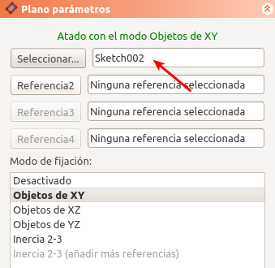  
*Figura 3.2.20. Selección de cónicas desde vista combinada*

## **Archivos y resultados finales**
En la tabla siguiente tenemos los enlaces para descargar el archivo del diseño que hemos realizado como ejemplo de la sección, otros formatos de archivo y una imagen del resultado impreso de la pieza diseñada.

| Archivos | Captura del laminador | Imagen del resultado final |
|-:-|-:-|-:-|
|  [Diseño](../img/designs/3/3_2-Pieza-1.FCStd)  [STL](../img/designs/3/3_2-Pieza-1.stl)  [3MF](../img/designs/3/3_2-Pieza-1.3mf)  [STEP](../img/designs/3/3_2-Pieza-1.step)  | 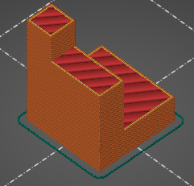 | 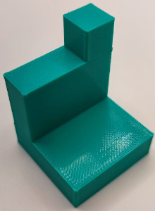 |

## **Ejercicio propuesto**
A partir de los datos indicados en la Figura 3.2.21 diseñar la pieza que se propone utilizando planos fijados a objetos.

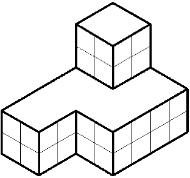  
*Figura 3.2.21. Pieza propuesta como ejercicio*

