# 3.3. Plano de referencia normal
Antes de entrar en el plano de referencia normal vamos a ver de forma rápida la extrusión por barrido.

## **3.3.1. Extrusión por barrido**
Vamos a hacer el diseño de un solido utilizando el sistema de barrido de croquis. Vamos a crear un codo de tubo con sección hexagonal como el que vemos en la Figura 3.3.1.

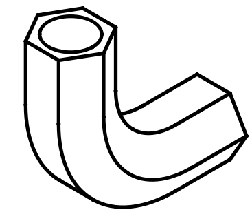  
*Figura 3.3.1. Codo a diseñar*

Comenzamos por crear un nuevo archivo y un boceto en el plano YZ que nos va a marcar la trayectoria de extrusión y las dimensiones del codo. Debe quedar como vemos en la Figura 3.3.2. Una vez finalizado el boceto cerramos la tarea.

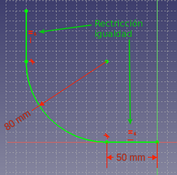  
*Figura 3.3.2. Boceto en plano YZ para la trayectoria*

Creamos un nuevo boceto en el mismo body (lo seleccionamos como activo si es necesario) ahora en el plano XZ. Será un hexágono con su centro en el origen de coordenadas y un circulo con centro en el mismo lugar de las dimensiones que vemos en la Figura 3.3.3. Una vez finalizado el boceto cerramos la tarea.

  
*Figura 3.3.3. Boceto en plano XZ para la forma*

Finalmente la situación que debemos tener es la de la Figura 3.3.4.

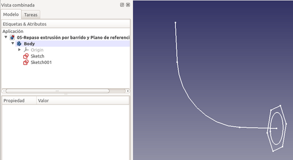  
*Figura 3.3.4. Situación con los dos bocetos*

Seleccionamos la herramienta 'Tubo aditivo' que vemos en la animación de la Figura 3.3.5. Esta nos va a crear un barrido de croquis seleccionado a lo largo de la trayectoria que indiquemos. El proceso debe realizarse en el orden que se ve en la animación y nos aparecerá de forma inmediata el objeto final tal y como se puede apreciar. 

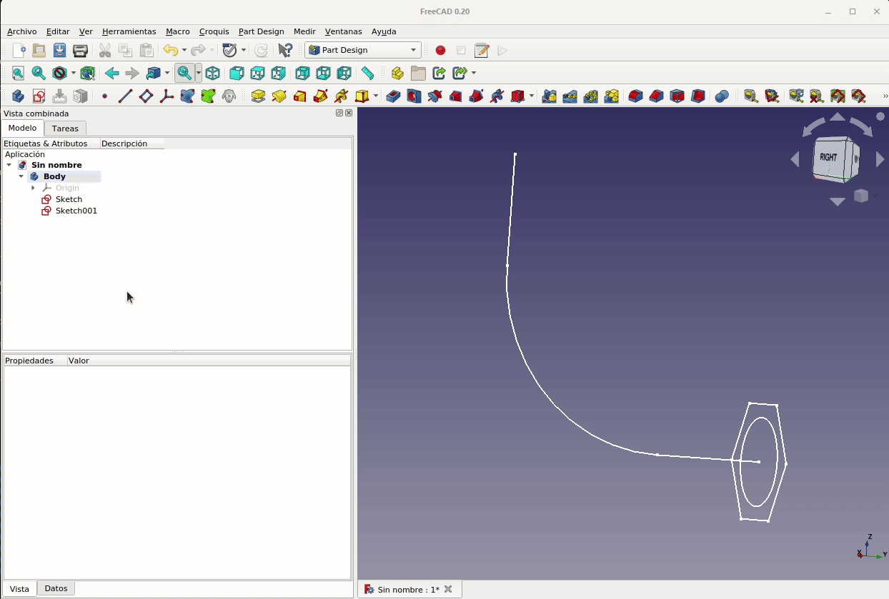  
*Figura 3.3.5. Herramienta Tubo aditivo y secuencia de selección de elementos*

Si cerramos la tarea haciendo clic en el botón 'OK' vemos el trabajo terminado y se observa el efecto del boceto creado para extruir con la forma hexagonal exterior y el orificio circular interior realizados a un tiempo, aunque es evidente que se puede hacer de otras formas esta parece bastante eficaz y no requiere de orificio posterior.

Si necesitamos consultar el [diseño en FreeCAD](../img/designs/3/3_3-Pieza-1.FCStd) lo podemos hacer descargando el archivo del enlace.

## **3.3.2. Herramienta espesor**
Vamos a ver otro proceso para hacer lo mismo que hemos visto pero utilizando la herramienta de “Aplicar espesor” que resulta también muy interesante. Está hwrramienta la tenemos disponible en el menú “Part”.

Inicialmente procedemos de forma similar a la vista anteriormente creando un 'Tubo aditivo' creando los mismos bocetos pero sin el orificio circular concentrico al hexágono. Procedemos según vemos en la animación de la Figura 3.3.6.

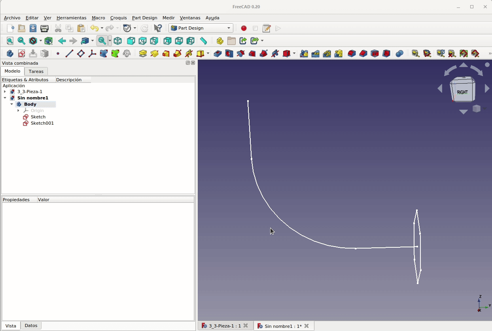  
*Figura 3.3.6. Creación del ángulo macizo*

Ahora nos situamos en el menú “Part”, seleccionamos una cara hexagonal del sólido y hacemos clic en la herramienta espesor citada, vemos como se nos crea el objeto tubo de forma inmediata. Podemos jugar con las diferentes opciones para ver como funcionan. En la animación de la Figura 3.3.7 vemos donde está dicha herramienta una solución que consiste en hacer clic en el botón “Caras” y posteriormente clic en ambas caras hexagonales para seleccionarlas.

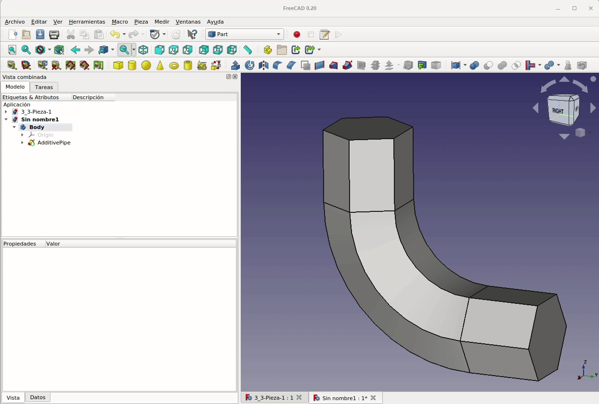  
*Figura 3.3.7. Uso de la herramienta espesor*

Si necesitamos consultar el [diseño en FreeCAD](../img/designs/3/3_3-Pieza-2.FCStd) lo podemos hacer descargando el archivo del enlace.

## **3.3.3. Plano de referencia normal a una arista**
Vamos a trabajar con el plano normal, que tiene como selecciones válidas las que vemos en la Figura 3.3.8. Vamos a obtener el mismo objeto que estamos viendo pero utilizando planos de referencia, en este caso plano de referencia normal a una arista.

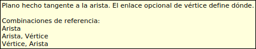  
*Figura 3.3.8. Selecciones válidas en plano normal a una arista*

Vamos a crear un plano normal a una arista. La situación de partida va a ser la que vemos en la Figura 3.3.9 y esta va a ser la trayectoria de extrusión creada en el plano YZ. Se trata de la misma trayectoria que en los ejemplos anteriores.

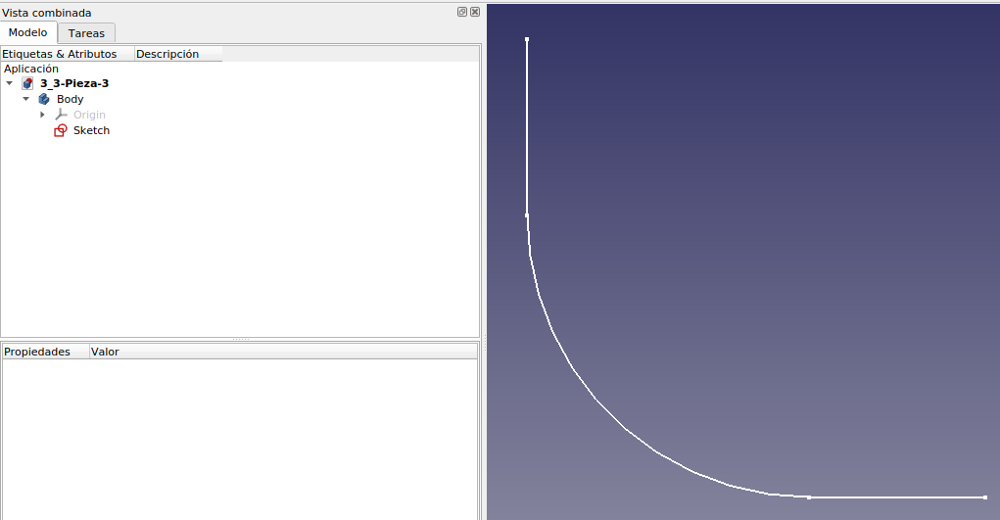  
*Figura 3.3.9. Trayectoria de partida*

Vamos a proceder como se observa en la animación de la Figura 3.3.10. Con la arista seleccionada desde vista 3D hacemos clic en crear plano de referencia. Se mostrará una ventana donde escogemos “Normal a arista” y ya podemos ver el plano que se va a crear. Para llevar el plano al vértice contrario lo desplazamos en Z la longitud del segmento, que recordemos es de 50 mm.

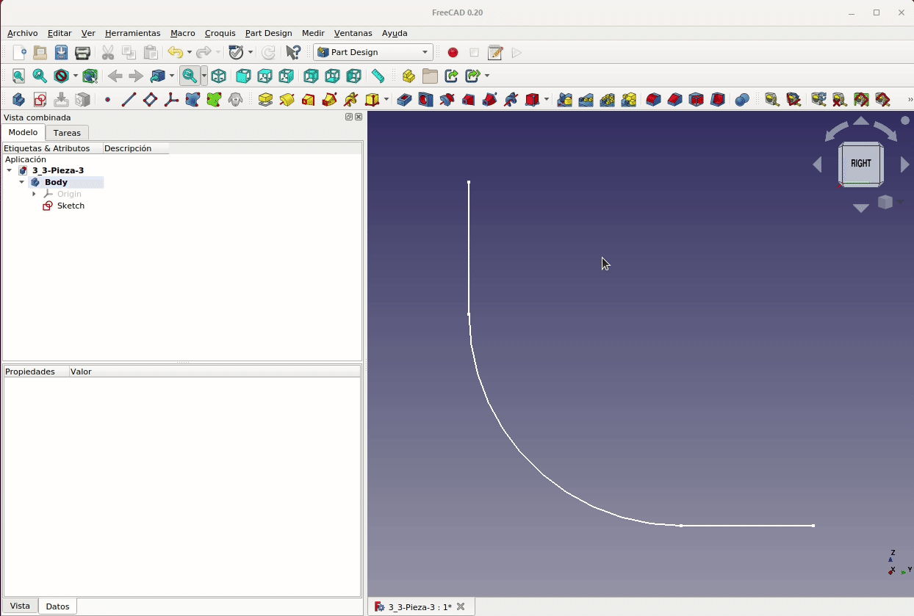  
*Figura 3.3.10. Creación de plano normal a arista*

En cuanto a la posición del plano vemos que el desplazamiento se realiza sobre su sobre su vector y en este caso la dirección del vector es la positiva del eje Z respecto a los ejes de referencia y por eso la cota es negativa. Si necesitamos cambiar ese valor a positivo (cambiar la dirección del vector) debemos marcar la opción “Voltear caras”, como vemos en la Figura 3.3.11 donde se observa como el mismo valor en positivo desplaza al plano justo al mismo lugar.

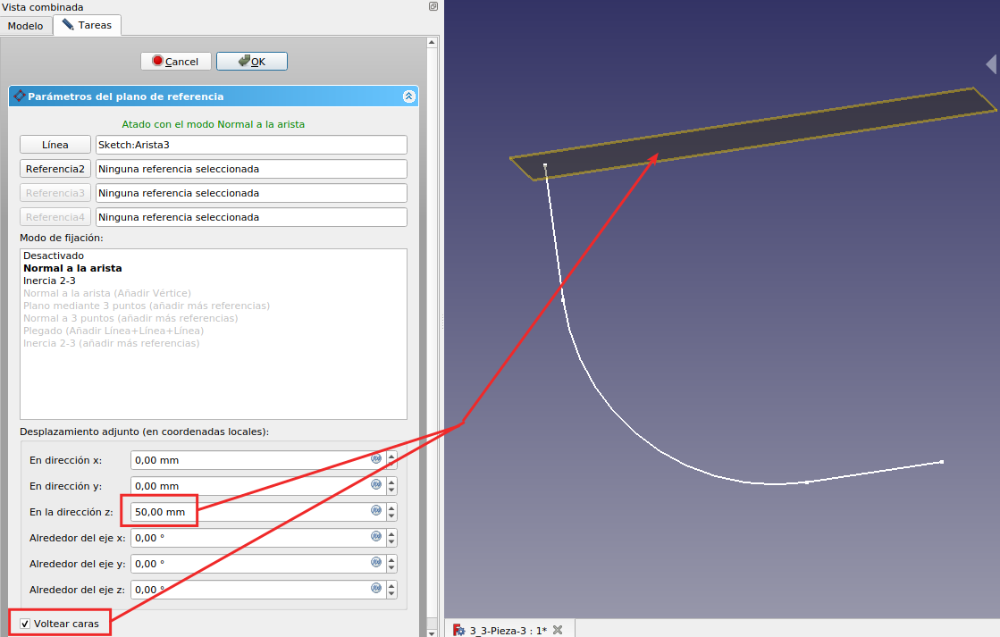  
*Figura 3.3.11. Efecto de la opción voltear caras*

Ya estamos en condiciones de crear el mismo boceto que anteriormente, en cualquiera de las formas vistas, para realizar una extrusión por trayectoria. Si seleccionamos el plano de referencia y creamos un nuevo boceto y seguimos la animación de la Figura 3.3.12 obtenemos el mismo objeto.

  
*Figura 3.3.12. Creación del codo a partir del plano normal a la arista*

Si necesitamos consultar el [diseño en FreeCAD](../img/designs/3/3_3-Pieza-3.FCStd) lo podemos hacer descargando el archivo del enlace.

## **3.3.4. Centro de masas de una arista**
Vamos a ver como situar el plano en el centro de masas de una arista. Para ello lo primero que hacemos es crear un punto en el centro de masas de la arista del boceto inicial que venimos utilizando tal y como vemos en la animación de la Figura 3.3.13.

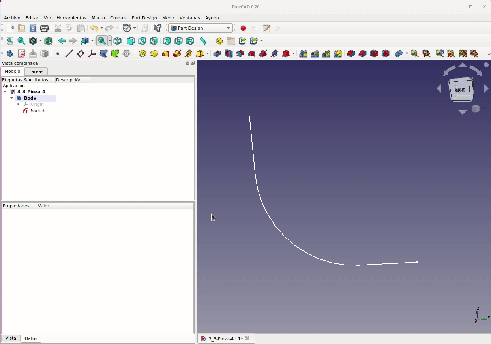  
*Figura 3.3.13. Creación de un punto en el centro de masas de la arista*

Ahora tan solo debemos crear el plano y hacer clic en el punto creado y el plano se creará normal a la arista y situado en su centro de masas, como vemos en la animación de la Figura 3.3.14. A partir de este plano ya podemos trabajar de cualquieras de las formas descritas para crear un boceto que tenga como base ese plano y obtener de nuevo el codo que estamos trabajando.

  
*Figura 3.3.14. Creación de un plano asociado al punto en el centro de masas de la arista*

Si necesitamos consultar el [diseño en FreeCAD](../img/designs/3/3_3-Pieza-4.FCStd) lo podemos hacer descargando el archivo del enlace.

## **3.3.5. Pieza de ejemplo**
Para ver la aplicación de lo que hemos descrito hasta ahora vamos a partir de una pieza basada en un boceto como el de la Figura 3.3.15 que una vez finalizado extruiremos 10mm.

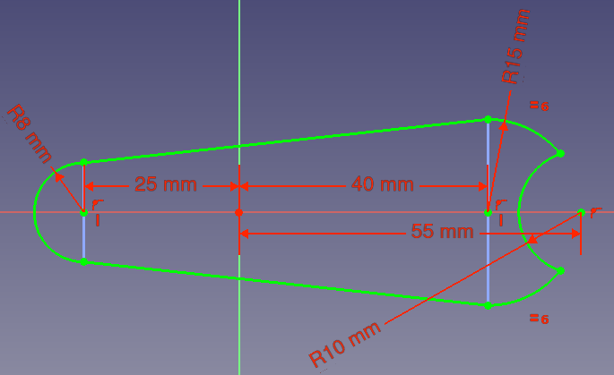  
*Figura 3.3.15. Boceto inicial de la pieza*

La idea es hacer un taladro centrado en la cara curva que forma el bocado y que atraviese toda la pieza. Inicialmente podríamos pensar en seleccionar la cara y hacer en crear boceto, pero esto no va a funcionar y FreeCAD nos va a mostrar el mensaje de error que vemos en la Figura 3.3.16, que nos indica de forma muy clara que un boceto no se puede realizar sobre una cara curva.

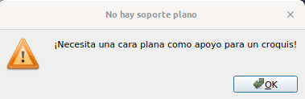  
*Figura 3.3.16. Mensaje de error al intentar crear boceto en cara curva*

Vamos a crear un punto en el centro de masas de la cara curva de la pieza, para lo cual seleccionamos la cara y hacemos clic en crear punto, escogiendo centro de masas, tal y como vemos en la animación de la Figura 3.3.17. Observamos que en este caso el centro de masas de esa cara curva está fuera de la pieza a la que pertenece.

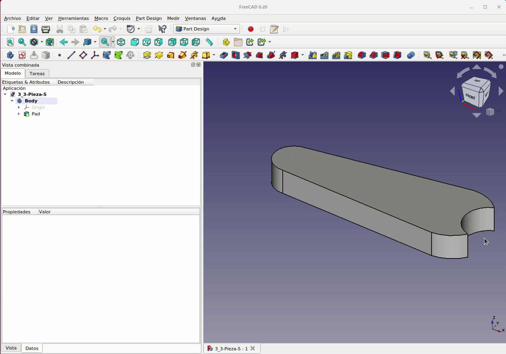  
*Figura 3.3.17. Creación de un punto auxiliar en el centro de masas de la cara curva*

A continuación vamos a crear un punto de referencia en cada una de las aristas rectas verticales de la cara curva que situaremos en su centro de masas. Posteriormente creamos un plano y lo hacemos pasar por los tres puntos creados, hacemos clic en uno de los puntos de una arista, en segundo lugar en el punto de la otra arista y en tercer lugar en el punto que representa el centro de masas de la curva y finalmente **escogemos 'normal a tres puntos'**. El proceso lo vemos en la animación de la Figura 3.3.18. Durante el proceso observamos que FreeCAD va intentando dar soluciones según las condiciones que marcan las selecciones que vamos haciendo.

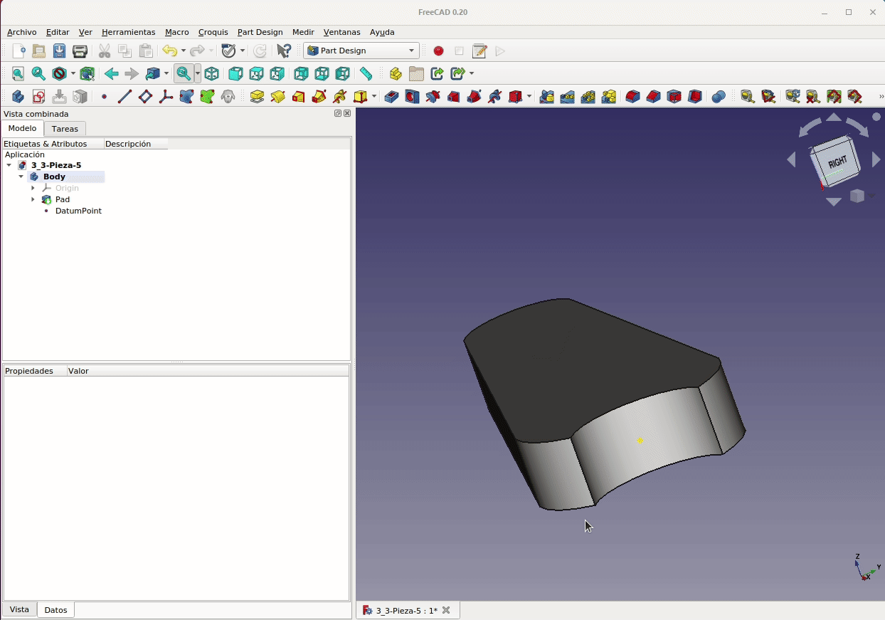  
*Figura 3.3.18. Creación del plano que pasa por tres puntos y es normal a ellos*

Ahora podemos hacer el boceto del taladro pasante, de 3 mm de radio, que estamos buscando situándolo sobre el plano recién creado y con el mismo proceder a realizar un vaciado a través de todos como el que vemos en la animación de la Figura 3.3.19.

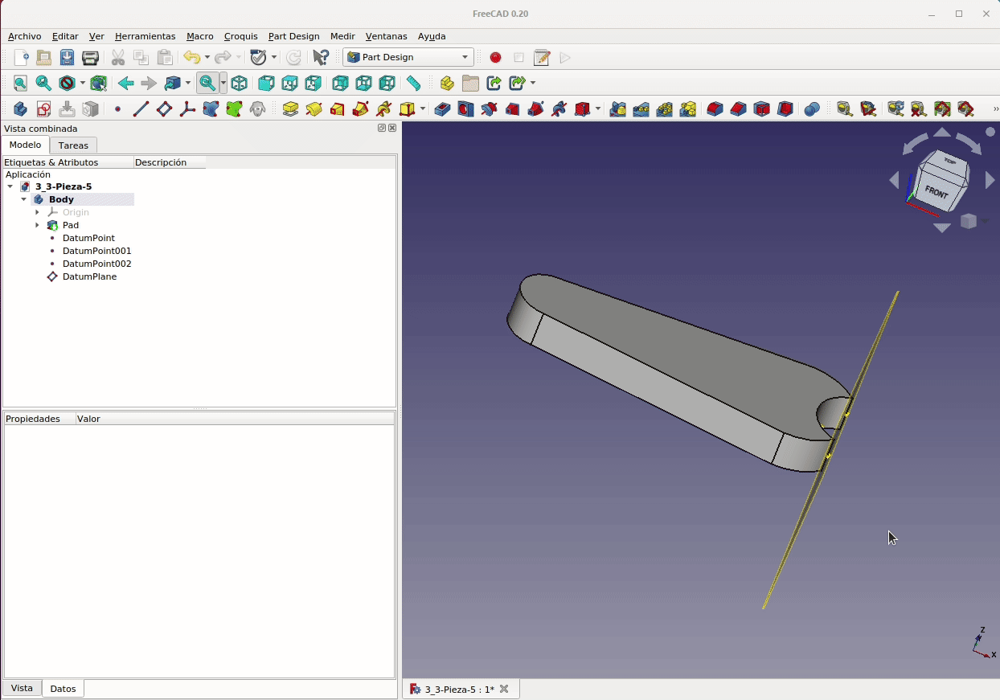  
*Figura 3.3.19. Proceso de creación del taladro pasante*

Vamos a hacer una sencilla comprobación de que el centro del taladro va a estar en el centro esperado (centro de la cara curva) y para ello vamos a utilizar los iconos que se citan a continuación.

* **Icono de arista vinculada**

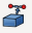  

Utilizando esta herramienta podemos crear una arista vinculada, que aparecerá en color azul, a una geometría externa. 

* **Icono para poner en modo referencia la barra de herramientas**

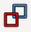  

Cambia la barra de herramientas a las restricciones seleccionadas a/desde el modo de referencia. Con esto crearemos cotas constructivas que no se tienen en cuenta ni crearán ningún conflicto con las dimensiones reales de la pieza. Tanto la barra de herramientas como las cotas creadas se pondrán en azul indicando que son auxiliares.

Si sobre nuestra pieza utilizamos estas herramientas, crearemos dos líneas auxiliares (aparecerán en azul) vinculadas a las aristas rectas de la cara curva, y realizamos las acotaciones que vemos en la animación de la Figura 3.3.20 donde podemos observar como efectivamente el centro del agujero está situado en el centro de masas. Para ello creamos un nuevo boceto utilizando el mismo plano de referencia definido anteriormente.

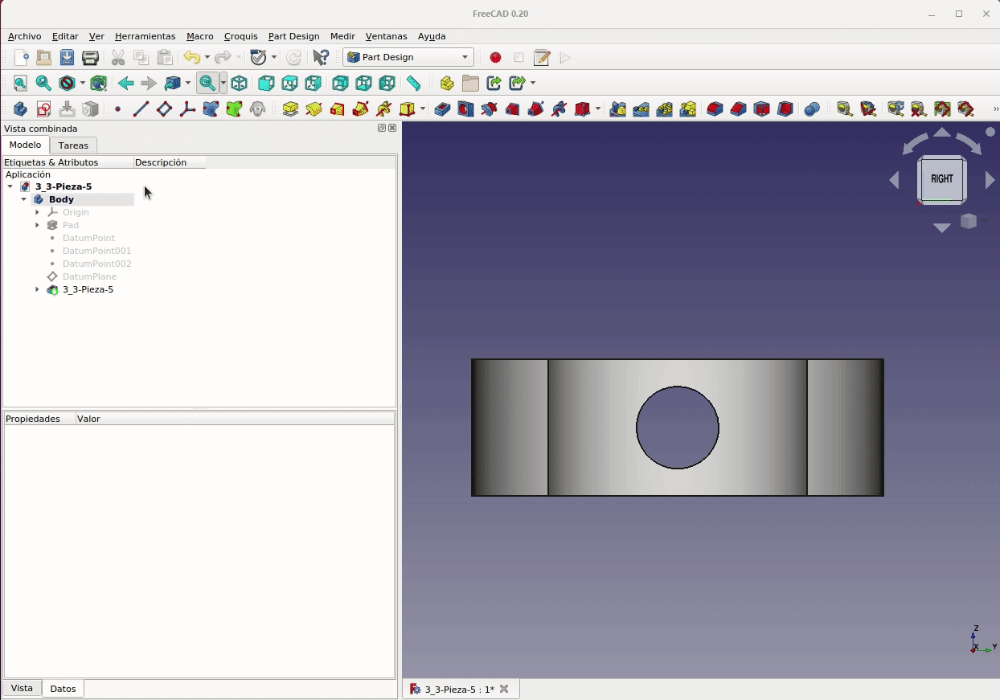  
*Figura 3.3.20. Proceso para demostrar que el taladro está centrado en la cara*

El aspecto final de la pieza lo podemos observa en la animación que vemos en la Figura 3.3.21 en la que se han ocultado tanto los puntos como el plano creados.

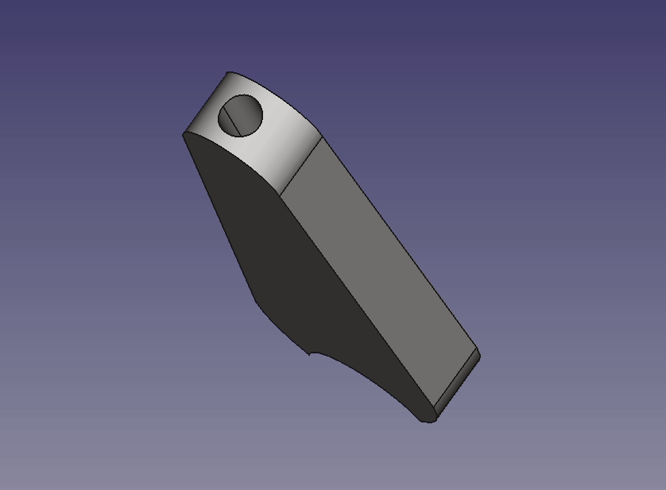  
*Figura 3.3.21. Aspecto final de 3_3-Pieza-5*

## **3.3.6. Archivos y resultados finales**
En la tabla siguiente tenemos los enlaces para descargar el archivo del diseño que hemos realizado como ejemplo de la sección, otros formatos de archivo y una imagen del resultado impreso de la pieza diseñada.

| Archivos | Captura del laminador | Imagen del resultado final |
|-:-|-:-|-:-|
|  [Diseño](../img/designs/3/3_3-Pieza-5.FCStd)  [STL](../img/designs/3/3_3-Pieza-5.stl)  [3MF](../img/designs/3/3_3-Pieza-5.3mf)  [STEP](../img/designs/3/3_3-Pieza-5.step)  | 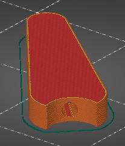 | 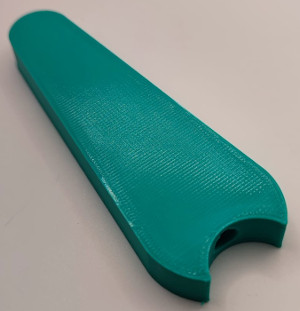 |

