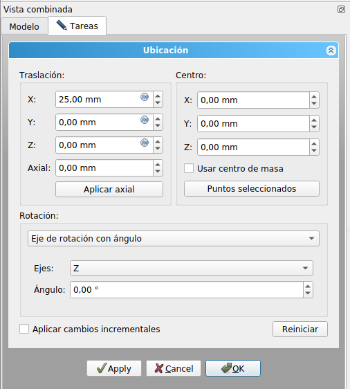
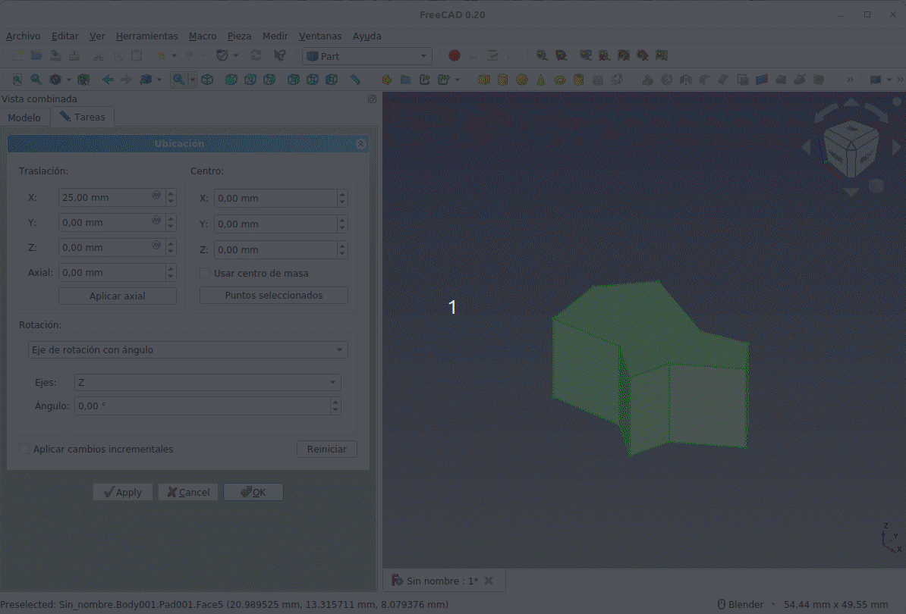
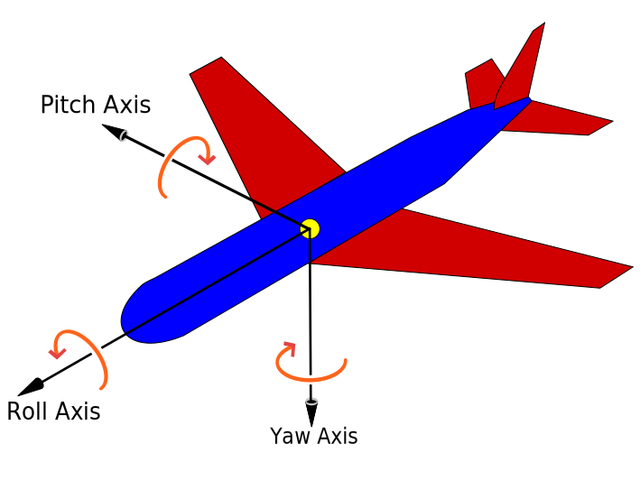
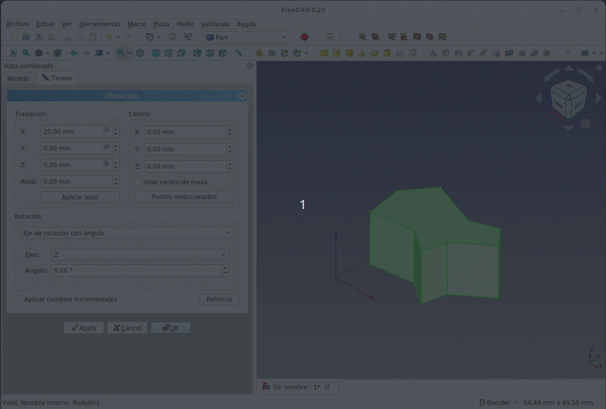
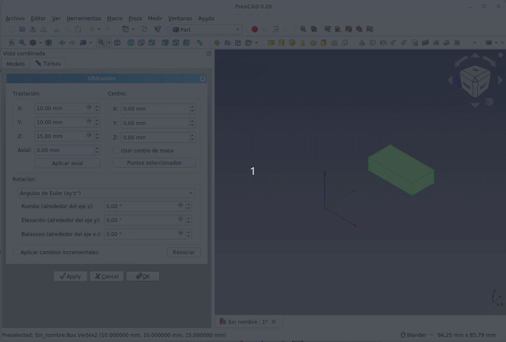
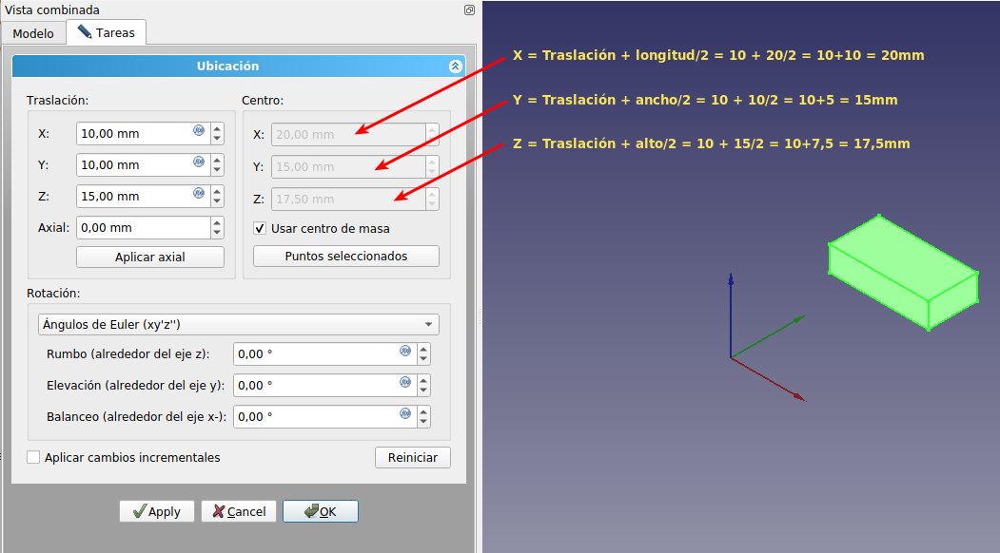
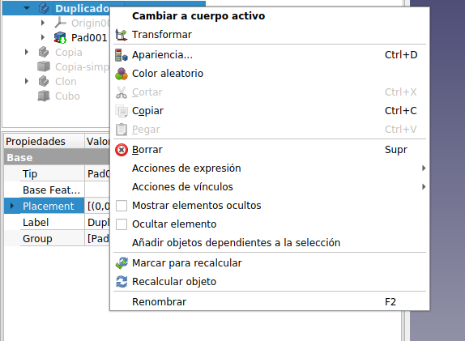
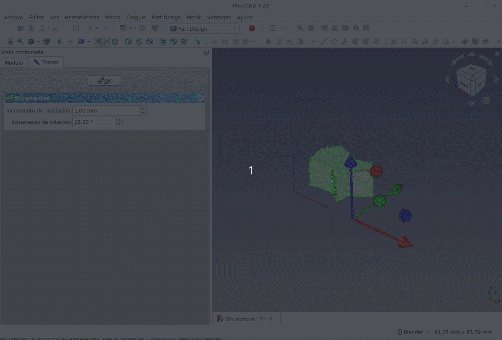

# 3.5. La propiedad Placement
La propiedad Placement la vamos a ver en este punto dado que la ubicación es la forma en que FreeCAD especifica la localización y la orientación de un objeto en el espacio. La ubicación se puede manipular de varias formas y vamos a ver la forma de hacerlo desde el panel de tareas de ubicación, que se abre haciendo clic en la diéresis de la derecha de la propiedad Placement. Esta acción despliega la ventana que vemos en la Figura 3.5.1.

  
*3.5.1. Propiedad Placement o Ubicación*

En la ventana podemos apreciar como se fija la ubicación de un objeto en el espacio mediante un vector de **Traslación** que describe el punto desde el cual se calcula la geometría del objeto u “origen local” y un valor escalar que indica la **Rotación** del objeto sobre el eje indicado. El valor lo ingresamos como grados pero el programa lo trabaja internamente como radianes.

También es posible trasladar o mover un objeto a lo largo del eje de rotación (movimiento axial) introduciendo la distancia en **Axial** y haciendo clic en **Aplicar axial**. En la animación de la Figura 3.5.2 vemos el efecto de lo explicado.

  
*3.5.2. Traslación y rotación de un objeto 3D*

Otra forma de establecer la orientación del objeto es utilizando los denominados **Ángulos de Euler** o ángulos de Tait-Bryan. Está basado en la orientación de un objeto utilizando los términos de aviación siguientes:

* **Yaw**: dirección o rumbo respecto al eje vertical del avión
* **Pitch**: elevación respecto al eje definido por las alas
* **Roll**: alabeo respecto al eje morro-cola del avión

En la Figura 3.5.3 (obtenida de [Wikimedia Commons](https://commons.wikimedia.org/wiki/File:Yaw_Axis_Corrected.svg)) vemos graficamente estos ejes.

  
*3.5.3. Movimientos Yaw, Pitch y Roll de un avión en vuelo*

En la animación de la Figura 3.5.4 vemos estos movimientos.

  
*3.5.4. Movimientos Yaw, Pitch y Roll*

Para explicar el uso de **Centro**  utilizaremos un paralelepipedo de longitud (X) 20mm, ancho (Y) 10mm y alto (Z) 5mm. La rotación sobre los ejes que establecen los **Ángulos de Euler** nos muestran (animación de la Figura 3.5.5) claramente que el objeto tiene un punto de referencia por defecto, que no es otro que su vértice inferior izquierdo. Es decir, el objeto rota sobre sus ejes de coordenadas locales cuyo origen está en ese punto.

  
*3.5.5. Rotaciones Ángulos de Euler del paralelepipedo*

La opción **Centro** permite mover ese punto a la posición que mas nos convenga. Si por ejemplo lo movemos al vértice situado en el final de la diagonal que va de su origen al superior derecho del plano superior vemos que el se realiza según ese origen.

Si marcamos **Usar centro de masa** el origen de coordenadas local se desplaza al centro de masas de la pieza referido al origen de coordenadas absoluto y los movimientos se realizan respecto a los ejes locales situados en el punto calculado. En la Figura 3.5.6 vemos el cálculo de ese centro de masa.

  
*3.5.6. Cálculo del centro de masa*

El botón **Puntos seleccionados** permite trasladar el origen local seleccionando 1, 2 o 3 puntos antes de hacer clic en este botón. Un punto puede estar en un vértice, cara o arista. Si se selecciona 1 punto, este se utilizará como centro de rotación. Si se seleccionan 2 puntos, el punto medio entre ellos será el centro de rotación y, si es necesario, se creará un nuevo eje personalizado. Si se seleccionan 3 puntos, el primer punto se convierte en el centro de rotación y se encuentra en el vector que es normal al plano definido por los 3 puntos. Se proporciona cierta información de distancia y ángulo en la vista de reporte, que puede ser útil al alinear objetos.

La casilla de verificación **Aplicar cambios incrementales** a la colocación de objetos es útil cuando las traslaciones/rotaciones se deben realizar en relación con la posición/orientación actual del objeto, en lugar de con la posición/orientación original. Marcar esta casilla restablece los campos de entrada de diálogo a cero, pero no cambia la orientación o ubicación actual del objeto. Podríamos decir que es como si fijasemos la posición actual de los ejes locales como posición inicial de estos a partir de ese momento.

Cuando hacemos clic con el botón secundario del ratón sobre un objeto 3D se nos muestra un menú con diferentes opciones, siendo una de ellas **Transformar**, como vemos en la Figura 3.5.7.

  
*3.5.7. Ventana flotante botón secundario del ratón*

Al hacer clic sobre esta opción en la ventana gráfica nos aparecen unos ejes especiales y una ventana denominada **Incrementos**. Las esferas de los ejes permiten girar el objeto según el eje escogido y las puntas de flecha permiten desplazarlo por ese eje. Los colores son totalmente coincidentes con los de la cruz de ejes u origen de coordenadas, rojo para el eje X, verde para el eje Y y azul para el eje Z. Los incrementos de traslación o rotación se realizan ajustándose a los valores indicados en ellos. En la animación de la Figura 3.5.8 vemos su funcionamiento.

  
*3.5.8. Uso de Transformar*

