# 3.1. Plano de referencia que pasa por tres puntos
Para llevar a cabo esta explicación vamos a trabajar a partir de los datos de la pieza de la Figura 3.1.1 en la que cada cuadradito mide 5 mm. Se trata simplemente de un cubo con un corte inclinado.

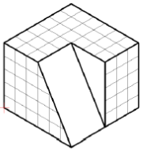  
*Figura 3.1.1. Pieza a diseñar*

Partimos de un cubo completo para hacer el corte de forma diferente, es decir, como cada cuadradito mide 5 mm el cubo tiene unas dimensiones de 30x30x25 mm que vamos a dibujar a partir de un boceto de 30x30 sobre el plano XY situado en el primer cuadrante y con un vértice en el origen de coordenadas de referencia. Este boceto lo extruiremos en positivo 25 mm para obtener el cubo que vemos en la Figura 3.1.2.

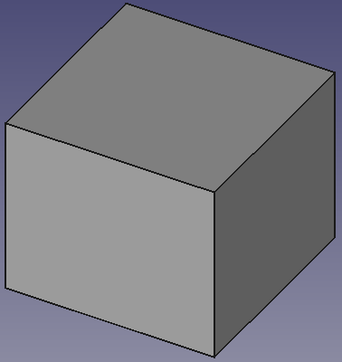  
*Figura 3.1.2. Cubo de 30x30x25 mm a partir de boceto*

Vamos ahora a realizar un corte a la pieza utilizando para ello un plano de referencia. Este plano lo usamos como soporte para hacer un boceto, es decir, algo similar a lo que hacemos cuando seleccionamos una cara como soporte de un boceto. El icono que nos da acceso a la herramienta es el que vemos en la Figura 3.1.3.

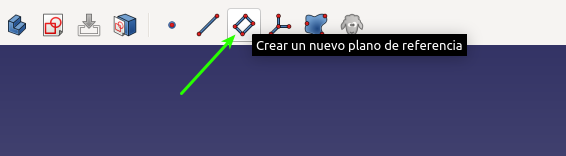  
*Figura 3.1.3. Icono acceso a plano de referencia*

Una vez seleccionada la herramienta se muestra una ventana como la de la Figura 3.1.4, donde se ha marcado la opción de plano por tres puntos.

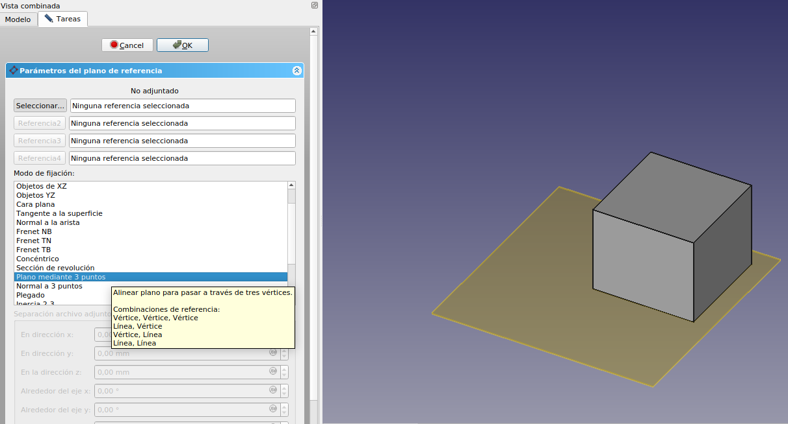  
*Figura 3.1.4. Herramienta plano de referencia*

Vemos que existen diversas formas de fijar un plano de referencia y que si dejamos el cursor sobre alguna de ellas nos muestra información adicional de lo que podemos hacer. En nuestro caso vamos a definir un plano que pasa por tres puntos, luego necesitamos definir esos tres puntos en nuestro sólido.

Ahora bien, para poder hacer que el plano pase por tres puntos primero tendremos que definir esos tres puntos, cosa que haremos a continuación tras cerrar la herramienta de plano de referencia.

Para crear puntos de referencia disponemos de una herramienta que podemos desplegar haciendo clic sobre el icono que vemos en la Figura 3.1.5.

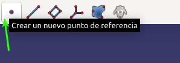  
*Figura 3.1.5. Icono acceso a crear puntos de referencia*

Esto nos despliega una ventana en la que disponemos de diversas opciones. Nosotros vamos a utilizar la opción Vértice que es la que observamos en la Figura 3.1.6.

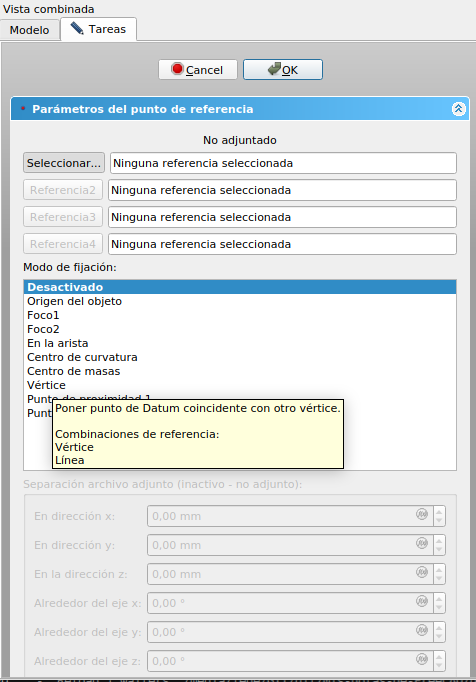  
*Figura 3.1.6. Fijar punto de referencia a vértice*

En nuestro caso vamos a comenzar por seleccionar el vértice superior derecho del cubo y vamos a situar el punto que desplazaremos a 15 mm del vértice seleccionado para que quede a mitad de la arista, tal y como vemos en la animación de la Figura 3.1.7. En esta misma animación se aprecia como se crean los otros dos puntos de referencia.

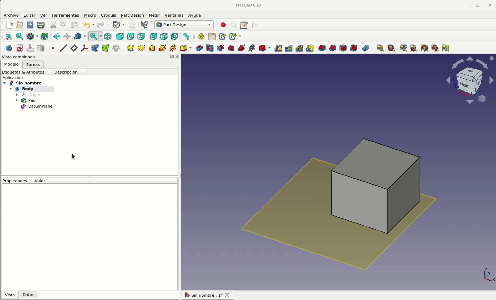  
*Figura 3.1.7. Fijación de puntos de referencia*

Vamos a proceder ahora a situar el plano para que pase por esos tres puntos, para ello seleccionamos el plano en el árbol de objetos y hacemos doble clic, seleccionamos plano por tres puntos si no lo está ya y vamos haciendo clic en cada uno de los puntos creados. Observamos como los botones son asociados al punto seleccionado. En la animación de la Figura 3.1.8 vemos el proceso completo.

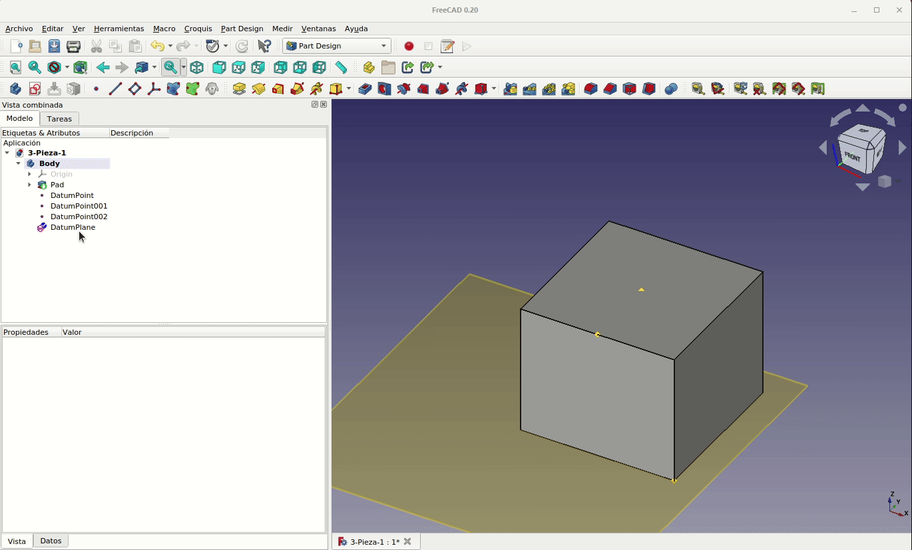  
*Figura 3.1.8. Asociación de los tres puntos de referencia al plano*

Ahora que tenemos el plano ya podemos utilizarlo para crear nuestro boceto, pero la idea es que este sea una línea cerrada que pasa justamente por los tres puntos que definen el plano, por tanto lo más conveniente va a ser crear una proyección auxiliar de esos tres puntos puesto que ellos mismos no van a ser seleccionables como referencia para los vértices de nuestro boceto. Seleccionamos el plano haciendo un clic sobre el mismo y creamos un nuevo boceto. Sin finalizar la tarea nos dirigimos a la ventana 'Vista combinada' y hacemos clic en 'Modelo' y prodecemos a ocultar el plano para poder trabajar más cómodamente y cuando lo hagamos volvemos a la vista 'Tareas'. En la Figura 3.1.9 observamos esto.

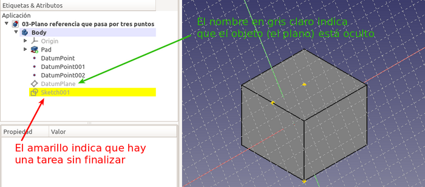  
*Figura 3.1.9. Ocultar plano sin finalizar tarea*

Escogemos la herramienta de crear arista vinculada, tal y como se observa en la Figura 3.1.10, y seleccionando cada uno de los puntos creamos una proyección de los tres puntos.

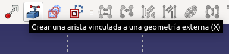  
*Figura 3.1.10. Herramienta arista vinculada*

Ahora dibujamos una polilínea que pase por esos tres puntos para obtener un boceto que delimite una superficie y como podemos observar las líneas están en verde indicando que está totalmente restringido ya que lo están los tres puntos que definen sus vértices. El aspecto debe ser el de la Figura 3.1.11, donde se aprecia que hemos dado transparencia al cubo para poder ver correctamente la polilínea creada.

  
*Figura 3.1.11. Boceto que delimita una superficie*

Con este nuevo boceto ya podemos trabajar de la forma habitual, por ejemplo haciendo un vaciado invertido de 5 mm, obteniendo algo similar a lo que vemos en la Figura 3.1.12.

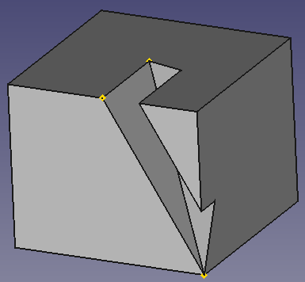  
*Figura 3.1.12. Vaciado invertido*

Si aumentamos la cota podemos llegar a cortar totalmente el cubo tal y como se observa en la Figura 3.1.13. Esto mismo se consigue si establecemos el 'Tipo' en 'A través de todos' que además nos sitúa en una posición ideal para explicar el funcionamiento paramétrico de FreeCAD. Para ello vamos a hacer algunas modificaciones en el objeto y vemos que ocurre.

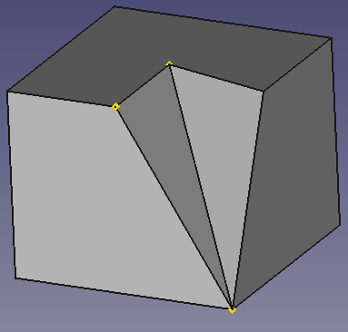  
*Figura 3.1.13. Efecto de aumentar el valor de cota*

Para apreciar ese comportamiento paramétrico vamos a hacer algunas modificaciones en el objeto y vemos que ocurre.

* En primer lugar cambiamos la longitud de extrusión del boceto original de 25 mm a 15 mm y tendremos algo como lo que vemos en la Figura 3.1.14. Vemos que el plano ha cambiado a la nueva posición y esto es debido a que los puntos por donde pasa están asociados a los vértices del sólido y por tanto si el sólido mueve esos vértices el plano se mueve con ellos.

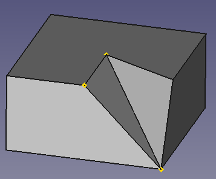  
*Figura 3.1.14. Cambio en la longitud de extrusión*

* Otra situación es la que vemos en la Figura 3.1.15, donde hemos cambiado de posición de dos de los puntos de referencia del plano y con ello cambia el vaciado creado en el sólido. Incluso un punto lo hemos sacado del sólido.

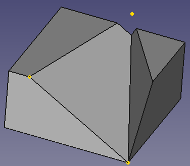  
*Figura 3.1.15. Cambio de posición de los puntos de referencia*

La pregunta que nos podemos hacer ahora sería ¿se puede diseñar la pieza propuesta inicialmente por este método sin añadir complejidad? Pues la respuesta es que si, lo único que hace falta es agregar un cuarto punto en el lugar adecuado y repetir todo el proceso anterior con los cuatro puntos y tendremos diseñada la pieza tal cual estaba propuesta. El resultado lo podemos ver en la Figura 3.1.16. A continuación tenemos los enlaces para descargar el archivo del diseño que hemos realizado como ejemplo de la sección, otros formatos de archivo y una imagen del resultado impreso de la pieza diseñada.

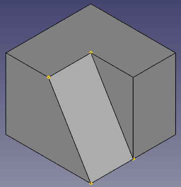  
*Figura 3.1.16. Pieza final*

## **Archivos y resultados finales**

| Archivos | Captura del laminador | Imagen del resultado final |
|-:-|-:-|-:-|
|  [Diseño](../img/designs/3/3-Pieza-1.FCStd)  [STL](../img/designs/3/3-Pieza-1.stl)  [3MF](../img/designs/3/3-Pieza-1.3mf)  [STEP](../img/designs/3/3-Pieza-1.step)  | 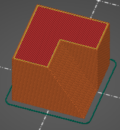 | 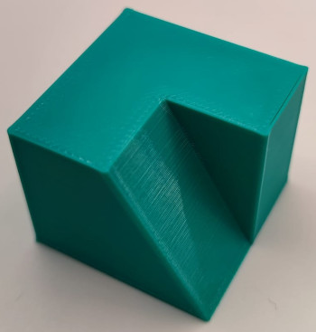 |

## **Ejercicio propuesto**
Diseñar la pieza que se propone en la figura 3.1.17 sabiendo que los cuadrados son de 5 mm y utilizando el método empleado en este apartado.

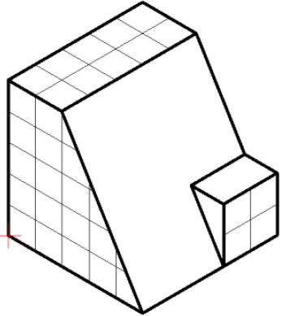  
*Figura 3.1.17. Pieza propuesta como ejercicio*

