# 3.0. ¿Por qué debemos usar planos de referencia?
Hemos visto en el apartado [2. Banco de trabajo PartDesign](2-PD.md) como se pueden crear bocetos sobre caras planas de nuestras piezas, pero esta **NO es una buena práctica** fundamentalmente por dos motivos:

- Solamente podemos hacerlo sobre caras planas, lo cual nos limita el diseño de piezas a no poder tomar como referencia caras curvas. Este aspecto se trata en otros apartados de la web.

- Otro, y mas importante, es el que vamos a desarrollar en este apartado y tiene que ver con lo que se denominan nombres topológicos de objetos que nos describen en la sección [Topological naming problem](https://wiki.freecadweb.org/Topological_naming_problem) de la wiki de FreeCAD. En realidad lo que vamos a hacer aquí es explicar esta entrada de la wiki.

## **3.0.1. Problema de denominación topológica en FreeCAD**
El problema se refiere al tema de que un objeto de una figura cambie su nombre interno después de realizar una operación booleana o de modelado (relleno, corte, unión, chaflán, redondeo, etc.). Si esto ocurre dará lugar a que se rompan o se calculen incorrectamente otras características paramétricas que dependen de esta figura. El problema afecta a todos los objetos de FreeCAD, pero es sobre todo importante cuando se construyen sólidos con el banco de trabajo 'Part design' y tratamos de acotarlos en el banco de trabajo de dibujo técnico TechDraw.

* En 'PartDesign' si una característica se apoya en una cara (o una arista o un vértice), esta puede romperse si el sólido subyacente cambia de tamaño u orientación, ya que la cara (o arista o vértice) original puede cambiar de nombre internamente. 
* TechDraw si una cota está midiendo la longitud de una arista proyectada, esta dimensión puede romperse si se cambia el modelo 3D, ya que los vértices de la arista pueden ser renombrados cambiando así la arista medida.

Este problema de denominación topológica es bastante complejo, tiene que ver con la forma en que FreeCAD maneja las actualizaciones de las formas geométricas creadas con el [OCCT kernel](https://wiki.freecadweb.org/OpenCASCADE/es) y se están dedicando muchos esfuerzos a resolverlo. Si estás interesado en el tema hay un hilo en el foro [Topological Naming, My Take](https://forum.freecadweb.org/viewtopic.php?t=27278) sobre el tema, eso si está en inglés.

Para resolver el problema de denominación topológica se aconseja seguir estos puntos:

1. En 'Partdesign' es aconsejable seguir las mejores prácticas posibles y que son discutidas en la página [edición de operaciones](https://wiki.freecadweb.org/Feature_editing/es)
2. Se recomienda muy especialmente el uso, como apoyo de referencia para objetos, los planos y sistemas de coordenadas locales. Esto va a generar modelos que no estarán sujetos a errores topológicos, al menos de forma sencilla.
3. En dibujo técnico, se recomienda poner dimensiones sólo cuando el modelo 3D esté finalizado y ya no se modificará más.

## **3.0.2. Ejemplo. Generar el problema**
Vamos a crear una pieza sencilla, provocar un error topológico y finalmente veremos como arreglar ese error. Comenzamos creando una pieza en forma de L siguiendo el proceso que vemos en la animación de la Figura 3.0.1 en el que partimos de un boceto totalmente restringido creado a partir de la herramienta 'Crear polilínea'.

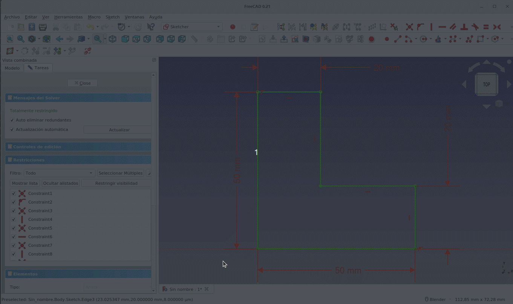  
*Figura 3.0.1. Creamos la pieza de partida*

Sobre la cara superior vamos a crear una nueva extrusión de la forma que vemos en la animación de la Figura 3.0.2 en la que vemos las dimensiones y situación del boceto de partida.

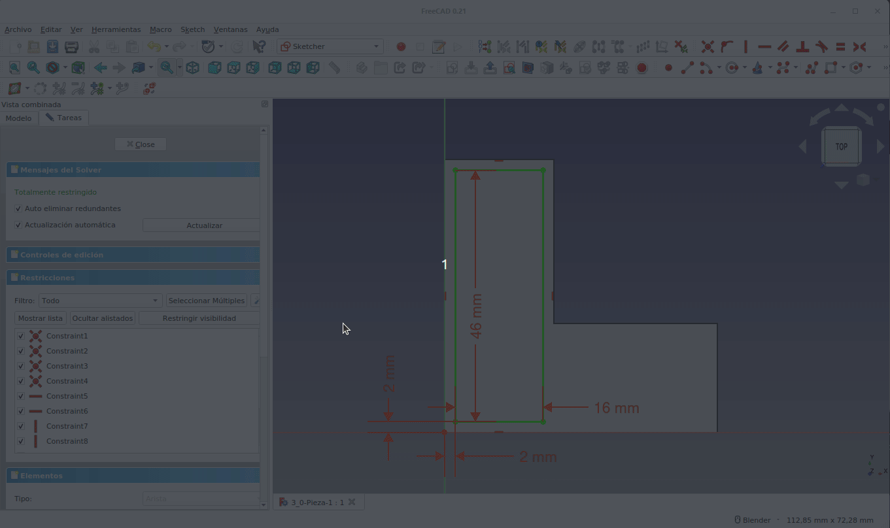  
*Figura 3.0.2. Creamos una nueva extrusión apoyada en la cara superior de la pieza*

Seleccionamos la cara superior de la extrusión anterior y creamos y extruimos el nuevo boceto que vemos en la Figura 3.0.3.

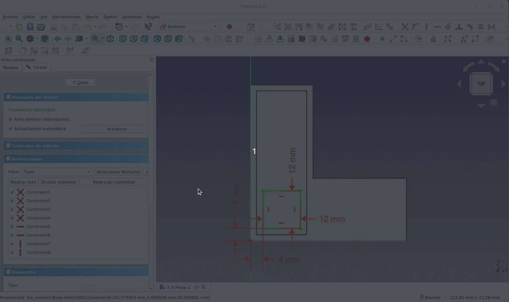  
*Figura 3.0.3. Creamos una nueva extrusión apoyada en la cara superior de la extrusión anterior*

Vamos a realizar las modificaciones en el segundo boceto que observamos en la Figura 3.0.4 para ver que ocurre con las pieza final.

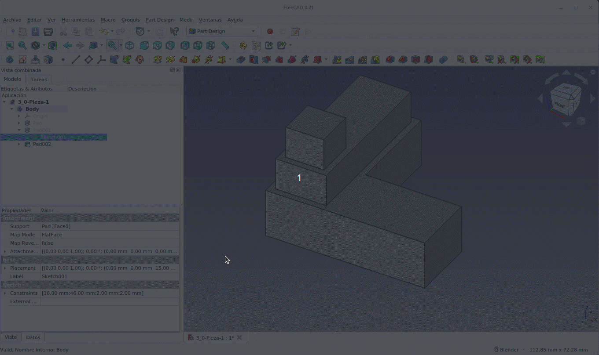  
*Figura 3.0.4. Modificamos el boceto de la pieza intermedia*

Vemos que la operación se realiza con total éxito. Vamos a realizar una modificación del segundo boceto para que no quede totalmente apoyado sobre la cara que seleccionamos inicialmente al crearlo (Figura 3.0.5), es decir que sobrepase los límites de esta cara.

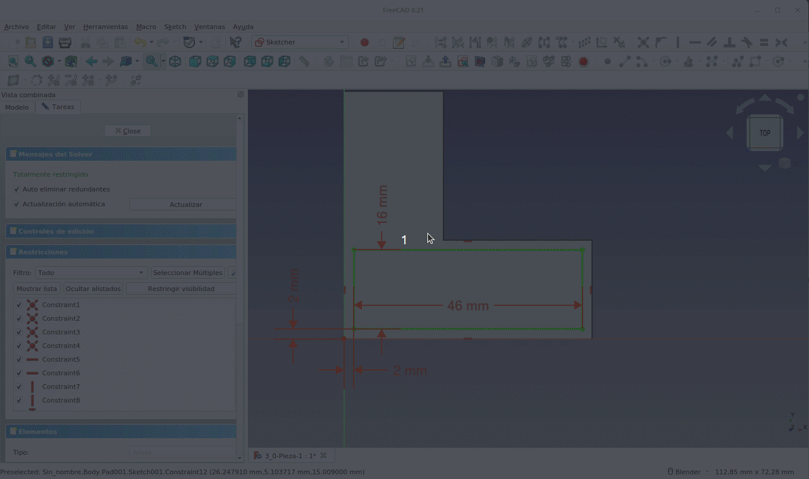  
*Figura 3.0.5. Nuevamente modificamos el boceto de la pieza intermedia*

Observamos al confirma la operación que la pieza final no se ha modificado y en el árbol de objetos aparece con una admiración (Figura 3.0.6) que indica que hay algún problema.

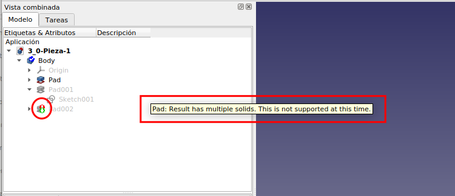  
*Figura 3.0.6. Nuevamente modificamos el boceto de la pieza intermedia*

Si hacemos visibles los bocetos (Figura 3.0.7) podemos observar como el que se corresponde con la última extrusión (Sketch002) tiene una posición extraña y además su vector normal está orientado en el sentido del eje X y no en el del eje Z como debería estarlo. Es decir, el apoyo del boceto está ahora en un plano lateral y no en la cara superior de la segunda extrusión, por lo que podemos afirmar que está colocado incorrectamente.

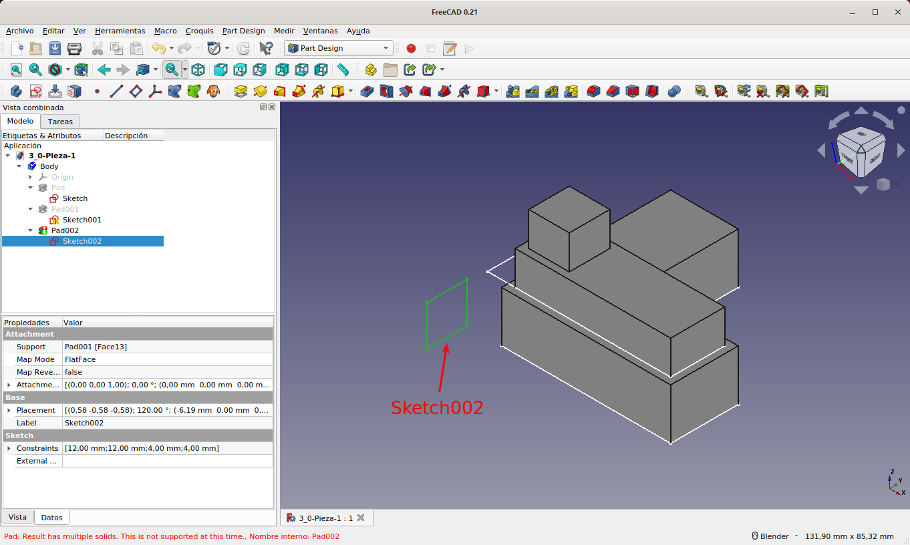  
*Figura 3.0.7. Hacemos visibles los bocetos*

Al tratarse de una pieza sencilla podemos pensar en solucionar el problema, pero si pensamos en piezas complejas el proceso podría ser muy largo y tedioso y probablemente sin un éxito final, dependiendo de la complejidad del diseño.

## **3.0.3. Solución**
Para entender correctamente la solución que le vamos a dar al problema vamos a trabajar con el [gráfico de dependencias](https://wiki.freecadweb.org/Std_DependencyGraph/es) de la pieza en cuestión. En la animación de la Figura 3.0.8 vemos como mostrarlo para la pieza del ejemplo. Partimos de la situación generada, es decir de la pieza con el error.

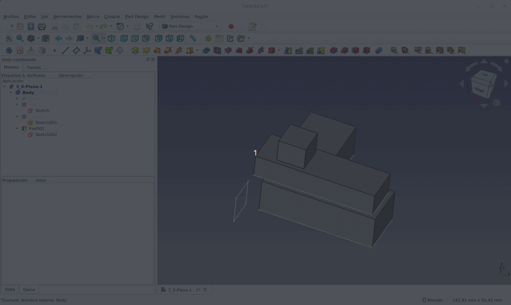  
*Figura 3.0.8. Mostrar gráfico de dependencias*

El gráfico de la Figura 3.0.9 revela claramente la relación directa que existe entre cada boceto y su extrusión. En esta especie de cadena es fácil entender que si cualquiera de sus eslabones se rompe el resto de la cadena tendrá problemas para recalcularse, y es debido a la nomenclatura topológica. 

Como ya hemos indicado la mejor solución para evitar la rotura es que los bocetos no se apoyen en caras sino en planos de referencia.

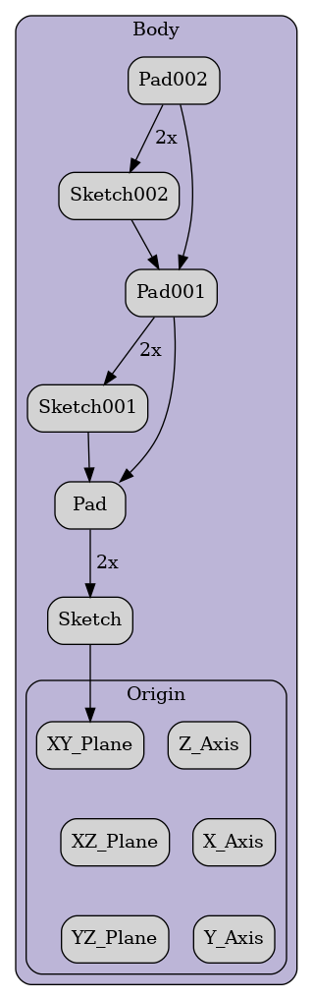  
*Figura 3.0.9. Gráfico de dependencias*

Para solucionar el problema vamos a crear dos planos apoyados en el plano origen XY y los vamos a desplazar en el eje Z a una posición coplanaria con la cara plana de la extrusión. Posteriormente moveremos el apoyo del boceto de la cara plana al plano de referencia, evitando así el problema de nomenclatura topológica. El proceso lo vemos en la animación de la Figura 3.0.10 para el segundo boceto.

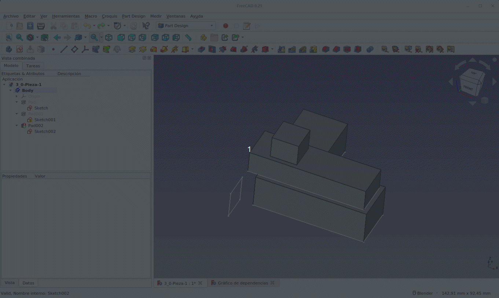  
*Figura 3.0.10. Creación de plano de referencia y apoyo del boceto en el mismo*

Lógicamente esto no arregla el problema puesto que no se ha generado en ese nivel de diseño, simplemente se modifica el diseño para que todos los bocetos tengan como referencia un plano.

En la Figura 3.0.11 vemos repetido el proceso para el tercer boceto, el cambio de apoyo del mismo de la cara plana al nuevo plano de referencia y como se arregla el problema al actualizar el diseño.

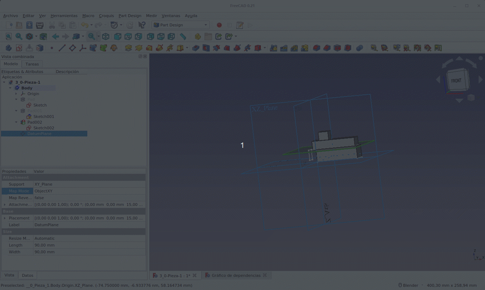  
*Figura 3.0.11. Creación de plano de referencia y apoyo del boceto en el mismo*

En la Figura 3.0.12 vemos los gráficos de dependencias antes y después de la solución y podemos apreciar claramente los cambios y que los bocetos se apoyan en los planos de referencia. Este modelo es más estable, ya que cada boceto puede modificarse de forma independiente de los demás.

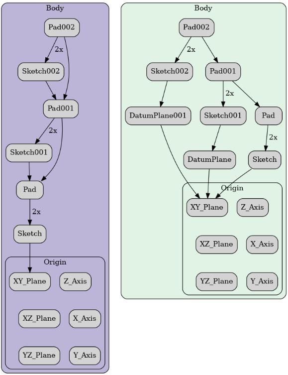  
*Figura 3.0.12. Comparativa de los dos gráfico de dependencias*

En la animación de la Figura 3.0.13 vemos como ahora las modificaciones de los bocetos no generan ningún tipo de problema y el objeto final se recalcula de forma eficiente.

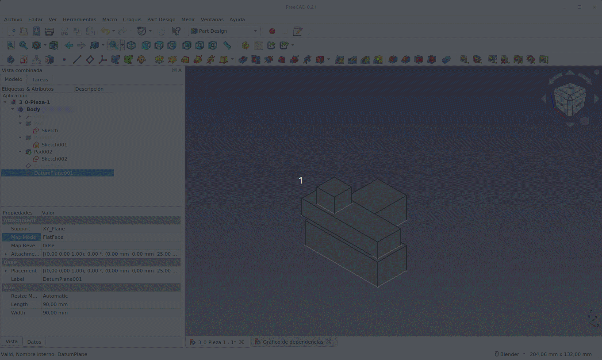  
*Figura 3.0.13. Cambios en los bocetos*

## **3.0.4. Conclusión**
Añadir objetos como planos de referencia supone un trabajo extra, pero en última instancia produce modelos más estables que están menos sujetos al problema de los nombres topológicos.

Naturalmente, y podríamos decir que lo más correcto, es crear los objetos de referencia antes de dibujar los bocetos y producir las extrusiones u otras operaciones.

Los planos de referencia también pueden basarse en otros planos de referencia. Esto genera una cadena de dependencias que también podría dar lugar a problemas topológicos; sin embargo, como los planos de referencia son objetos mucho mas simples que una cara de un objeto, los riesgos de tener estos problemas son menores.

Los objetos de referencia, los puntos, las líneas, los planos y los sistemas de coordenadas también pueden ser útiles como geometría de referencia, es decir, como ayudas visuales para mostrar las características importantes del modelo, incluso si no se apoya ningún boceto directamente a ellos.

El diseño de la pieza se ha realizado con la versión 0.21 de FreeCAD para aportar las últimas modificaciones realizadas y en [3_0-Pieza-1.FCStd](../img/designs/3/3_0-Pieza-1.FCStd) tenemos la pieza en su estado final para poder trabajar con ella si así lo necesitamos.
