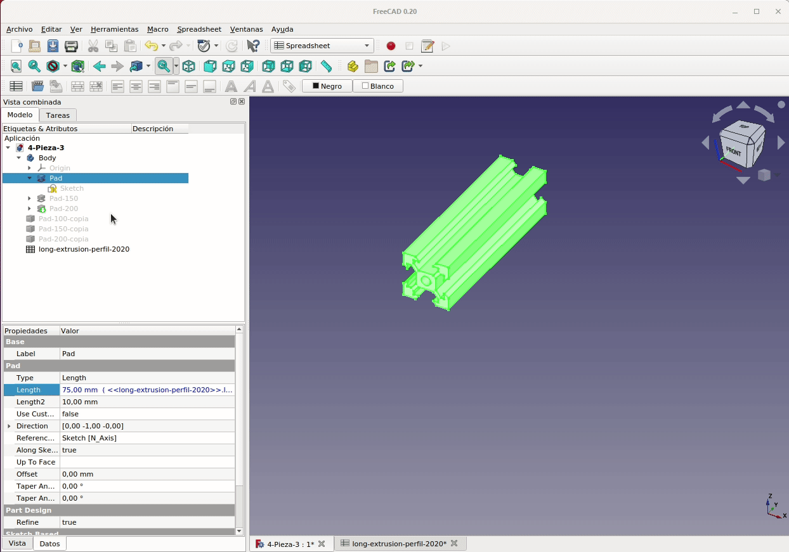
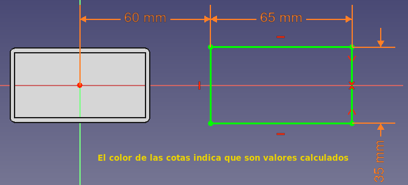

# 4. Diseño paramétrico en FreeCAD. Otros enfoques
Vamos a aprender a diseñar objetos utilizando un nuevo enfoque y explorar una pequeña gama de herramientas. Comenzaremos explorando la herramienta 'Espesor', aprenderemos a usar la hoja de cálculo en el banco de trabajo 'SpreadSheet' y haremos una generación automática de cajas con sus tapas en diferentes tamaños.

## **4.1. Herramienta espesor**
La herramienta está situada en el banco de trabajo 'Part', sirve para ahuecar sólidos y vemos su icono en la Figura 4.1.

  
*Figura 4.1. Icono de la herramienta Espesor*

Vamos a ver de forma rápida el uso de 'Espesor'. En un nuevo archivo creamos un boceto sobre el plano XY, con la herramienta polígono dibujamos un pentágono regular centrado en el origen de coordenadas para tener 2DoF, o sea 2 grados de libertad. Aplicamos restricción de horizontalidad haciendo clic en la herramienta "crear una restricción horizontal" a la línea inferior y acotamos uno de los lados del con una longitud de 30 mm. De esta forma tenemos el boceto restringido que vemos en la imagen 4.2.

  
*Figura 4.2. Pentágono regular totalmente restringido*

Cerramos el boceto y usando el cuadro de diálogo 'Herramientas de croquis' de la pestaña de tareas en la ventana de vista combinada o haciendo clic en el icono de la herramienta 'Extruir' creamos un sólido de 25 mm de espesor.

Ahora vamos a usar la herramienta 'Espesor' para ahuecar nuestra extrusión. Nos dirigimos al banco de trabajo 'Part', seleccione la cara superior de la extrusión y hacemos clic en la herramienta 'Espesor'. Veremos al instante que la pieza ahora aparece como un recipiente hueco realizado como una versión hueca de la misma pieza. El proceso lo vemos en la animación de la Figura 4.3.

  
*Figura 4.3. Creación de recipiente pentagonal*

A la izquierda del objeto tenemos un cuadro de diálogo que nos permite cambiar la cara seleccionada y varios parámetros de la pieza. En la animación de la Figura 4.4 observamos el funcionamiento de los mas importantes.

  
*Figura 4.4. Opciones de Espesor*

Finalmente, si queremos aplicar la herramienta pero para crear un objeto que sea más una tubería que un cuenco, podemos hacer clic en el botón 'Caras' y seleccionar dos o mas caras y veremos el objeto hueco que se crea. En la animación de la Figura 4.5 vemos este proceso.

  
*Figura 4.5. Creación de pieza en forma de tubo*

Si necesitamos consultar el [diseño en FreeCAD](../img/designs/4/4-Pieza-1.FCStd) lo podemos hacer descargando el archivo del enlace.

La herramienta de 'Espesor' es una excelente manera de crear rápidamente geometrías huecas, pero tiene algunas limitaciones, especialmente cuando trabajamos con piezas que en su geometría tienen partes curvas. No obstante es posible crear objetos como el de la animación de la Figura 4.6, que tenemos disponible en este [enlace a 4-Pieza-2](../img/designs/4/4-Pieza-2.FCStd).

  
*Figura 4.6. Creación de pieza con forma esférica*

## **4.2. Diseño paramétrico**
Ya vimos en el apartado [1.9. Copias simples de objetos](intro.md) como replicar objetos. Podemos utilizar este enfoque para crear copias de piezas y, por ejemplo mediante el software de laminado, cambiar ciertas dimensiones, como por ejemplo su longitud. También podemos dibujar un boceto de la pieza y luego extruirlo varias veces a diferentes longitudes.

Vamos a comenzar por realizar un boceto de un perfil de aluminio tipo 2020 V SLOT muy utilizado en impresoras 3D y máquinas CNC. En la Figura 4.7 tenemos una imagen con los datos de sus dimensiones reales.

  
*Figura 4.7. Dimensiones perfil 2020 V SLOT*

A partir de las dimensiones dadas en la Figura 4.7 vamos a dibujar el boceto de la Figura 4.8. Hemos escogido el segundo cuadrante sobre el plano XZ porque es simétrico en los otros tres cuadrantes, aunque se puede escoger cualquiera de los cuadrantes para dibujar la cuarta parte del perfil. También lo hacemos con referencia al origen de coordenadas para que este sea el centro de la pieza donde situar el orificio central.

  
*Figura 4.8. Boceto inicial del perfil 2020 V SLOT*

En la animación de la Figura 4.9 vemos el uso de la herramienta de simetría en bocetos. En la selección inicial y realizando el barrido de izquierda a derecha, queda seleccionado el punto sobre el origen de coordenadas y por ese motivo la simetría se realiza con esa referencia. Es decir, la operación de simetría se realiza con respecto a la última línea o punto seleccionado.

  
*Figura 4.9. Trabajo con la herramienta de simetría en boceto*

Siguiendo el método que conocemos podemos llegar a tener una situación como la que vemos en la Figura 4.10, donde se han realizado tres extrusiones del mismo boceto a tres longitudes diferentes y se han creado copias de cada una de ellas.

  
*Figura 4.10. Creación de diferentes longitudes del perfil 2020*

La única diferencia entre las tres piezas es la longitud de extrusión y aunque este es un ejemplo muy simple lo vamos a utilizar para introducir la idea de trabajar paramétricamente. ***El trabajo paramétrico en CAD consiste en poder cambiar la geometría del modelo ajustando las dimensiones de los parámetros que lo definen***. En el ejemplo se trata de un solo un parámetro que vamos a almacenar en una hoja de calculo y modificarlo cuando lo necesitemos.

***

> **- Consejo:**

***

Seleccionamos el banco de trabajo 'SpreadSheet' de hoja de cálculo usando el menú desplegable y hacemos clic en el ícono 'Crear hoja de cálculo'. Debemos ver una hoja de cálculo abierta en una nueva pestaña en la ventana de vista 3D con el nombre Spreadsheet1 y además pasa a ser un nuevo elemento en la vista de árbol. Esto es muy útil, ya que permite cambiar rápidamente entre el modelo y la hoja de cálculo y cerrar la pestaña de la hoja de cálculo si ya no necesitamos cambiar nada ni ver sus datos. Logicamente la podemos abrir en cualquier momento desde la vista de árbol como hacemos con cualquier elemento. Las funciones de la hoja de cálculo son muy similares a las hojas de cálculo de paquetes ofimáticos como LibreOffice. Aunque no es obligatorio si es conveniente, como en el resto de objetos, poner un nombre mas significativo a la hoja de cálculo. Procedemos según la animación de la Figura 4.11.

  
*Figura 4.11. Creación de una hoja de cálculo*

En este apartado simplemente vamos a seguir trabajando la hoja de cálculo con el ejemplo sencillo que estamos diseñando y en el apartado [5-Spreadsheet y DynamicData](5-SP-DD.md) se profundiza en estas interesantes herramientas.

Continuamos escribiendo la etiqueta 'Longitud de extrusión' en la celda A1 e introduciendo en la celda B1 la longitud que queremos que tenga nuestra extrusión. El número que escribimos aquí se interpreta con las unidades que usa FreeCAD, que se pueden configurar en el menú de preferencias. En nuestro caso, se trata de milímetros y esa medida estará por tanto expresada en milímetros y no necesitamos definir unidades en la hoja de cálculo. Tal y como se observa en la animación de la Figura 4.12 a la celda con la medida le hemos puesto un nombre o alias, en nuestro caso 'lext' que va a resultar necesario para hacer referencia al valor de la celda en la fase de diseño.

  
*Figura 4.12. Añadiendo datos a la hoja de cálculo*

Hacemos clic en la pestaña con el fichero de diseño y vamos a ocultar todas las copias y mostrar la pieza Pad-100 y podemos observar que en el dato 'Longitud' aparecen 100 mm, que es el valor actual de la longitud de la extrusión, pero si hacemos clic en el dato veremos a la derecha de su valor un icono circular de color azul. Si hacemos clic aquí se abre el editor de fórmulas y si comenzamos a escribir el nombre de nuestra hoja rápidamente aparecerá en el desplegable donde la seleccionamos y cuando lo tengamos introducimos un punto desde el teclado (esto no será necesario si seleccionamos la hoja de entre las sugeridas pero si cuando tecleamos el nombre de la misma) para que nos aparezcan los alias definidos, escogemos el nuestro (animación de Figura 4.13) y ya tenemos que el valor de ese dato se va a calcular según el valor de la celda B1 que tiene de alias 'lext'.

  
*Figura 4.13. Utilizando datos a la hoja de cálculo*

En la figura 4.14 vemos el resultado de todos estos cambios.

  
*Figura 4.14. Aspecto final de la extrusión utilizando datos de la hoja de cálculo*

Ya podemos proceder a crear las copias simples de las piezas con las distintas longitudes que establezcamos en la hoja de cálculo, tal y como podemos ver en la animación de la Figura 4.15. Es evidente que con un ejemplo tan sencillo apenas hay diferencia, pero si imaginamos que podemos cambiar muchos mas datos y que además sus valores en la hoja de cálculo procedan a su vez de formulas que los calculan si es evidente la gran ventaja de usar hojas de cálculo para parametrizar datos en los diseños.

  
*Figura 4.15. Creando piezas a partir de datos de la hoja de cálculo*

Si queremos consultar el [diseño en FreeCAD](../img/designs/4/4-Pieza-3.FCStd) del perfil 2020 lo podemos hacer descargando el archivo del enlace.

## **4.3. Diseño paramétrico de una caja de reciclaje**
Vamos a ver un poco mejor el uso de estos conceptos creando un diseño de una caja con tapa que nos va a servir de contenedor para el reciclado de pilas tipo botón.

Comenzamos por crear un nuevo proyecto. En el nuevo proyecto, vamos al banco de trabajo de hojas de cálculo y creamos una nueva. Para el cuerpo principal o vaso de nuestra caja, vamos a necesitar cuatro parámetros: longitud, anchura, altura y grosor de la pared de la caja. Creamos etiquetas para estos parámetros y les damos nombres y valores (Figura 4.16).

  
*Figura 4.16. Datos para el vaso de la caja*

Ahora nos dirigimos al banco de trabajo PartDesign y creamos un cuerpo y un boceto en el plano XY. Dibujamos un rectángulo con dos vértices diagonales simétricos al origen de coordenadas. A continuación, añadimos una restricción para la longitud del rectángulo asignándole como valor el correspondiente de la hoja de cálculo. Repetimos la operación con una línea vertical y le asociamos como valor la anchura de la hoja de cálculo. El boceto debe aparece como en la Figura 4.17 completamente restringido.

  
*Figura 4.17. Boceto inicial del vaso*

Cerramos el boceto y mediante la herramienta extruir crear el paralelepípedo asociando la longitud de extrusión al parámetro altura de la hoja de cálculo. Para crear el vaso recurrimos a la herramienta espesor ya vista. Para establecer el grosor, vamos a vincular el valor del grosor en nuestra hoja de cálculo. En la animación de la figura 4.18 vemos el proceso.

  
*Figura 4.18. Creación del vaso final*

El proceso que vamos a seguir para hacer la tapa es asociar su posición y sus dimensiones a las de la caja utilizando formulas simples de forma que la tapa se ajuste a la caja generada. La primera tarea es posicionar el nuevo diseño a lo largo del eje X y para que no esté encima del vaso vamos a marcar una restricción de distancia horizontal entre el origen de coordenadas y un de los vértices izquierdos del rectángulo. El valor de esta cota lo vinculamos a la celda de la longitud, lo que hará que la tapa siempre esté separada del vaso manteniendo un espacio entre ambas. En la animación de la Figura 4.19 vemos como hacerlo.

  
*Figura 4.19. Posicionado del boceto de la tapa*

***

> **- Consejo:**

***

Para crear la longitud y la anchura de la tapa, vamos a dirigirnos a la hoja de cálculo y creamos nuevas etiquetas, una para la longitud de la tapa, otra para la anchura, una mas para la altura de la tapa y la última para establecer la tolerancia. Para establecer su valor vamos a realizar un cálculo que lo genere. El valor de la longitud de la tapa vamos a calcularlo como la longitud del vaso mas el doble del grosor de la pared y sumaremos el valor de la tolerancia. Este valor de tolerancia va a ser el espacio libre necesario para que la tapa encaje en el vaso, valor que dependerá de la precisión de la impresora a utilizar. En mi caso establezco ese valor en medio milímetro. En la animación de la figura 4.20 vemos la parte final del proceso para completar esta parte. El cálculo del ancho de la tapa se hace de forma similar a la longitud.

  
*Figura 4.20. Fórmulas de cálculo de las dimensiones de la tapa*

Ahora nos dirigimos al boceto y restringimos las cotas vertical y horizontal a los valores calculados en la hoja de cálculo quedando el resultado que vemos en la Figura 4.21.

  
*Figura 4.21. Boceto final de la tapa*

Ya podemos cerrar la tarea y extruir el boceto aplicando la longitud establecida en la hoja de cálculo. En la animación de la Figura 4.22 podemos ver el problema que se da al seguir el proceso, que no es otro que estamos intentando crear dos sólidos en un mismo body y esto no está permitido. La solución es crear un nuevo body, mover el boceto al nuevo body y ya si seguir la tarea de crear la tapa. Aplicamos la herramienta 'Espesor' aplicando el grosor dado en la hoja de cálculo.

  
*Figura 4.22. Creación de la tapa*

Y con esto tenemos un generador básico de cajas de diferentes tamaños simplemente cambiando dimensiones en la hoja de cálculo. En la Figura 4.23 vemos dos ejemplos creando la figura final a partir de las 'Copias simples' creadas que se han movido y a las que se ha modificado su aspecto.

  
*Figura 4.23. Dos ejemplos de cajas*

El diseño en el plano XY significa que la caja y la tapa serán fáciles de imprimir en 3D, ya que ambas partes están diseñadas de una manera que las emula apoyadas en la plataforma de impresión. Para ver las cajas con su tapa en la posición de colocada, se han movido y rotado convenientemente las copias simples creadas.

## **4.4. Archivos y resultados finales**
En la tabla siguiente tenemos los enlaces para descargar el archivo del diseño que hemos realizado como ejemplo de la sección, otros formatos de archivo y una imagen del resultado impreso de la pieza diseñada.

| Archivos | Captura del laminador | Imagen del resultado final |
|-:-|-:-|-:-|
|  [Diseño](../img/designs/4/4-Pieza-4.FCStd)  [STL](../img/designs/4/4-Pieza-4-30x60.stl)  [3MF](../img/designs/4/4-Pieza-4-30x60.3mf)  [STEP](../img/designs/4/4-Pieza-4-30x60.step)  |  |  |

## **4.5. Ejercicio propuesto**
A partir del diseño de caja creado modificarlo para incluir una ranura de 22 x 6 mm centrada en la tapa.
