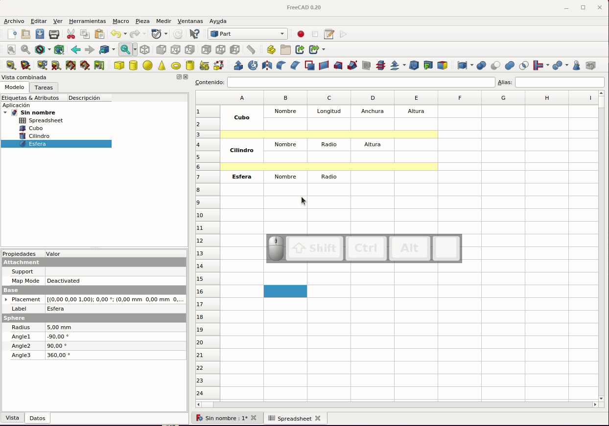
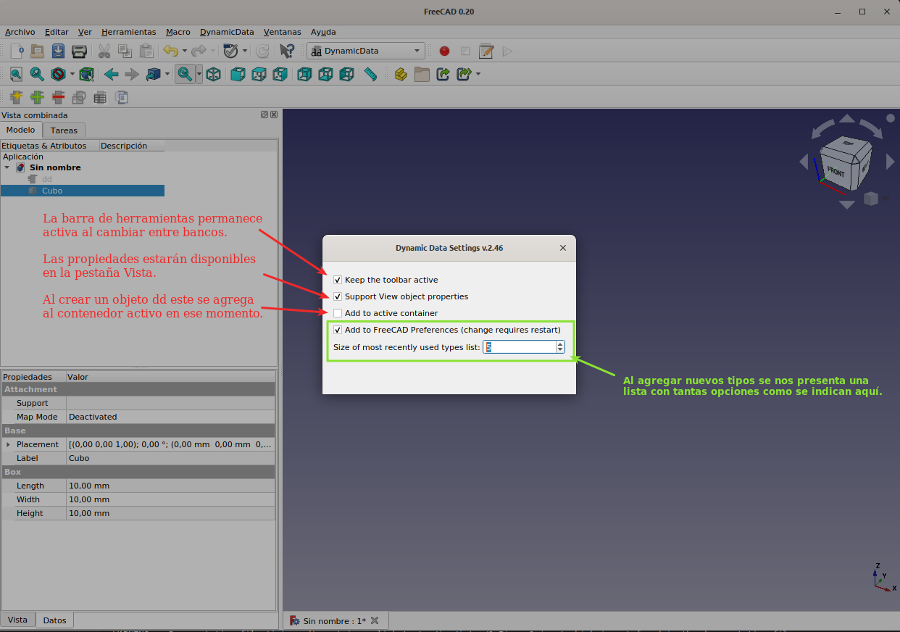
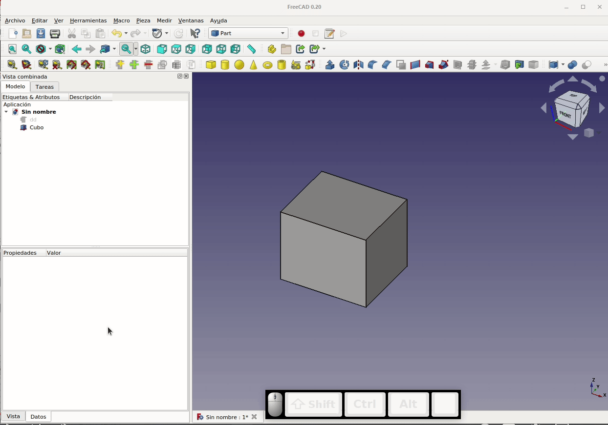
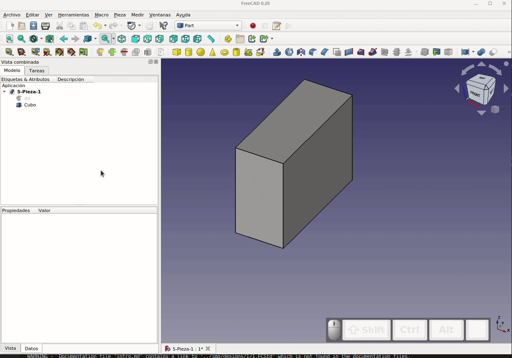

# 5. Hojas de cálculo y datos dinámicos
En este apartado vamos a describir y aplicar lo descrito en la [wiki de FreeCAD sobre Spreadsheet](https://wiki.freecadweb.org/Spreadsheet_Workbench) y también veremos la idea básica de trabajar con Calc, la hoja de cálculo de LibreOffice que por supuesto es externa al programa pero ofrece muchas mas posibilidades de cálculo que la del programa.

## **5.1. Banco de trabajo Spreadsheet**
Ya hemos visto el uso básico de este banco de trabajo en el apartado 4 y ahora vamos a profundizar un poco mas en el mismo.

### 5.1.1. Herramientas

En la tabla siguiente vemos los iconos de las herramientas disponibles y una descripción breve de para que sirve cada una de ellas.

| Icono | Descripción |
|:-:|---|
|  | Crea una nueva hoja de cálculo |
|  | Importa desde un archivo CSV a una hoja de cálculo |
|  | Exportar a un archivo CSV desde una hoja de cálculo |
|  | Une las celdas seleccionadas |
|  | Divide celdas que previamente han sido unidas |
|  | Alinea el contenido de las celdas seleccionadas a la izquierda |
|  | Alinea el contenido de las celdas seleccionadas al centro horizontalmente |
|  | Alinea el contenido de las celdas seleccionadas a la derecha |
|  | Alinea el contenido de las celdas seleccionadas a la parte superior de las mismas |
|  | Alinea el contenido de las celdas seleccionadas al centro verticalmente |
|  | Alinea el contenido de las celdas seleccionadas a la parte inferior de las mismas |
|  | Establece el contenido de las celdas seleccionadas a negrita |
|  | Establece el contenido de las celdas seleccionadas a itálica |
|  | Establece el contenido de las celdas seleccionadas a subrayar |
|  | Establece el alias o nombre para una celda seleccionada |
|  | Establecen los colores de primer plano y de fondo de las celdas seleccionadas |

### 5.1.2. Preferencias
Las preferencias de hojas de cálculo las encontramos siguiendo la ruta indicada en la animación de la Figura 5.1 y solamente estarán disponibles después de abrir un documento que contenga una hoja de cálculo o después de visitar el banco de trabajo Spreadsheet. Cada vez que iniciemos FreeCAD va a ser necesario visitar al menos una vez el banco de trabajo DynamicData para que las herramientas queden disponibles.

  
*Figura 5.1. Acceso a Preferencias de Spreadsheet*

Solamente tenemos una pestaña: 'Hoja de cálculo' en donde se puede configurar lo siguiente:

* **Carácter delimitador**. Es el carácter utilizado como delimitador de campos.
* **Carácter de Entrecomillado**. Es el carácter utilizado para delimitar cadenas.
* **Carácter de escape**. Es el carácter utilizado para evitar que se analice el siguiente carácter.

En definitiva son los caracteres a configurar acordes con nuestra hoja de cálculo para importar y exportar archivos CSV.

### 5.1.3. Insertar y eliminar filas y columnas
Podemos insertar o eliminar filas y columnas haciendo clic con el botón derecho del ratón en un encabezado de fila o columna y seleccionando la opción apropiada en el menú contextual. Es posible seleccionar primero varias filas o columnas, bien manteniendo presionado la tecla Ctrl al seleccionar los encabezados, o manteniendo presionado el botón izquierdo del ratón y arrastrándolo. En la animación de la Figura 5.2 se ilustra esto. Hemos puesto unos nombre simples a las celdas para que se hagan patentes los cambios.

  
*Figura 5.2. Insertar y eliminar filas y columnas*

Debemos tener muy presente que eliminar filas o columnas que contengan datos puede romper el funcionamiento de la hoja de cálculo y/o de la pieza que se basa en la hoja de cálculo sin que recibamos ningún tipo de aviso al respecto.

### 5.1.4. Cortar, copiar y pegar celdas
Las operaciones clásicas de cortar, copiar y pegar se pueden usar en las celdas de hojas de cálculo de FreeCAD y además utilizando los atajos normales de teclado para estas operaciones: Ctrl+X Ctrl+C y Ctrl+V respectivamente. Para seleccionar múltiples celdas mantendremos presionada la tecla Ctrl mientras las vamos seleccionando, o mantenemos presionado el botón izquierdo del ratón y arrastramos para seleccionar un rango de celdas que se contenga en un barrido rectangular.

Las operaciones de cortar y copiar almacenan el contenido y las propiedades de las celdas en el portapapeles. La operación de pegar escribe los datos del portapapeles en la celda indicada. La operación de copiar crea un recuadro en verde alrededor de la celda o celdas a copiar mientras que cortar hace lo propio con el recuadro en color rojo. La operación de pegar actualiza el contenido de la celda o celdas y las fórmulas se actualizan como consecuencia de la operación. En la animación de la Figura 5.3 vemos como se realizan varias de estas operaciones. La animación se inicia copiando un celda que contiene una fórmula y vemos que se copia pero actualizando las referencias a celdas, lo que hace que la fórmula no trabaje correctamente. 

  
*Figura 5.3. Cortar, copiar y pegar celdas*

NDebemos tener muy presente que eliminar filas o columnas que contengan datos puede romper el funcionamiento de la hoja de cálculo y/o de la pieza que se basa en la hoja de cálculo sin que recibamos ningún tipo de aviso al respecto.

### 5.1.5. Propiedades de las celdas
Las propiedades de una celda de nuestra hoja de cálculo se pueden editar haciendo clic con el botón derecho teniendo el cursor situado en la celda y seleccionando Propiedades del menú contextual. En la Figura 5.4 vemos la ventana que se muestra.

  
*Figura 5.4. Propiedades de las celdas*

En la animación de la Figura 5.5 podemos ver como trabajar con estas propiedades de una forma sencilla aplicando los cambios a una sola celda aunque esto mismo se puede hacer con una selección de celdas. Respecto a las unidades veremos mas adelante un poco mas y respecto al alias es la misma propiedad que la ya vista con anterioridad.

  
*Figura 5.5. Ajuste de propiedades de las celdas*

### 5.1.6. Expresiones
Técnicamente las expresiones deben comenzar con un signo igual '='. Sin embargo, la hoja de cálculo intenta ser inteligente; si se introduce lo que parece una expresión sin el '=' inicial, este se añadirá automáticamente.

Las expresiones de celdas pueden contener números, funciones, referencias a otras celdas y referencias a propiedades del modelo. Las celdas se referencian por su columna (siempre en letra MAYÚSCULA) y su fila (número). Una celda también puede ser referenciada por su nombre o alias.

El número de decimales mostrados puede diferir ya que depende de la configuración que establezcamos en preferencias.

Es posible también introducir referencias a objetos del modelo 3D en las celdas para que los cambios que realizamos en el modelo 3D sea cambiado en la hoja de cálculo. En la animación de la Figura 5.6 vemos una aplicación simple del concepto para un cubo, un cilindro y una esfera.

  
*Figura 5.6. Calculo de propiedades de objetos en celdas a partir del modelo 3D*

El uso de los valores de las celdas de la hoja de cálculo para definir las propiedades del modelo 3D ya lo hemos visto anteriormente.

En este punto hay que avisar que este banco de trabajo **NO** está totalmente desarrollado y por lo tanto habrá cosas que no funcionen como esperamos o simplemente lo hagan mal. Para más información sobre las expresiones y las funciones disponibles, véase la información en la wiki de FreeCAD sobre [Expresiones](https://wiki.freecad.org/Expressions/es).

### 5.1.7. Recálculos en modelos complejos
Cuando editamos el valor de una celda de una hoja de cálculo se activa un nuevo cálculo del modelo 3D, incluso si los cambios no afectan al modelo. Cuando tenemos un modelo complejo, un recálculo puede llevar bastante tiempo y, por supuesto, tener que esperar después de cada edición es bastante molesto. Tenemos tres posibles soluciones para esto:

* **Omitir temporalmente los recálculos**

Para ello podemos hacer clic con el botón derecho sobre el nombre del archivo que contiene la hoja de cálculo y marcar la opción 'Saltar recalculado' del menú contextual. En la Figura 5.7 vemos la opción marcada.

  
*Figura 5.7. Activar la opción 'Saltar recalculado'*

La desventaja de este método es que los nuevos valores no se mostrarán hasta que se vuelva a calcular el documento. En su lugar se muestra '#PENDING'. Podemos hacer el recálculo o bien lo hacemos de forma manual haciendo clic en el icono 'Actualizar pantalla' o 'Std Refresh' (animación de la Figura 5.8) o también podemos desmarcar la opción para que se vuelvan a realizar los cálculos.

  
*Figura 5.8. Herramienta 'Actualizar pantalla'*

* **Usar una macro**

Podemos descaargar y ejecutar la macro [skipSheet.FCMacro](https://forum.freecadweb.org/viewtopic.php?f=8&t=48600#p419301). Aunque ahorra algunos pasos respecto al paso anterior básicamente tiene el mismo inconveniente.

* **Colocar la hoja de cálculo en un archivo FreeCAD diferente**

Consiste en hacer referencia a los datos de una hoja de cálculo externa desde un archivo .FCStd utilizando la siguiente sintaxis: "=NameOfFile#<<MySpreadsheet>>.MyAlias". Esto nos ofrece la ventaja de que el recálculo se realiza en la propia hoja de cálculo sin afectar para nada al modelo 3D, pero la desventaja es que el modelo no se va a calcular automáticamente después de los cambios en la hoja de cálculo.

En el escenario en el que primero abrimos el archivo de 'hoja de cálculo', cambiamos uno o más valores y luego abrimos el archivo del 'modelo', no habrá ninguna indicación de que el modelo deba volver a calcularse. Pero si ambos archivos están abiertos, el ícono 'Actualizar pantalla' se actualizará correctamente para el 'modelo' después de los cambios en el archivo 'hoja de cálculo'. Es decir, tampoco ofrece una gran ventaja respecto a los anteriores.

### 5.1.8. Unidades
La hoja de cálculo tiene una noción de dimensión (unidades) asociada con los valores de celda. Un número ingresado sin una unidad asociada no tiene dimensión. La unidad debe ingresarse inmediatamente después del valor del número, sin espacios intermedios. Si un número tiene una unidad asociada, esa unidad se utilizará en todos los cálculos. Por ejemplo, la multiplicación de dos longitudes en milímetros da un área en mm².

Si una celda contiene un valor que representa una dimensión, debe ingresarse con su unidad asociada. Si bien en muchos casos simples se puede trabajar con un valor adimensional, no es nada recomendable el no introducir la unidad ya que hay algunas secuencias de operaciones que hacen que FreeCAD detecte unidades incompatibles en una expresión cuando a simple vista nos parece que la expresión debería ser válida.

Un número adimensional no se puede cambiar a un número con una unidad mediante el cuadro de diálogo de propiedades de la celda. Uno puede poner una cadena de unidades, y esa cadena se mostrará; pero la celda aún contiene un número adimensional. Para cambiar un valor adimensional a un valor con una dimensión, el valor en sí debe volver a ingresarse con su unidad asociada.

### 5.1.9. Enlaces entre celdas
Es posible enlazar el contenido de unas celdas a otras celdas , con un mismo rango, en la hoja de cálculo. En la animación de la Figura 5.9 vemos como enlazamos el rango de celdas A7-C8 al rango de celdas A10-C11.

  
*Figura 5.9. Enlace de celdas*

Las celdas enlazadas tienen un borde azul para resaltar que es un enlace. Si ahora cambiamos, por ejemplo el radio de la esfera, el cambio nos aparecerá inmediatamente en la celda C11, además de en la C8 que es donde se calcula el valor en función del que pongamos en el modelo 3D.

Para eliminar un enlace de celdas basta con hacer clic con el botón derecho en una celda enlazada (no es necesario resaltar todo el rango enlazado) y seleccione 'Enlazar' en el menú contextual. En la ventana que se abre hacemos clic en el botón 'Desenlazar' y observamos que desaparece el recuadro azul. Los datos se quedan igual e incluso funcionan los cambios, pero la diferencia es que ahora podemos eliminar el contenido de esas celdas y cuando están enlazadas no podemos.

La opción 'Ocultar dependencia del enlace' de la ventana 'Enlazar' se puede utilizar para evitar problemas con dependencias cíclicas entre hojas de cálculo. Por ejemplo, las celdas de la Hoja de cálculo A están vinculadas a la Hoja de cálculo B, y a su vez las celdas de la Hoja de cálculo B están vinculadas a otras celdas de la Hoja de cálculo A. Esta opción debe usarse con precaución porque las dependencias rotas pueden dañar nuestro archivo FreeCAD sin recibir ninguna advertencia al respecto.

## **5.2. Banco de trabajo DynamicData**
Es un banco de trabajo externo que debemos instalar a través del 'Administrador de complementos' que tenemos en el menú Herramientas de FreeCAD. En la imagen 5.10 vemos este gestor de complemento con el banco ya instalado.

  
*Figura 5.10. Banco de trabajo DynamicData instalado*

Se trata de un banco de trabajo que es una alternativa al banco de trabajo Spreadsheet y que nos va a ser útil para personalizar propiedades de diseño. Debemos tener en cuenta que los archivos FCStd que contienen objetos DynamicData dd pueden ser compartidos con usuarios que no tengan el banco de trabajo DynamicData instalado, siendo completamente funcionales. Pero sin el banco de trabajo instalado, esos usuarios no podrán agregar/eliminar propiedades a menos que se haga mediante secuencias de comandos de Python.

Antes de comenzar y con el 'Gestor de complementos' abierto hacemos clic sobre el banco de trabajo DynamicData y si en la ventana que se nos abre, en la esquina superior derecha, hay un botón 'Actualizar' lo pulsamos para obtener la última versión disponible de forma que debemos ver algo similar a la Figura 5.11.

  
*Figura 5.11. Banco de trabajo DynamicData actualizado*

También podemos proceder como en la animación de la Figura 5.12 y comprobar todas las actualizaciones disponibles y aplicarlas a nuestra versión de FreeCAD.

  
*Figura 5.12. Comprobar actualizaciones desde el Administrador de complementos*

Si nos cambiamos al banco de trabajo DynamicData veremos como aparece su barra de herramientas y una entrada en la barra de menús. En el menú veremos una opción de configuración del banco de trabajo que no nos aparece en la barra de herramientas.

En la animación de la Figura 5.13 podemos observar como la barra de herramientas de DynamicData está presente (esto ocurre tras visitar una vez DynamicData) en otros bancos de trabajo para hacer accesibles sus herramientas.

  
*Figura 5.13. Barra de herramientas DynamicData en otros bancos de trabajo*

### 5.2.1. Herramientas
A continuación vamos a ver los iconos de las herramientas disponibles y una descripción breve de para que sirve cada una de ellas. Posteriormente veremos un ejemplo de aplicación donde serán utilizadas.

| Icono | Descripción |
|:-:|---|
|  | Crea un nuevo objeto contenedor DynamicData |

| Icono | Descripción |
|:-:|---|
|  | Agrega una nueva propiedad personalizada al objeto contenedor DynamicData seleccionado |

Si existe mas de un objeto 'dd' y no se selecciona ninguno en la vista de árbol, este comando no estará activo.

A partir de la versión 2.44, agregar una propiedad se realiza desde un solo cuadro de diálogo (Figura 5.14). Después de seleccionar el tipo de propiedad, el siguiente paso es darle un nombre ad y (opcionalmente) un nombre de grupo, información sobre herramientas y un valor inicial.

  
*Figura 5.14. Ventana Agregar Propiedad dd*

Todos los nombres de propiedades se anteponen con "dd" automáticamente y la primera letra está en mayúscula. Si no nos gusta este sistema, podemos cambiar el nombre de la propiedad después de agregarla, pero se recomienda seguir la convención de nomenclatura dd o, de lo contrario, es posible que algunas funciones en el banco de trabajo no funcionen correctamente.

| Icono | Descripción |
|:-:|---|
|  | Herramienta para eliminar una propiedad agregada previamente con la herramienta Agregar propiedad |

Se selecciona la propiedad que desea eliminar de la lista que se muestra. También se puede optar por eliminar todas las propiedades de una sola vez. **Herramienta que debemos tener cuidado en su uso ya que la acción de eliminar propiedades no se puede deshacer**.

| Icono | Descripción |
|:-:|---|
|  | Herramienta para importar alias de hojas de cálculo seleccionadas como propiedades en el objeto dd seleccionado |

Advertencia: las hojas de cálculo seleccionadas se modificarán. Las celdas que contienen los alias harán referencia a la propiedad del objeto dd.

| Icono | Descripción |
|:-:|---|
|  | Herramienta para importar restricciones con nombre de bocetos seleccionados como propiedades en el objeto dd seleccionado |

Advertencia: los bocetos seleccionados se modificarán. Todas las restricciones con nombre harán referencia a la propiedad del objeto dd.

| Icono | Descripción |
|:-:|---|
|  | Vincular paramétricamente una propiedad copiada o configurada |

| Icono | Descripción |
|:-:|---|
|  | Herramienta para cambiar la configuración del banco de trabajo |

Accesible solamente desde el menú DynamicData. En la Figura vemos las opciones de configuración del banco de trabajo DynamicData.

  
*Figura 5.15. Setting de DynamicData*

### 5.2.2. Utilización básica de DynamicData
Comenzamos por crear un nuevo archivo, nos situamos en el banco de trabajo dd y creamos un nuevo objeto que nos aparecerá en el árbol de objetos. Si hacemos clic sobre el mismo vemos que tiene dos propiedades o datos, un 'Label' o nombre que comienza con dd (como se aconseja) y un campo Dynamic Data que básicamente nos da información de la versión que tenemos instalada del banco de trabajo.

Lo que si debemos tener siempre presente es que el objeto dd es un objeto contenedor para propiedades dinámicas po lo que, logicamente, podemos agregar propiedades desde aquí. Esto básicamente es lo mismo que crear un 'Alias' en una hoja de cálculo, disponiendo de tipos de propiedades entre los que podemos elegir. Una vez elegido el tipo de propiedad (acorde con el tipo que vamos a definir) y le damos un valor, que si no especificamos se tomará como cero por defecto. Podemos observar como el objeto dd pasa a tener un nuevo dato que podemos definir como hacemos habitualmente.

En la animación de la Figura 5.16a vemos como hacer este proceso y como asociar la propiedad dd creada a un objeto 3D.

  
*Figura 5.16a. Creación de objeto, propiedad y uso de objeto DynamicData*

En la Figura 5.16b vemos el proceso de creación de un propiedad y el significado de cada uno de los campos que podemos cumplimentar.

  
*Figura 5.16b. Creación de propiedad DynamicData*

En la propiedad 'Tooltip' en realidad lo que ponemos es la pista rápida que nos dará si dejamos el cursor situado sobre la nueva propiedad al menos un segundo y una vez que esta ha sido aplicada.

En la animación de la Figura 5.17 vemos una forma mas apropiada de crear propiedades, como usarlas y como interactuar con sus valores como datos dinámicos.

  
*Figura 5.17. Mas propiedades y cambios de datos DynamicData*

Esto lo podemos ver como que los contenedores dd sirven como una especie de almacén de todas nuestras variables y así en lugar de tener estos valores en un archivo de hoja de cálculo los tenemos en objetos DynamicData como datos dinámicos del objeto.

Para ver otra forma de crear una propiedad o dato en el objeto dd primero vamos a eliminar una de las propiedades anteriores (la que tiene un nombre poco acorde) y así dejarla libre para la nueva tarea. En la animación de la Figura 5.18 vemos el proceso de eliminación. Una vez eliminada la propiedad nos dirigimos al cubo y eliminamos la ecuación de cálculo basada en la propiedad anterior.

  
*Figura 5.18. Eliminar un propiedad en un objeto DynamicData*

Ahora vamos a ver el proceso para crear una propiedad (será la longitud del cubo) a partir de la herramienta de copia de propiedades. En primer lugar seleccionamos ambos objetos en la vista de árbol, hacemos clic en la herramienta de 'Copiar propiedad' y de las opciones disponibles escogemos según la animación de la Figura 5.19 ya que lo que pretendemos es copiar una propiedad del cubo a una nueva propiedad del objeto DynamicData existente.

  
*Figura 5.19. Copia de una propiedad del cubo a una nueva propiedad del objeto DynamicData existente*

Cuando finalicen los cambios ya podemos proceder a crear la formula a partir de la nueva propiedad y con los mismos efecto que hemos visto anteriormente.

En la Figura 5.20 vemos el gráfico de dependencias (Herramientas -> Gráfico de dependencias) y podemos observar como cada una de las propiedades del cubo están enlazadas a su correspondiente objeto DynamicData.

  
*Figura 5.20. Gráfico de dependencias de 5-Pieza-1*

Utilizando solamente un cubo parece de poca utilidad, pero imaginemos que tenemos muchos objetos 3D y sus propiedades las recopilamos en uno o varios objetos dd y ya le encontramos mas sentido al banco de trabajo. En la animación de la Figura 5.21 hemos creado un cilindro, le asociamos su propiedad radio al objeto dd y luego hacemos que la propiedad 'Altura' del cilindro sea la misma que la del cubo. Incluso vemos el funcionamiento después de realizar una operación booleana sobre los dos objetos.

  
*Figura 5.21. Asociaciones de propiedades con dd*

El nuevo árbol de dependencias los vemos en la Figura 5.22, donde se observa claramente la mezcla de dependencias.

  
*Figura 5.22. Gráfico de dependencias de 5-Pieza-1*

Ya hemos visto como eliminar una propiedad dd y como eliminar el enlace en la propiedad del objeto pero también podemos romper el enlace existente sin necesidad de eliminar la propiedad, para ello tan solo debemos seleccionar el objeto 3D y haciendo clic en el icono de copiar propiedad, que ahora nos muestra esta posibilidad. En la animación de la Figura 5.23 tenemos el procedimiento para el ancho del cubo. La ventaja de romper el enlace radica en que la propiedad permanece intacta y en que la operación de eliminar la propiedad no se puede deshacer.

  
*Figura 5.23. Rotura de un enlace en dd*

El mismo procedimiento se puede realizar haciendo clic sobre el objeto 'Fusion' y resultaría incluso mas apropiado hacerlo aquí, en el objeto 3D resultante, aunque en realidad se actúa sobre la propiedad del objeto fuente.

Veamos ahora como al crear un enlace a la propiedad 'Placement' se crean varios vínculos en una sola acción, lo que evidentemente es mucho más rápido que crearlos uno por uno. También aprovechamos para ver que aunque hay una operación booleana por encima del objeto seguimos pudiendo realizar este tipo de operaciones. En la Figura 5.23 vemos el proceso completo.

  
*Figura 5.24. Creación de enlaces multiples en propiedad Placement*

Por comodidad de trabajo vamos a desplazar estos objetos hacia la derecha (50 mm es suficiente) para despejar la zona del origen de coordenadas. Para ello activamos la 'Cruz de ejes' desde el menú 'Ver'. Una realizado el desplazamiento ocultamos los objetos y la 'Cruz de ejes'.

### 5.2.3. Importar restricciones de un boceto a DynamicData
Veamos ahora el proceso para importar datos creados en un boceto a DynamicData. Vamos a utilizar la herramienta que vemos en la Figura 5.25, donde podemos apreciar su pista rápida, que traducida viene a indicar: *Importa restricción con nombre del boceto seleccionado al objeto dd*.

  
*Figura 5.25. Pista rápida de la herramienta 'Importar restricción con nombre'*

Para comenzar vamos a crear un 'Body' y un boceto como el de la Figura 5.26. Las dimensiones se corresponden con las de un tubo rígido de cobre de una pulgada de diámetro nominal de tipo K.

  
*Figura 5.26. Dimensiones del tubo rígido de cobre 1" tipo K*

En la animación de la Figura 5.27 vemos como crear estas restricciones y como ponerles nombre.

  
*Figura 5.27. Restricciones y nombre de las mismas*

En la Figura 5.28 observamos como aparece reflejado el trabajo anterior en los datos del boceto que hemos dibujado.

  
*Figura 5.28. Las restricciones con sus nombres en los datos del boceto*

A continuación vamos a seleccionar el objeto dd y manteniendo pulsada la tecla CTRL el boceto (podemos seleccionar en orden inverso) para observar que se activa la herramienta de importación (animación de la Figura 5.29) sobre la que hacemos clic.

  
*Figura 5.29. Proceso inicial de importación*

Al final vemos que nos aparece una ventana que tiene como título 'Prueba de Sensatez o de juicio de DynamicData' que viene a realizarnos la advertencia que vemos en la ventana de la Figura 5.30 traducida.

  
*Figura 5.30. Prueba de Sensatez o de juicio de DynamicData*

Como nos indica de forma clara, a partir de ahora los cambios en las dimensiones del boceto ya no los realizamos en este sino en el objeto dd. En la Figura 5.31 vemos esta propiedades en los datos de 'Vista combinada'.

  
*Figura 5.31. Datos del boceto en el objeto dd de DynamicData*

En la animación de la Figura 5.32 vemos que cuando entramos en la edición del boceto han cambiado a color naranja las restricciones lo que nos indica que es un valor vinculado a una fórmula. Si observamos las restricciones a la izquierda vemos justamente esto y si entramos en la expresión vemos como ahora esta restricción depende del valor de la variable en el objeto dd.

  
*Figura 5.32. Cambios en el boceto debidos a la importación*

Al final de la animación vemos como realizar cambios en estas dimensiones y como sigue siendo posible asignar un expresión a esta propiedad del objeto dd a través de una fórmula, que por qué no, podría estar asociada a una hoja de cálculo.

### 5.2.4. Importar restricciones de una hoja de cálculo a un objeto DynamicData
Para ver el funcionamiento de esta herramienta vamos a necesitar crear una hoja de cálculo en nuestro proyecto, crear algún dato y ponerle su nombre o alias. En la animación de la Figura 5.33 partimos de las tareas anteriores ya realizadas y procedemos a usar la herramienta.

  
*Figura 5.33. Importar datos de una hoja de cálculo a DynamicData*

En la Figura 5.34 vemos la traducción del aviso que nos presenta esta importación. Es muy importante destacar aquí que las fórmulas no se importan, es mas se transforman en un simple dato numérico, por lo que si necesitamos realizar cálculos el proceso es convertirlos en datos dd y realizar los cálculos en las fórmulas que podemos crear en DynamicData. 

  
*Figura 5.34. Prueba de Sensatez o de juicio de DynamicData*

A estas altura quizá ya nos habrá ocurrido que alguna de estas operaciones no se realiza correctamente (no queda reflejada en el objeto dd) aunque hacemos correctamente el proceso. Una de las causas puede se, por ejemplo, usar caracteres no permitidos por DynamicData aunque si lo estén por FreeCAD, como puede ser el carácter "-" (guion normal) que no es un carácter válido para usar en nombres de objetos.

Si ahora volvemos a la hoja de cálculo podemos observar como el alias de la celda permanece intacto, su valor también, pero si hacemos clic sobre ellas observamos como ese valor ya no es un número (Figura 5.35), sino un valor enlazado con un dato de DynamicData.

  
*Figura 5.35. El valor de la celda con alias es un dato enlazado de DynamicData*

Imaginemos que la situación es que la longitud de tubo establecida es la longitud mínima que se puede cortar y que los cortes comerciales tienen que ser múltiplos de ese valor. También podemos pensar en un futuro en cambiar esa longitud mínima. En la animación de la Figura 5.36 vemos como crear la fórmula de cálculo en el objeto dd partiendo de valores dd que han sido importados de la hoja de cálculo y como afectan los cambios a los valores tanto en el objeto dd como en la hoja de cálculo. Inicialmente observamos como todas las celdas con alias están enlazadas al objeto dd tras realizar la correspondiente importación.

  
*Figura 5.36. Importar datos de una hoja de cálculo a DynamicData*

Vamos a realizar un par de extrusiones con distintos valores (Figura 5.37) realizando las pertinentes copias del objeto.

  
*Figura 5.37. Extruir a partir de datos en dd*

En el enlace a [5-Pieza-1.FCStd](../img/designs/5/5-Pieza-1.FCStd) tenemos disponible el archivo de diseño o fuente por si necesitamos consultar algún detalle.

### 5.2.5. Copia de propiedades
Vamos a partir de una situación similar a la de la Figura 5.38 en la que tengamos dos cuerpos con sus respectivos objetos. En mi caso he realizado una copia de "5-Pieza-1.FCStd" para trabajar a partir de los datos dd que ya teníamos.

  
*Figura 5.38. Situación de partida para copia de propiedades*

Antes de empezar con la herramienta en si vamos a ver como asignar a dd una propiedad con varios valores. Comenzamos por crear un objeto dd de tipo vector como vemos en la Figura 5.39.

  
*Figura 5.39. Asignar propiedad tipo vector*

Vamos a crear dos propiedades nuevas en dd referentes al color del objeto y al porcentaje de transparencia del mismo, tal y como vemos en la Figura 5.40. Estas propiedades no admiten la introducción de expresiones por lo que en 'Vista combinada -> Propiedades -> Vista' no podemos asignarle los nuevos valores dd creados.

  
*Figura 5.40. Creamos propiedades que no admiten expresiones*

A través de la herramienta "Copia" de dd si vamos a poder relacionar estos valores, tal y como apreciamos en la Figura 5.41.

  
*Figura 5.41. Copiar propiedad 'Color' de dd a objeto*

En la Figura 5.42 vemos el resultado de aplicar un proceso similar para la transparencia.

  
*Figura 5.42. Copiar propiedad 'Transparencia' de dd a objeto*

Vamos ahora a copiar la posición que establecimos para el paralelepípedo a partir de los datos de dd en el contenedor dd de forma paramétrica. Para ello seleccionamos de la forma que vemos en la Figura 5.43 y le damos un nombre apropiado a la nueva propiedad de DynamicData.

  
*Figura 5.43. Copiar propiedad de cuerpo u objeto para crear una propiedad dd*

En la Figura 5.44 vemos como afecta cambiar los datos en dd al objeto 3D omo consecuencia de la copia paramétrica de estos desde el body del paralelepipedo a una propiedad dd que en realidad tiene varias opciones.

  
*Figura 5.44. Efecto de cambiar datos en dd de una propiedad que es copia de una de un cuerpo*

La copia sin enlazar los valores simplemente copia esos valores pero futuros cambios no harán que se reflejen en la copia pues no están enlazados.

En el enlace a [5-Pieza-2.FCStd](../img/designs/5/5-Pieza-2.FCStd) tenemos disponible el archivo de diseño o fuente por si necesitamos consultar algún detalle.
