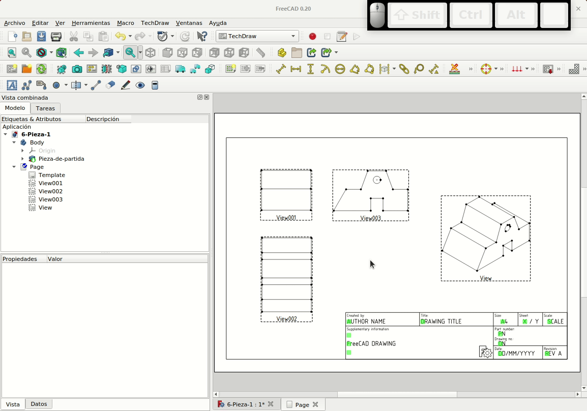
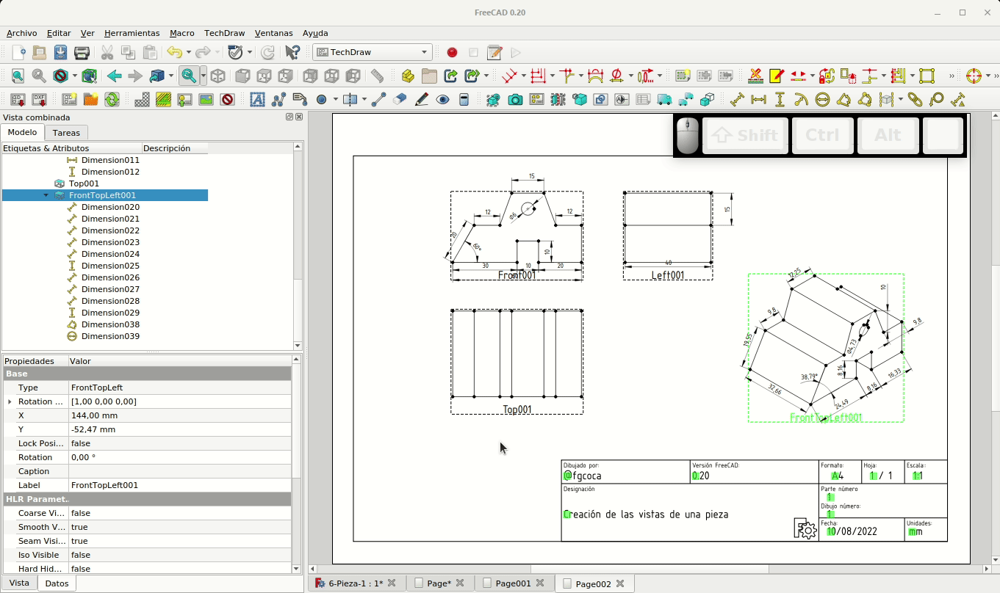
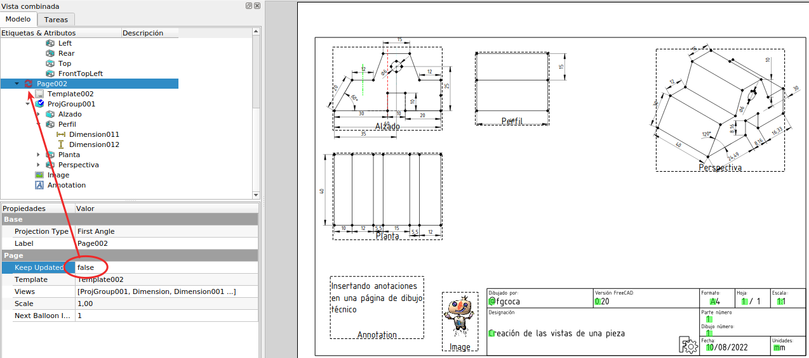

# 6. Dibujo técnico. Banco de trabajo TechDraw
FreeCAD no solo se utiliza para modelar e imprimir en 3D, también se puede usar para diseñar piezas que se van a crear mediante métodos de eliminación de material con tornos o fresadoras, o también para realizar ajustes con técnicas de cortar, taladrar y limar para elaborar piezas de distintos materiales. Lo mas habitual para dar la información necesaria para fabricar una pieza es utilizar dibujos técnicos.

FreeCAD permite la creación de dibujos técnicos mediante CAD a partir de modelos 3D con las herramientas que nos facilita el banco de trabajo 'TechDraw' o de dibujo técnico.

Básicamente lo que haremos es obtener las "vistas" de una pieza según los criterios que establece la norma UNE 1032, equivalente a la norma ISO 128.

A estas páginas de dibujo se pueden añadir dimensiones, secciones, áreas sombreadas, anotaciones y símbolos en formato SVG, que además las páginas se pueden exportar a diferentes formatos como DXF, SVG y PDF.

A continuación se listan los iconos de este banco de trabajo junto a una breve descripción de su uso. A lo largo de este apartado se irán utilizando la mayor parte de los mismos.

* **Formatos o páginas**

| Icono | Descripción |
|:-:|---|
|| Insertar página por defecto. Añade una nueva página utilizando formato predeterminado |
|| Inserta página usando plantilla. Añade una nueva página utilizando la plantilla seleccionada |
|| Fuerza una actualización de la página seleccionada |

* **Vistas**

| Icono | Descripción |
|:-:|---|
|| Insertar vista. Añade una proyección o vista 2D de un objeto |
|| Insertar vista activa. Inserta una vista de la vista 3D activa con opciones de configuración  |
|| Insertar grupo de proyección. Abre una ventana de diálogo para crear diferentes vistas de un objeto 3D |
|| Insertar vista de una sección. Inserta una sección transversal de una vista existente |
|| Insertar vista de detalle. Agrega una vista en detalle de una parte de una vista existente |
|| Insertar objeto del banco de trabajo Draft. Inserta en la vista 2D un objeto existente creado con Draft |
|| Insertar objeto del banco de trabajo Arch. Inserta en la vista 2D un objeto existente creado con Arch |
|| Insertar objeto del banco de trabajo Spreadsheet. Inserta en la vista 2D un objeto existente creado con Spreadsheet  |
|| Mover vista. Mueve una vista y todos sus objetos dependientes (globos, dimensiones, etc.) a una página diferente |
|| Compartir vista. Comparte una vista en una segunda página |
|| Forma de proyecto. Abre ventana de diálogo con opciones seleccionables |

* **Decoración**

| Icono | Descripción |
|:-:|---|
|| Rayar una cara usando un archivo de imagen. Aplica un patrón de rayado |
|| Aplicar una geometría de rayado a la cara. Aplica un sombreado utilizando un patrón |
|| Insertar símbolo SVG. Inserta un símbolo de un archivo SVG en una página |
|| Insertar imagen Bitmap. Inserta una imagen PNG o JPG en una página |
|| Activar o desactivar los marcos en la vista 2D |

* **Dimensiones o acotado**

Se trata de establecer dimensiones lineales que se pueden basar en una línea, dos puntos o en línea y punto.

| Icono | Descripción |
|:-:|---|
|| Cota alineada. Inserta una cota alineada |
|| Cota horizontal. Acotación horizontal |
|| Cota vertical. Acotación vertical |
|| Cota de radio. Acotación del radio de un círculo o arco |
|| Cota de diámetro. Acotación del diámetro de un círculo o arco |
|| Cota de ángulo.  Agrega una dimensión de ángulo entre dos bordes rectos |
|| Cota de ángulo 3 puntos. Agrega una cota de ángulo a partir de tres puntos |
|| Cota de extensión horizontal. Acota sumando en horizontal |
|| Cota de extensión vertical. Acota sumando en vertical |
|| Enlazar cota a geometria 3D |
|| Anotar con globo |
|| Insertar cota de marca |

El resto de herramientas se pueden [consultar en la wiki de FreeCAD](https://wiki.freecadweb.org/TechDraw_Workbench/es).

## **6.1. Requisitos previos**
El requisito fundamental para poder obtener las distintas vistas es disponer de una pieza en tres dimensiones de la que obtenerlas y en este caso vamos a utilizar la que vamos a diseñar a continuación.

  
*Figura 6.1. Pieza de partida*

El proceso de diseño es sencillo, partimos de un boceto como el de la Figura 6.2, realizado sobre el plano YZ y una vez finalizado lo extruimos una longitud de 40 mm.

  
*Figura 6.2. Boceto para crear la pieza de partida*

Si queremos ahorrarnos el tiempo de diseño podemos descargar la [6-Pieza-1.FCStd](../img/designs/6/6-Pieza-1.FCStd).

Si no tenemos un modelo 3D seleccionado la operación que haremos a continuación nos dará error.

***
**CONFIGURACIÓN**

Antes de continuar debemos hacer algún cambio importante en algunas preferencias para que los centros de círculos y arcos estén marcados cuando se dibujan en las vistas de TechDraw. Estando situados en el banco de trabajo de TechDraw, vamos a Editar -> Preferencias y localizamos el icono de TechDraw. En la ventana de preferencias de TechDraw, hacemos clic en la pestaña "Anotación" (Figura 6.3) y nos aseguramos de que las casillas "Mostrar marcas en el centro" e "Imprimir Marcas Centrales" estén marcadas. Hacemos clic en Aplicar y luego en Aceptar para cerrar Preferencias.

  
*Figura 6.3. Configuración inicial de TechDraw -> Anotación*

***

## **6.2. Creación de las vistas**
Con el fichero anterior abierto nos dirigimos al menú desplegable para seleccionar el banco de trabajo de TechDraw. En primer lugar debemos insertar un formato o página del tamaño adecuado para contener nuestras vistas y esto lo podemos hacer de dos formas:

| Icono | Descripción|
|:-:|---|
|  | Insertar la página por defecto|
|  | Insertar a partir de una plantilla y escoger la que mas nos interese de entre las existentes |

En la Figura 6.4 vemos como queda el entorno una vez cargada la página por defecto.

  
*Figura 6.4. Insertar página por defecto*

En la Figura 6.5 vemos como queda el entorno una vez cargada la plantilla A4_Landscape_ISO7200TD.svg.

  
*Figura 6.5. Insertar página usando plantilla*

En ambos casos los cuadraditos verdes del cajetín indican que el campo es editable, como veremos posteriormente y como la nueva 'página' aparece como un objeto en el árbol de archivos.

Cuando seleccionamos la opción de 'Insertar página usando plantilla' se nos abre una carpeta que contiene diferentes plantillas para dibujo técnico. Vemos que hay diferentes tamaños de página: A4, A3, A2, A1, etc. También hay plantillas según estándares técnicos ANSI e ISO (Organización Internacional para la Estandarización), que nos van a resultar útiles si queremos hacer dibujos que cumplan con los estándares.

Nos situamos en la pestaña que contiene el modelo 3D y nos aseguramos de tener la visualización en el ángulo que queremos que se muestre en el plano de dibujo 2D. A continuación, teniendo el modelos 3D seleccionado en el árbol de archivos, hacemos clic en el icono de la herramienta "Insertar Vista". Si cambiamos la pestaña 'Page', debemos ver que el objeto 3D se ha agregado al dibujo 2D como perspectiva y en el ángulo que aparece en la vista previa en 3D. En la pestaña 'Page', tenemos una línea discontinua alrededor de la 'vista'. Estos recuadros se denominan 'Marcos de vista'. Haciendo clic en el marco y arrastrando podemos mover la vista por la página de dibujo técnico. Si seleccionamos el marco podemos eliminarlo con la tecla suprimir del teclado. En la Figura 6.6 tenemos una animación del proceso descrito.

  
*Figura 6.6. Insertar vistas en la página de dibujo técnico*

***

> **- Consejo:**

***

Observamos como todas las líneas tienen los vértices marcados con puntos y el círculo tiene marcado el centro, lo que nos ayudará a la hora de agregar dimensiones y otras tareas. Estas marcas son parte del marco de la vista y estos se pueden activar y desactivar los marcos de vista haciendo clic en el icono "Activar o desactivar la vista de marcos" o haciendo clic con el botón derecho y seleccionando "Alternar marcos". En la animación de la Figura 6.7 vemos como se hace esto.

  
*Figura 6.7. Activar o desactivar marcos*

Aunque el proceso visto nos conduce a obtener un resultado totalmente correcto es evidente que resultaría mucho mas cómodo poder insertar varias vistas de una sola vez. Para ello creamos una nueva página y teniendo seleccionada la pieza en 'Vista combinada' hacemos clic en el ícono 'Insertar grupo de proyección'. Se nos mostrará una ventana para configurar lo que queremos trasladar al dibujo 2D. En la animación de la Figura 6.8 vemos el proceso.

  
*Figura 6.8. Insertar varias vistas*

Al seleccionar la pestaña de la página vemos los cambios según vamos seleccionando y nos permite observar como en este caso que todas las vista no entran en el formato seleccionado a la escala por defecto pero si la cambiamos se soluciona el problema. También observamos como las vistas se pueden mover individualmente salvo la vista central que mueve todo el conjunto como si de un grupo se tratase. Ahora bien, la única vista con libertad de movimiento es la perspectiva, el resto se mueven pero sin perder la relación con la central en cuanto a los ejes por los que se mueven.

Para una obtención correcta de las vistas es necesario que el ajuste de la dirección primaria se corresponda con una vista en alzado en visualización 3D. Si procedemos de esta forma vamos a obtener algo similar a lo de la Figura 6.9, en la que las vistas se han posicionado adecuadamente y hemos ajustado la escala de visualización a 1:2.

  
*Figura 6.9. Vistas insertadas y ajustes*

## **6.3. Rellenando el cajetín**
Para esta tarea recuperamos la página creada inicialmente y procedemos como vemos en la animación de la Figura 6.10. Al mostrar los marcos también se hacen visibles los campos editables del cajetín y haciendo clic sobre el cuadrado verde se nos despliega la ventana de edición del campo que corresponda.

  
*Figura 6.10. Relleno del cajetín*

Observamos como el espacio reservado para title es pequeño y además que el cajetín tiene algunas secciones prescindibles para nuestros propósitos. Vamos a configurar el cajetín realizando algún trabajo de edición de la plantilla desde Inkscape. El proceso no lo vamos a tratar aquí pero el resultado final se puede [descargar en este enlace](../img/designs/Templates/A4_Horizontal.svg) para utilizarlo si nos ha gustado. El aspecto final lo vemos en la Figura 6.11.

  
*Figura 6.11. Lámina de dibujo con el nuevo cajetín*

## **6.4. Acotado de planos**
Podemos establecer dimensiones lineales de las vistas en 2D utilizando los iconos correspondientes. Para esto se pueden utilizar dos puntos, una línea o dos líneas. Los iconos y su tipo asociado son muy intuitivos y fáciles de utilizar y también muy similar a agregar restricciones en el banco de trabajo de Sketcher.

Puede resultar conveniente, antes de introducir cotas, ir a la personalización de las opciones de visualización para ajustar tamaño de textos, tamaño de flechas y demás opciones disponibles para el banco de trabajo *TechDraw* a fin de conseguir un resultado óptimo.

### 6.4.1. Acotaciones
En la animación de la Figura 6.12 observamos la acotación de la planta y como hemos acomodado algunas de ellas. De forma ligeramente diferente al banco de trabajo Sketcher, cuando deseamos seleccionar varios vértices, debemos mantener presionada la tecla CTRL. Los agujeros en los dibujos técnicos se anotan comúnmente con el diámetro en lugar del radio, porque el fabricante querrá saber qué tamaño de broca o escariador usar.

  
*Figura 6.12. Acotado de una pieza*

***

> **- Consejo:**

***

En la Figura 6.13 vemos el aspecto final de la lámina 2D con una imagen externa insertada.

  
*Figura 6.13. Lámina finalizada*

En la Figura 6.13 podemos observar como las dimensiones de las vistas están correctas y coinciden con la del boceto original pero las de la vista en perspectiva son diferentes.  Esto se debe a que "FrontTopLeft", que es nuestra perspectiva, es una proyección isométrica, y nuestro dibujo primario era una proyección ortogonal. Para obtener los valores correctos es necesario vincular las dimensiones directamente con el modelo 3D.

Para solucionar el problema de las dimensiones en vista isométrica vamos a proceder de la siguiente forma:  

1. En la página 2D hacemos clic en la cota que vamos a vincular y se nos destacará su nombre en 'Vista combinada'. Debemos anotar o memorizar el nombre de la cota que, como un objeto mas que es, podemos cambiarle el nombre para que nos resulte más fácil reconocerla.

2. Nos situamos en la pestaña 3D y seleccionamos la arista (o aristas si se trata de un ángulo) que vamos a vincular con la acotación. Hacemos clic en el icono 'Enlazar cota a geometria 3D' y se nos abrirá una ventana ?Cota de enlace' donde debemos seleccionar la cota, o cotas, implicada y pasarla a la parte 'Seleccionado' de la ventana, pulsamos en Ok y hemos vinculado ambas dimensiones. Si tenemos varias páginas 2D nos preguntará cual queremos usar.

El proceso para una de las cotas y para el diámetro lo vemos en la animación de la Figura 6.14. Previamente se ha cambiado el nombre de estos dos objetos para que resulte aún mas claro el proceso.

  
*Figura 6.14. Enlazando cotas con el modelo 3D*

### 6.4.2. Anotaciones
Además de los datos que figuran en el cajetín es posible agregar texto en cualquier lugar del documento utilizando la herramienta 'Insertar anotación'. Al hacer clic en la herramienta, veremos aparecer una etiqueta o un marco (depende de si tenemos activada o no la vista de marcos) con el texto "Default Text". En la animación de la Figura 6.15 vemos como insertar y editar una anotación con la vista de marcos activada.

  
*Figura 6.15. Insertando anotaciones con vista de marcos activada*

Si no tenemos la vista de marcos activada la anotación no es editable desde la zona de dibujo pero si desde la zona de 'Vista combinada' como cualquier otro objeto. En la Figura 6.16 vemos el proceso en estas condiciones.

  
*Figura 6.16. Insertando anotaciones con vista de marcos desactivada*

La ventana de texto de las anotaciones no usa ajuste de texto y por lo tanto debemos pulsar ENTER para crear una nueva línea de texto.

### 6.4.3. ¿Qué ángulo?
En dibujo técnico existen numerosos estándares y sistemas que lo rigen. Un conjunto de estándares está relacionado con los ángulos de proyección que definen la ubicación de las vistas en el dibujo técnico. FreeCAD trabaja con dos familias de vistas de proyección, 'Primer ángulo' y 'Tercer ángulo'.

Los dibujos en primer ángulo son los más comunes fuera de América del Norte, donde se utiliza comúnmente el tercer ángulo.

Es importante indicar en nuestros planos que ángulo estamos usando con la inclusión del símbolo correspondiente y muy conveniente indicar y poner en práctica el uso de un ángulo y no mezclar ambos tipos.

Es bastante complejo explicar la diferencia entre primer ángulo y tercer ángulo, y además existen numerosos enfoques diferentes para explicarlo. A continuación ponemos algunos enlaces y una infografía bastante clara del tema.

* [Página en inglés de wikipedia](https://en.wikipedia.org/wiki/Multiview_orthographic_projection#Third-angle_projection)

* [Página en español](https://hmong.es/wiki/Multiview_projection) de leer wikipedia con un nuevo diseño.

* [Explicación en inglés de Green Mechanic](https://www.green-mechanic.com/2016/01/difference-between-first-third-angle.html)

En la Figura 6.17 vemos la infografía de Green Mechanic sobre el tema.

  
*Figura 6.17. Infografía primer y tercer ángulo*

### 6.4.4. Exportación
Es posible exportar los dibujos 2D en diferentes formatos para poder utilizarlos en documentación e incluso imprimirlos. El proceso a seguir es muy simple: hacemos clic en cualquier parte del dibujo 2D y se nos muestran las opciones de salida disponibles (Figura 6.18). Escogemos la opción requerida, le ponemos nombre y listo para exportar.

  
*Figura 6.18. Opciones de exportación*

En la Figura 6.19 vemos el archivo exportado a formato SVG abierto en Inkscape.

  
*Figura 6.19. Exportación SVG*

En la Figura 6.20 vemos el archivo exportado a formato PDF abierto en el Visor de documentos de Ubuntu.

  
*Figura 6.20. Exportación PDF*

En la Figura 6.21 vemos el archivo exportado a formato DXF abierto en [LibreCAD](https://librecad.org/), un software Open Source para diseño 2D.

  
*Figura 6.21. Exportación DXF*

### 6.4.5. Secciones, sombreado y rayado
En dibujo técnico es habitual utilizar elementos como líneas, rayados o sombreados que ayuden en su legibilidad. En la barra de herramientas 'Anotación' disponemos de algunas con las que podemos añadir vértices, puntos centrales, puntos en cuadrantes de círculos, líneas centradas en caras, entre dos líneas o entre dos puntos. En la animación de la Figura 6.22 vemos como trabajar con algunas de estas herramientas sobre el alzado de nuestra pieza. Estos elementos en muchos casos son denominados 'objetos cosméticos' y una de sus principales características es que no van a aparecer en el árbol de objetos.

  
*Figura 6.22. Puntos y líneas cosméticas*

En esta barra de herramientas se disponen de herramientas de edición de los elementos que se crean desde la misma debido a su no existencia en el árbol de objetos.

En la Figura 6.23 vemos una vista de nuestro plano con los elementos reposicionados en el plano y una alerta de que hemos desactivado el posiconado automático de la página para así evitar que los elementos se muevan a su posición por defecto cuando realizamos tareas sobre ellos.

  
*Figura 6.23. Elementos posicionados en el plano y desactivado del posicionado automático*

Para crear una sección marcamos con un clic la cara de la pieza por la que deseamos realizar el corte y activamos la herramienta de 'Crear sección' como vemos en la Figura 6.24.

  
*Figura 6.24. Activamos la herramienta para crear una sección*

Nos aparece la ventana 'Crear vista de sección' (Figura 6.25) en 'Vista combinada' donde podemos elegir la orientación de la sección haciendo clic sobre el gráfico que se corresponda con el corte que deseamos realizar. Esto nos creará en la vista seleccionada al principio la línea indicativa del corte con las flechas apuntando en la dirección escogida. Podemos ponerle un identificador a la sección y podemos posicionar el plano de corte. En el momento de creación de esta documentación los cambios realizados en esta ventana no se muestran en tiempo real en el plano y por lo tanto el reposicionado del plano lo haremos desde los datos en 'Vista combinada'.

  
*Figura 6.25. Crear vista de sección*

En la animación de la Figura 6.26 vemos como cambiar la posición del plano de corte sobre las tres secciones creadas, una en cada vista de la pieza, y como cambia la posición del plano de sección en la vista. En los datos es posible cambiar otros parámetros referentes a las secciones. Section A-A es la sección del perfil, Section B-B la del alzado y Section C-C la de la planta.

  
*Figura 6.26. Mover el plano de corte*

El último paso que vamos a ver en esta sección es el de aplicar algún sombreado y rayado a algunas caras de la perspectiva de la pieza, tal y como observamos en la animación de la Figura 6.27. Para añadir sombreado o rayado a una cara, la seleccionamos y luego hacemos clic en 'Aplicar sombreado geométrico a la cara'. En el cuadro de diálogo, puede cambiar varios ajustes, como el patrón, el grosor de línea y el color.

  
*Figura 6.27. Sombreado y rayado de caras*

En la imagen 6.28 vemos en detalle los patrones creados.

  
*Figura 6.28. Detalle de sombreado y rayado de caras*

