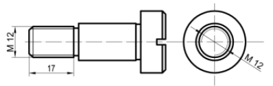
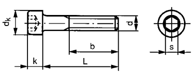
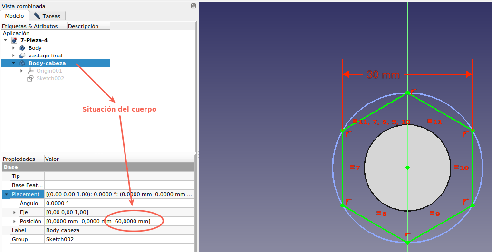

# 7. Tornillos y tuercas
Abordaremos el tema de diseño de este tipo de elementos partiendo de un repaso sencillo del trabajo con hélices y la extrusión por trayectoria.

Se recomienda encarecidamente seguir el capitulo [6.13 28 Hélices y roscas](http://www.iearobotics.com/wiki/index.php?title=Dise%C3%B1o_de_piezas_con_Freecad#28_H.C3.A9lices_y_roscas) de la temporada 1 de tutoriales de FreeCAD del maestro [Obijuan](https://es.wikipedia.org/wiki/Juan_Gonz%C3%A1lez_G%C3%B3mez) disponible en la [Obijuan Academy](http://www.iearobotics.com/wiki/index.php?title=Obijuan_Academy).

Existe un banco de trabajo denominado **Fasteners** (tornillos) que es muy útil cuando queremos poner tornillos en nuestros diseños y que incluso se puede utilizar para crear tuercas. El banco de trabajo incluye tornillos, tuercas, arandelas, etc básica en formato DIN, aunque existen algunos otros. En los enlaces siguientes tenemos el acceso al banco de trabajo original y al tutorial creado por mi sobre el tema.

* [Banco de trabajo original](https://github.com/shaise/FreeCAD_FastenersWB) instalable desde 'Addon manager' o Administrador de complementos.

* [Tutorial Tornillos en FreeCAD](https://fgcoca.github.io/Tornillos-en-FreeCAD/)

En la wiki de FreeCAD tenemos un tutorial completo denominado [Thread for Screw Tutorial](https://wiki.freecadweb.org/Thread_for_Screw_Tutorial) que es un tratado completo de sistemas de creación de roscas para tornillos donde se exponen seis métodos diferentes.

## **7.1. Introducción y repaso**
Comenzamos recordando como se realiza una barrido recorriendo una trayectoria. Para ello vamos a trabajar con una primitiva geométrica paramétrica como es la hélice que nos va a marcar el recorrido del barrido. Por otra parte haremos el barrido partiendo de un boceto de un pentágono para comprobar el recorrido que realiza cada uno de sus vértices según la trayectoria marcada.

Nos dirigimos al banco de trabajo 'Part' y creamos una hélice con los datos que vemos en la animación de la Figura 7.1. En este ejemplo vemos como al principio se crea una hélice cada vez que pulsamos el botón OK, pero posteriormente cuando entramos en la edición de la misma esto ya no ocurre. Es otro ejemplo mas del por qué es conveniente cambiar los valores de los datos en 'Vista combinada'.

  
*Figura 7.1. Creación de la hélice*

En la Figura 7.2 vemos la creación del pentágono regular y la situación de los elementos respecto al origen de coordenadas o 'Cruz de ejes'.

  
*Figura 7.2. Creación del pentágono*

Vamos a cambiar el radio de la hélice para hacerlo coincidir con el vértice del pentágono (Figura 7.3) y ver más claramente que al extruir siguiendo la trayectoria de la hélice ese vértice dará una vuelta de 360º.

  
*Figura 7.3. Cambio del radio de la hélice*

Vamos a generar el barrido del pentágono siguiendo la trayectoria de la hélice, tal y como observamos en la Figura 7.4.

  
*Figura 7.4. Barrido del pentágono siguiendo la hélice*

Veamos como se produce ese torsionado en la pieza final (Figura 7.5) observando el barrido de cada uno de los vértices del pentágono siguiendo la trayectoria marcada.

  
*Figura 7.5. Ver por que se produce el torsionado*

Vemos como el vértice que coincide con el principio de la hélice gira los 360º hasta completar la trayectoria y como el resto de vértices van siguiendo su trayectoria para hacer lo mismo puesto que pertenecen a la misma figura de referencia, el pentágono. También vemos el uso de la herramienta 'Estilo de dibujo' que en esta ocasión hemos puesto como 'alambres' pero que dispone de otras opciones que nos pueden resultar útiles.

Podemos observar en la animación de la Figura 7.5 que hemos seleccionado las propiedades 'Crear sólido' y ' Ángulo fijo' en la ventana. Estas propiedades se corresponden en 'Vista combinada' con 'Solid' y 'Frenet'. En la Figura 7.6 podemos observar para que se han seleccionado.

  
*Figura 7.6. Propiedades Solid y Frenet*

La propiedad 'Frenet' o 'Ángulo fijo' controla la forma en que la orientación del perfil va cambiando cuando va siguiendo la trayectoria del barrido. Si 'Frenet' es 'false' (no hemos marcado 'Ángulo fijo'), la orientación del perfil se mantiene constante y la pieza resultante tiene la mínima torsión posible. Sin embargo, Cuando un perfil genera un barrido a lo largo de una hélice, sufre como un deslizamiento que va desviando su orientación suavemente, va rotando siguiendo la hélice. Tenemos que seleccionar la propiedad 'Frenet' a 'true' para evitar estas deformaciones. En definitiva, se basa en resolver un problema de geometría diferencial, donde las [fórmulas de Frenet-Serret](https://en.wikipedia.org/wiki/Frenet%E2%80%93Serret_formulas) describen las propiedades cinemáticas de una partícula que se mueve a lo largo de una curva diferenciable continua en un espacio euclidiano tridimensional.

Es evidente que aún le falta bastante para ser un tornillo, pero se parece bastante y si nos fijamos en la Figura 7.7 observamos con que facilidad podemos cambiar el paso de la hélice para cambiar la forma de la pieza y como la propiedad radio no afecta para nada en este caso.

  
*Figura 7.7. Cambios en el paso de hélice y su radio*

Queda claro que cuando disminuimos el paso a la mitad la trayectoria gira 720º (dos vueltas completas) y cuando la aumentamos al doble gira 180º (media vuelta). Se aconseja al lector crear el modelo 3D o descargar la [7-Pieza-1.FCStd](../img/designs/7/7-Pieza-1.FCStd) y probar con diferentes pasos para observar el resultado final.

## **7.2. Roscas**
Podemos definir rosca como resalte acanalado ejecutado en forma de hélice sobre un cuerpo cilíndrico o cónico. La rosca puede ser interior o exterior. En la Figura 7.8 vemos los elementos que intervienen en una rosca.

  
*Figura 7.8. Elementos que intervienen en una rosca*

1. Paso: Es la distancia medida paralelamente al eje entre dos filetes consecutivos. También puede definirse como el número de hilos que existe en una longitud determinada de rosca, como por ejemplo en una pulgada.
2. Profundidad de la rosca. Es la distancia entre la cresta y el fondo medida perpendicularmente al eje.
3. Profundidad superior. Distancia entre la cresta y la línea media.
4. Profundidad inferior. Distancia entre el fondo y la línea media.
5. Diámetro nominal (D o d). Es el mayor de los diámetros que se pueden medir sobre un elemento roscado exteriormente.
6. Diámetro del núcleo o de fondo (D1 o d1). Corresponde al volumen sobre el que se asienta la rosca.
7. Ángulo de rosca α: Es el formado por dos flancos contiguos del perfil. 
8. Sentido de las roscas. Bien a derechas o a izquierdas, según que el apriete entre tornillo y tuerca se realice girando el tornillo en sentido inverso o igual a las agujas del reloj.
9. Número de entradas (Figura 7.9). Una rosca puede ser sencilla, es decir estar formada por un solo filete que se arrolla en espiral sobre un cilindro, o bien múltiples formadas por dos o más filetes, que se arrollan paralelamente iniciándose en puntos equidistantes de la periferia del elemento roscado. Se aplica cuando se quiere fijar un elemento con pocas vueltas.

  
*Figura 7.9. Número de entradas de una rosca*

En la tabla siguiente vemos la designación abreviada de los principales sistemas de roscas así como sus características principales.

| Tipo | Abreviatura | Especificación | Norma |
|:-:|:-:|---|:-:|
| Métrica | M | Diámetro exterior en mm | DIN ISO 13-1 |
| Métrica fina | M | Diámetro exterior y paso en mm | DIN ISO 13-2 a 11 |
| Whitworth | R-Rp | Diámetro exterior en pulgadas | DIN 2999 |
| Whitworth BSP | G | Diámetro exterior en pulgadas | ISO 228-1,DIN 228 |
| Trapezoidal | Tr | Diámetro exterior y paso en mm | DIN 103 ISO 2903 |

### 7.2.1. Sistema métrico
El triángulo fundamental es equilátero: Tanto en la rosca normal como en la fina. La norma que lo regula es la DIN 13. Sus características se definen a en la Figura 7.10.

  
*Figura 7.10. Características rosca métrica*

Donde:

* Diámetro nominal: D = d
* Paso: P
* D1 =  d – 2·H1 = d – 1,082532·P
* Diámetro medio: D2 = d2 = d – 0,649519 · P
* Diámetro del núcleo: d3 = d – 1,226869 · P = 0,866025 · P
* Profundidad portante de rosca: H1 = 0,541266·P
* Profundidad de rosca: h3 = 0,613435·P
* Radio fondo de rosca: R = H/6 = 0,144338 · P

La Norma DIN 13-1, establece las características de las roscas métricas gruesas cuyos tamaños van desde la M1 a M68. Las roscas de métricas finas se regulan por las normas DIN 13-2 a la DIN 13-11 1999-11 y diámetros nominales de 1mm a 1000 mm y pasos finos de 0,2 a 8 mm.

En la tabla siguiente vemos algunas de las roscas mas utilizadas y que corresponden a métrica gruesa. Todas las medidas se dan en milímetros.

| Denominación | Diámetro nominal | Paso | Diámetro núcleo tornillo/tuerca | Profundidad rosca tornillo/tuerca | Diámetro de broca |
|---|:-:|:-:|:-:|:-:|:-:|
| M2 | M2 | 0,40 | 1,509/1,567 | 0,245/0,217 | 1,6 |
| M2,5 | M2,5 | 0,45 | 1,948/2,130 | 0,276/0,244 | 2,1 |
| M3 | M3 | 0,50 | 2,387/2,459 | 0,307/0,271 | 2,5 |
| M4 | M4 | 0,70 | 3,141/3,242 | 0,429/0,379 | 3,3 |
| M5 | M5 | 0,80 | 4,019/4,134 | 0,491/0,433 | 4,2 |
| M6 | M6 | 1,00 | 4,773/4,917 | 0,613/0,541 | 5 |
| M8 | M8 | 1,25 | 6,466/6,647 | 0,767/0,677 | 6,8 |
| M10 | M10 | 1,50 | 8,160/8,376 | 0,920/0,812 | 8,5 |
| M12 | M12 | 1,75 | 9,853/10,106 | 1,074/0,947 | 10,2 |
| M16 | M16 | 2,00 | 13,546/13,835 | 1,227/1,083 | 14 |
| M20 | M20 | 2,50 | 16,933/17,294 | 1,534/1,353 | 17,5 |
| M24 | M24 | 3,00 | 20,319/20,752 | 1,840/1,624 | 21 |
| M30 | M30 | 3,50 | 25,706/26,211 | 2,147/1,894 | 26,5 |
| M36 | M36 | 4,00 | 31,093/31,670 | 2,454/2,165 | 32 |
| M42 | M42 | 4,50 | 36,147/37,129 | 2,760/2,436 | 37,5 |
| M48 | M48 | 5,00 | 41,866/42,587 | 3,076/2,706 | 43 |
| M56 | M56 | 5,50 | 19,252/50,046 | 3,374/2,977 | 50,5 |
| M64 | M64 | 6,00 | 56,639/57,505 | 3,681/3,248 | 56 |

### 7.2.2. Sistema Whitworth
El sistema inglés Whitworth (Figura 7.11) presenta un perfil del triángulo isósceles, siendo su lado menor igual al paso. El ángulo de rosca es de 55º y el fondo de los filetes del tornillo y de la tuerca son redondeados. Sus características están recogidas en la norma DIN 2999. Los pasos van desde 1/8” a 18”. Fundamentalmente se utilizan en tubos y se rigen por las normas ISO 7/1, DIN 2999, BS 21 y DIN ISO 228.

  
*Figura 7.11. Características rosca Whitworth*

Donde:

* Paso: P = 25,4/z
* z = Hilos en una pulgada
* R= 0,137329P
* H= 0,960491P
* H1=0,640327P
* Diámetro nominal: D = d
* D1 =  D – 2·H1 = D – 1,280654·P
* Diámetro medio: D2 = d2 = d – 0,6403 · P

### 7.2.3. Roscas trapezoidales
Basadas en la norma DIN 103 e ISO 2903. Tienen gran resistencia y se utiliza para fabricación de husillos, empleados principalmente para transmisión y transformación de movimiento en ambos sentidos. El diente lo forma un triángulo isósceles de ángulo desigual de 30º y lado desigual igual al paso P (Figura 7.12). El diámetro exterior y el paso se expresan en mm.

  
*Figura 7.12. Características rosca trapezoidal*

Donde:

* D1 = d-2H1 = d-P
* H1 = 0,5P
* h3 = H4 = H1 + ac = 0,5P + ac
* z = 0,25P = 0,5H1
* D4 = d + 2ac
* d3 = d – 2h3
* d2 = D2 = d – 0,5P
* ac = Juego
* R1 = 0,5ac
* R2 = ac
* R3 = ac

En internet podemos encontrar toda la información sobre estas roscas y otras que no vamos a tratar aquí por carecer de interés para nuestros propósitos.

## **7.3. Representación y acotado de roscas**
Las roscas se representan según lo indicado en la Norma UNE 1-108-83, independientemente de su tipo.

## **7.3.1. Roscas macho**
Se acotan por su diámetro exterior o nominal, expresado en mm o pulgadas, y a dicha cota se antepone la letra que indica el tipo de rosca (Figura 7.13),

  
*Figura 7.13. Representación y acotado de una rosca M12*

En las longitudes roscadas se incluyen los achaflanados y los bombeados de entrada de la rosca. La salida de la rosca no se considera como tal.

## **7.3.1. Roscas hembra**
Las roscas interiores se acotan por su diámetro nominal. Las flechas de las líneas de cotas se refieren siempre a la línea fina, que es la más exterior y se corresponde con el mayor de los diámetros representados. En la Figura 7.14 y 7.16 vemos un ejemplo para rosca interna M7.

  
*Figura 7.14. Representación y acotado de una rosca interior*

Para el caso de agujeros ciegos roscados se acota, el diámetro, la profundidad del agujero y la longitud de la rosca útil (Figura 7.15 y 7.16).

  
*Figura 7.15. Representación y acotado de agujeros ciegos*

El límite de la rosca útil, se indica por una línea gruesa continua que se traza hasta el diámetro exterior del roscado (Figura 7.16).

  
*Figura 7.16. Límite útil de rosca*

## **7.3. Creación de una rosca**

### 7.3.1. Rosca exterior

Vamos a seguir avanzando un poco mas en el modelado 3D de tornillos y tuercas. Para ello vamos a crear un trozo de rosca con dimensiones según la normativa DIN ISO. Sin entrar en mas detalles vamos a intentar modelar la parte roscada de un tornillo DIN 912 M10x40 de cabeza cilíndrica y hueco hexagonal. En la Figura 7.16 vemos representado este tipo de tornillo.

  
*Figura 7.17. Representación del tornillo DIN 912 M10x40 de cabeza cilíndrica y hueco hexagonal*

Los datos de este tornillo van a ser los siguientes:

* d = M10
* L = 40 mm
* P = 1,5 mm
* **b = 32 mm**
* dk = 16 mm como máximo
* k = 10 mm como máximo
* S = 8 mm

Por ahora nos dedicamos al diseño de la parte destacada de los datos. Para ello vamos a crear la hélice guía con esa longitud de 32 mm un paso de 1,5 mm y un diámetro de 10 mm, acudiendo al banco de trabajo 'Part', como vemos en la Figura 7.18.

  
*Figura 7.18. Creamos la hélice para el tornillo M10*

El siguiente paso es crear la sección del filete, que como hemos visto es un triángulo rectángulo para roscas métricas. En la animación de la Figura 7.19 vemos el procedimiento seguido, que consiste en dibujar un triángulo en el plano XZ con su baricentro distanciado 5 mm del origen de coordenadas, de forma que coincida con el inicio de la hélice y uno de sus vértices apuntando hacia el exterior de la hélice. Este triángulo tendrá como longitud de sus lados la misma que el paso de rosca. Una vez acabado el triángulo hacemos el barrido por trayectoria y ya tenemos nuestra rosca creada.

  
*Figura 7.19. Creación de la rosca*

Si observamos el resultado final vemos que se ha creado un objeto hueco, razón por la que debemos añadir un cilindro, pero ¿de que diámetro?. En la Figura 7.20 hemos obtenido, mediante líneas auxiliares, la distancia que debemos restar al radio de la hélice para obtener el del cilindro.

  
*Figura 7.20. Cota de profundidad del triángulo*

Restando 5 - 0,43 = 4,57 mm. Le damos una radio al cilindro de 4,58 mm para que se introduzca minimamente en la rosca pero no deje espacio entre esta y el propio cilindro. Le ponemos una altura de 32 mm y fusionamos ambos objetos para obtener nuestro rosca (Figura 7.21) que ya es bastante similar a lo que sería un tornillo de M10.

  
*Figura 7.21. Rosca exterior final obtenida*

### 7.3.1. Rosca interior
Para nuestro ejemplo vamos a ver las tuercas hexagonales DIN 934, que tienen el aspecto y las dimensiones que vemos en la Figura 7.22 y la tabla que le sigue.

  
*Figura 7.22. Aspecto y dimensiones de tuercas DIN 934*

| D | E | H | SW |
|:-:|:-:|:-:|:-:|
| M2 | 4,38 | 1,6 | 4 |
| M2,5 | 5,45 | 2 | 5 |
| M3 | 6,01 | 2,4 | 5,5 |
| M4 | 7,66 | 3,2 | 7 |
| M5 | 8,79 | 4 | 8 |
| M6 | 11,05 | 5 | 10 |
| M8 | 14,38 | 6,5 | 13 |
| M10 | 18,9 | 8 | 17 |
| M12 | 21,1 | 10 | 19 |
| M16 | 26,76 | 13 | 24 |
| M20 | 32,95 | 16 | 30 |
| M24 | 39,6 | 19 | 36 |
| M30 | 50,9 | 24 | 46 |
| M36 | 60,8 | 29 | 55 |
| M42 | 75 | 34 | 65 |
| M48 | 86,5 | 38 | 75 |
| M56 | 98,1 | 45 | 85 |
| M64 | 110 | 51 | 95 |

Para nuestro caso vamos a diseñar la tuerca M10, por lo que el diámetro interior es de 10 mm, la distancia entre aristas de 18,9 mm, la altura de 8 mm y la distancia entre caras de 17 mm. El diámetro interno se corresponde con la dimensión de rosca M10 exterior. Vamos a empezar por crear la tuerca hexagonal ciega, para ello partimos del boceto de la imagen 7.23 que extruimos a una longitud de 8 mm.

  
*Figura 7.23. Tuerca ciega M10*

Ahora procedemos a crear una rosca exterior M10 de unos 12 o 14 mm de longitud. El proceso a seguir es exactamente el mismo que el del ejemplo de rosca exterior M10. Al final debemos tener algo algo similar a la Figura 7.24.

  
*Figura 7.24. Tuerca ciega mas rosca exterior M10*

Ahora creamos una unión entre el cilindro y el barrido. El objeto 'Fusion' creado lo movemos al cuerpo donde creamos el filete de la rosca y procedemos a realizar un corte entre ambos cuerpos. En la Figura 7.25 vemos este proceso final completo.

  
*Figura 7.25. Tuerca M10*

Por ahora nos vamos a dar por satisfechos con el aspecto de la rosca para seguir profundizando en el tema en el apartado siguiente.

## **7.4. Tornillos y tuercas**
Ya hemos visto, aunque sin apenas entrar en detalle, los tipos y definiciones de roscas y ahora vamos a entrar un poco mas a fondo en las definciones de los tornillos y tuercas. Solamente vamos a referirnos a los tornillos utilizados para uniones metálicas aunque existen otros muchos modelos. En la Figura 7.26 tenemos representadas las diferentes partes de un tornillo.

  
*Figura 7.26. Partes de un tornillo*

* **Cabeza**. Es la parte del tornillo que nos va a permitir apretarlo o aflojarlo utilizando la herramienta adecuada. Habitualmente los tornillos se identifican por: tipo de cabeza, diámetro, longitud, perfil de rosca y paso de rosca. En cuanto a la cabeza los tenemos representados en la Figura 7.27 (imagen obtenida de wikipedia) 

| Cabezas | Tipo / herramienta |
|:-:|---|
|  *Figura 7.27. Tipos de cabezas de tornillo*  |  Tipo:   (a) - hexagonal o cuadrada   (b) - redonda o alomada   (d, g) - cilíndrica    (c, e, f) - avellanada   Herramienta:   Llave fija o inglesa - a    Ranura - b,c y d  Allen - e  Philips o estrella - f  Moleteado - g  |

* **Diámetro**. Grosor del tornillo medido en la zona de la rosca, normalmente dado en milímetros.
* **Cuello**. Es la parte del cilindro no roscada. En algunos tipos de tornillos la parte del cuello mas cercana a la cabeza puede ser de forma cuadrada.
* **Rosca**. La parte roscada del cilindro que define el diámetro del tornillo.
* **Longitud**. Es la longitud total del tornillo y es lo que miden el cuello y la rosca juntos y se denomina **vástago**.

En la figura 7.26 también quedan representados los elementos que componen la rosca en si misma:

* **Cresta**. Es la parte mas saliente de la rosca.
* **Filete**. Sería el elemento (normalmente un triángulo) comprendido entre la cresta y el fondo. Se suele denominar **hilo**.
* **Fondo o raíz**. La parte mas baja de la rosca.

La tuerca es un elemento que trabaja asociada al tornillo y sus tipos de rosca tienen las mismas características que la de los tornillos. Una tuerca se define por su número de caras, su grosor o longitud, su diámetro y su tipo de rosca. Los tipos mas destacados los vemos en la Figura 7.28.

  
*Figura 7.28. Tipos de tuercas*

En la Figura 7.29 tenemos definidas todas las dimensiones de las diferentes partes que componen el tornillo, incluyendo alguna aún no definida, y a continuación se da una tabla con las dimensiones de estas partes para distintos tipos de tornillos.

  
*Figura 7.29. Acotado de las partes de un tornillo*

La salida es el chaflán de transición entre la parte roscada y no roscada o cuello, el chaflán es la parte final del tornillo que se achaflana para que la tuerca se aloje con mas facilidad y el acuerdo en la unión entre el vástago y la cabeza del tornillo.

Existen tablas para todos los tipos y dimensiones posibles de tornillos así como para especificar sus características de material con el que están fabricados, si son o no calibrados, normales o autoroscantes, etc.

En la figura 7.30 vemos el gráficos de dimensiones de un tuerca hexagonal estándar y una tabla con la especificación de sus dimensiones.

  
*Figura 7.30. Acotado de las partes de una tuerca*

Finalmente para poder hacer correctamente los filetes de las roscas debemos saber que estas no son exactamente triangulares sino que los vértices están redondeados, entre otras cosas para evitar que corten cuando son de metal. Una rosca ISO estándar es una rosca métrica y tiene las propiedades que vemos en la Figura 7.31, donde podemos observar que el ángulo del filete es constante y de 60º, que H es la distancia entre puntas del triángulo y H1 es la profundidad de rosca de base a base del arco de las puntas.

  
*Figura 7.31. Rosca ISO estándar*

**H = 0,866 . P y H1 = 0,541 . P**

El valor de H = 0,866 . P y H1 = 0,541 . P

Ya tenemos todos los datos necesarios para el diseño completo de tornillos y tuercas y vamos a proceder a diseñar un DIN-931 de cabeza hexagonal y **M20x60** mm para proceder a imprimir el resultado y comprobar que funciona correctamente. El aspecto real del tornillo y sus especificaciones los vemos en la Figura 7.32. Consultando los datos anterior vemos que el paso para un tornillo M20 es de 2,5 mm y por lo tanto:

**H = 0,866 . P = 0,866 x 2,5 = 2,165 y H1 = 0,541 . P = 0,541 x 2,5 = 1,3525**

  
*Figura 7.32. Tornillo DIN-931 de M20x60 y tuerca M20*

### 7.4.1. Diseño del tornillo
Procedemos con el diseño del tornillo (Figura 7.33) a partir de los datos anteriores. Vamos a comenzar por crear un cilindro que cubra las necesidades del vástago del tornillo, es decir un cilindro de radio 10 y altura 60 mm al que vamos a crear en su base un chaflán de 3 mm que es el dato para esta medida.

  
*Figura 7.33. Vástago para el tornillo DIN-931 de M20x60*

Antes de continuar con la rosca vamos a crear la salida, que es otro chaflán que parte de un punto situado a la distancia marcada por la longitud roscada (25 mm). Esto lo podemos hacer de varias formas, pero vamos a ver una en la que usaremos nuevas herramientas de FreeCAD. En concreto vamos a crear un sólido de revolución a partir de un boceto. Para mayor comodidad vamos a ocultar el cilindro original por el momento. Creamos un plano de referencia fijado al plano XY y lo elevamos en Z 25 mm para lo que necesitaremos poner visible 'Origin'. Este plano simplemente nos va a servir para saber donde está el punto de partida del chaflán pero en realidad no lo usaremos para nada.

Ahora creamos un boceto en el plano XZ con el aspecto y dimensiones que vemos en la Figura 7.34, donde hemos activado también el plano de referencia anterior.

  
*Figura 7.34. Boceto para generar el chaflán de salida*

En la animación de la Figura 7.35 vemos como generar el sólido de revolución a partir del boceto y como obtener el chaflán de salida, dejando el vástago listo para hacerle la rosca.

  
*Figura 7.35. Vástago con chaflán de salida*

Vamos ahora a crear el filete de rosca, pero esta vez ya si teniendo en cuenta todas sus dimensiones. Vamos a crear un triángulo en el plano XZ basándonos en la Figura 7.31 y los datos del tornillo M20x60 de forma que un vértice apunte al cilindro del vástago. Este objeto va a actuar a modo de cuchilla para tornear la rosca en el vástago. Restringimos el ángulo a los 60º de la norma y debemos tener en cuenta los valores de H y H1 calculados en la figura 7.32, es decir H = 2,165. También creamos una restricción de simetría respecto al eje horizontal. Con estos valores el triángulo se verá como en la Figura 7.36.

  
*Figura 7.36. Cuchilla triangular base*

A este triángulo le queda un grado de libertad que no es otro que su posición horizontal, pero esta hay que fijarla desde un punto que aún no existe y que es el de corte del redondeo de la esquina con el eje. Vamos entonces a crear ese arco de redondeo. Conocemos la distancia H1 = 1,3525 que existe entre las dos rectas secantes que se representan en la Figura 7.31 y la distancia H. Si hacemos la operación siguiente:

(H - H1)/P = (2,165 - 1,3525)/2,5 = 0,8125/2,5 = 0,325

Obtenemos la distancia a los vértices para ambas rectas secantes, por lo que dividiendo esa cantidad entre dos ya sabemos a que distancia del vértice debemos situar la recta secante que nos va a servir para obtener los puntos inicial y final del arco que lógicamente tendrá su centro sobre el eje. Finalmente esa distancia es de 0,1625 mm. En la Figura 7.37 vemos el proceso de creación de este arco y la forma de situar el triángulo exactamente en su posición.

  
*Figura 7.37. Cuchilla triangular final*

Vemos en el proceso la importancia de trabajar con lineas y cotas auxiliares para tener claras las referencias sin que el boceto final quede afectado y resulte válido para realizar la operación que queremos hacer.

La distancia del punto de corte del arco con el eje es lógicamente la que marca el diámetro interior de la rosca, que es de 16,933 por lo que el radio es de 8,4665 mm. En la Figura 7.38 vemos en detalle el boceto creado.

  
*Figura 7.38. Boceto de la cuchilla*

Ya podemos imaginar que lo que nos queda es relativamente sencillo y consiste en crear la hélice para generar el barrido y con ello crear el filete de rosca que buscamos. Para ello nos dirigimos al banco de trabajo 'Part' y creamos una hélice de paso 2,5 mm, un radio de 10 mm y una altura de un poco mas de 25 mm (27 mm) que es la longitud de la zona roscada y de esta forma nos meteremos con la rosca en el chaflán de salida. Tenemos que tener en cuenta que ahora no ocurrirá como cuando generábamos las roscas iniciales que el extremo de la hélice coincida con el centro del triángulo, pero esto no es importante puesto que ahora ese triángulo si es exactamente como marca la norma y lo que hacíamos al principio era solamente con fines de aprendizaje. En la figura 7.39 vemos el proceso final de creación del vástago.

  
*Figura 7.39. Vástago final*

Vamos ahora a diseñar la cabeza del tornillo creando en primer lugar un nuevo cuerpo que colocaremos a la altura de la cara plana superior del cilindro. La cabeza de un tornillo M20 tiene un espesor de 13 mm, una medida entre caras de 30 mm, entre aristas de 34,6 y el radio del acuerdo es de 1 mm. En este nuevo cuerpo creamos un boceto como el que vemos en la Figura 7.40 que posteriormente extruiremos una longitud de 13 mm.

  
*Figura 7.40. Boceto para la cabeza del tornillo*

La situación que debemos tener es la que vemos en la Figura 7.41, donde podemos apreciar que el vástago y l cabeza son dos objetos diferentes. La idea de mostrar la situación en este momento es apreciar como al crear un boceto sobre el plano XY en un cuerpo desplazado en el eje Z afecta a la posición final del objeto puesto que se han desplazado su objeto 'Origin' a la nueva posición.

  
*Figura 7.41. Cabeza en su estado inicial*

En el gráfico de la Figura 7.29 solamente tenemos los dos datos que se destacan en la Figura 7.42, la circunferencia y el ángulo de 30º para proceder al diseño del achaflanado de los vértices de la cabeza.

  
*Figura 7.42. Datos para el achaflanado de los vértices de la cabeza*

El proceso que vamos a seguir es crear una ranura mediante revolución de un boceto que cumpla con el ángulo y que su lado tenga la longitud requerida desde el vértice a la circunferencia. Para ello nos vamos a ayudar de un boceto auxiliar con el que solamente averiguaremos una longitud, la que apreciamos en la Figura 7.43, donde vemos como las líneas y las cotas son elementos de construcción o auxiliares. Como este boceto no va a tener efecto alguno sobre la pieza lo diseñamos directamente sobre la cara. Se calcula la longitud que resulta ser de 2,32 mm.

  
*Figura 7.43. Obtención de la medida de uno de los lados del triángulo*

Vamos a crear un plano de referencia apoyado sobre la cara superior que giraremos 90º y apoyado en este plano creamos un nuevo boceto para marcar la distancia antes calculada y el ángulo que requerimos. Para ello nos va a resultar más cómodo en ciertos momentos poner la vista del modelo en modo alambres. En la Figura 7.44 vemos completo el proceso y el resultado que se obtiene.

  
*Figura 7.44. Creamos el achaflnado mediante ranura de revolución*

Si intentamos fusionar ambas partes nos va a generar un resultado incorrecto y aprovechando la situación vamos a introducir algunos conceptos mas de trabajo con FreeCAD. En primer lugar y con objeto de tener mejor organizado nuestro trabajo vamos a crear 'Grupos' o carpetas que contengan de manera separada los elementos o partes del diseño. En la Figura 7.45 vemos el proceso en el que creamos todas las carpetas o grupos necesarios, como movemos los elementos a cada carpeta y como mostrar y ocultar estos elementos a partir de los grupos.

  
*Figura 7.45. Creamos de grupos o carpetas*

Nos vamos a situar en el banco de trabajo 'Part' y vamos a crear copias simples de los objetos que van a formar el tornillo. En la Figura 7.46 tenemos la forma de hacerlo. **Debemos tener en cuenta que las copias simples no se actualizan si realizamos cambios en los objetos originales**.

  
*Figura 7.46. Creamos de copias de objetos y traslado a su carpeta*

En el proceso observamos como la cabeza no se sitúa en el lugar esperado (por esto la operación de unión no tendría éxito con los objetos originales) y como se traslada a su posición. Este es otro motivo de por qué siempre debemos utilizar planos de referencia adecuados que coloquen al objeto en su lugar.

Ahora ya si podemos fusionar las copias, crear el redondeado con el radio del acuerdo de 1 mm y dar textura material al objeto final, tal y como se aprecia en la animación de la Figura 7.47.

  
*Figura 7.47. Tornillo final*

### 7.4.2. Diseño de la tuerca
Para el diseño de la tuerca vamos a utilizar una nueva herramienta de FreeCAD situada en el banco de trabajo 'Part Design' y que se llama 'Agujero' que sirve para crear uno o mas agujeros a partir de bocetos seleccionados de círculos o arcos. En la entrada de la wiki de FreeCAD [PartDesign Hole](https://wiki.freecadweb.org/PartDesign_Hole) tenemos disponible toda la información. El uso de la herramienta es relativamente sencillo y hay que seguir los siguientes pasos:

1. Hacer clic en el botón 'Agujero'
2. Si en nuestro diseño existe un boceto sin usar la herramienta lo usará automáticamente y si encuentra mas de uno nos pedirá que seleccionemos uno mostrándonos una ventana como la de la Figura 7.48. La opción recomendada es seleccionar un boceto antes de ejecutar 'Agujero'.
3. Definir los parámetros que caracterizan a ese agujero según las ventana de opciones que vamos a describir seguidamente.
4. Hacer clic en el botón OK para aplicar los cambios.

  
*Figura 7.48. Opciones de selección válidas*

Una vez terminado el proceso de utilización de la herramienta se nos mostrará la ventana que vemos en la Figura 7.49, que son los parámetros del taladro que se describen brevemente. Se omiten intencionadamente todos los parámetros relativos a perfiles [UTS](https://en.wikipedia.org/wiki/Unified_Thread_Standard) de roscas utilizadas fundamentalmente en Estados Unidos y Canadá.

  
*Figura 7.49. Parámetros de taladro*

Vamos a crear nuestra tuerca. Comenzamos por crear el cuerpo en bruto o posta para la tuerca. Creamos y extruimos 16 mm el boceto de la Figura 7.50 para tener la base de la tuerca.

  
*Figura 7.50. Boceto base de la posta para la tuerca*

Creamos un boceto sobre la cara superior de la posta sin que importe para nada su tamaño, pues esto lo determinamos desde la herramienta 'Agujero'. Procedemos según la animación de la Figura 7.51.

  
*Figura 7.51. Proceso de creación de la rosca en la posta*

En la figura 7.52 tenemos los datos del 'Agujero' roscado creado para disponer de los mismo de manera estática.

  
*Figura 7.52. Datos de la rosca en la herramienta Agujero*

Nos resta crear el achaflanado de los vértices que en el caso de las tuercas es en ambas caras de la misma. Nos situamos en una vista frontal y creamos un nuevo boceto en el plazo XZ. Establecemos como 'Estilo de dibujo' el 'modelos de alambres' y creamos un boceto como el que vemos en la Figura 7.53, donde vemos como la arista izquierda de la pieza se ha utilizado para crear una línea de construcción.

  
*Figura 7.53. Boceto para achaflanado en ambas caras*

En la Figura 7.54 vemos el resultado de generar una ranura por revolución de 360º sobre el eje vertical del boceto creado. En definitiva esta es la tuerca final.

  
*Figura 7.54. Tuerca con achaflanado*

En la Figura 7.55 tenemos el tornillo M20x60 con su tuerca M20 acoplada.

  
*Figura 7.55. Tornillo M20x60 con Tuerca M20*

La herramienta nos ofrece una utilidad que nos vendrá muy bien para ajustar las impresiones 3D de las roscas diseñadas a nuestra impresora concreta. En la Figura 7.56 he resaltado esta utilidad de 'Hilo personalizado' y establecido un determinado valor. Lo que ocurre al poner ese valor en 'Holgura' es que aumenta el 'Diámetro' del 'Tamaño' seleccionado haciendo posibles los ajustes citados de realidad de diseño a realidad impresa.

  
*Figura 7.56. Activación de la utilidad Holgura*

El resultado final impreso lo vemos en la Figura 7.57, en la que hemos incluido ambos elementos por separado y en dos posiciones de roscado diferentes.

  
*Figura 7.57. Tornillo M20x60 y tuerca M20 impresos en 3D*

## **7.5. Ejemplo. Tapón de plástico**
Nos vamos a basar, o mejor dicho vamos a seguir, los capítulos 27 y 28 del Módulo II del "Curso / Tutorial de FreeCAD" de [Bernardo Cruz](https://www.youtube.com/c/BernardoVB/featured) porque además de crear un tapón con una rosca diferente nos va a servir para ver algunas cosas de FreeCAD que son interesantes.

Creamos un nuevo documento, un cuerpo y un boceto apoyado en XY como el de la Figura 7.58 que extruimos 15 mm.

  
*Figura 7.58. Boceto cuello de una botella*

Ahora nos cambiamos al banco de trabajo 'Part' para crear una hélice con los datos que vemos en la Figura 7.59, es decir: Paso = 3, Altura = 12 y Radio = 15 mm.

  
*Figura 7.59. Hélice guía filete*

Volvemos a 'Part Design' para crear la sección circular de la rosca. En la animación de la figura 7.60 vemos como crear la sección circular de 2 mm de diámetro, que situamos a 15 mm del centro de ejes coordenados (centro de la espiral). Volvemos a 'Part' y creamos el ya conocido Barrido. En esta ocasión vemos que el aspecto de esta rosca es el de un muelle, o dicho de otra forma, ya tenemos la manera de crear muelles en FreeCAD.

  
*Figura 7.60. Filete circular de rosca*

El siguiente paso, que vemos en la Figura 7.61, es hacer de nuevo visible el cilindro, posicionar la rosca y crear la fusión de ambos objetos para tener un objeto final que en el futuro será el cuello de la botella, pero que ahora vamos a utilizar para crear el tapón.

  
*Figura 7.61. Rosca del cuello de botella sólido*

Para crear la base del tapón ponemos en nuestro diseño un cilindro de radio 17 mm y con una  altura de 16 mm. Ahora creamos un corte entre el cilindro y el objeto de rosca anterior y obtendremos el tapón en bruto que vemos en la Figura 7.62. Es muy probable que la operación de corte aparentemente exitosa nos genere problemas de visualización. Esto es debido a que a veces los cortes entre piezas que están exactamente en la misma posición (vertical en este caso en una altura en Z de 0 mm) genera algún problema. Para solucionarlo simplemente movemos la rosca una centésima hacia abajo en el eje Z y ya estaría solucionado.

  
*Figura 7.62. Tapón en bruto de la botella*

Además de lo bonito del ejercicio en si mismo este es el principal motivo por el que he querido introducir este ejemplo, aprender a hacer una tuerca, implementada como tapón en este caso, a partir del corte entre dos sólidos.

Ahora nos quedaría aplicarle redondeos a las aristas para darlo por finalizado y vamos a ver como aplicar redondeos con diferentes valores a diferentes aristas pero de una sola vez. En la animación de la Figura 7.63 vemos el proceso. Hay que tener especial cuidado en las selecciones para cambiar los radios y al final seleccionar todas las aristas a redondear para aplicar la operación. También debemos tener controlados los radios para que no originen operaciones no válidas como la que vemos en la animación.

  
*Figura 7.63. Redondeos finales*

Vamos a darle textura y color y aprender a cambiarle el color pero a una sola cara. El proceso lo vemos en la animación de la Figura 7.64.

  
*Figura 7.64. Texturizado y colores*

En este punto, y por motivos de lo que veremos después, hago una copia del archivo 7-Pieza-5.FCStd y renombro los archivos resultantes para tener algo similar a lo que vemos a continuación en la Figura 7.65. Para dejar el archivo 7-Pieza-5Cuello.FCStd en el estado que nos interesa eliminamos las operaciones realizadas para obtener el tapón final.

  
*Figura 7.65. Creción de dos archivos: Tapón y Cuello*

Una vez que tenemos el cuello de botella sólido que vemos en la imagen 7.65 crear el cuello en si mismo es bastante fácil porque tan solo debemos editar el boceto en el que se basa y crear un círculo concéntrico (Figura 7.66) con el primero de menor diámetro para que se "perfore" el orificio del cuello.

  
*Figura 7.66. Cuello de botella perforado*

Ahora tenemos dos objetos en dos archivos diferentes de FreeCAD y vamos a ver como presentar los dos objetos en el mismo proyecto. Este proceso nos va a servir para agrupar piezas, aunque esto, como sabemos, si es para imprimir en 3D ya lo hacen de forma muy eficiente los laminadores. En la Figura 7.67 vemos como fusionar proyectos en FreeCAD.

  
*Figura 7.67. Fusionar proyectos Cuello y Tapón botella*

Observamos como el tapón ha perdido su configuración de color, aunque al ir a 'Apariencia' para modificarlo vemos que si tiene el color establecido, por lo que aquí no vamos a poder hacer lo que queremos. Esto es un error de FreeCAD que seguramente se solucionará en versiones futuras, pero por ahora, como vemos en la Figura 7.68, nos conformamos con arreglar el problema manualmente.

  
*Figura 7.68. Cambio de color del tapón*

## **7.6. Archivos y resultados finales**
En la tabla siguiente tenemos los enlaces para descargar los archivos del diseño que hemos realizado como ejemplos de la sección, otros formatos de archivo y una imagen del resultado impreso de las piezas diseñadas. Omito de forma intencionada los enlaces al diseño del tapón y del cuello de botella.

| Archivos | Captura del laminador | Imagen del resultado final |
|-:-|-:-|-:-|
|  [Diseño](../img/designs/7/7-Pieza-1.FCStd)  [STL](../img/designs/7/7-Pieza-1.stl)  [AMF](../img/designs/7/7-Pieza-1.amf)  [STEP](../img/designs/7/7-Pieza-1.step)  |  |  |
|  [Diseño](../img/designs/7/7-Pieza-4.FCStd)  [STL](../img/designs/7/7-Pieza-4-Tornillo M20x60.stl)  [AMF](../img/designs/7/7-Pieza-4-Tornillo M20x60.amf)  [STEP](../img/designs/7/7-Pieza-4-Tornillo M20x60.step)  |  |  |
|  [Diseño](../img/designs/7/7-Pieza-4.FCStd)  [STL](../img/designs/7/7-Pieza-4-Tuerca M20.stl)  [AMF](../img/designs/7/7-Pieza-4-Tuerca M20.amf)  [STEP](../img/designs/7/7-Pieza-4-Tuerca M20.step)  |  |  |

