# 8. Edición de piezas 3D
Hay ocasiones en que tenemos la necesidad de modificar una pieza de la que solamente tenemos el modelo 3D en formato stl y, salvo que la modificación sea muy sencilla y sobre una pieza no muy compleja, va a resultar una tarea compleja e incluso imposible en algunos casos. El problema radica en que stl es un formato de archivo que se denomina facetado y que consiste en que el modelo 3D original se convierte en multitud de facetas o caras, normalmente triangulares, unidas unas con otras por sus vértices. En la figura siguiente vemos la tuerca diseñada en el apartado 7, en concreto el archivo 7-Pieza-4-Tuerca M20.stl cargado en FreeCAD donde se aprecian perfectamente la cantidad de facetas creadas respecto al modelo de diseño.

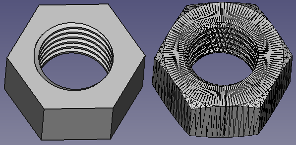  
*Comparación modelo de diseño con modelo stl*

Ya podemos intuir que la tarea de realizar operaciones sobre la pieza stl va a resultar compleja y además comencemos por decir que un stl no es un sólido 3D mallado sobre el que podamos trabajar directamente,

En el banco de trabajo Part disponemos de herramientas que nos permiten convertir el objeto stl a un sólido 3D, veamos como utilizarlas. Para ello vamos a crear un nuevo archivo en FreeCAD en el que cargaremos el modelo stl. Con el stl seleccionado en el árbol de objetos nos dirigimos al menú Pieza y escogemos 'Crear forma de malla' y se nos muestra una ventana en la que podemos pulsar OK para generar la malla con una precisión de 0.1 o seleccionar 'Coser la figura' e introducir la tolerancia que queramos. Debemos tener en cuenta que esta operación puede tardar bastante tiempo dependiendo de la pieza y el ordenador utilizados. El concepto 'Coser' es algo similar a reparar errores del tipo dos vértices próximos no están unidos y la herramienta 'Coser' los une, reparando el error.

En la animación siguiente vemos como crear la forma de malla a partir del stl de la tuerca M20.

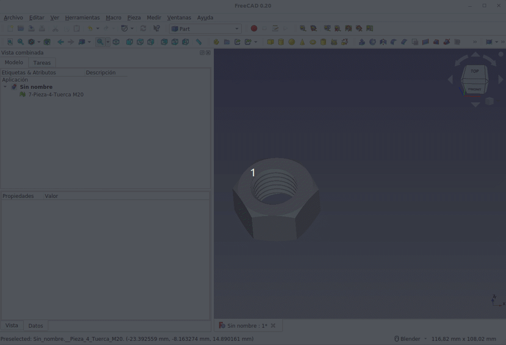  
*Creación de la malla del modelo stl*

En este caso hemos tenido éxito y podemos continuar trabajando, pero si no fuese así tendriamos que recurrir a la tarea, bastante tediosa y larga, de intentar reparar la malla, ya sea con las herramientas que nos ofrece FreeCAD en su banco de trabajo [Mesh Design](https://wiki.freecad.org/Mesh_Workbench) o utilizando cualquier otra herramienta de trabajo con mallas.

El siguiente paso, aunque no es obligatorio hacerlo pero si conveniente, es comprobar que la malla generada no tiene errores escogiendo la opción 'Verificar geometria' del menú Part. En el caso que nos ocupa dicha herramienta no indica ningún error.

Ya podemos convertir la malla en sólido para poder trabajar con el mismo en FreeCAD. Vemos el proceso en la animación siguiente.

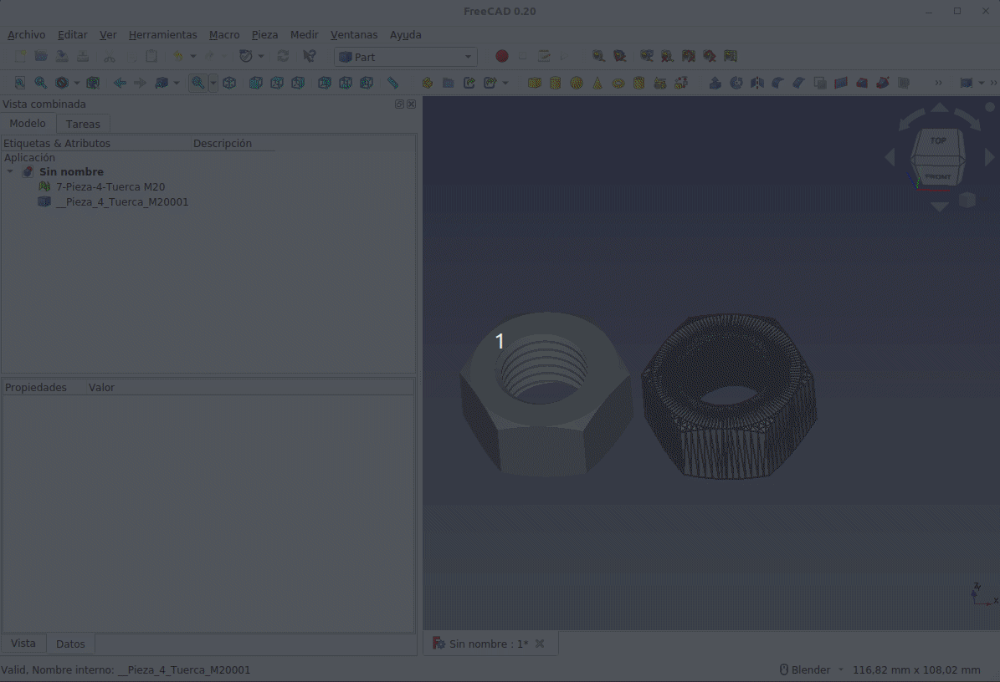  
*Creación del sólido a partir de la malla*

Observamos como el sólido obtenido, como es lógico, es una figura facetada, pero sobre esta si podemos intentar realizar operaciones y ver que ocurre.

Como hemos indicado, si la pieza no es muy compleja y la operación es sencilla es muy posible que tengamos éxito, pero si no lo obtenemos y la modificación es muy compleja con las herramientas de que disponemos, podemos recurrir a rediseñar la pieza desde cero, pero para ello vamos a necesitar tomar medidas en un modelo .STEP o algún otro no facetado. A partir del sólido obtenido ya podemos obtener el archivo .STEP exportando el mismo si es necesario porque no disponemos de ese tipo de archivo.

El formato STEP (.stp o .step) es el formato de modelo sólido universal en el mundo CAD (*Computer-Aided Design* o diseño asistido por computadora) y CAM (*Computer-Aided Manufacturing* o fabricación asistida por computadora). Idealmente podemos obtener el formato STEP partiendo de un modelo sólido descargado o creado por nosotros de forma que podemos evitar completamente el formato stl, pero si solamente disponemos de este formato, ya sea porque hemos descargado el modelo o porque procede de un escaneo 3D, no vamos a tener una forma razonable de comenzar con un modelo sólido.

Por otro lado digamos que hay dos tipos de archivos stl, los de baja complejidad que se pueden convertir facilmente y los extremadamente complejos, llenos de orificios y/o agujeros y con muchas intersecciones que pueden llegar a bloquear el programa de conversión. Pero, aunque estemos con un archivo del segundo tipo, diremos que siempre vale la pena intentarlo.

Vamos a ver a continuación las herramientas que tenemos disponibles en FreeCAD (será nuestro software de conversión) para poder tomar medidas, pero antes vamos a ver brevemente unos breves conceptos de malla y como usarlos.

Retomamos el ejemplo de la tuerca con el archivo stl ya importado y vamos a eliminar las dos operaciones realizadas. Vamos a seleccionar el banco de trabajo 'Mesh Design' y nos aparecerá en la barra de menús un entrada denominada 'Malla'. Con el objeto stl seleccionado nos dirigimos a la opción 'Analizar' y dentro de esta escogemos 'Evaluar y reparar la malla' de forma que tendremos la situación que vemos en la figura siguiente.

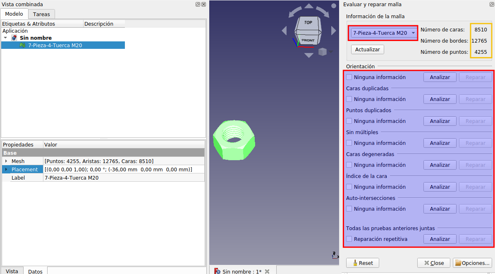  
*Evaluar y reparar la malla*

El recuadro en amarillo nos informa de la composición de la malla que corresponde a la pieza seleccionada y abajo en la figura tenemos las opciones que nos ofrece la herramienta. Una por una, vamos haciendo clic en cada botón Analizar y si el análisis encuentra algún problema clic en Reparar. En la animación siguiente vemos el funcionamiento de estas herramientas.

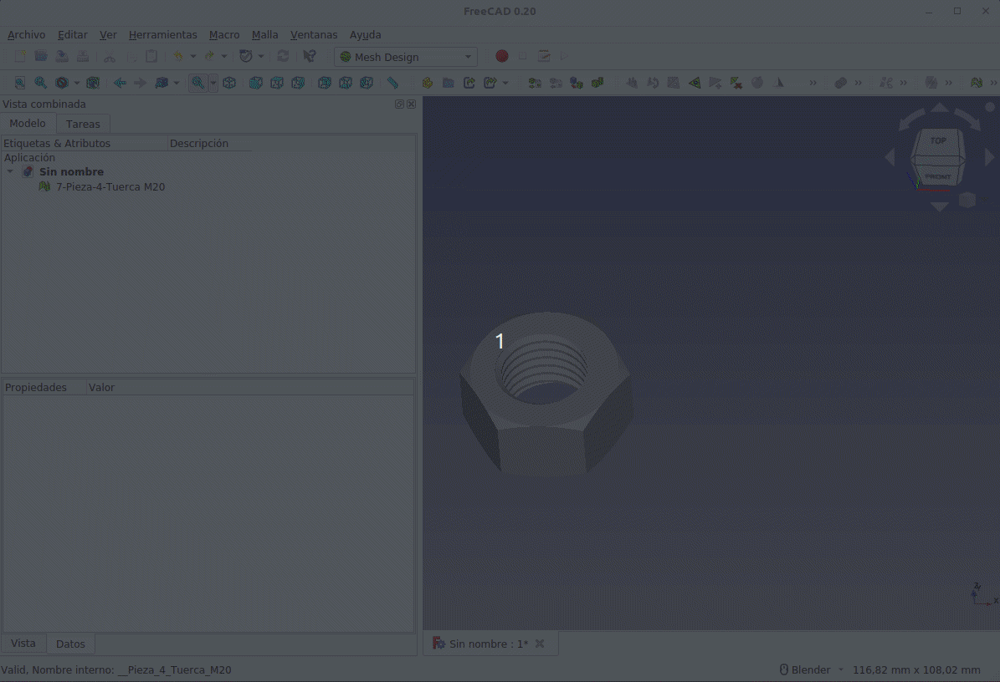  
*Uso de Evaluar y reparar la malla*

Al final de la animación vemos como al cambiar las opciones y realizar un análisis repetitivo si aparecen errores y se ponen activos algunos de los botones Reparar. Acción que no analizaremos y que se ha puesto solo para ver las opciones disponibles. 

Aunque no tengamos éxito con la herramienta aplicaremos a la pieza los pasos anteriores para intentar obtener el sólido que poder exportar a forma STEP.

Ya sea ejecutando estos últimos pasos o solamente los primeros el sólido obtenido se puede exportar como .step desde el menú Archivo.

Vamos a continuación a partir de un archivo en formato STEP para ver las distintas formas de tomar medidas a la pieza y poder crear un nuevo diseño de la misma.

## **Herramientas de medición en FreeCAD**
Veremos en primer lugar las que están integradas por defecto y finalmente describiremos el banco de trabajo añadido Manipulator.

### La regla
Esta herramienta de medida está en todos los bancos de trabajo dado que está en la barra de herramientas 'Vista' justo al final de la misma. Vamos a intentar tomar dos medidas conocidas del exterior de la tuerca M20, la distancia entre caras planas (30mm) y la distancia entre vértices opuestos (34,6mm) y lo haremos sobre una vista en planta. Finalmente tomaremos también la medida de altura (16mm) de la misma sobre una vista de alzado o perfil. En la animación siguiente vemos el proceso.

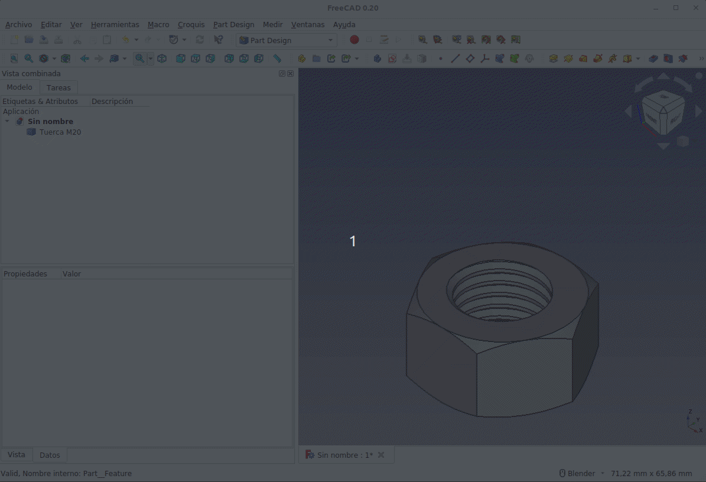  
*Tomando medidas con la regla*

La herramienta presenta como principales los siguientes inconvenientes:

* Es muy dificil hacer clic en el punto exacto porque la herramienta no tiene referencias a objetos de ningún tipo. Esto hace que las medidas sean solamente aproximadas.
* También tiene el inconveniente de que cada vez que terminas una medida la herramienta deja de estar con el cursor.
* Solamente sirve para medir de forma aproximada longitudes.
* Cada medida es un elemento mas en el árbol de objetos.
* La organización de los textos y líneas asociados son muy anacrónicos y no se pueden cambiar
* Las medidas (distancias) no son editables, aunque en el árbol podemos cambiarlas porque se trata de un nombre de objeto (Label) pero en realidad la propiedad 'Distance' no se verá afectada, tal y como se aprecia en la imagen siguiente.

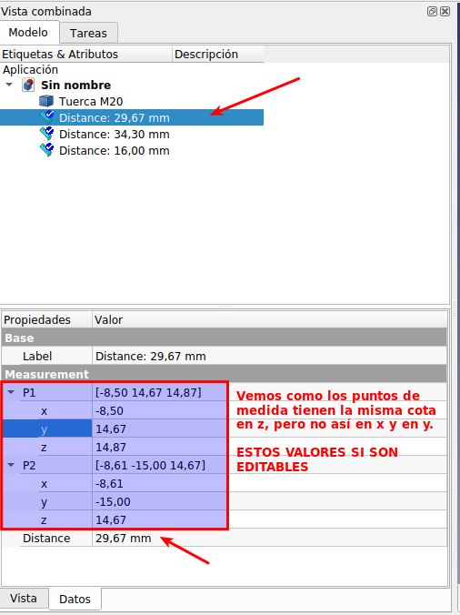  
*La propiedad Distance no es editable*

Podemos concluir diciendo que la regla es una herramienta que nos sirve para tomar una medida rápida aproximada de algo, pero desde luego no sirve como herramienta para medir de manera fiable. Es una mala herramienta y de muy poca precisión.

Aunque los puntos si son editables y podemos arreglar el valor real de la propiedad es un método que evidentemente no es útil. En la figura siguiente vemos los valores de los puntos modificados y como la propiedad Distance ahora si es la apropiada.

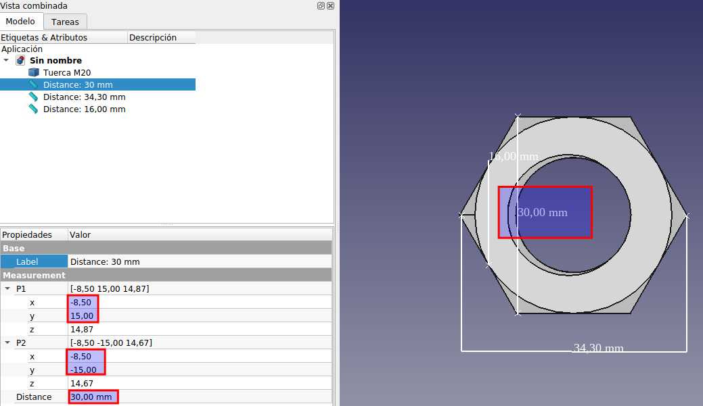  
*Edición de los puntos inicial y final de la medida*

### Herramientas Medir de Part
En el banco de trabajo Part tenemos una barra denominada 'Medir' que nos ofrece las herramientas para tomar medidas de forma precisa. En la tabla siguiente vemos sus iconos, nombre y descripción breve de las mismas y a continuación desarrollamos cada una de ellas.

|Icono|Nombre|Descripción|
|:-:|---|---|
||Medida lineal|Crea una medida lineal|
||Medida angular|Crea una medida angular|
||Actualizar medida|Actualiza todas las medidas|
||Borrar todo|Borra todas las medidas|
||Alternar todo|Muestra u oculta todas las medidas|
||Alternar 3D|Muestra u oculta las medidas 3D|
||Alternar Delta|Muestra u oculta las medidas delta|

En realidad las herramientas de medida son las dos primeras, el resto son para la gestión de las medidas realizadas.

<b>- Medida lineal</b>

Este comando mide la distancia entre dos elementos topológicos seleccionados (vértice, borde, cara) y muestra las medidas en la vista 3D. Se muestran tanto la distancia más corta entre los dos elementos como las medidas delta (distancias paralelas a los ejes X, Y, Z globales).

Tenemos varias formas de invocar al comando, bien haciendo clic en el icono o bien seleccionan la entrada correspondiente del menú y es posible ejecutarlo haciendo primero una selección previa de elementos (vértices, aristas o caras) o bien activando la herramienta para que nos muestre una ventana en la que podemos realizar la selección. ***Todas las medidas son descartadas al cerrar el documento***.

En la animación siguiente vemos como utilizar la herramienta y el uso del resto de herramientas.

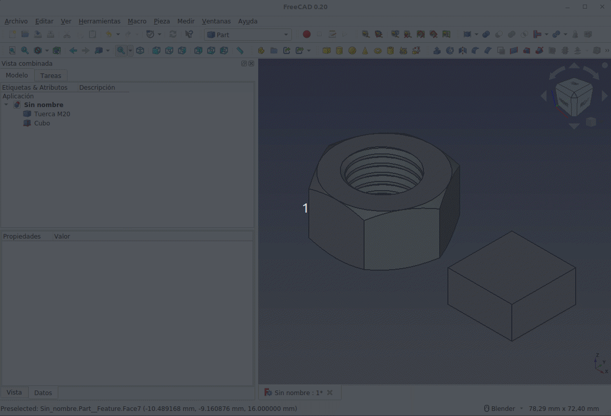  
*Uso de medida lineal*

<b>- Medida angular</b>

Este comando mide el ángulo entre dos bordes rectos, dos caras planas o un borde recto y una cara plana y muestra la medida en la vista 3D.

La forma de invocar al comando es totalmente similar al anterior. ***Todas las medidas son descartadas al cerrar el documento***.

En la animación siguiente vemos como utilizar la herramienta y el uso del resto de herramientas.

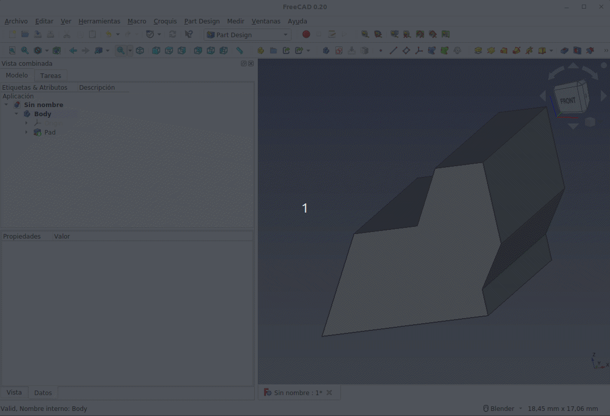  
*Uso de medida angular*

Esta si es una herramienta de medida de precisión pero con la limitación de que no permite medir diámetros o radios, salvo que tengamos puntos definidos que lo permitan.

### Herramientas Medir de Draft
Una de las cosas que tenemos que saber manejar para el uso correcto de 'Draft' es la rejilla y para ello tenemos una barra de herramientas denominada 'Draf Tray', como la de la figura siguiente, que nos permite configurarla a nuestras necesidades.

  
*Barra de herramientas Draft Tray*

Con Draft Tray podemos seleccionar el plano de trabajo, definir la configuración de estilo, conmutar el modo de construcción e indicar la capa o grupo activo. En la tabla describimos brevemente esto.

|Herramientas|Nombre|Descripción|
|:-:|---|---|
||Plano|Selección del plano de trabajo|
||Estilo|Establecer el estilo por defecto para nuevos objetos|
||Conmutar modo construcción|Establece el modo construcción o auxiliar como activo o no activo|
||Autogrupo|CAmbia la capa de dibujo 2D activa|

En la animación siguiente vemos el uso básico del botón 'Plano'. En la misma vemos como activar y desactivar la rejilla que marca el plano de trabajo, como cambiar las opciones de la cuadricula así como establecer el plano en el que se sitúa la rejilla o plano de referencia.

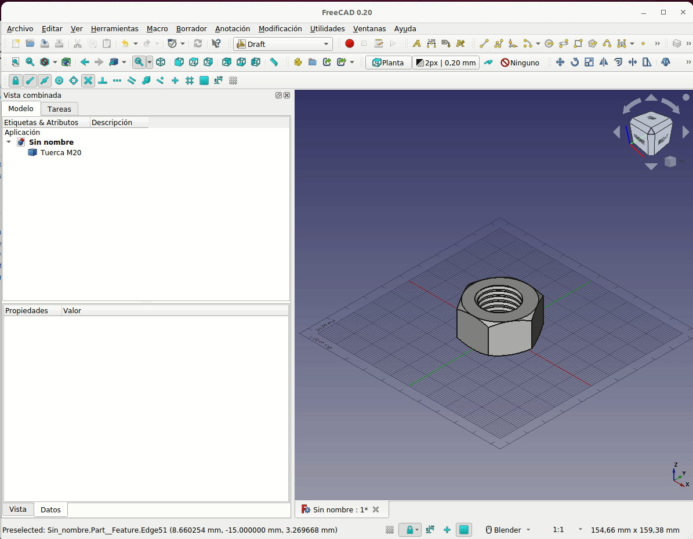  
*Uso de Plano de Draft Tray*

El botón 'Estilo' nos abre la ventana que vemos en la figura siguiente, donde aparecen texto explicativos de cada elemento.

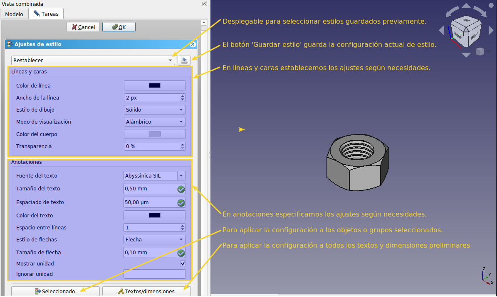  
*Uso de Estilo de Draft Tray*

En la siguiente animación vemos algunas opciones de manejo de la herramienta.

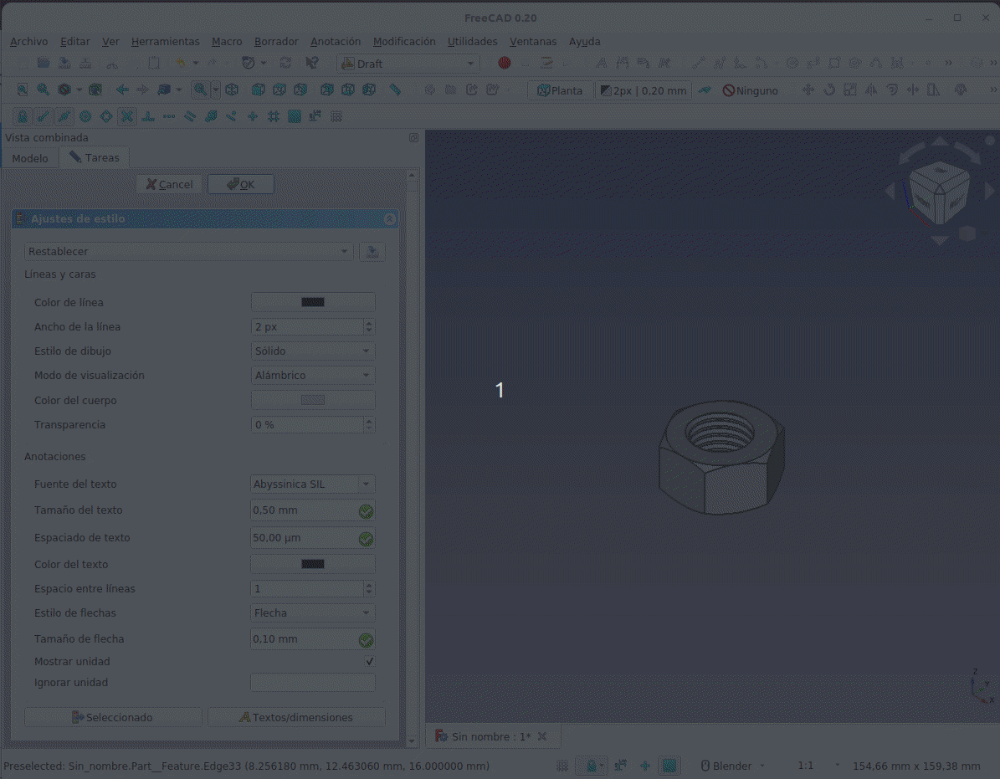  
*Uso de Estilo de Draft Tray*

En el banco de trabajo Draft también disponemos de una barra de herramientas y una entrada de menú denominados 'Anotación' y dentro de esta una herramienta 'Cota' que nos va a permitir crear acotaciones para una dimensión lineal, radial o angular.

Esta herramienta unida a la barra de herramientas de ajustes que vemos en la figura siguiente nos van a permitir crear acotaciones de precisión.

  
*Barra de herramientas de ajustes*

Vamos a describir esta barra antes de continuar con la herramienta 'Cota'. Podemos decir que los diferentes iconos cuando se activan y desactivan permiten que nuestro cursor tome como referencia del objeto al que se acerca alguna de las opciones marcadas, o no lo tenga en cuenta si no está activada. En la siguiente tabla tenenmos el nombre y significado de cada icono.

|Icono|Nombre|Descripción|
|:-:|---|---|
||Bloquear/desbloquear|Habilita o deshabilita todos los ajustes|
||Punto final|Ajuste a los puntos finales de los bordes|
||Punto medio|Ajuste al punto medio de los bordes|
||Centro|Ajuste al centro de arcos y círculos|
||Ángulo|Ajuste a los cuadrantes en múltiplos de 30º y 45º|
||Intersección|Ajuste a la intersección de dos bordes|
||Perpendicular|Ajuste a puntos perpendiculares a caras o bordes|
||Extensión|Ajuste a línea imaginaria que se extiende más allá de los extremos de los bordes rectos|
||Paralelo|Ajuste a una línea imaginaria paralela a los bordes rectos|
||Especial|Ajuste a puntos especiales definidos por el objeto|
||Cerca|Ajuste a un punto cercano a caras o bordes|
||Ortogonal|Ajuste a líneas imaginarias que cruzan el punto en múltiplos de 45º|
||Rejilla|Ajuste a las intersecciones de la cuadrícula o rejilla|
||Plano de trabajo|Proyecta puntos de ajuste en el plano de trabajo actual|
||Dimensiones|Muestra las dimensiones X e Y temporales|
||Rejilla de referencia|Activa o desactiva la cuadricula de referencia|

Las dimensiones lineales basadas en bordes y las dimensiones radiales son paramétricas. Esto significa que se actualizarán si se modifica el borde medido. Los bordes medidos pueden pertenecer a objetos planos pero también a cuerpos sólidos. Las dimensiones angulares no son paramétricas. Veamos como usar los tres tipos de acotaciones.

**NO DEBEMOS NUNCA CONFUNDIR ESTAS HERRAMIENTAS DE REFERENCIA CON LAS HERRAMIENTAS DE RESTRICCIONES**

* **Cota lineal**. El uso de la herramienta de cota lineal es sencillo, se selecciona la herramienta, se designa el primer punto del elemento a dimensionar sobre la vista 3D, se selecciona un segundo punto del mismo elemento y se designa un tercer punto que será la posición de la cota. Para el uso de la misma y que el resultado sea el correcto es fundamental que el plano de trabajo esté en la orientación correcta y hacer uso de las herramientas de ajuste para tener precisión en la designación de puntos. En la animación siguiente vemos brevemente el funcionamiento de la herramienta.

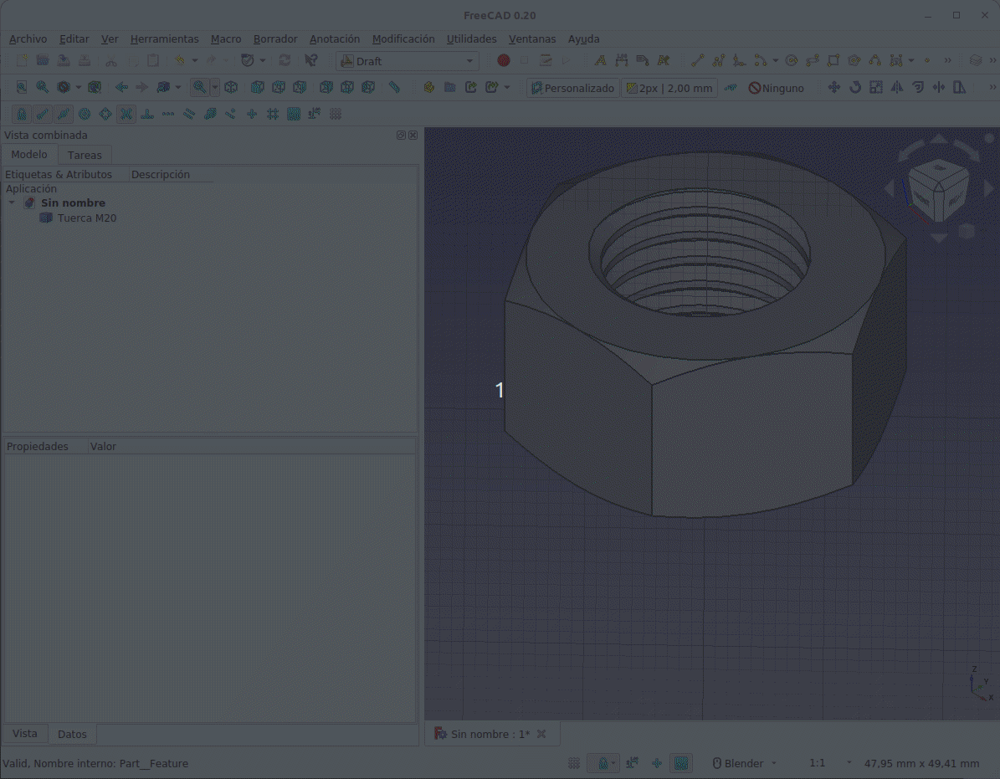  
*Uso de Cota lineal*

En la siguiente vemos un poco el problema que plantea no tener correctamente seleccionado el plano de trabajo para que se sitúen correctamente las dimensiones.

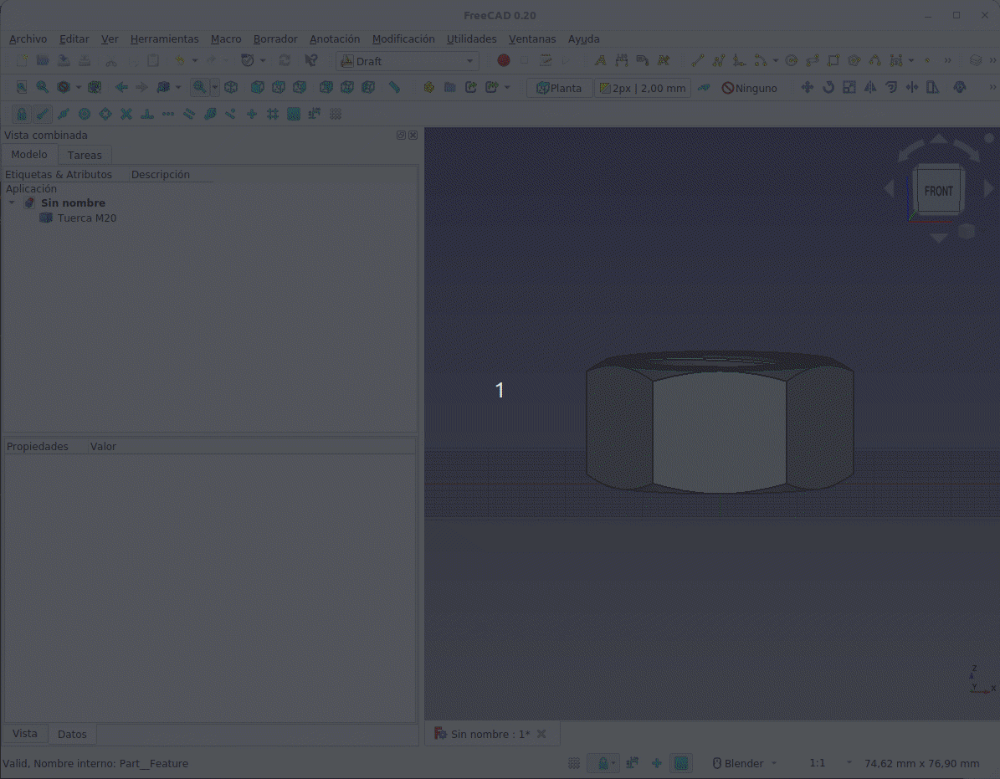  
*Uso de Cota lineal*

* **Cota angular**. Para ver como se usa esta herramienta vamos a basarnos en una sencilla pieza que diseñamos nostros mismos con el fin de conocer las dimensiones de la misma y así poder corroborar que coinciden con las que medimos en el archivo STEP. Partimos de un boceto como el de la figura siguiente, dibujado sobre el plano XZ y que extruimos 50mm.

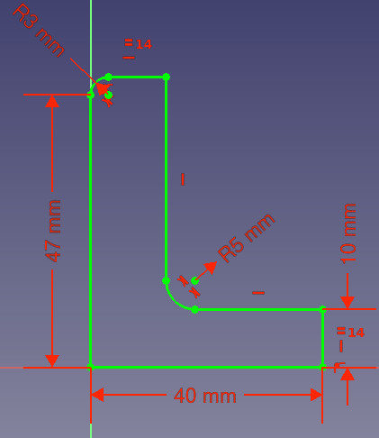  
*Boceto de partida para trabajar el acotado angular*

Ahora dibujamos el boceto de la imagen siguiente sobre el plano de la cara superior de la parte mas corta de la L.

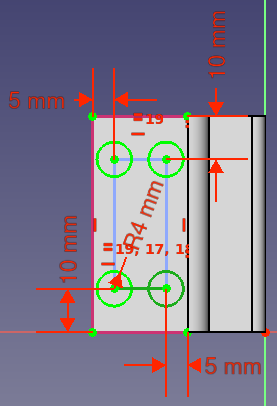  
*Boceto de agujeros en parte corta de la L*

Salimos del boceto y creamos un vaciado que atraviese la pieza.

Sobre la cara interna vertical de la L vamos a crear un orificio centrado en la parte plana de la misma según el boceto de la figura siguiente.

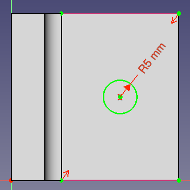  
*Boceto de agujero centrado en parte vertical de la L*

Salimos y realizamos un agujero pasante en la cara.

Sobre la misma cara que antes vamos a crear boceto para realizar los agujeros que vemos en la figura siguiente.

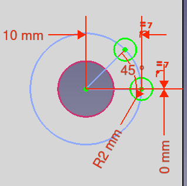  
*Boceto de matriz de agujeros en parte vertical de la L*

Realizamos un vaciado con una cota de 5mm para ambos agujeros. Nuestra pieza final [pieza_acotar_angular.FCStd](../img/designs/8/pieza_acotar_angular.FCStd) la vemos en la figura siguiente y el archivo exportado en formato STEP lo tenemos en [pieza_acotar_angular.FCStd](../img/designs/8/pieza_acotar_angular.step) para descargar y utilizar para practicas acotados.

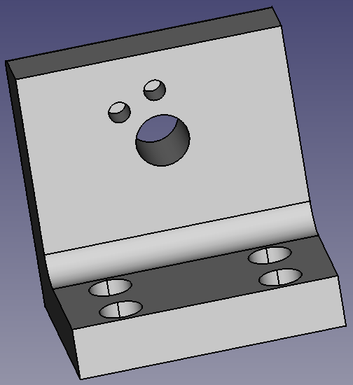  
*Pieza final para acotaciones*

Cerramos el diseño y en un nuevo archivo cargamos el fichero .step creado para continuar con la acotación angular. En la animación siguiente vemos como acotar los radios o diámetros de todos los elementos de la pieza.

  
*Acotación de orificios y redondeos*

Realmente nos queda una cota angular que tomar y es el ángulo al que se han colocado los agujeros no pasanten. No hay una herramienta para hacerlo directamente así que tendremos que proceder a crear un boceto y líneas auxiliares para hacerlo, tal y como podemos apreciar en la animación siguiente.

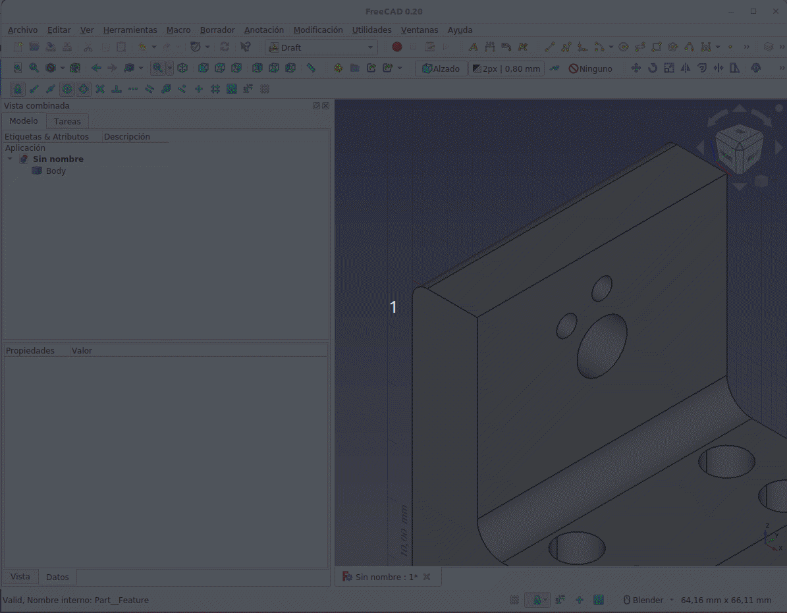  
*Acotación de ángulo entre orificios*

### Herramientas Medir de Arch
En este banco de trabajo disponemos de las mismas herramientas que en Draft y se utilizan de la misma forma, pero además tenemos la herramienta 'Encuesta' (Arch Survey) que permite obtener medidas e información de un modelo y transferir esa información a otras aplicaciones. Es evidentemente una herramienta enfocada a arquitectura. Una vez seleccionada la herramienta, al hacer clic en diferentes subelementos de objetos 3D se recopila la siguiente información:

- Al hacer clic en un borde se obtiene su longitud
- Al hacer clic en un vértice se obtiene su altura (coordenada en el eje Z)
- Al hacer clic en una cara se obtienes su área o superficie
- Al hacer doble clic en cualquier parte del objeto 3D se selecciona todo el objeto y se obtendrá su volumen

Cuando se recopila tal información, suceden varias cosas:

- Se coloca una etiqueta en la parte superior del elemento en el que hizo clic, que muestra el valor (con "a" para el área, "l" para la longitud, "z" para la altura o "v" para el volumen)
- El valor numérico se copia en el portapapeles, por lo que se puede pegar directamente en otra aplicación
- Se imprime una línea en la ventana de salida de FreeCAD. Después de salir del modo 'Encuesta', esas líneas se pueden copiar y pegar en otra aplicación (los valores están separados por comas, lo que facilita la conversión a datos de hoja de cálculo)
- La longitud total o el área de los elementos en los que hizo clic también se imprime en la ventana de salida
- Cada longitud o área también se registra en el cuadro de diálogo de tareas

El uso de la herramienta consiste en presione el botón Arch Survey, hacer clic en vértices, aristas, caras o doble clic para seleccionar objetos completos.

Al presione Esc o el botón Close para salir del modo Encuesta se eliminan todas las etiquetas. Para no perderlos se puede exportar el contenido del cuadro de diálogo Tarea presionando el botón "Exportar CSV". El archivo CSV resultante se puede abrir con una hoja de cálculo o con un editor o procesador de texto.

Es posible agregar una etiqueta personalizada a cualquier línea agregando un texto en el campo de descripción y luego presionando el botón establecer descripción.

En la animación siguiente vemos el funcionamiento de la herramienta.

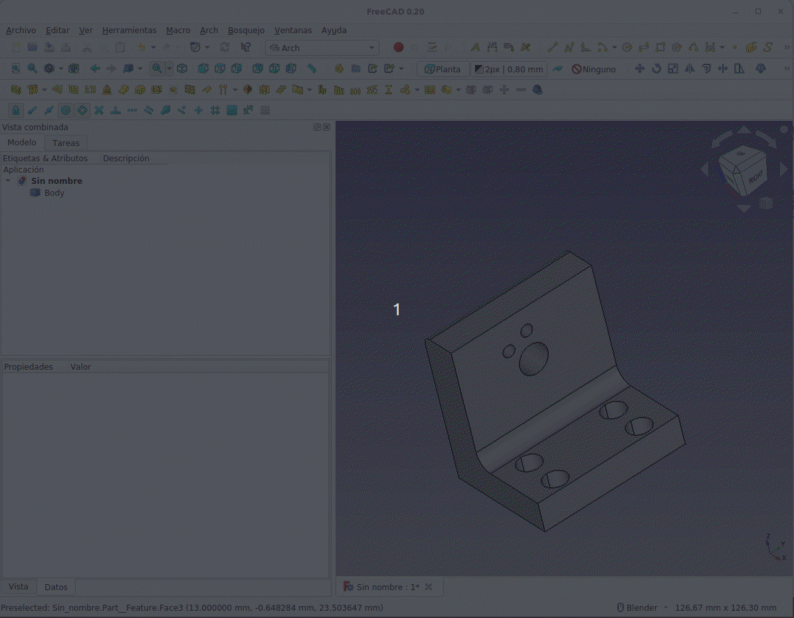  
*Funcionamiento de Encuesta de Arch*

El archivo exportado y abierto en un editor de texto lo vemos en la figura siguiente.

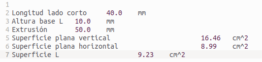  
*Archivo CSV abierto con editor de texto*

## **Manipulator Workbench**
Se trata de un banco de trabajo externo que aún no está integrado que está descrito en https://wiki.freecad.org/Manipulator_Workbench que además de aportarnos las formas de medir vistas sirve de ayuda para alinear, mover y rotar objetos en formato STEP.

Podemos localizarlo en el 'Gestor de complementos' tal y como vemos en la figura siguiente, desde donde podemos instalarlo si aún no lo hemos hecho antes.

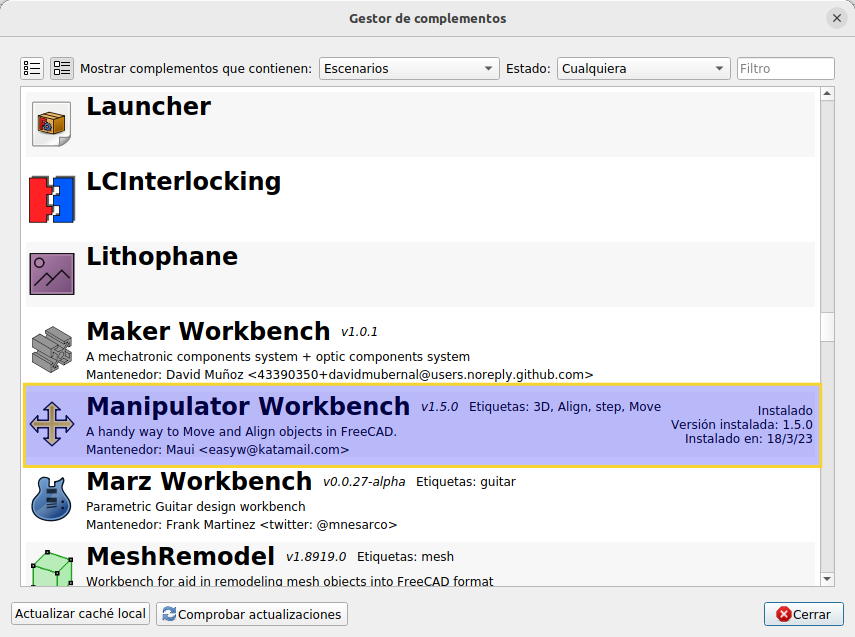  
*Manipulator en el Gestor de completos*

Las herramientas disponibles, que a su vez agrupan a un conjunto de ellas sobre la temática, son las siguientes:

|Icono|Nombre|Descripción|
|:-:|---|---|
||Alinear|Conjunto para mover y alinear piezas 3D o un objeto con el origen|
||Mover|Conjunto para mover y rotar piezas 3D en diferentes ejes|
||Calibre|Conjunto para medir piezas 3D|

Las herramientas de cada grupo pueden estar flotantes o ancladas a la izquierda o a la derecha de la ventana de FreeCAD. Cada herramienta desplegada dispone de un botón de ayuda sobre la misma y un botón para cerrar la ventana flotante.

Las referencias que aparecen en la wiki indicada son:

* Autor en github: [@easyw](https://github.com/easyw)
* Foros de FreeCAD: [easyw-fc](https://forum.freecadweb.org/memberlist.php?mode=viewprofile&u=6387)
* Código fuente en github: https://github.com/easyw/Manipulator
* Anuncios/discusión del foro: https://forum.freecadweb.org/viewtopic.php?t=24742

### Herramientas alinear
Pulsamos Ctrl+Clic para agregar selección de caras, planos, aristas y ejes y al final hacemos clic en el botón 'Alinear'. La primera Selección es la Referencia para alinear.

La opción jerarquía establece el orden para alinear los objetos dentro de una sola jerarquía entre Part y Body.

Si no es posible alinear las partes en un solo paso, podemos intentar alinear los bordes antes y luego las caras.

Las referencias se pueden establecer mediante un cuadro delimitador, el centro de masas y puede normal al plano o invertida.

Se puede alinear a centros, planos o ambos a un tiempo y se pueden elegir los ejes con los que alinear.

El botón 'Mover' permite mover un solo objeto.

E botón 'Centro' permite mover la selección al origen.

El botón 'XRay' permite seleccionar a través de la pieza.

En la figura siguiente tenemos la ventana de las herramientas alinear con las descripciones previas marcadas.

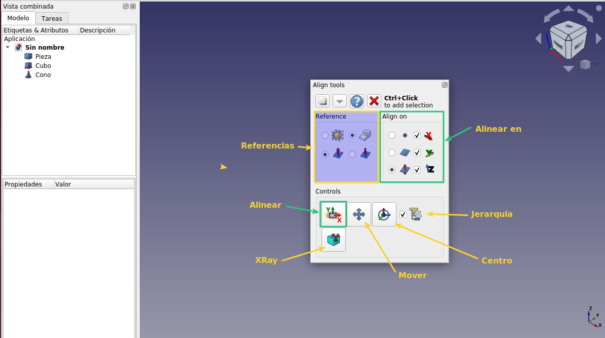  
*Herramientas Alinear*

En la animación vemos el uso de algunas de las opciones

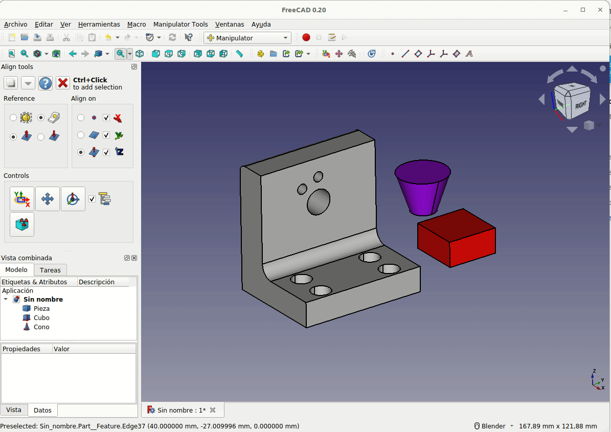  
*Uso de la herramientas Alinear*

### Herramientas mover
Con esta herramienta podemos mover y rotar elementos 3D fijando como eje de referencia los ejes X, Y o Z o cualquier arista o borde de una pieza. Para iniciar la manipulación hacemos clic en el botón 'Mover', seleccionamos la cara, borde o eje como Eje de referencia con el que se moverá/rotará y cambiamos la posición o grados de giro en los cuadros de datos. La primera selección es la referencia para mover/rotar. También existe un botón que permite alinear la vista 3D con la cara seleccionada.

Vemos las herramientas en funcionamiento en la animación siguiente.

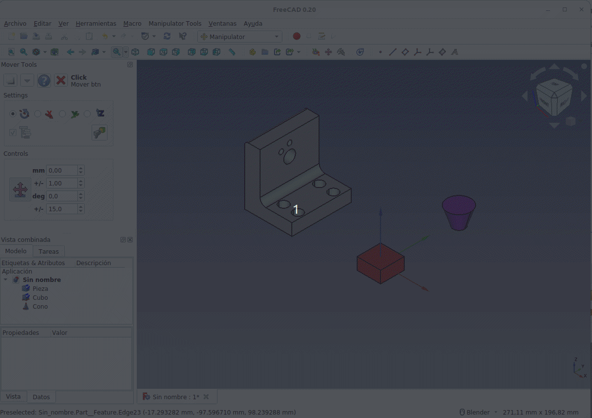  
*Uso de la herramientas Mover*

### Herramientas calibre o medir
En primer lugar hacemos clic en el botón 'Medir' (calibre) para iniciar la medición.
Seleccione el tipo de referencia que necesitamos y hacemos clic en una cara, un borde o un vértice para identificar los puntos de medición.

Podemos seleccionar 'Plano de anotación' para usar un plano para colocar una dimensión.

La herramienta va creando objetos según las selecciones en el árbol en una carpeta que podefecto tiene el nombre Measurements. Vem os el funcionamiento básico en la animación siguiente.

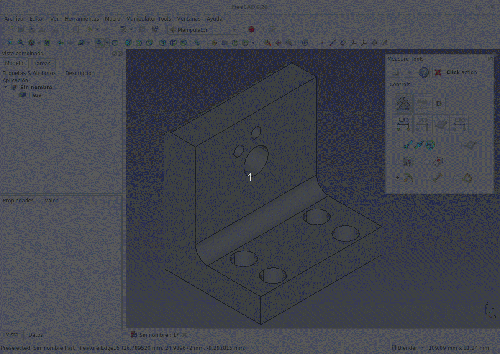  
*Uso de la herramientas Medir (calibre)*

## **Complemento QuickMeasure**
QuickMeasure (medida rápida) es una herramienta de FreeCAD diseñada para medir características rápidamente sin necesidad de agregar dimensiones a la ventana del gráfico.

Lo desarrolla Dan Miel ([@DanMiel](https://github.com/DanMiel)) bajo licencia GPLv3 ([LICENCIA](https://github.com/DanMiel/QuickMeasure/blob/main/LICENSE))

Es muy sencillo de usar y basta con seguir la siguiente guía:

* Seleccionar Quick Measure en el menú desplegable de bancos de trabajo. Se mostrará el único icono que tiene.

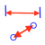

Si hacemos selecciones en la ventana gráfica:

* Al seleccionar un vértice, se mostrará la posición x, y, z (coordenadas) de ese punto en el cuadro de diálogo y el nombre del objeto.
* Al seleccionar una línea mostrará su longitud y las coordenadas del punto medio, y si es curva muestra el radio, el diámetro, el centro del arco y su longitud. En todos los casos muestra el nombre del objeto seleccionado.
* Al seleccionar dos características, se mostrará la distancia entre ellas más, cuando corresponda, la distancia en los ejes x, y y z Las rectas y los cilindros muestran si son paralelos o no.
* Al seleccionar tres o más superficies suma las áreas de las superficies seleccionadas.

Cuando seleccionamos objetos en Vista combinada:

* El área, el volumen y su nombre si se trata de objetos primitivos o que puede medir. En caso contrario mostrará un mensaje indicando que no puede medir esa característica.

A continuación describimos los botones que aparecen en la ventana emergente.

* **Clear**: Borra el contenido de la ventana editora de texto.
* **Copy**: Copia el contenido de la ventana editora en el portapapeles.
* **Close**: Cierra la ventana editora.
* **Origin**: Muestra u oculta el origen de la pieza mediante un símbolo rojo.
* **Mid Line**: Muestra mediante símbolo el punto central de una o varias líneas.
* **Del Mid Lines**: Borra el símbolo de todos los puntos medios creados.

En la animación siguiente vemos el funcionamiento de la herramienta en distintos aspectos y sobre diferentes objetos.

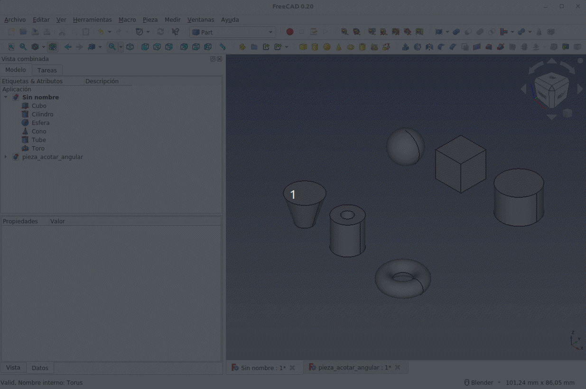  
*Uso de la herramienta Quick Measure*

