# 9.1. Repaso de conceptos básicos sobre curvas en FreeCAD
Veremos algunos conceptos a modo de repaso y nos iremos introduciendo en el diseño de piezas curvas. 

## **9.1.1. Proyección aditiva**
Vamos a ver el uso de la herramienta 'Proyección aditiva' o ' Additive Loft' del banco de trabajo 'Part Design', que es un primer método para crear transiciones complejas rectas o curvas entre bocetos. Para empezar hagamos un objeto que podemos considerar ornamental y que se pueda imprimir en 3D.

En el banco de trabajo 'Part Design' creamos un primer boceto apoyado en el plano XY como el de la Figura 9.1.1. Dibujamos un rectángulo que restringimos como se indica.

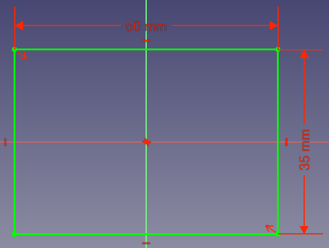  
*Figura 9.1.1. Boceto inicial*

En el mismo cuerpo vamos a crear una serie de bocetos con los datos y características que vemos en la animación de la Figura 9.1.2. Todos los planos van apoyados en el plano XY y desplazados y/o girados mediante su propiedad 'Attachment'.

  
*Figura 9.1.2. Creación del resto de bocetos*

Ahora activamos la herramienta 'Proyección aditiva', seleccionamos el primer boceto con un doble clic o alternativamente antes de activar la herramienta ya tenemos seleccionado el boceto. Posteriormente vamos añadiendo secciones pulsando el botón y seleccionando el boceto que corresponde hasta llegar al último, tal y como vemos en la animación de la Figura 9.1.3. Cada vez que se añade una sección se observa como se crea la proyección de forma aditiva. He girado el último boceto hasta un ángulo de solamente 60º para obtener un resultado mas espectacular.

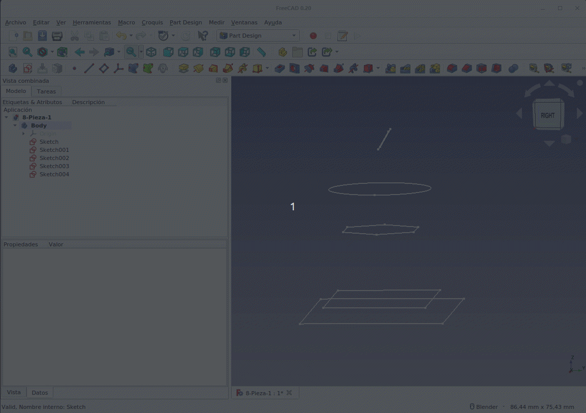  
*Figura 9.1.3. Creación de la proyección aditiva*

El resultado es una forma bastante curiosa aunque no tenga ningún sentido concreto.

En la ventana de parámetros de proyección hay dos casillas de verificación, las que vemos en la Figura 9.1.4 y que sirven para:

* **'Superficie reglada'**. Dependiendo de si se selecciona o no el objeto alterna entre tener geometrías de líneas recta/lana o curvas. Si no se selecciona las transiciones son suaves. En este ejemplo concreto no vamos a apreciar nada especial con esta.
* **'Cerrado'**. Hace una transición desde la última sección transversal a la primera, creando un bucle.

Los objetos creados de esta forma son como cualquier otro objeto de FreeCAD en el sentido de que se pueden usar otras herramientas en los objetos creados de esta forma, como seleccionar bordes, caras o aristas. Sin embargo, cuando las superficies generadas son complejas y curvas, es posible que algunas herramientas no funcionen correctamente y necesitemos un enfoque diferente.

En el enlace a [9-Pieza_1.FCStd](../img/designs/9/9-Pieza-1.FCStd) está el archivo fuente del objeto anterior.

Una cosa que se intenta a menudo es usar la herramienta 'Espesor' a estos objetos para obtener el objeto ahuecado. Lamentablemente, la herramienta 'Espesor' solo funcionan con geometrías simples, por lo que no es posible trabajar de esta manera.

Vamos sin embargo a crear un cuenco esférico utilizando esta técnica para demostrar cómo podemos crear objetos curvos con paredes de grosor definido. En un nuevo proyecto, creamos un cuerpo y un boceto en el plano XY. Dibujamos dos círculos restringidos al origen, con un diámetro de 60 y 57 mm. Esto va a generar una pared con un espesor de 1,5 mm.

Cerramos este boceto y creamos otro con los círculos un poco mas grandes, de 100 y 97 mm, cerramos y creamos una copia del primer boceto que va a ser nuestro tercer boceto. Hacemos clic en el segundo boceto y lo levantamos en el eje Z 50 mm y hacemos lo mismo con el tercero para elevarlo hasta 100 mm. En la Figura 9.1.4 vemos el proceso a partir del primer boceto.

  
*Figura 9.1.4. Creación de los bocetos para crear recipiente*

Siguiendo el mismo proceso que anteriormente llegamos a obtener la forma que vemos en la Figura 9.1.5 con forma curvilínea. Las dos opciones están desmarcadas.

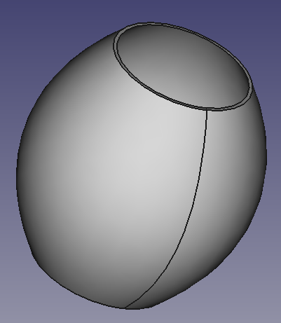  
*Figura 9.1.5. Objeto hueco curvilineo*

En la Figura 9.1.6 vemos la consecuencia de seleccionar la casilla de verificación 'Superficie reglada' en la ventana 'Parámetros de proyección'.

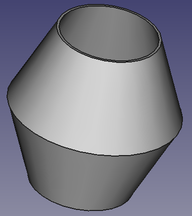  
*Figura 9.1.6. Objeto hueco con superficie reglada*

Si queremos convertir el objeto en un recipiente debemos cerrarlo en uno de sus extremos. En la Figura 9.1.7 vemos el proceso seguido a partir del boceto inicial para crear y extruir una base que fusionamos con el objeto creado anteriormente.

  
*Figura 9.1.7. Recipiente curvilineo*

El barrido a lo largo de una trayectoria es una idea similar a la rotación de un croquis que incluso comparte algunos atributos. Sin embargo, el barrido utiliza una ruta o geometría dibujada por nosotros por la que se barre la extrusión, en lugar de una generada automáticamente. Hay un par de enfoques para crear barridos en FreeCAD: uno que usa el banco de trabajo 'Part' y el otro que usa el banco de trabajo 'Part Design'. Veamos ambos para asi tenerlos en nuestro conjunto de habilidades. En estos momentos es importante, si no conocemos el concepto de B-spilines entrar en el apartado [B-Splines](https://wiki.freecadweb.org/B-Splines#B-splines_in_FreeCAD) de la wiki de FreeCAD para ponernos al día en estos conceptos. En el mismo artículo nos explican el concepto de curva Bèzier ya que una B-spiline (spiline básica) no es mas que la unión de varias curvas de Bézieer. Estudiamos este tipo de líneas en un apartado posterior.

### Barridos en Part Design
Sobre un nuevo proyecto creamos un cuerpo y un boceto en el plano XY que tenga la forma y dimensiones que vemos en la Figura 9.1.8. Indicar que para estas ideas iniciales no es necesario restringir completamente el boceto. Hemos partido de un rectángulo al que hemos redondeado las esquinas utilizando la herramienta 'Redonde0 que conserva las restricciones'.

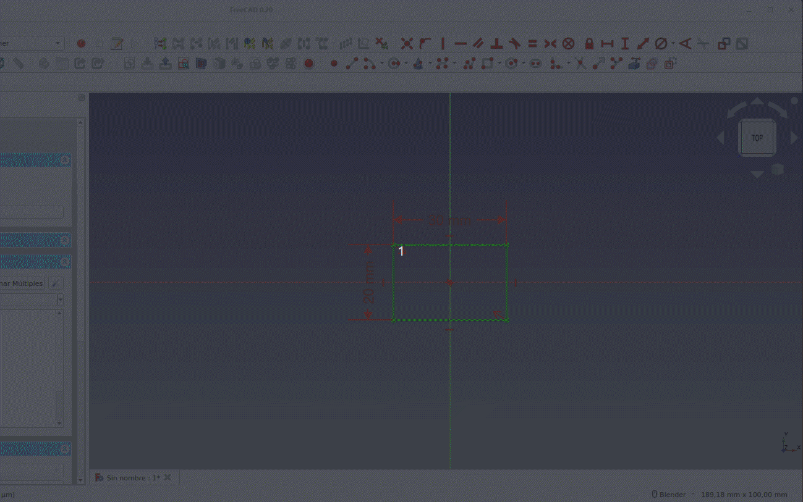  
*Figura 9.1.8. Boceto inicial y redonde que conserva restricciones*

Este boceto va a ser el perfil de nuestro elemento que extruimos arrastrándolo a lo largo de una trayectoria.

Creamos un nuevo boceto en el mismo cuerpo, esta vez en el plano XZ. En este boceto, vamos a crear la ruta a lo largo de la cual se extruirá nuestro perfil. Usamos la herramienta 'Crear B-spline' que es similar a la herramienta polilínea pero creando una combinación de curvas una sola línea. Con la herramienta B-spline seleccionada, hacemos clic con el botón izquierdo sobre el punto de origen y arrastramos una línea hacia arriba y hacia la derecha o izquierda de la vertical, hacemos clic con el botón izquierdo nuevamente y continuamos con la siguiente línea hacia arriba y hacia la línea central . Ahora hacemos clic con el botón izquierdo nuevamente y nos movemos para crear una especie de forma de Z sesgada. Hacemos clic con el botón izquierdo para establecer el siguiente punto y luego clic con el botón derecho para finalizar la B-spline. En la Figura 9.1.9 vemos una animación de lo dicho. Observamos durante el proceso que al hacer clic se crean unos puntos rodeados de un círculo azul que al cerrar van a ser los tiradores para modificar la curva.

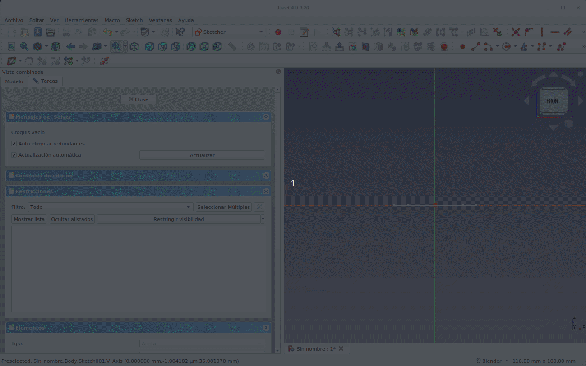  
*Figura 9.1.9. Boceto con B-spiline*

En esta sección nos limitaremos a mover los círculos para ajustar la curva como queramos de forma que nos quede algo similar a lo que vemos en la figura 9.1.10.

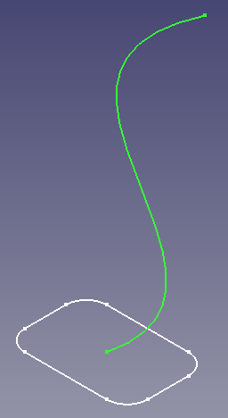  
*Figura 9.1.10. Aspecto de ambos bocetos*

Ya tenemos los elementos para utilizar la herramienta 'Tubo aditivo' (AdditivePipe) de uso muy similar a la de 'Proyección aditiva'. En la animación de la Figura 9.1.11 vemos su uso para este caso.

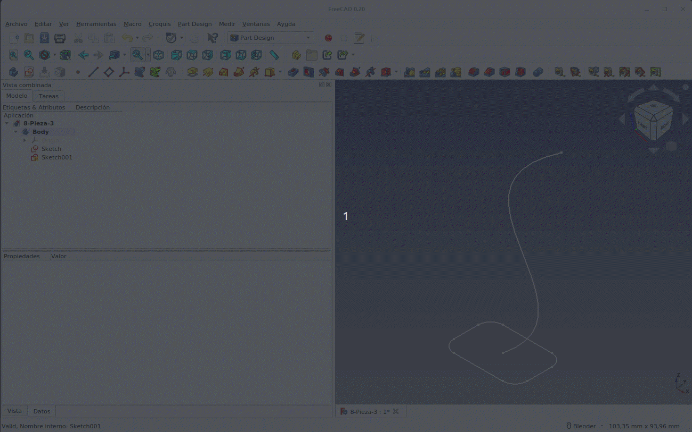  
*Figura 9.1.11. Uso de la herramienta 'Tubo aditivo'*

***

> **- Consejo:**

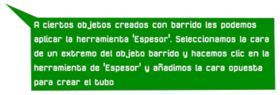

***

En la animación de la Figura 9.1.12 vemos como crear un tubo a partir del objeto sólido creado anteriormente. En la ventana de diálogo, podemos establecer el grosor de la pared.

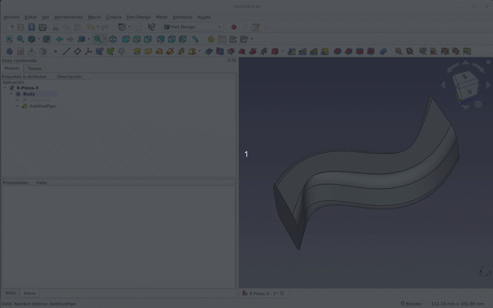  
*Figura 9.1.12. Creación del 'Tubo aditivo'*

En el banco de trabajo 'Part Design' hay unos iconos en azul y rojo que también son herramienta de barrido similares a las vistas, excepto que son para barridos sustractivos. Esto significa que puede dibujar un objeto sólido y luego cortarlo y eliminar material mediante un barrido por trayectoria. En la animación de la Figura 9.1.13 vemos el uso básico de una de estas herramientas. El Barrido sustractivo crea un sólido sustractivo en el Body (cuerpo) activo, realizando un barrido de uno o más bocetos (también llamados secciones) a lo largo de una trayectoria abierta o cerrada. Esta forma es entonces sustraída del sólido existente. El barrido sustractivo se usa a menudo para crear roscas.

Vamos a partir de un cilindro de 6 mm de radio extruido 35 mm, una hélice sustractiva de paso 5 mm, altura 25 mm. En el mismo cuerpo que el cilindro creamos un boceto como el de la Figura 9.1.13.

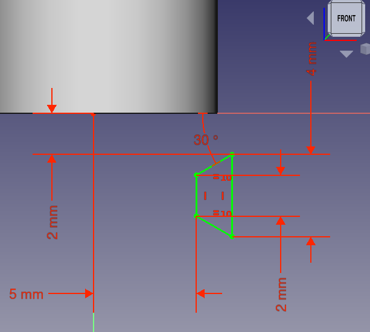  
*Figura 9.1.13. Boceto para barrido sustractivo*

Procedemos a utilizar la herramienta como vemos en la Figura 9.1.14 donde observamos su funcionamiento.

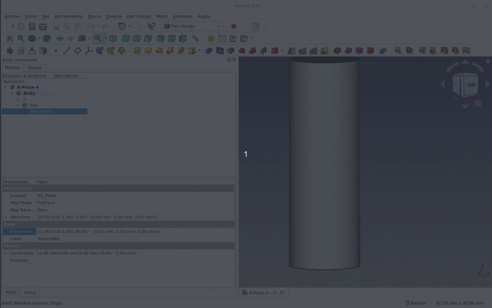  
*Figura 9.1.14. Trabajo con hélice sustractiva*

Dos grupos de herramientas interesantes de estudiar son las de creación de primitivas [aditivas](https://wiki.freecadweb.org/PartDesign_CompPrimitiveAdditive/es) y [sustractivas](https://wiki.freecadweb.org/PartDesign_CompPrimitiveSubtractive/es) que se documentan en los enlaces a la wiki de FreeCAD anteriores. Se trata de herramientas que añaden o sustraen al sólido existente en el mismo cuerpo activo las nombradas como 'Caja o Cubo', 'Cono', 'Cilindro', 'Elipsoide', 'Prisma', 'Esfera', 'Toro' y 'Cuña'.

### Barridos en Part
Finalmente, echemos un vistazo a las utilidades de barrido en el banco de trabajo 'Part'', que se presentan de manera un poco diferente. Aunque también crearemos perfiles y trayectos para que se transformen en piezas pero sin la necesidad de tener un cuerpo o body. En la Figurra 9.1.15 vemos las dos herramientas que vamos a analizar.

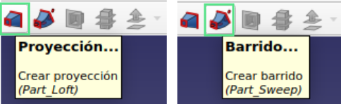  
*Figura 9.1.15. Herramientas de barrido en Part*

- **<u>1. Barrido</u>**

Creamos un nuevo proyecto y nos dirigimos directamente al banco de trabajo 'Sketcher' y creamos un nuevo boceto en el plano XY, dibujamos por ejemplo un círculo que restringimos a 20 mm de diámetro con su centro en el origen y le cambiamos el nombre a "circulo". Cerramos ese boceto y sin tener nada seleccionado en 'Vista combinada' creamos un segundo boceto, nuevamente en el plano XY, y en este boceto, dibujemos un cuadrado, que restringimos como se observa en la Figura 9.1.16 y le cambiamos el nombre a cuadrado.

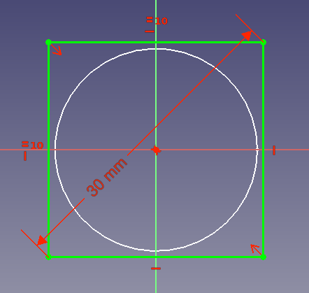  
*Figura 9.1.16. Creación del segundo boceto*

Vamos a mover la posición del boceto para que se desplace verticalmente 100 mm positivos en el eje Z y que gire un ángulo de 30 grados respecto al eje Y en sentido antihorario. En la ventana 'Vista combinada' y con el objeto "cuadrado" marcado entramos en 'Placement' y cambiamos el valor de Z a 100 mm, escogemos el eje de giro como Y y marcamos un ángulo de -30º. En la Figura 9.1.17 vemos el aspecto que debe tener la situación.

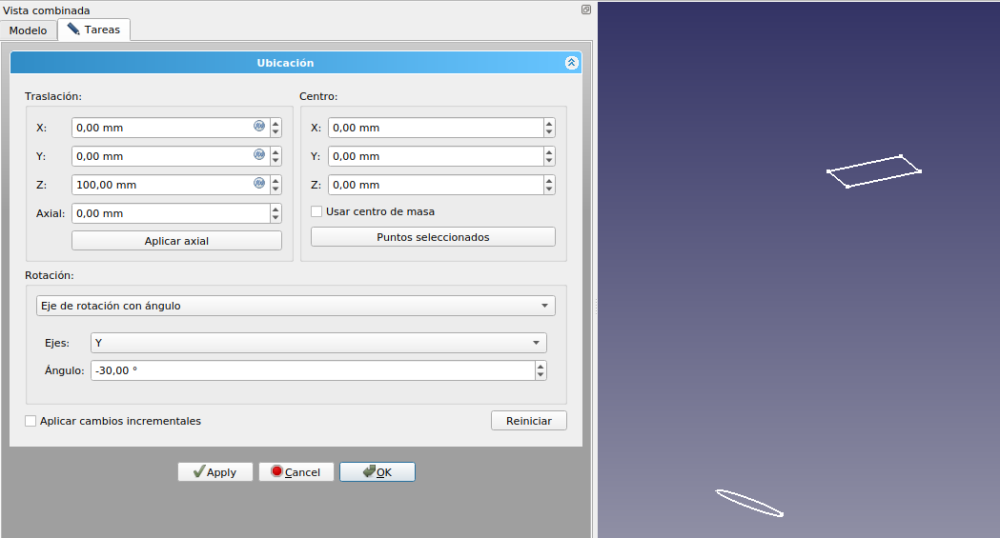  
*Figura 9.1.17. Situación con los dos bocetos creados y editados*

A continuación, asegurándose de que no haya nada seleccionado en el árbol de objetos, creamos un tercer boceto esta vez en el plano XZ. Vamos a crear un B-spiline desde el origen al centro del cuadrado. Debemos vincular el punto final de la B-spiline con el cuadrado utilizando la herramienta 'Geometria externa' tal y como vemos en la animación de la Figura 9.1.18.

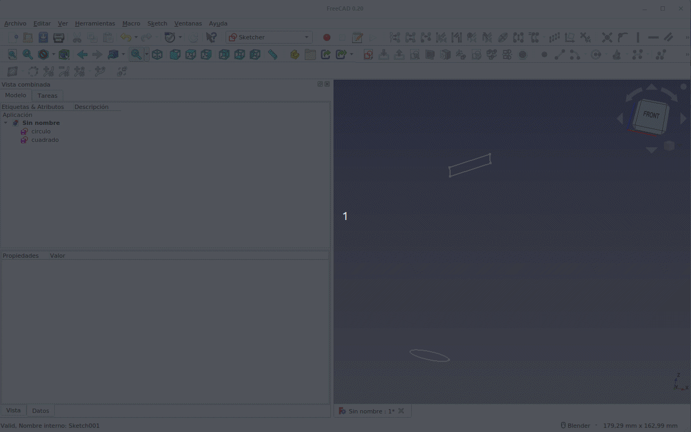  
*Figura 9.1.18. Creación de la B-spiline*

Nos movemos al banco de trabajo 'Part' y seleccionamos la herramienta 'Barrido' para seguir el proceso que observamos en la Figura 9.1.19. La pieza final podemos modificarla a partir de sus datos pero hacer un doble clic sobre la misma no nos abrirá la ventana de opciones de barrido, por lo que si queremos cambiar algo en esta ventana hay que eliminar el barrido y crearlo de nuevo. Una vez creado el barrido hacemos algunas operaciones con la pieza.

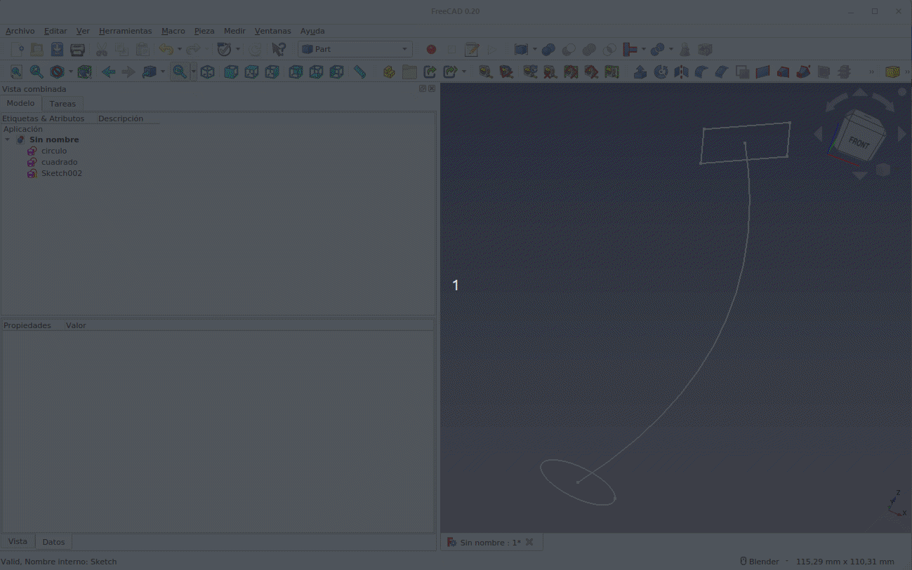  
*Figura 9.1.19. Creación final de la pieza por barrido*

- **<u>2. Proyección o Loft</u>**

Esta herramienta sirve para crear un sólido o vaciado a partir de dos o mas perfiles del mismo tipo. Vamos a crear como ejemplo un embudo (Figura 8.1.20) para ver como se crea una superficie por proyección o Loft. Vamos a crear los elementos utilizando las primitivas del banco de trabajo. Tal y como vemos en la Figura 9.1.20 creamos un círculo de 7 mm de radio apoyado en XY pues no modificamos las opciones de 'Posición'. Creamos un segundo círculo de 12 mm de radio que levantamos 100 mm en el eje Z y finalmente creamos un elipse con radio mayor de 120 mm, radio menor de 100 mm, la elevamos 200 mm en Z y la giramos 25º respecto al eje Y. Creamos la proyección y tenemos el embudo creado.

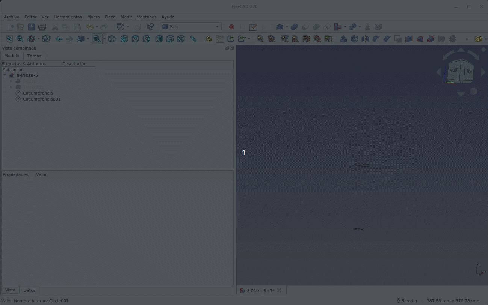  
*Figura 9.1.20. Creación de un embudo por proyección*

Podemos encontrar mas detalles técnicos en el artículo [Part Loft Technical Details](https://wiki.freecadweb.org/Part_Loft_Technical_Details) de la wiki de FreeCAD.

### Enlaces a los archivos de diseño de las piezas de la sección

* [Objeto decorativo: 9-Pieza-1.FCStd](../img/designs/9/9-Pieza-1.FCStd)
* [Recipiente: 9-Pieza-2.FCStd](../img/designs/9/9-Pieza-2.FCStd)
* [Tubo con trayectoria: 9-Pieza-3.FCStd](../img/designs/9/9-Pieza-3.FCStd)
* [Hélice sustractiva: 9-Pieza-4.FCStd](../img/designs/9/9-Pieza-4.FCStd)
* [Barridos en banco de trabajo 'Part': 9-Pieza-5.FCStd](../img/designs/9/9-Pieza-5.FCStd)
