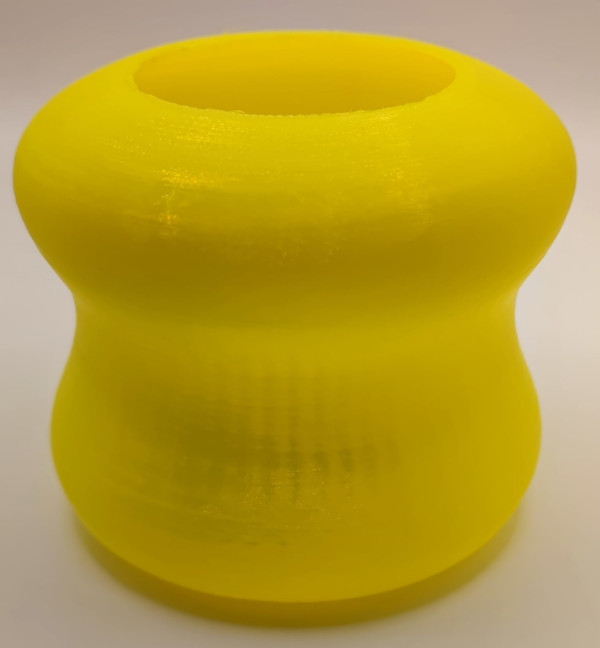

# 9.2. B-Splines
Ya hemos hablado algo de este tipo de curvas, pero ahora vamos a ver en que están fundamentadas y, por supuesto, como trabajar con ellas.

Para centrar el problema vamos a partir de una situación en la que tenemos que diseñar una pieza para imprimir en 3D que tiene un voladizo pero en la que las estructuras externas de soporte no está permitido utilizarlas. En la Figura 9.2.1 se ejemplifica de que situación podemos estar hablando.

  
*Figura 9.2.1. Pieza para impresión 3D con voladizo*

Tenemos que imprimir la pieza tal y como se ve en la perspectiva y al no estar permitidos los soporttes de impresión debemos rediseñar la parte del voladizo para que la impresión sea viable. Es decir debemos de rediseñar para que los soportes no sean necesarios y para ello disponemos de varias opciones que vemos a continuación.

* <b><u>Opción 1</b></u>. Modificar según vemos en la Figura 9.2.2 de forma que sea viable para impresión 3D.

  
*Figura 9.2.2. Opción 1*

El ángulo marcado es el ángulo máximo permitido por la mayoría de impresoras 3D FDM e incluso algunas no serán capaces de respetarlo. Por esto la solución puede resultar no viable dependiendo de la impresora disponible. Además la opción incrementa considerablemente el volumen de la pieza, y por lo tanto su peso y el material necesario.

* <b><u>Opción 2</b></u>. Conectar los puntos anteriores mediante un arco que sea tangente a la línea auxilar utilizada y que vemos en la Figura 9.2.3.

  
*Figura 9.2.3. Opción 2*

El volumen de material es menor que en el caso de la línea recta pero la impresión vuelve a poder no resultar viable.

* <b><u>Opción 3</b></u>. La forma ideal de conectar ambos puntos es que el arco comience de forma tangencial y acabe siendo tangente como en el arco. Una curva con la que se pueden conectar dos puntos tangencialmente a un punto de referencia puede ser muy útil para las construcciones. Las curvas de Bézier proporcionan esta característica. En la Figura 9.2.4 vemos una posible solución del problema.

  
*Figura 9.2.4. Opción 3*

Sin entrar en mas detalles en el enlace podemos consultar mas detalles de las [curvas de Bezier](https://wiki.freecad.org/B-Splines#B-splines_in_FreeCAD) tanto sus matemáticas como su principal problema de que al agregar o cambiar un punto de control se modifica toda la curva. Para resolver el problema se pueden unir varias curvas de Bezier dando como resultado la denominada spline o mas en particular una B-spline (spline base). En el mismo enlace se dan mas detalles de la B-spline que vamos a omitir ya que solamente vamos a ver como trabajar con ellas en FreeCAD.

FreeCAD ofrece la posibilidad de crear B-splines uniformes o no uniformes de cualquier grado en 2D a través del banco de trabajo Sketcher.

## **Tipos de B-spline**
En la barra de herramientas de geometrías de Sketcher tenemos disponible un icono para crear una B-spline. Haciendo clic en la flecha a su derecha se expanden los dos iconos que vemos a continuación y que se corresponden con los dos tipos de B-spline que podemos crear.

|Icono|Función|
|:-:|---|
||Icono de acceso a los tipos de B-spline|
||Dibuja una B-spline por sus puntos de control o polos|
||Dibuja una B-spline periódica (cerrada) por sus puntos de control|

### Herramienta crear B-spline
Esta herramienta nos permite crear una B-spline por puntos de control o polos. En la Figura 2.9.5 vemos un ejemplo de B-spline.

  
*Figura 9.2.5. Ejemplo de B-spline*

En la imagen anterior podemos distinguir las siguientes partes:

* En color blanco una curva B-spline definida por 4 puntos de control.
* En color verde vemos líneas rectas que conectan los puntos de control y forman lo que se denomina polígono de control.
* En color verde vemos el peine de curvatura.
* En color amarillo oscuro los círculos de peso.
* El dígito verde "3" en el centro se refiere al grado del B-spline.
* Los dígitos "(4)" entre paréntesis en los extremos de la B-spline se refieren a su multiplicidad de nodos.
* Los dígitos "[1.00]" entre corchetes se refieren al peso de los puntos de control.
* El dígito rojo "1" denota el peso del punto de control que se define como la restricción mediante el radio del círculo del punto de control.

Para utilizar la herramienta seguimos el siguiente proceso:

1. Hacemos clic en el botón 'Crear B-spline'.
2. Creamos una serie de puntos haciendo clic en la vista 3D. Mientras el comando está activo, los puntos creados se conectan con líneas rectas y se crea un círculo de construcción centrado en cada punto.
3. Opcionalmente, a partir de la versión 0.20, podemos presionar la tecla D antes de finalizar la entrada para definir el grado de B-spline.
4. Opcionalmente, a partir de la versión 0.20, podemos presionar la tecla Retroceso antes de finalizar la entrada para eliminar el último punto de control creado.
5. Para terminar con la entrada de puntos o nodos pulsamos el botón derecho del ratón y se generará la curva. La herramienta permanece activa para trazar una nueva curva hasta que hagamos de nuevo clic en el botón derecho para salir del comando.

* Es posible definir el peso de los puntos de control cambiando los radios de los círculos de peso. Pero para cambiarlos antes debemos eliminar las restricciones de igualdad en los círculos. La restricción del radio es arbitraria, el peso de los puntos de control estará definido por los radios relativos de los círculos. Funciona de manera similar a la gravedad: cuanto más grande es un círculo en relación con los demás, más se atraerá la curva hacia el punto de control.
* La visibilidad del polígono de control, el peine de curvatura, el grado y la multiplicidad de nudos se pueden activar o desactivar desde la barra de herramientas de herramientas B-spline.
* Mas adelante veremos las herramientas en la barra de herramientas de herramientas B-spline. 

En la fecha de publicación de esta web las principales limitaciones de la herramienta son:

* Muchos tipos de restricciones no son compatibles. Solo se pueden restringir el punto de control y los puntos finales de B-spline.
* Las herramientas de dividir o partir y alargar o extender no son compatibles.
* La forma de una curva B-spline solo se puede editar arrastrando alguno de los puntos de control. Los nodos que se encuentran en la curva no se pueden seleccionar.

### Herramienta crear B-spline periódica
Esta herramienta nos permite crear una B-spline periódica (cerrada). En la Figura 2.9.6 vemos un ejemplo de B-spline periódica.

  
*Figura 9.2.6. Ejemplo de B-spline periódica*

En la imagen anterior podemos distinguir las siguientes partes:

* En color blanco una curva B-spline periódica definida por 8 puntos de control.
* En color verde vemos líneas rectas que conectan los puntos de control y forman lo que se denomina polígono de control.
* En color verde vemos el peine de curvatura.
* En color amarillo oscuro los círculos de peso.
* El dígito verde "3" en el centro se refiere al grado del B-spline.
* Los dígitos "(1)" entre paréntesis en los nodos se refieren a su multiplicidad de nodos.
* Los dígitos "[1.00]" entre corchetes se refieren al peso de los puntos de control.
* El dígito rojo "1" denota el peso del punto de control que se define como la restricción mediante el radio del círculo del punto de control.

Para utilizar la herramienta seguimos el siguiente proceso:

1. Hacemos clic en el botón 'Crear B-spline periódica'.
2. Creamos una serie de puntos haciendo clic en la vista 3D. Mientras el comando está activo, los puntos creados se conectan con líneas rectas y se crea un círculo de construcción centrado en cada punto.
3. Opcionalmente, a partir de la versión 0.20, podemos presionar la tecla D antes de finalizar la entrada para definir el grado de B-spline.
4. Opcionalmente, a partir de la versión 0.20, podemos presionar la tecla Retroceso antes de finalizar la entrada para eliminar el último punto de control creado.
5. Para terminar con la entrada de puntos o nodos hacemos clic sobre el primer punto o pulsamos el botón derecho del ratón y se generará la curva. La herramienta permanece activa para trazar una nueva curva hasta que hagamos de nuevo clic en el botón derecho para salir del comando.

* Es posible definir el peso de los puntos de control cambiando los radios de los círculos de peso. Pero para cambiarlos antes debemos eliminar las restricciones de igualdad en los círculos. La restricción del radio es arbitraria, el peso de los puntos de control estará definido por los radios relativos de los círculos. Funciona de manera similar a la gravedad: cuanto más grande es un círculo en relación con los demás, más se atraerá la curva hacia el punto de control.
* La visibilidad del polígono de control, el peine de curvatura, el grado y la multiplicidad de nudos se pueden activar o desactivar desde la barra de herramientas de herramientas B-spline.
* Mas adelante veremos las herramientas en la barra de herramientas de herramientas B-spline. 

En la fecha de publicación de esta web las principales limitaciones de la herramienta son:

* Muchos tipos de restricciones no son compatibles. Solo se pueden restringir los puntos de control y los nodos de B-spline.
* Las herramientas de dividir o partir y alargar o extender no son compatibles.
* La forma de una curva B-spline solo se puede editar arrastrando alguno de los puntos de control. Los nodos que se encuentran en la curva no se pueden seleccionar.

## **B-spline en FreeCAD**
En FreeCAD podemos crear B-splines en 2D uniformes o no uniformes de cualquier grado desde el banco de trabajo sketcher.

### Creación
Por defecto se crean B-splines de grado 3 uniformes excepto si no existen suficientes puntos de control para hacerlo. Es entonces cuando se crea un B-spline con solo 2 puntos de control que es una curva Bézier lineal. Podemos establecer el grado pulsando la tecla D pero teniendo en cuenta que si el número de nodos no es suficiente el grado se adaptará a ese número de puntos. En la animación de la Figura 9.2.7 vemos el proceso de creación de curvas B-spline.

  
*Figura 9.2.7. Creación de B-splines*

Cuando creamos curvas periódicas con la herramienta B-spline debemos tener precaución porque si suministramos menos de 3 puntos el sistema va a dejar inservible el boceto en el que estemos trabajando, e incluso puede cerrarse FreeCAD. En la animación de la Figura 9.2.8 vemos el proceso de creación de curvas B-spline periódicas y al final vemos el problema comentado. También podemos observar como no es necesario hacer coincidir el primer y el último punto para que la curva se cierre

  
*Figura 9.2.8. Creación de B-splines periódicas*

También podemos crear B-splines a partir de segmentos de bocetos ya existentes. Para hacerlo, seleccionamos los elementos y hacemos clic en el icono 'Convertir Geometria a B-spline'

### Cambiar el grado
Para cambiar el grado seleccionamos la B-spline y utilizamos el botón aumentar o disminuir el grado de B-spline, que tienen respectivamente el aspecto siguiente:

 

Es importante tener en cuenta que la disminución de grado no puede revertir un aumento anterior de grado. Para entender mejor esto vamos a comenzar por identificar partes de B-splines que son básicamente una combinación de curvas Bézier. En la Figura 9.2.9 vemos una spline cúbica (grado 3) formada por tres segmentos, es decir tres curvas conectadas por dos nodos.

  
*Figura 9.2.9. Composición de una B-spline*

La curva de la Figura 9.2.9 es una spline cúbica o de grado 3, lo que significa que está formada por tres curvas conectadas por dos nodos de control. El segmento exterior de la izquierda va desde el nodo inicial al nodo A, el segmento central del nodo A al nodo B y el segmento exterior derecho va del nodo B al nodo final. Los dos nodos de control son, lógicamente los nodos A y B.

Los segmentos exteriores tienen cada uno 2 puntos de control, el interior ninguno para cumplir con la restricción de que los nodos tienen multiplicidad 1.

Disminuir el grado no eliminará los puntos de control sino que tratará de conservar la forma de la spline. Por lo tanto, se agregarán segmentos. Para el ejemplo que estamos utilizando, veremos una gran cantidad de nuevos segmentos de spline con cada punto de control y la forma de la spline solo se ha modificado ligeramente, como vemos en la Figura 9.2.10.

  
*Figura 9.2.10. B-spline donde el grado se cambió de 3 a 2*

Debemos tener en cuenta que también se aumenta la multiplicidad de los nodos con el fin de conservar la forma de spline.

Si ahora intentamos aumentar el grado, no se puede obtener el estado inicial de la spline porque la información se perdió por la disminución anterior del grado. Para nuestro ejemplo, aumentar el grado nuevamente conduce a lo que vemos en la Figura 9.2.11.

  
*Figura 9.2.11. B-spline donde el grado se cambió de 3 a 2 y luego de 2 a 3*

### Cambiar la multiplicidad de nodos
Los puntos donde se conectan dos curvas de Bézier para formar el B-spline se denominan nodos. La multiplicidad de nodos determina cómo se conectan las partes Bézier.

Para cambiar la multiplicidad de nodos, utilizamos los botones de la barra de herramientas B-spline aumentar la multiplicidad de nodos o B-spline disminuir la multiplicidad de nodos, que podemos elegir mediante el desplegable disponible. A continuación se muestran los iconos de ambas operaciones. Para usar la herramienta tenemos que seleccionar el un nodo y después el botón que necesitemos de los dos anteriores.

 

No es posible crear una B-spline a partir de dos B-Splines que estén conectadas entre si porque no se unirán en una sola. Es decir, su punto de unión no es un nodo. La única forma de obtener un nuevo nodo en un B-spline existente es disminuir el grado. Sin embargo, esto puede generar muchos nodos nuevos. Por lo tanto, la mejor opción es volver a dibujar el B-spline con más puntos de control.

Matemáticamente hablando un nodo en una spline con grado ***g*** y con multiplicidad ***m*** significa que las curvas Bézier izquierda y derecha del nodo tiene al menos una derivada de orden ***n*** (llamada continuidad Cn) mientras que:

$n = g - m$

Seguimos con la misma b-spline anterior, que es una spline cúbica (g = 3) cuyos nodos tienen multiplicidad 1. Vamos a aumentar la multiplicidad del nodo ixquierdo (nodo A) incrementando la misma hasta 3. En la nimación de la Figura 9.2.12 vemos como cambiar la multiplicidad del nodo y como hacer visible el cambio moviendo nodos.

  
*Figura 9.2.12. B-spline donde se cambia la multiplicidad de un nodo*

Vemos al principio y al final como afecta mover los nodos antes y después de incrementar la multiplicidad.

Una consecuencia de una mayor multiplicidad es que por el precio de perder continuidad se gana control local. Esto significa que el cambio de un punto de control solo afecta la spline localmente a este punto modificado. Esto se puede ver en la animación de la Figura 9.2.13, donde se aumenta y hace visible el aumento de multiplicidad del nodo de la derecha. Se contnúa trabajando con la spline anterior. En la misma animación vemos el efecto de disminuir la multiplicidad en el nodo izquierdo.

  
*Figura 9.2.13. B-spline donde se cambia la multiplicidad de un nodo y se baja la de otro*

### Cambiar el peso
Ya hemos indicado que el radio de los círculos amarillos establece el peso para el punto de control correspondiente. Por defecto todos los círculos tienen de radio 1 y está restringido para que sea así. Para poder crear una B-spline racional estos pesos deben indepndizarse. Para ello tenemos que eliminar la restricción de igualdad y después establecer diferentes radios para los círculos o cambiar el radio arrastrando el círculo hasta adaptarnos a lo que necesitemos. En la Figura 9.2.14 vemos el funcionamiento de la herramienta.

  
*Figura 9.2.14. Efectos de cambios de peso*

Un peso cero conduce a una división por cero y no nos deja ponerlo, como tampoco están permitidos los pesos negativos aunque en teoría serían posibles.

### Edición de nodos
Se pueden agregar nuevos nodos usando el botón de inserción de nodo B-spline siguiente.

En la animación de la Figura 9.2.15 vemos como añadir un nodo a la curva con la que empezamos a trabajar.

  
*Figura 9.2.15. Añadir nodo a B-spline*

Un nodo se elimina disminuyendo su grado a 0, es decir, aplicando la herramienta 'B-spline para disminuir la multiplicidad de nodos'  cuando su grado es 1.

Al momento de realizar esta web no se admite el cambio del valor del parámetro de un nodo.

### Información de una B-spline
Una B-spline se define por sus propiedades y no por su forma, por lo que poder mostrar y ocultar estas propiedades nos va a resultar muy útil. En la tabla siguiente vemos estas propiedades, el botón de ocultar/mostrar y su descripción.

|Propiedad|Botón|Acción|
|---|:-:|---|
|Grado||Mostrar/Ocultar grado B-spline|
|Poligono de control||Mostrar/ocultar polígono de control B-spline|
|Peine de curvatura||Mostrar/ocultar peine de curvatura B-spline|
|Multiplicidad de nodos||Mostrar/ocultar multiplicidad de nudos B-spline|
|Pesos||Mostrar/ocultar el peso del punto de control B-spline|

### Limitaciones, usos típicos y diseño
La principal limitación existente hasta la fecha de creación de esta web con la versión 0.20 y 0.21 es que no se pueden establecer restricciones tangenciales.

Las B-spline se utilizan fundamentalmente en tres casos:

1. Curvas que empiezan/terminan tangencialmente a una determinada dirección.
2. Curvas que describen diseños más grandes y brindan la libertad de cambios locales.
3. Curvas que proporcionan cierta continuidad (derivada).

En base a esto podemos crear un diseño como el que vamos a ver en el ejemplo siguiente. Vamos a crear sobre el plano XZ un boceto como el de la Figura 9.2.16.

  
*Figura 9.2.16. Boceto con curvas que proporcionan continuidad*

Para su creación se han utilizado dos líneas auxiliares y las acotaciones de algunos puntos de control que serán suficientes para tener un diseño muy similar al de la imagen.

Hay casos en los que es físicamente necesario tener cierta continuidad superficial en las transiciones geométricas. Por ejemplo las paredes internas de una tubería por la que va a circular un fluido. Cuando se produce un cambio en el diámetro del tubo, no se debe tener un borde porque este introduciría turbulencias en la circulación del fluido.

El mismo efecto se puede producir por ejemplo en el guardabarros de un automovil o el ala de un avión con la circulación de aire y los posibles bordes, por lo que utilizar curvas B-spline nos soluciona el problema.

Si revolucionamos en Z o eje vertical el boceto y le aplicamos la herramienta 'Espesor' obtenemos un bonito y curioso recipiente con curvas que tienen continuidad. En las Figuras siguientes vemos el objeto en fase de diseño y el modelo impreso en 3D.

  
*Figura 9.2.17. Recipiente en fase de diseño*

  
*Figura 9.2.18. Recipiente impreso en 3D*

En los enlaces siguiente tenemos:

* Archivo fuente de FreeCAD: [Enlace para descarga del archivo fuente de FreeCAD](../img/designs/9/9-Recipiente.FCStd)
* Archivo STL:  [Enlace para descarga del archivo en formato STL](../img/designs/9/9-Recipiente.stl)
* Archivo STEP:  [Enlace para descarga del archivo en formato STEP](../img/designs/9/9-Recipiente.step)

## **Superficies con B-spline**
Antes de entrar con la descripción y utilización del banco de trabajo Curves vamos a ver como crear superficies curvas con B-spline.

Es posible crear una superficie curva a partir de la extrusión de una B-spline cualquiera. Vamos a partir de un boceto como el que vemos en la Figura 9.2.19.

  
*Figura 9.2.19. Boceto B-spline para extruir*

Cerramos la tarea de creación de la B-spline y nos dirigimos al banco de trabajo Part para crear una extrusión del boceto y obtener inicialmente una superficie curva. En principio es posible extruir a lo largo de la normal o en cualquiera de los tres ejes la longitud propuesta. En el caso de la normal se puede invertir el sentido de la extrusión marcando la casilla 'Invertido'. Esta inversión se puede hacer en los ejes estableciendo su valor a -1, lo que podemos hacer con un doble clic sobre el nombre del eje. En la animación de la Figura 9.2.20 vemos este proceso quedándonos finalmente con una extrusión en Z de 40mm.

  
*Figura 9.2.20. Superficie curva a partir de boceto B-spline extruido*

A partir de esta superficie curva podemos realizar una nueva extrusión a lo largo del eje Y para dar espesor a la superficie y crear un sólido. Vemos el proceso en la animación de la Figura 9.2.21.

  
*Figura 9.2.21. Dando grosr a la superficie curva creada a partir de boceto B-spline extruido*

