# 9.3. Banco de trabajo Curves
El banco de trabajo **Curves** es un banco de trabajo externo basado en Python con una colección de herramientas para curvas y superficies NURBS (acrónimo inglés de Non-Uniform Rational B-Spline) que viene a significar B-splines racionales no uniformes. Mas detalle de este tipo de curvas y su historia la podemos encontrar en la entrada [NURBS](https://es.wikipedia.org/wiki/NURBS) de Wikipedia.

El banco de trabajo lo encontramos en el Administrador de complementos desde el que podemos realizar su instalación. En la Figura 9.3.1 vemos el banco de trabajo ya instalado en el Administrador de complementos.

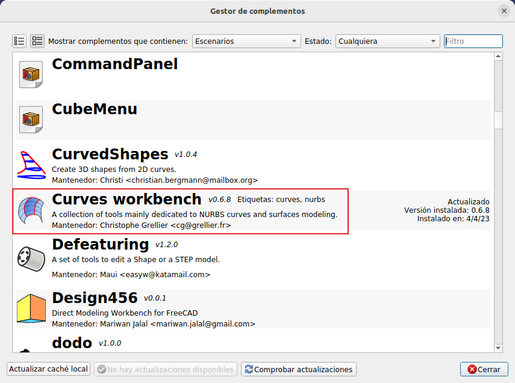  
*Figura 9.3.1. Banco de trabajo Curves en el Administrador de complementos*

## **Herramientas Curves**
En la tabla siguiente tenemos todos los iconos del banco de trabajo Curves de la barra de herramientas denominada Curves junto con su nombre y descripción básica para dibujar/modificar lineas curvas.

|Icono|Nombre|Descripción|
|:-:|---|---|
|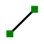|Línea|Crea una línea paramétrica entre dos vertices|
|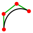|Spline editable|Crea una curva B-spline a mano alzada|
|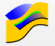|Mezclar curvas|Construye una curva 3D como intersección de dos curvas proyectadas|
|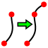|Extender curva|Extiende el borde seleccionado|
|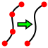|Unir splines|Une los bordes seleccionados de curvas B-spline|
|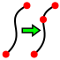|Dividir curva|Divide el borde seleccionado|
|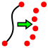|Discretizar|Discretizar una arista|
||Aproximar|Interpolar puntos con una curva BSpline|
|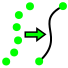|Interpolar|Aproximar puntos o curvas NURBS|
|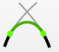|Mezclar curva|Mezcla una curva entre dos bordes|
|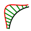|Peine paramétrico|Crea un diagrama de peine paramétrico en los bordes seleccionados|
|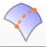|Curva en superficie|Crea una curva en la superficie de un objeto|

### Línea
Se puede invocar el comando desde el menú 'Curves' o haciendo clic en su icono.

### Spline editable
Se puede invocar el comando desde el menú 'Curves' o haciendo clic en su icono. Opcionalmente podemos seleccionar vértices, aristas o caras de forma que:

* El número de vértices de la spline coincidirá con el número de elementos seleccionados.
* Los vértices de la spline se ajustarán a los vértices seleccionados y a los puntos medios de las aristas y caras seleccionadas.

Cuando usamos el comando tenemos disponibles acciones que podemos realizar con teclas a veces unidas a clic del ratón.

* La tecla A selecciona o anula la selección de todos los vértices y líneas guía.
* La tecla I agregará un vértice al segmento perteneciente a la línea guía seleccionada. Se seleccionará el nuevo vértice.
* La tecla T activa o desactiva el modo tangente para los vértices seleccionados o las líneas guía.
* La tecla P alinea los objetos seleccionados.
* La tecla S se puede usar para ajustar un vértice a un vértice que pertenece a otro B-spline. Con un vértice del B-spline que se está editando seleccionado, mantenemos presionada la tecla Ctrl y agregamos el vértice de destino a la selección, luego presionamos la tecla S y los vértices se unen. Para desvincular los vértices, seleccionamos el par de vértices y vuelvemos a presionar la tecla S. El vértice del B-spline que se está editando permanece seleccionado y ahora se puede mover.
* La tecla L activa o desactiva la interpolación lineal.
* Las teclas X , Y o Z se pueden usar para restringir el movimiento del objeto que se está arrastrando. Mientras arrastramos pulsamos la tecla del eje deseado y para desactivar la restricción volvemos a pulsar la misma tecla.
* La tecla Q finaliza el comando y sale del modo de edición.

### Mezclar curvas
Se puede invocar el comando desde el menú 'Curves' o haciendo clic en su icono. Seleccionamos dos objetos o formas y activamos la herramienta. La dirección de la cámara se almacena en cada selección de forma y se puede utilizar como dirección de proyección.

Hay que establecer estas direcciones a 0,0,0 para usar el posicionamiento de cada forma como dirección de proyección.

### Extender curva
Se puede invocar el comando desde el menú 'Curves' o haciendo clic en su icono.

### Unir splines
Se puede invocar el comando desde el menú 'Curves' o haciendo clic en su icono. Seleccionamos uno o varios bordes en la vista 3D (pulsamos la tecla CTRL para varias selecciones). Estos bordes deben agregarse en un orden consecutivo. Todos los bordes se fusionan en uno solo Bspline.

### Dividir curva
Se puede invocar el comando desde el menú 'Curves' o haciendo clic en su icono.

### Discretizar
Se puede invocar el comando desde el menú 'Curves' o haciendo clic en su icono.

El término discretización es un concepto matemático que se puede definir como: El proceso de transferir funciones continuas, modelos, variables y ecuaciones a contrapartes discretas.

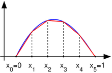  
*Figura 9.3.2. Una función continua (azul) y una aproximación lineal (rojo)*

### Aproximar
Se puede invocar el comando desde el menú 'Curves' o haciendo clic en su icono.

La herramienta permite convertir una nube de puntos en una superficie.

### Interpolación
Se puede invocar el comando desde el menú 'Curves' o haciendo clic en su icono.

### Peine paramétrico
Se puede invocar el comando desde el menú 'Curves' o haciendo clic en su icono.

Es una herramienta de ayuda que nos permite visualizar la regularidad de una curva así como la continuidad entre dos curvas. En la Figura 9.3.3 vemos el comando activado.

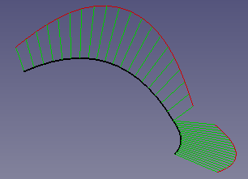  
*Figura 9.3.3. Peine paramétrico*

### Curva en superficie
Se puede invocar el comando desde el menú 'Curves' o haciendo clic en su icono.

## **Herramientas Superficies**
En la tabla siguiente tenemos todos los iconos del banco de trabajo Curves de la barra de herramientas denomi nada superficies junto con su nombre y descripción básica para trabajar con superficies.

|Icono|Nombre|Descripción|
|:-:|---|---|
|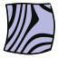|Textura cebra|Crea una textura cebra para inspeccionar superficies|
|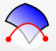|Recortar cara|Recorta una cara con una curva proyectada|
|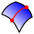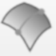|Isocurva|Crea una isocurva a partir de una cara|
|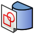|Boceto a superficie|Asigna un boceto a una superficie|
|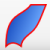|Barrido en 2 railes|Crea un perfil de barrido en 2 railes|
|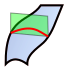|Plano de soporte (Curves ProfileSupport)|Crear un plano de soporte para bocetos|
|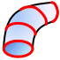|Perfil para tuberia|Crea el perfil para un barrido de tubo o de una carcasa|
||Barrido para tuberia|Crea un barrido de tubo o de una carcasa|
||GordonSurface|Crea una superficie que reviste una red de curvas|
|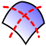|SegmentSurface|Segmenta una superficie en isocurvas|
||CompressionSpring|Crea un resorte de compresión|
|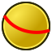|ReflectLines|Crea las líneas de reflexión en una forma, de acuerdo con la dirección de la vista|
|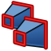|MultiLoft|Objetos de perfil Loft hechos de múltiples caras en paralelo|
|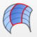|Combinación de superficies|La herramienta BlendSurface crea una superficie entre dos aristas con cierta continuidad entre las caras de apoyo|

### Textura cebra
Se puede invocar el comando desde el menú 'Surfaces' o haciendo clic en su icono.

Es una herramienta en la que podemos cambiar el ancho de las franjas negras de datos, escalar y rotar las rayas de cebra.

### Recortar cara
Se puede invocar el comando desde el menú 'Surfaces' o haciendo clic en su icono.

### Isocurva
Se puede invocar el comando desde el menú 'Surfaces' o haciendo clic en su icono.

Una isocurva o curva isoparamétrica es una curva de valor constante en una superficie.

Se crea una red UV sobre la superficie y se pueden cambiar los parámetros NumberU y/o NumberV para obtener más curvas.

### Boceto a superficie
Se puede invocar el comando desde el menú 'Surfaces' o haciendo clic en su icono.

Esta herramienta asigna un boceto a una cara, al estilo de una etiqueta en una botella. El boceto mapeado no tiene efecto en el resultado.

Hay 2 métodos para usar la herramienta Boceto a superficie:

**1.-** Teniendo definida la zona para un boceto que queremos mapear a una cara debemos proceder de la forma siguiente:

* Con la cara destino seleccionada en la vista 3D activamos la herramienta y en el boceto mapeado podemos comprobar las siguientes propiedades:

    * Que la cara seleccionada es el soporte (Support) de este boceto.
    * Que el modo de mapeo (Map Mode) está en Desactivado dejando la cara como primera referencia
    * Que la ubicación (Placement) x,y,z=0
  
* Si editamos el boceto mapeado vemos que se ha añadido un rectángulo auxiliar (azul) con referencia al origen de coordenadas del objeto y con un tamaño igual al desarrollo del objeto. Este rectángulo serán los límites paramétricos de la cara y es donde debemos dibujar nuestro boceto. Todo el boceto que vamos a crear debe estar dentro de esos límites.
* Al finalizar salimos del modo de edición y tendremos el boceto mapeado en la cara seleccionada.

En la animación de la Figura 9.3.4 vemos resumido este proceso sobre un cilindro de radio 50mm y altura 60mm.

  
*Figura 9.3.4. Creación de boceto mapeado en una cara*

El objeto final Sketch_On_Surface está adaptado a la cara seleccionada pero es independiente de esta.

*A veces ocurre que al hacer esta operación el rectángulo que se crea no es una buena referencia donde realizar nuestro boceto y tenemos 
que proceder como se describe en el punto 2. En la Figura 9.3.5 vemos el proceso inicial realizado sobre una superficie curva y como no hay un rectángulo auxiliar válido*

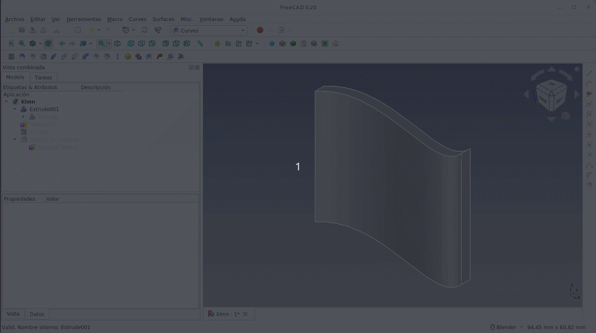  
*Figura 9.3.5. Creación de boceto mapeado en una cara que no genera un rectángulo válido*

**2.-** No teniendo una zona para un boceto que queremos mapear a una cara. Partimos de una superficie curva como la de la Figura 9.2.21 del apartado anterior para realizar el trabajo.

* Posicionamos la superficie destino en la vista 3D, creamos un boceto (en este caso en el plano XZ) en el banco de trabajo Sketcher y dibujamos, con líneas auxiliares, un boceto que delimite la cara. Estos van a ser nuestros límites de dibujo, tal y como apreciamos en la Figura 9.3.6

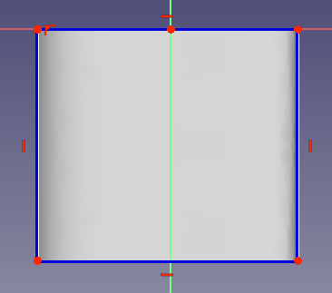  
*Figura 9.3.6. Límite para bocetar*

* Dentro de los límites establecidos dibujamos un boceto cualquiera (en la Figura 9.3.7 vemos un ejemplo) que va a quedar claramente separado y no orientado con la superficie curva.

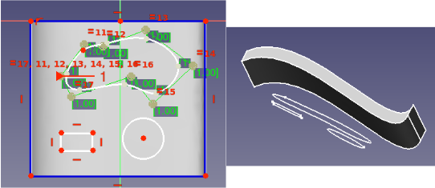  
*Figura 9.3.7. Boceto para poner en superficie curva*

* Ahora nos vamos al banco de trabajo Curves para colocar el boceto en la cara curva. Lo primero que debemos hacer es asociar la propiedad Map Mode del boceto con la cara curva que en este momento está en modo desactivado. Para hacer la asociación procedemos como se observa en la animación de la Figura 9.3.8. En esta misma animación vemos al final como se coloca el boceto sobre la superficie curva adaptándose a la misma.

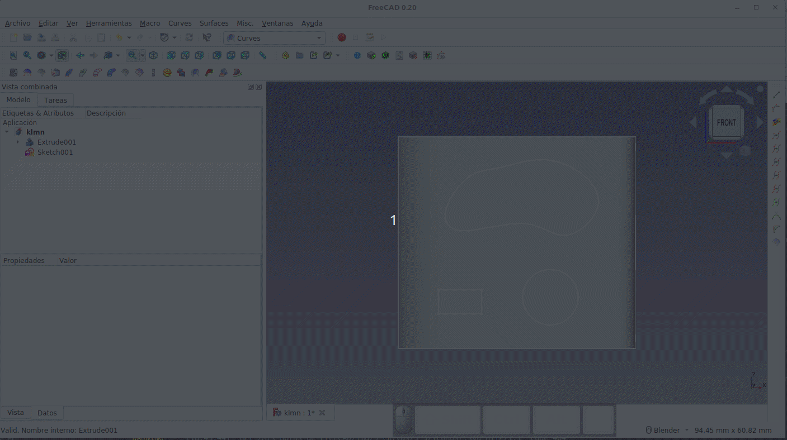  
*Figura 9.3.8. Asociación de la propiedad Map Mode del boceto a la cara curva*

* Se ha creado un objeto SketchOnSurface en la superficie de nuestro objeto basado en este boceto.

Una vez mapeado el boceto las posibles opciones de configuración de Sketch_On_Surface son:

* Extrusión de relleno (Fill Extrusion): cuando el valor de 'Grosor (Thickness)' no es nulo se generarán caras de transición.
* Rellenar caras (Fill Faces): esto rellenará todas las figuras geométricas cerradas en caras.
* Desplazamiento (Offset): esto moverá las formas mapeadas según el eje normal a la cara de mapeo en una u otra dirección dependiendo de si el valor es negativo o positivo.
* Grosor (Thickness): si no es nulo, dará grosor a las superficies creadas anteriormente.

En la animación de la Figura 9.3.9 vemos los efectos de cambiar estos valores de configuración.

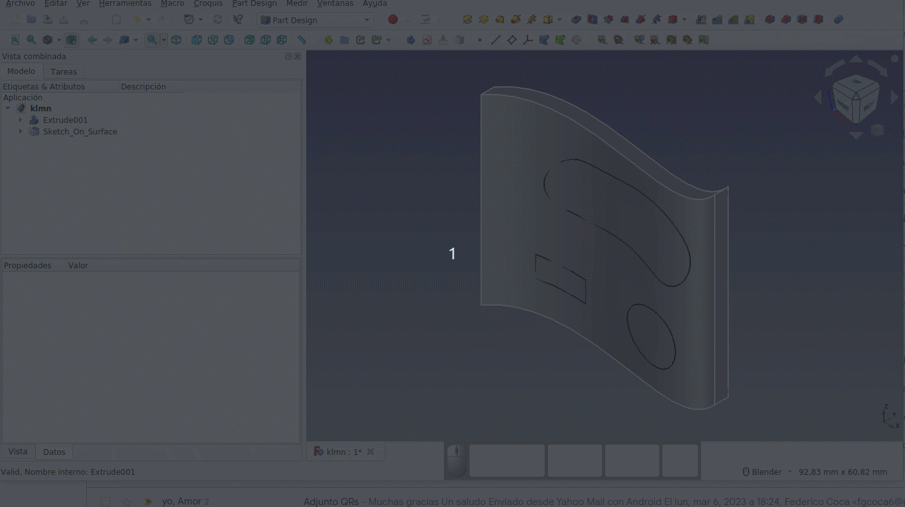  
*Figura 9.3.9. Cambios en los valores de configuración de Sketch_On_Surface*

### Barrido en 2 railes
Se puede invocar el comando desde el menú 'Surfaces' o haciendo clic en su icono.

En el apartado [Ejemplos resueltos](./ejemplos/ejem_curves.md) en la entrada Pala se da toda la expliación sobre esta herramienta.

### Plano de soporte (Curves ProfileSupport)
Se puede invocar el comando desde el menú 'Surfaces' o haciendo clic en su icono.

### Tuberia o carcasa (Pipeshell)
Se puede invocar cada comando desde el menú 'Surfaces' o haciendo clic en su correspondiente icono, uno para Perfil y otro para Barrido. Aunque inicialmente la herramienta puede ser similar a las ya vistas de barrido por trayectoria, y lo es, no es menos cierto que esta es mucho mas potente.

En realidad se trata de una herramienta que actualmente está dividia en dos, la primera para crear el perfil del objeto para ser la tuberia y la otra para hacer el barrido. Hay que respetar una cierta secuencia para usar las herramientas y es que primero se crea el perfil y luego el barrido.

En el apartado [Ejemplos resueltos](./ejemplos/ejem_curves.md) hay varias entradas donde se profundiza en el uso de esta herramienta.

### GordonSurface
Se puede invocar el comando desde el menú 'Surfaces' o haciendo clic en su icono.

Esta herramienta nos permite crear superficies de tipo "tienda de campaña o toldo".

Una superficie Gordon requiere un conjunto de líneas o curvas que creen una red de soporte para la superficie, que estará apoyada y entre esa red.

En el ejemplo de la wiki [Curves GordonSurface]() y que vemos en la Figura 9.3.10, las líneas azules (denominadas costillas o nervaduras) representan la forma de la superficie en diferentes zonas de la misma y se pueden considerar como secciones transversales y actuarán como soportes. Las líneas amarillas representan la extensión y la forma de la superficie entre las secciones transversales definidas por las líneas azules.

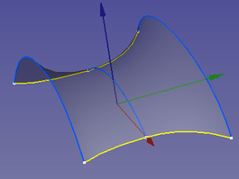  
*Nervaduras y forma de GordonSurface*

Las líneas azules y amarillas se pueden crear en bocetos.

Los bocetos correspondinetes a las nervaduras azules suelen partir de copias del primero con un desplazamiento de ubicación, estando cada "costilla" en un boceto separado.

Los bocetos que contienen las líneas amarillas de extensión/forma generalmente harán referencia a la geometría externa de los bocetos de las nervadura para un posicionamiento preciso.

Una vez creados los bocetos debemos seleccionar todas las líneas (utilizando la selección múltiple haciendo clic mientras se mantiene presionada la tecla Ctrl) que definirán la superficie. El orden de selección define el orden de cosido. Debemos seleccionar en orden primero las costillas primero. En el ejemplo anterior, seleccionamos las líneas azules de izquierda a derecha o de derecha a izquierda y continuamos con la selección de las líneas de extensión y cuando las tengamos todas invocamos al comando,

A continuación definimos brevemente las propiedades de GordonSurface.

* **Placement:** se puede utilizar para ajustar la posición de la superficie (solamente la superficie, no las líneas) Gordon resultante.
* **Label:** es el nombre de la superficie que por defecto es Gordon.
* **Output:** define el tipo de salida. (Predeterminado: Superficie, Opciones: Superficie (Surface), Estructura alámbrica (Wireframe))
* **Gordon>Max Ctrl Pts:** Máximo número de puntos de crontol (por defecto 80).
* **Gordon>Sources:** líneas seleccionadas por el usuario que se utilizan para crear la superficie Gordon.
* **Gordon>Tol3D:** tolerancia 3D (predeterminada: 0,01)
* **Wireframe>Samples U:** Número de muestras en dirección U. (Predeterminado: 16). Se utiliza para determinar la densidad de la malla cuando la propiedad Output se establece en Estructura alámbrica.
* **Wireframe>Samples V:** idéntica a la anterior pero en dirección V.

En la Figura 9.3.11 vemos la superficie de Gordon como estructura alámbrica con U=16 y V=16.

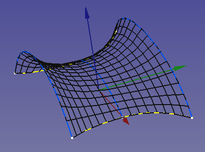  
*Superficie de Gordon como estructura alámbrica*

Las curvas de cada grupo (costillas y rieles) deben tocar todas las curvas del otro grupo. En otras palabras, deben formar un patrón de cuadrícula o red.

### SegmentSurface
Se puede invocar el comando desde el menú 'Surfaces' o haciendo clic en su icono.

### CompressionSpring
Se puede invocar el comando desde el menú 'Surfaces' o haciendo clic en su icono.

### ReflectLines
Se puede invocar el comando desde el menú 'Surfaces' o haciendo clic en su icono.

### MultiLoft
Se puede invocar el comando desde el menú 'Surfaces' o haciendo clic en su icono.

### Combinación de superficies
Se puede invocar el comando desde el menú 'Surfaces' o haciendo clic en su icono.

La herramienta BlenSurface crea una superficie entre dos aristas con cierta continuidad entre las caras de apoyo. Hay que seleccionar cuatro objetos en la vista 3D, una cara y un borde y otra cara y otro borde.

## **Miscelanea**
En la tabla siguiente tenemos todos los iconos del banco de trabajo Curves de la barra de herramientas denominada Miscelanea junto con su nombre y descripción básica para trabajar con superficies.

|Icono|Nombre|Descripción|
|:-:|---|---|
||Informacion de geometria|Muestra información de geometria de aristas, caras, polos, nudos y pesos|
|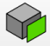|Extraer subforma|Extrae la parte seleccionada como no paramétrica|
|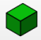|Sólido paramétrico|Crea un sólido paramétrico de la selección de objetos tanto en la vista 3D como en el árbol de objetos|
||Pega SVG|Pega el contenido SVG del portapapeles|
|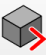|Objetos a consola|Ofrece acceso a los objetos seleccionados en la consola de Python|
|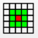|Seleccionar caras adyacentes|Selecciona las caras adyacentes de una sub forma|
|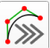|B_spline a consola|Crea un script de Python para construir las curvas B-spline seleccionadas|

### Informacion de geometria
Se puede invocar el comando desde el menú 'Misc.' o haciendo clic en su icono.

Muestra información de geometria de aristas o caras de la forma activa seleccionada. Si se trata de curvas Bezier y B-spline y superficies en vista 3D muestra polos, nudos y pesos.

### Extraer subforma
Se puede invocar el comando desde el menú 'Misc.' o haciendo clic en su icono.

Funciona de forma muy similar a la copia simple del menu Part y sirve para crear una copia no paramétrica de la parte seleccionada del objeto. En la animación 9.3.12 siguiente vemos como funciona la herramienta sobre el ejemplo de la pala.

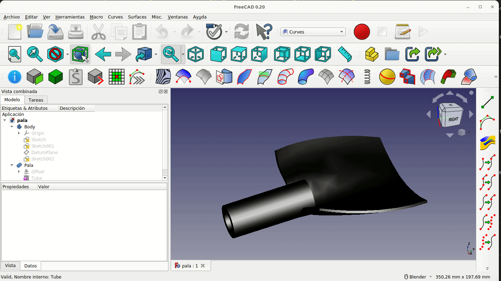  
*Extraer subforma*

### Sólido paramétrico
Se puede invocar el comando desde el menú 'Misc.' o haciendo clic en su icono.

### Pega SVG
Se puede invocar el comando desde el menú 'Misc.' o haciendo clic en su icono.

### Objetos a consola
Se puede invocar el comando desde el menú 'Misc.' o haciendo clic en su icono.

Para su uso simplemente seleccionamos objetos en el árbol o en la vista 3D y activamos la herramienta. Para tener acceso a la selección se pueden crear algunas variables en la consola.

### Seleccionar caras adyacentes
Se puede invocar el comando desde el menú 'Misc.' o haciendo clic en su icono.

Seleccionando una arista o una cara en la vista 3D y seleccionando la herramienta veremos como todas las caras que están en contacto con la misma pasan a formar parte de la selección.

### B_spline a consola
Se puede invocar el comando desde el menú 'Misc.' o haciendo clic en su icono.

Seleccionando algunas curvas Bezier o B-spline en la vista 3D podemos activar la herramienta y las curvas son recreadas con comando en la consola de Python.
