# La macro FCCircularText
Se trata de una macro que resulta especialmente útil para trabajar con textos en FreeCAD cuyo autor es [Mario52](https://wiki.freecad.org/User:Mario52) y su información está disponible en la [wiki](https://wiki.freecad.org/Macro_FCCircularText) de FreeCAD.

La forma mas sencilla de instalarla es desde el Administrador de complementos y se ejecuta desde el menú de macros, como siempre. En la figura siguiente vemos la macro en el Administrador de complementos justo antes de instalarla.

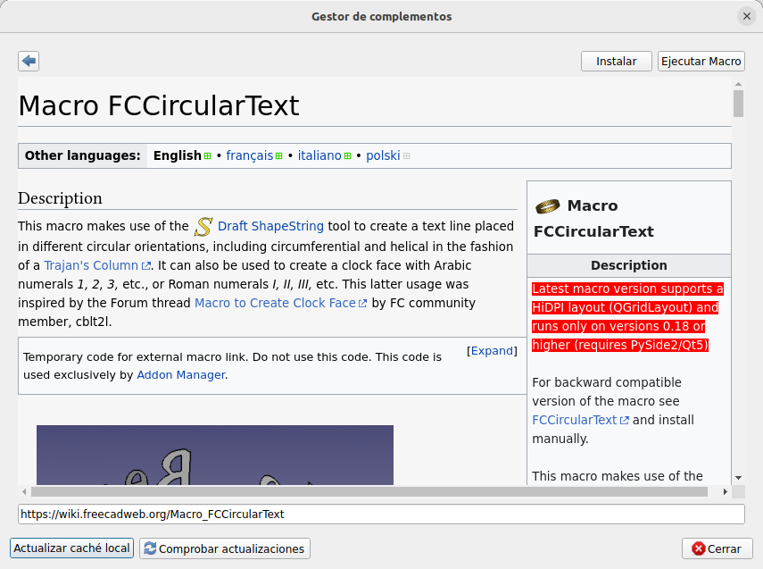  
*La macro FCCircularText en el administrador de complementos*

Una vez instalada la ejecutamos y nos muestra la ventana que vemos en la figura siguiente, que pasaremos a describir a continuación.

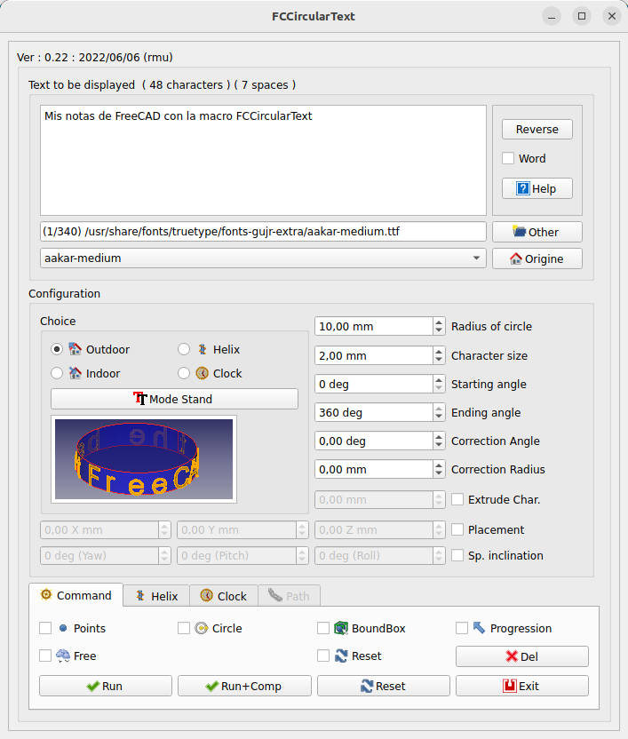  
*La macro FCCircularText en ejecución*

Vamos a vedescribirr esta ventana por secciones para al final ver ejemplos de uso.

## **Sección primera**
Se corresponde con la parte superior y es la que vemos en la figura siguiente.

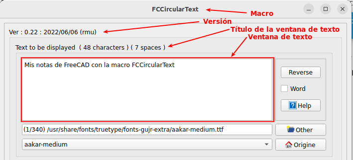  
*Sección primera de la macro FCCircularText*

- La ventana de edición de texto nos muestra el texto actual y en su título nos indica el número de caracteres y de espacios en blanco que contiene.
- El botón Reverse invierte el sentido de escritura del texto
- Si Word está seleccionado se considera el texto como palabras, o sea, el texto se corta en los espacios y se escribe palabra por palabra, en lugar de carácter por carácter como es lo normal. En el título de la ventana se refleja esto indicando el número de paralabras.
- El botón Help muestra la wiki de FreeCAD en una pestaña de FreeCAD.
- El cuadro a la izquierda de Other muestra la ruta y el nombre del archivo de la fuente
- El botón Other permite buscar la fuente en otro directorio
- El botón Origine permite volver a la ruta y a la fuente original o por defecto cuyo nombre se muestra a la izquierda.

## **Sección segunda**
Se trata de la ventana de la figura siguiente que nos va a permitir la configuración de caracteres en FCCircularText.

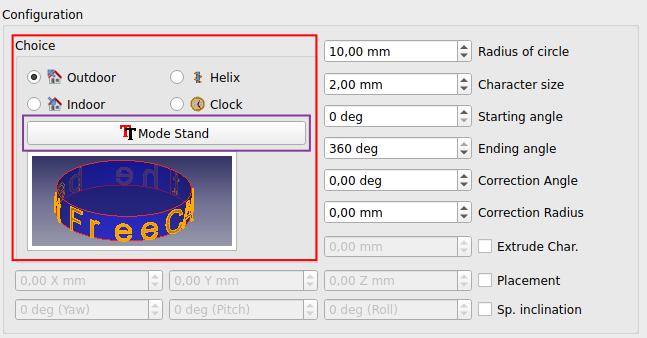  
*Sección segunda de la macro FCCircularText*

La zona marcada en rojo nos permite escoger donde y como queremos el texto dependiendo del valor que indique el botón enmarcado en morado. El Mode Stand para texto de pie y el Mode Flat para texto en círculo.

La figura siguiente muestra las opciones Extrerior e Interior en Mode Stand y en Mode Flat.

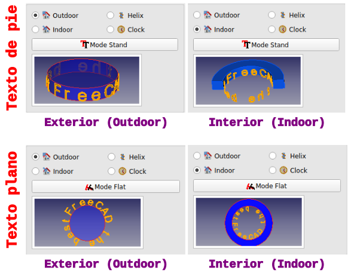  
*Opciones exterior e interior para texto de pie o plano*

Además disponemos de dos formas mas de colocar el texto, en hélice y en forma de reloj, tal y como vemos en la figura siguiente. Para estas dos formas el botón Mode está desactivado.

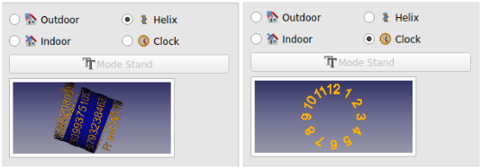  
*Opciones hélice y reloj*

En la figura siguiente vemos el significado de algunos de los parámetros de esta segunda sección.

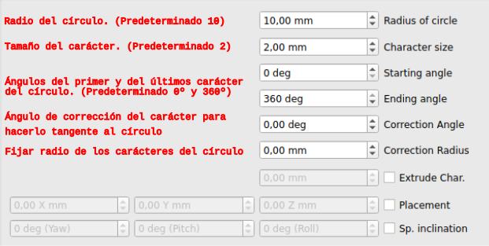  
*Parámetros sección segunda*

El valor predeterminado para el Ángulo de corrección es de 10º y para el radio de corrección de 0,15mm.

El resto de parámetros de la zona de configuración no están activos de forma predeterminada, pero se pueden activar y configurar sus valores. En la figura siguiente vemos activados estos parámetros, la explicación de su uso y un gráfico (obtenido di [wikipedia](https://en.wikipedia.org/wiki/Aircraft_principal_axes)) que los explica conceptualmente desde el punto de vista de la aviación.

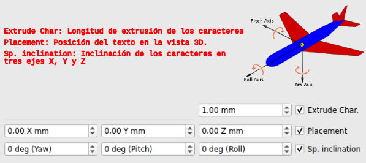  
*Parámetros sección segunda*

En el enlace a la wikipedia además hay una animación que lo deja aún más claro.

## **Sección de comandos**
Se trata de los botones que hay en la parte inferior de la ventana y que reproducimos en la figura siguiente con la indicación de su funcionalidad.

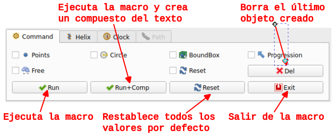  
*Comandos*

Veamos la descripción de las opciones seleccionables. Se puede seleccionar una sola o varias para combinar el efecto.

* **Points (Puntos)**. Crea puntos de referencia de cada letra y espacio en blanco que podremos utilizar según necesitemos.
* **Circle (Círculo)**. Crea círculo de referencia. Si estamos usando una hélice esta opción no estará disponible.
* **BoundBox (Caja delimitadora)**. Crear un caja delimitadora para cada carácter.
* **Progression (Progesión)**. Visualiza los caracteres según se construyen.
* **Free (Libre)**. Todas las preselecciones son ignoradas.
* **Reset (Restablecer)**. Cuando no está seleccionada todos los valores establecidos se reinician con cada creación. Si seleccionamos la opción no se realiza ese reinicio y si el resultado no es el esperado no perdemos la configuración realizada.
* **Del (borrar)**. Este botón permite borrar el último objeto creado.

Estas opciones solamente las tenemos disponibles cuando escogemos Outdoor o Indoor.

## **Configuraciones**
Realizadas las descripciones anteriores vamos a ver las diferentes posibilidades que tenemos con las configuraciones realizando pequeños ejemplos de cada caso para una mejor compresión. Partiremos de una configuración inicial como la que vemos en la figura siguiente.

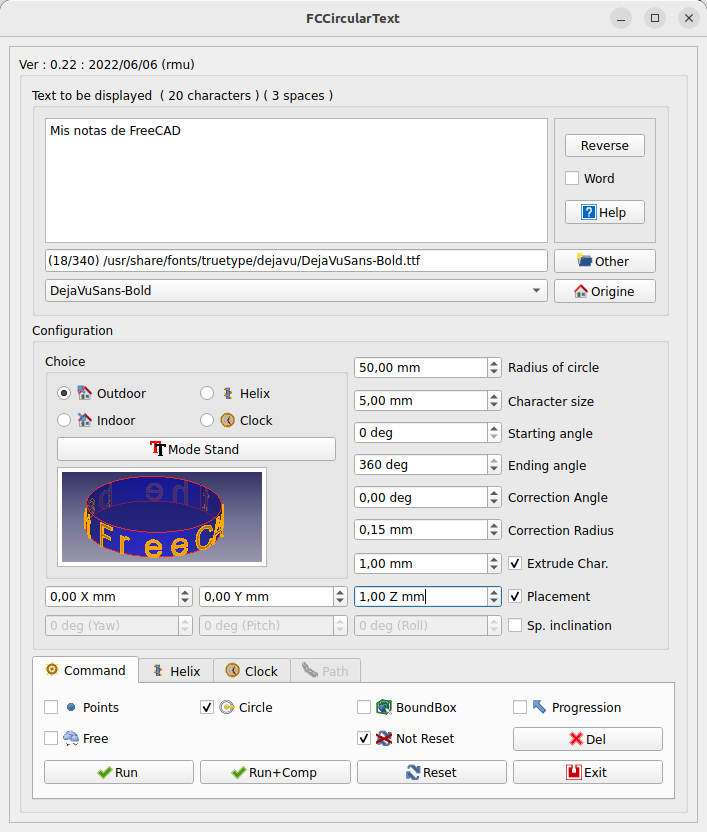  
*Configuración inicial para el uso de configuraciones*

### Exterior
Se trata del modo por defecto y el texto se escribe en el exterior de la circunferencia o círculo con la configuración que le establezcamos a través de los diferentes parámetros. En la figura siguiente vemos el resultado tras pulsar el botón Run.

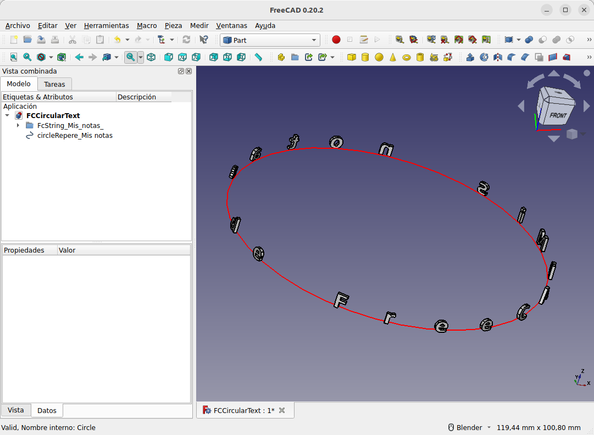  
*Outdoor con la configuración inicial*

Podemos convertir el trabajo en un sólido 3D si creamos un clon del objeto FCString, extruimos el círculo desde Part y fusionamos esta extrusión con el clon, obteniendo lo que vemos en la figura siguiente.

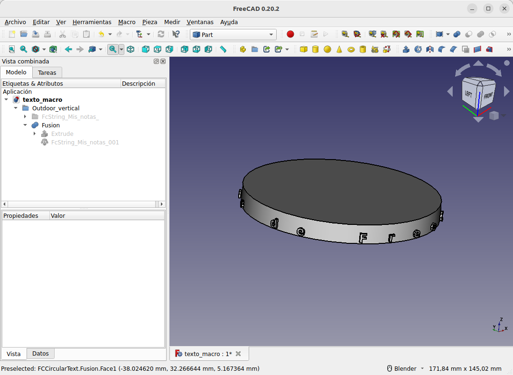  
*Objeto 3D con texto vertical en un cilindro*

De forma totalmente similar podemos conseguir poner el texto en círculo sobre la base superior de un cilindro. Esto se dará resuelto en el ejercicio pero se propone al lector que lo haga por si mismo.

### Interior
El texto ahora está escrito en el interior del círculo. En la figura siguiente vemos un resultado tras pulsar el botón Run.

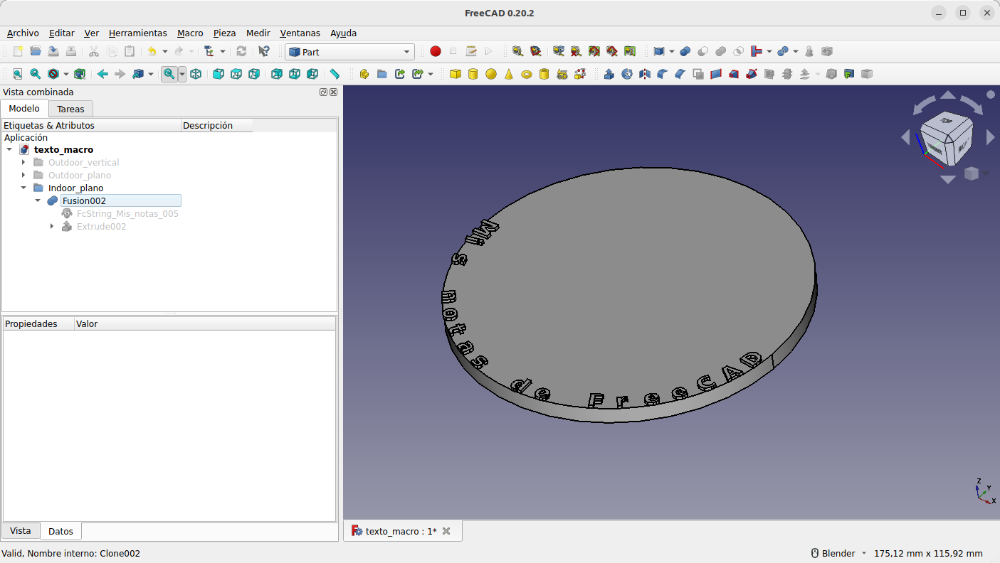  
*Objeto 3D con texto plano Indoor*

Para el caso de texto en vertical creamos el ejemplo de la figura siguiente. En este proceso requiere de la creación y extrusión de los bocetos necesarios para crear el soporte del texto.

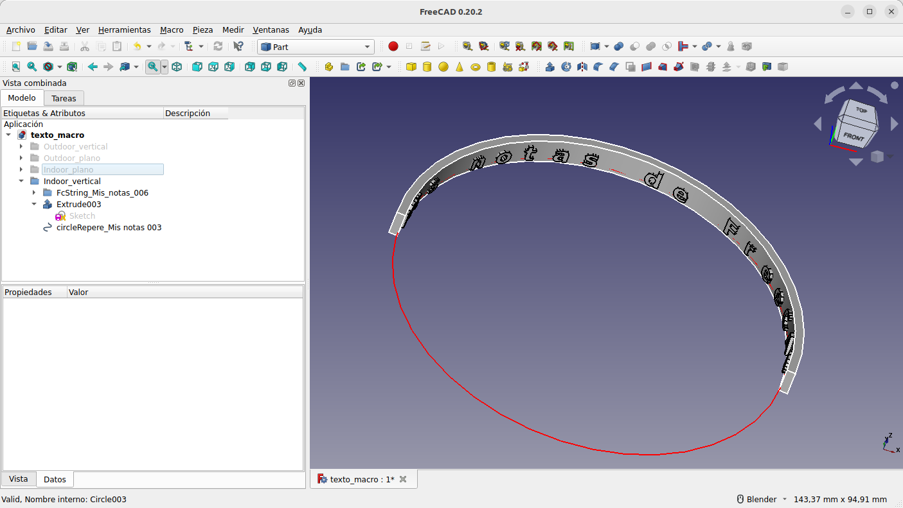  
*Objeto 3D con texto vertical Indoor*

### Hélice
El texto se coloca en la circunferencia exterior de una hélice. La pestaña Helix se activa cuando escogemos Helix y viceversa, quedando el resto de opciones disponibles para su configuración.

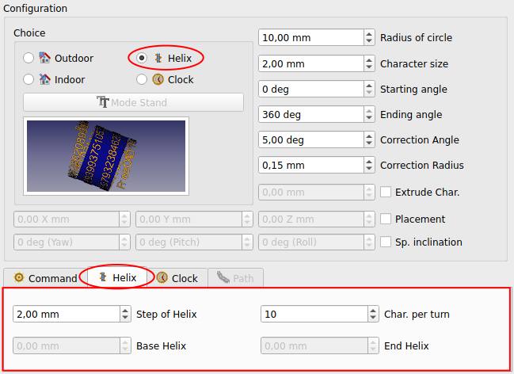  
*Opciones para hélice*

Las propiedades para Helix son:

* **Step of helix (Paso de hélice)**. Es el paso de los giros de la hélice siendo 2 su valor por defecto. Si ponemos su valor a cero se activan las opciones Base Helix y End Helix.
* **Char. per turn (Caracteres por giro)**. Es el número de caracteres a colocar en cada gito helicoidal. Su valor predeterminado es 10.
* **Base Helix**. Proporciona la base para iniciar la hélice (incluso la colocación Z). Si 'Placement Z' es diferente de cero, el punto de inicio se agrega a la Ubicación Z.
* **End Helix**. Indica el final de la hélice. El paso de la hélice se calculará en relación con la altura y el número de caracteres por giro helicoidal.

En la figura siguiente vemos los dos últimos campos activados.

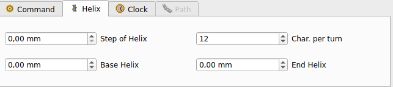  
*Acceso a las opciones no activas para hélice*

En la animación siguiente vemos un ejemplo de creación de texto en hélice aplicado a un recipiente en el que el texto queda grabado. Es evidente que la profundidad del grabado la podemos cambiar y que también podemos poner el texto en relieve.

  
*Creación de texto en hélice en recipiente*

### Reloj
Las figuras forman parte de un círculo con números arábigos o romanos. La pestaña Clock se activa cuando escogemos Clock y viceversa, quedando como opciones disponibles para su configuración el radio del círculo y el tamaño del caracter.

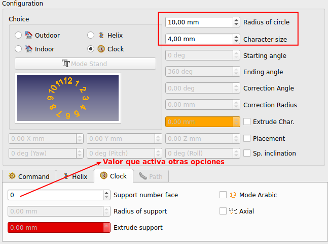  
*Opciones para clock*

Las propiedades para Clock son:

* Si **Support number face (número de caras de soporte)** es diferente de cero, se crea un soporte. A continuación se indican los posibles valores de **Support number face** con su número de caras y el texto que los sustituye.

    - 0 = **Support number face**: ninguna cara.
    - 1 = **Support circle**. Se crea un círculo.
    - 2 = **Support rectangle**. Se crea un rectángulo (altura = Radio soporte y anchura = Radio soporte * 2).
    - 3 = **Support triangle**. Se crea un triángulo circunscrito en un círculo de radio = Radio soporte * 2.
    - 4 = **Support square**. Se crea un cuadrado (Radio de soporte).
    - 5 = **Support polygone**. Un polígono con el número de caras circunscritas mostradas (pentágono, hexágono,...).

* **Radius of support (Radio del soporte o apoyo)**. Radio del soporte del reloj. Por defecto su valor será el radio del círculo y se cambia con este. Si los queremos diferentes primero ajustamos el radio del círculo y después el del soporte.
* **Extrude support (Espesor del soporte o apoyo)**. Si está activo se puede indicar una longitud de extrusión.

    - Si el espesor es cero entonces no se extruye.
    - Si el grosor del soporte es mayor que el carácter, la caja del valor se colorea en rojo.
    - Si el Selector de Extrude Char. no está marcado la caja del valor se colorea en naranja para avisar que el reloj está en la base del soporte

* **Mode Arabic o Mode Roman**. Cuando el selector está marcado los números de las horas se crean en números romanos y cuando no lo está en números arábicos.
* **Axial o Redress**. Los números se colocan de forma axial o compensando la posición.

En las figuras siguientes tenemos las configuraciones y el reloj que se genera con ellas.

* Reloj circular con números romanos en posición compensada.

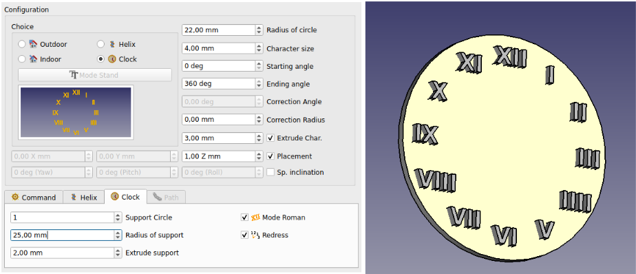  
*Reloj circular*

* Reloj rectangular con números romanos en posición axial.

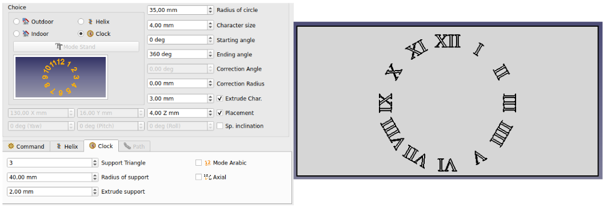  
*Reloj rectangular*

* Reloj triangular con números arábicos en posición axial.

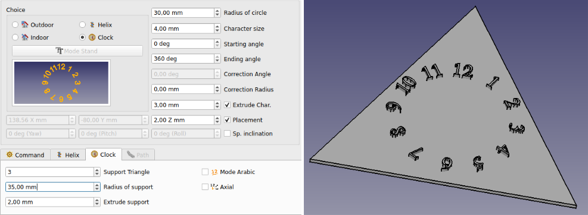  
*Reloj triangular*

* Reloj cuadrado con números romanos en posición axial.

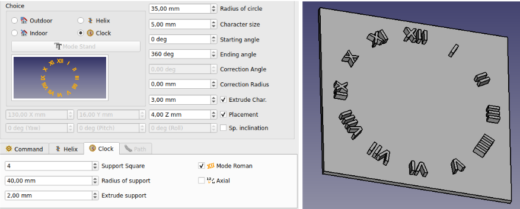  
*Reloj cuadrado*

* Reloj pentagonal con números romanos en posición axial.

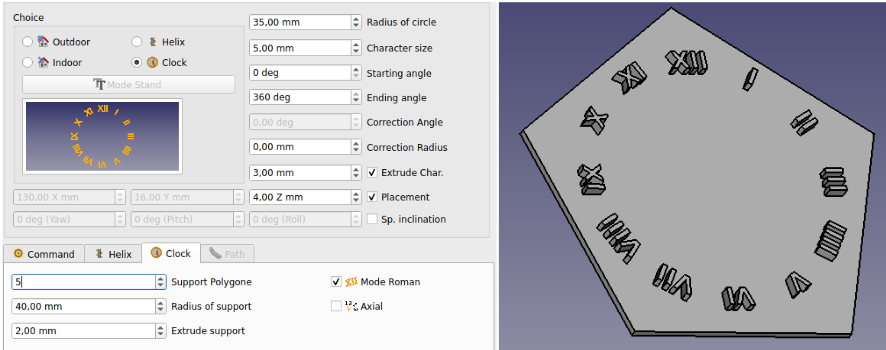  
*Reloj pentagonal*

* Reloj decagonal con números romanos en posición axial.

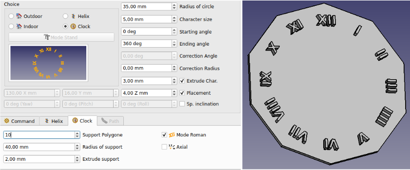  
*Reloj decagonal*

## **Sección path**
La sección de trayecto o path se activa y muestra la longitud del cable seleccionado. Esta sección permanece siempre inactiva hasta que en la vista 3D se selecciona un alambre, un arco, un círculo, una línea o un borde, que es cuando la sección Path se colorea en verde y los comando no utilizado se colorean en rojo. En la figura siguiente vemos la sección path activa al activar el borde del cilindro.

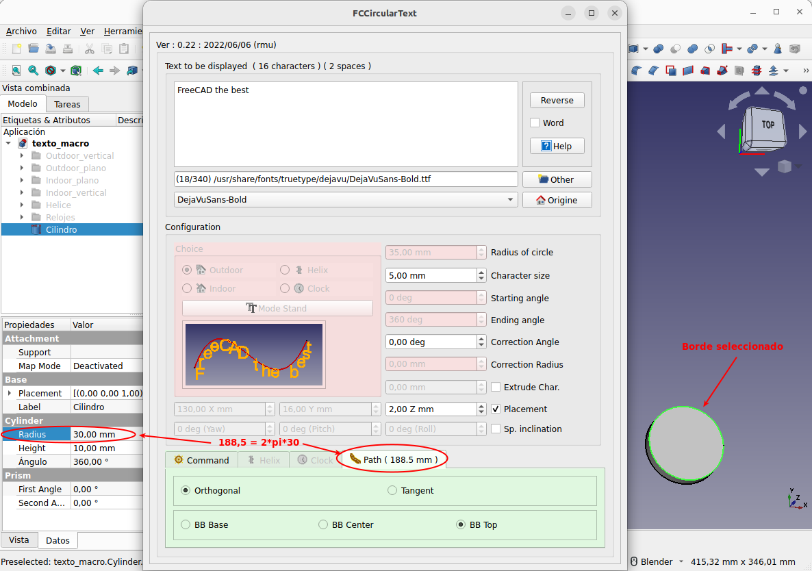  
*Sección path activa*

Las opciones disponibles son:

* **Orthogonal (Ortogonal)**. El carácter es ortogonal a la vista
* **Tangent (Tangente)**. El carácter es tangente a la ruta del punto en el alambre.
* **BB Base**. La base del carácter es la ruta en el alambre.
* **BB Center**. El centro del texto señala la ruta en el alambre.
* **BB Top**. El límite superior del character señala la ruta en el alambre.

En el enlace tenemos el archivo fuente de FreeCAD con los diseños vistos:

* [Enlace para descarga del archivo fuente de FreeCAD](../img/designs/10/texto_macro.FCStd)
