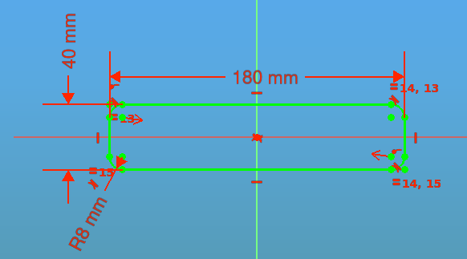

# Creación de texto desde el banco de trabajo Draft
Este es seguramente el método más sencillo y rápido de crear textos para levantarlos en 3D. Se trata de la herramienta 'ShapeString' que se traduce como 'Forma a partir de texto'.

Lo primero a tener en cuenta para trabajar es decidir que modelo de texto es el que queremos poner en 3D. En todos los sistemas operativos hay multitud de fuentes de tipo ttf (true type font) que podemos utilizar. Debemos tener presente que pueden existir fuentes que nos den errores, fundamentalmente debidos a que en el archivo vectorial de creación de una o varias letras no se creó un trazo vectorial cerrado (se ha dejado abierto en algún punto, posiblemente sin querer) lo que va a impedir su extrusión, como en cualquier boceto no cerrado. Podemos recurrir a localizar los archivos de diseño de la fuente y arreglarlo, pero esto puede resultar bastante complejo por lo que se aconseja cambiar a otra fuente ttf.

Si ninguna de las fuentes disponibles en nuestro sistema nos satisface podemos localizar en el navegador otros tipos, como por ejemplo las de google o [google fonts](https://github.com/google/fonts) o alguna web del tipo [1001 free fonts](https://www.1001freefonts.com/), de donde se ha descargado la [star-jedi](https://www.1001freefonts.com/sci-fi-fonts.php) para realizar pruebas en los ejemplos.

Otro factor importante a tener en cuenta es que si utilizamos fuentes del sistema nuestro archivo de diseño puede no ser portable porque varíe el directorio donde se encuentra la fuente. Esto es fácil de evitar llevando la fuente en el directorio de trabajo de diseño, que además simplifica su localización y apenas aumenta el tamaño del directorio pues los archivos de fuentes pesan muy poco.

En la wiki de FreeCAD está disponible el tutorial [Draft ShapeString tutorial](https://wiki.freecad.org/Draft_ShapeString_tutorial) escrito originalmente por Roland Frank (2017, r-frank) y fue reescrito y reilustrado por vocx. Lo utilizaremos para un primer ejemplo que sirva de guía de uso.

El tutorial describe un método para crear texto en 3D y usarlo con objetos sólidos en el banco de trabajo Part. Básicamente consiste en:

* insertar texto delineado con la herramienta 'Forma a partir de texto o ShapeString'
* extruirlo para que sea un sólido 3D con 'Extruir' de Part
* colocarlo en el espacio 3D usando la colocación o Placement y 'Mover' de Draft (usando un boceto como geometría auxiliar)
* grabar el texto aplicando la herramienta booleana 'Cortar' de Part.

Para usar ShapeStrings con el banco de trabajo PartDesign, el proceso es esencialmente el mismo pero ShapeString se coloca dentro de un body para extruirlo.

## **Creación de la forma básica**
Nos dirigimos al banco de trabajo Part e insertamos la primitiva de un cubo. Seleccionamos en el árbol de objetos el cubo y en la pestaña de datos le cambiamos su anchura a 31mm. Seleccionamos la arista superior derecha y creamos un chaflán de 5mm de longitud. En la figura siguiente vemos el aspecto de la forma en este instante.

  
*Forma básica a partir de un cubo y una operación de chaflán*

## **Creación de la cadena de texto**
Nos dirigimos al banco de trabajo Draft y estando seguros de no tener nada seleccionado en la vista de árbol establecemos como plano de trabajo el XY (Top) seleccionando según vemos en la figura siguiente.

  
*Configuración del plano donde se colocará el texto*

Para insertar el texto "FreeCAD" hacedmos clic en ShapeString y configuramos la ventana que nos sale tal y como vemos en la figura siguiente. Para establecer las coordenadas a 0 lo podemos hacer una a una o haciendo clic en el botón 'Reiniciar puntos'. Tengase en cuenta que estas coordenadas se actualizan cada vez que pasemos el ratón por la zona de visualización 3D. Al finalizar cerramos la ventana haciendo clic en el botón 'OK'.

  
*Configuración de Forma a partir de texto o ShapeString*

En la figura siguiente vemos el estado actual de nuestro diseño. Se ha dado un valor de 30 a la transparencia del objeto 3D para una mejor visualización.

  
*Texto FreeCAD creado correctamente*

## **Creación del texto en 3D**
Volvemos al banco de trabajo Part y en la vista de árbol seleccionamos el objeto ShapeString y configuramos la ventana tal y como se ve en la figura siguiente.

  
*Configuración de la ventana Extrusión*

El resultado lo vemos en la figura siguiente.

  
*Texto extruido en 3D*

## **Posicionamiento del texto**
El primer paso es crear un bocdeto auxiliar que posteriormente utilizaremos como geometria auxiliar para colocar el texto en 3D en su lugar. Nos dirigimos al banco de trabajo Sketcher y en la vista 3D seleccionamos la cara inclinada para seleccionarla como plano para un nuevo boceto que creeamos haciendo clic en el botón 'Crear croquis', seleccionamos FlatFace en la ventana emergente y dibujamos una línea horizontal cuyo extremo izquierdo estará situado a 2,5mm en los ejes X e Y respecto al origen. Si queremos que el boceto esté totalmente restringido le damos una longitud a la línea de, por ejemplo, 25mm aunque esto último no es importante en este caso. En la animación siguiente se recrean estos pasos.

  
*Creación del boceto auxiliar*

A continuación vamos a realizar algunas operaciones para reposicionar el texto 3D. En la vista de árbol seleccionamos Extrude y hacemos clic en la diéresis de la propiedad Placement. En la ventana que nos aparece marcamos la opción 'Aplicar cambios incrementales'. En rotación escogemos 'Eje de rotación con ángulo' y aplicamos una rotación de 90 respecto al eje Z y hacemos clic en el botón aplicar lo que provocará que el testo 3D gire esos 90º y que se restablezca el campo Ángulo a cero. Ahora cambiamos la rotación al eje Y y le aplicamos un ángulo de 45º y finalizamos la operación haciendo clic en el botón aplicar para restablecer el ángulo a cero. Una vez realizadas las tareas cerramos la ventana de diálogo con el botón OK. El eje de giro se puede establecer introduciendo un vector que tendrá la misma dirección y sentido que la los ejes coordenados si solamente se establece a 1 uno de los ejes. En la animación siguiente vemos como se hacen estas operaciones.

  
*Posicionamiento del texto 3D desde Placement*

Nos dirigimos de nuevo al banco de trabajo Draft y si es necesario activamos el modelo de alambres como Estilo de dibujo, lo que nos permitirá ver los objetos que están detrás de otros. Nos aseguramos de que esté activa la opción de Adherir a punto final como referencia de objetos. En la vista árbol seleccionamos Extrude y hacemos clic en la herramienta Mover y hacemos primero clic en la esquina superior izquierda del texto extruido y en segundo lugar otro clic en el extremo izquierdo de la línea auxiliar. En la animación siguiente vemos estos procedimientos.

  
*Posicionamiento del texto 3D con Mover*

## **Creación del texto en el objeto 3D**
Con la opción de movimiento realizada la operación que debemos hacer desde el banco de trabajo Part es un corte booleano que nos arrojará el resultado que vemos en la figura siguiente.

  
*Texto grabado*

Para ver otras opciones de creación del texto vamos a activar la referencia al punto medio y proceder según vemos en la figura siguiente, donde al final se aplica una operación de unión booleana que crea el texto en relieve.

  
*Posicionamiento del texto 3D con Mover*

Vemos como ahora son posibles dos operaciones diferentes. Si queremos cambiar la longitud de grabación o de relieve del texto deberemos de cambiar la longitud de extrusión del texto.

## **Creación del texto 3D en PartDesign**
Debemos crear un body y mover el ShapeString al mismo, así como el objeto en 3D. Para alinear el texto al plano inclinado utilizaremos la herramienta 'Trazar croquis en cara' y mediante Attachement lo recolocamos adecuadamente. Ahora ya podemos realizar una extrusión a la longitud deseada y tendremos el texto en relieve en el objeto 3D. En la animación siguiente se ve el punto de partida y como crear el texto en 3D.

  
*Texto 3D con PartDesign*

De forma totalmente similar se puede crear un texto grabado utilizando la herramienta Vaciado.

En el enlace siguiente tenemos el Archivo fuente de FreeCAD conteniendo diferentes opciones de forma de crear el objeto con el texto:

* [Enlace para descarga del archivo fuente de FreeCAD](../img/designs/10/texto_SS.FCStd)

## **Centrado del texto**
Vamos a ver una forma sencilla de centrar un texto creado con ShapeString. Partimos de un objeto rectangular con esquinas redondeadas de 5mm de espesor obtenido a partir del boceto de la figura siguiente.

  
*Boceto del objeto para centrar texto*

Sobre la cara superior del objeto creamos un punto de referencia que situamos en el centro de masas porque pretendemos centrar el texto en esa cara del objeto. Vemos la situación de creación en la figura siguiente.

  
*Punto de referencia en el centro de masas de la cara superior*

Nos dirigimos al banco Draft y creamos la cadena de texto que vemos en la figura siguiente. Nos aseguramos de que la cadena está dentro del body donde se ha creado el objeto 3D.

  
*Cadena de texto*

Ocultamos el objeto 3D y abrimos la pestaña vista con el ShapeString seleccionado, localizamos la propiedad BoundingBox y la ponemos en true. Esto va a poner un rectángulo encuadrando la cadena de texto en el que aparecen tres cosas importantes: la referencia 0,00 como origen del texto, la longitud horizontal del BoundingBox (137,09 en este caso) y la longitud vertical del mismo (9,51 en este caso). En la figura siguiente vemos una parte de esto.

  
*Origen y tamaño del BoundingBox de la cadena de texto*

Hacemos visible el objeto 3D y colocamos la cadena de texto sobre su cara superior. Cambiamos a la pestaña Datos de ShapeString y con la propiedad Map Mode seleccionamos la cara y le damos a OK. En la figura siguiente vemos la situación tras entrar en la propiedad y realizar la selección.

  
*Mover la cadena de texto con Map Mode*

Ahora vamos a posicionar el texto también desde Map Mode. Para ello tanto en dirección X como en Y vamos a colocar un valor que se va a obtener como la mitad del valor del BoundingBox de cada eje dividido por dos. En ambos ejes será con signo negativo para que se desplace al centro de masas de la cara. En el eje X será -137,09/2 y en el eje Y será -9,51/2. Introducimos los valores activando el icono para fórmula tal y como vemos en la figura siguiente.

  
*Centrar la cadena de texto con Map Mode*

Ya podemos extruir o vaciar el texto en el objeto 3D estando este texto perfectamente centrado.

En el enlace siguiente tenemos el Archivo fuente de FreeCAD:

* [Enlace para descarga del archivo fuente de FreeCAD](../img/designs/10/centrar.FCStd)

## **Ejemplo sencillo de llavero**
Simplemente vamos a enlazar el archivo de diseño y ver el resultado final de un posible uso de una herramienta como esta.

El llavero final lo vemos en la figura siguiente. Hemos utilizado la fuente Starjedi.ttf para su creación.

  
*Llavero texto FreeCAD*

En el enlace siguiente tenemos el Archivo fuente de FreeCAD conteniendo diferentes opciones de forma de crear el objeto con el texto:

* [Enlace para descarga del archivo fuente de FreeCAD](../img/designs/10/llavero_freecad.FCStd)
