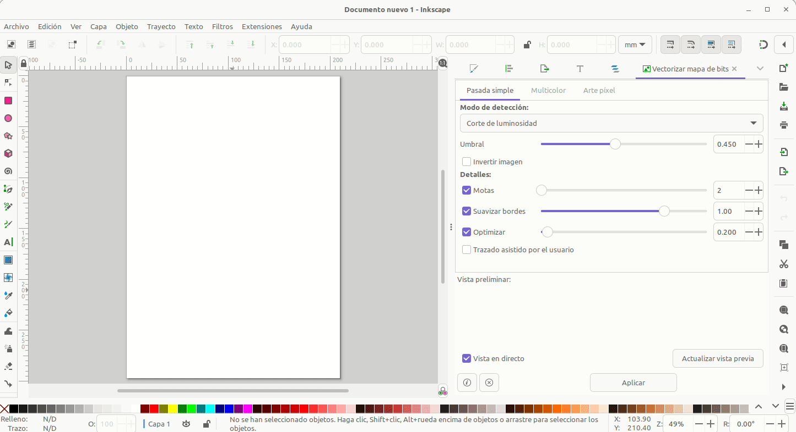
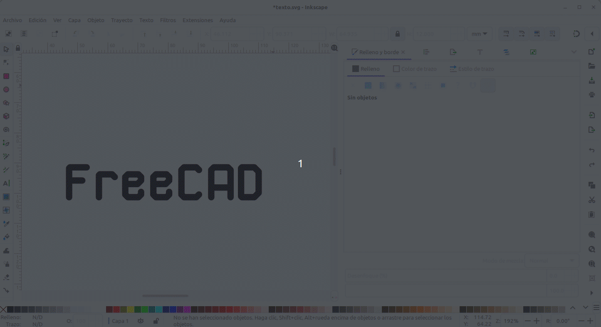
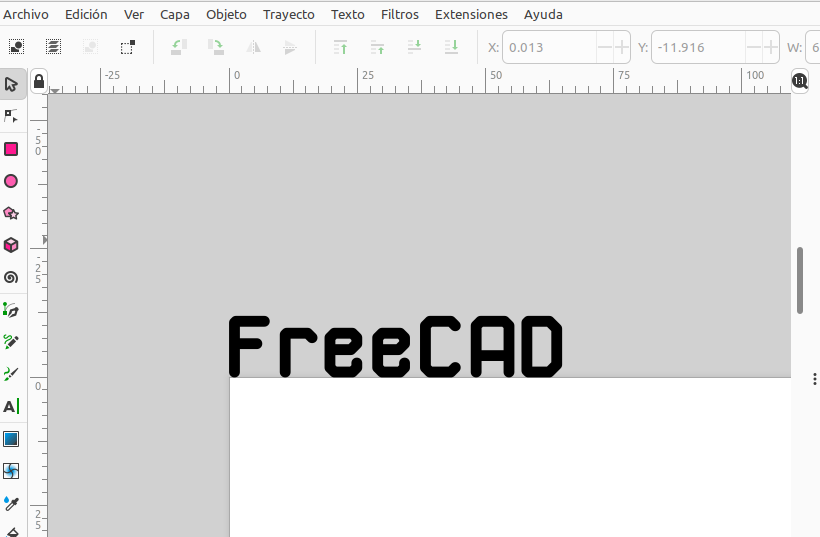
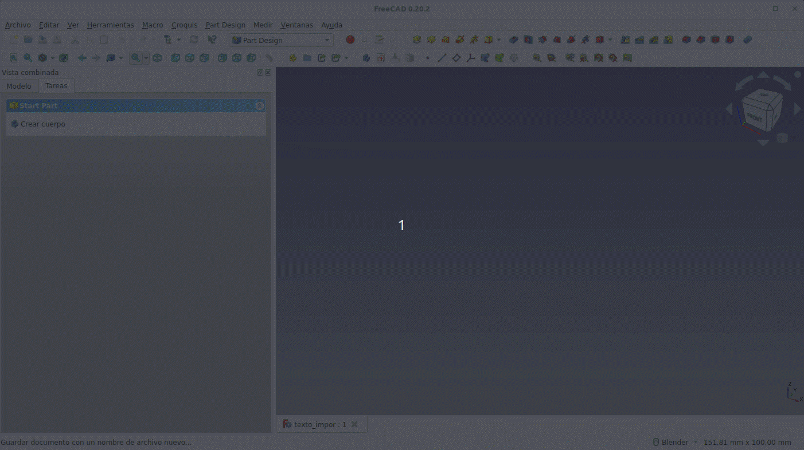
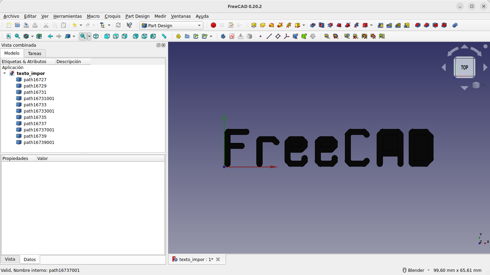
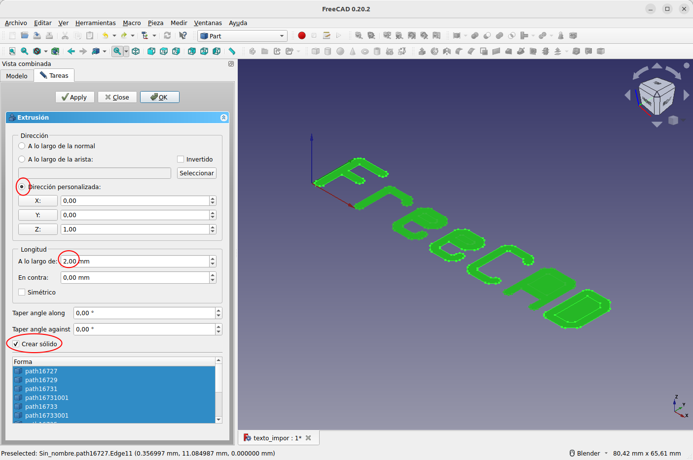
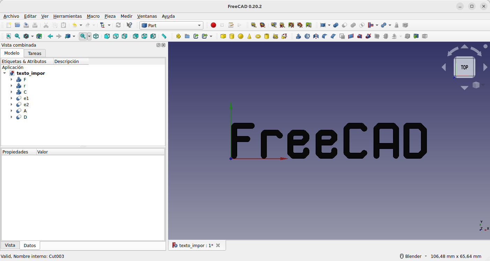

# Crear e importar texto
Para la creación del texto vamos a utilizar Inkscape (versión 1.2.2 en este ejemplo) a partir de su icono de texto,  hacer clic en la zona de trabajo y escribir el texto en la fuente seleccionada. Una ventaja inicial es que vamos a poder establecer el tamaño del texto a partir de sus propiedades de altura y anchura, para lo que es conveniente establecer las unidades en mm y bloquear la relación de aspecto con el candado. En la animación siguiente vemos estos procesos iniciales.

  
*Procesos iniciales en Inkscape para establecer tamaño del texto*

En la animación anterior vemos también como poner y quitar el relleno del texto.

En estos momentos el texto es un solo objeto y lo podemos editar, modificar la fuente, etc. Pero en estas condiciones no nos servirá de nada en FreeCAD por lo que debemos vectorizarlo o convertirlo en trayectos. En la animación vemos como hacer esto y podemos observar como una vez vectorizado ya no es editable como texto y que se trata de vectores que se han creado para cada letra.

  
*Convertir el texto en trayectos*

Ahora las letras quedan definidas por lo puntos o nodos que unen sus rectas o curvas de Bezier.

Vamos a desplazar el texto, de la forma que se aprecia en la figura siguiente, al origen de coordenadas de Inkscape que se sitúa en la esquina superior izquierda del papel. De esta forma el texto quedará situado a partir del origen de coordenadas de FreeCAD.

  
*Colocación del texto en el origen*

Ahora ya estamos en condiciones de guardar nuestro trabajo y lo vamos a hacer escogiendo el formato SVG Plano que da compatibilidad entre programas de dibujo vectorial o SVG (Scalable Vector Graphics) y que elimina toda la información relacionada con el programa que no tiene ninguna utilidad.

Ya podemos cerrar Inkscape y dirigirnos a FreeCAD donde crearemos un nuevo documento y realizaremos la importación del archivo SVG creado tal y como vemos en la animación siguiente.

  
*Importamos el texto en FreeCAD*

Lógicamente realizamos la importación como una geometria y vemos que cuando finaliza el trabajo (figura siguiente) se han creados una serie de elementos que conforman las diferentes letras. En algunos casos (e, A y D) podemos observar que se crean dos, uno para la parte externa y otro para la parte interna de la letra.

  
*Texto importado en FreeCAD*

Procedemos a realizar la extrusión de todos los elementos o bien desde Part o bien desde PartDesign creando elementos body. La configuración de la ventana de extrusión en Part la vemos en la figura siguiente.

  
*Configuración de la extrusión en FreeCAD*

Para obtener las letras e1, e2, A y D simplemente se realiza un corte a la parte exterior con la parte interna. En la figura siguiente vemos el trabajo finalizado en esta etapa con cada letra extruida renombrada para un mejor entendimiento.

  
*Letras individuales finalizadas*

El letrero completo como un solo elemento 3D se consigue uniendo todas las operaciones anteriores. A partir de esa unión ya podemos continuar el trabajo con el texto según la necesidad que tengamos.

En los enlaces siguientes tenemos el archivo de Inkscape y el archivo fuente de FreeCAD:

* [Enlace para descarga del archivo de Inkscape](../img/designs/10/texto.svg)
* [Enlace para descarga del archivo fuente de FreeCAD](../img/designs/10/texto_impor.FCStd)
