# Poner texto sobre superficies curvas
Ya hemos visto como podemos crear los textos con ShapeString o desde Inkscape. En el primer caso tenemos solamente algunas posibilidades de modificación del texto y en el segundo tenemos muchas mas, así que utilizaremos una u otra forma según nuestras propias necesidades.

## **Texto perpendicular a superficie**
En este primer caso vamos a crear el texto para colocarlo sobre una superficie circular perteneciente a un tubo como el que vemos en la figura siguiente. El texto lo haremos perpendicular a la cara coloreada.

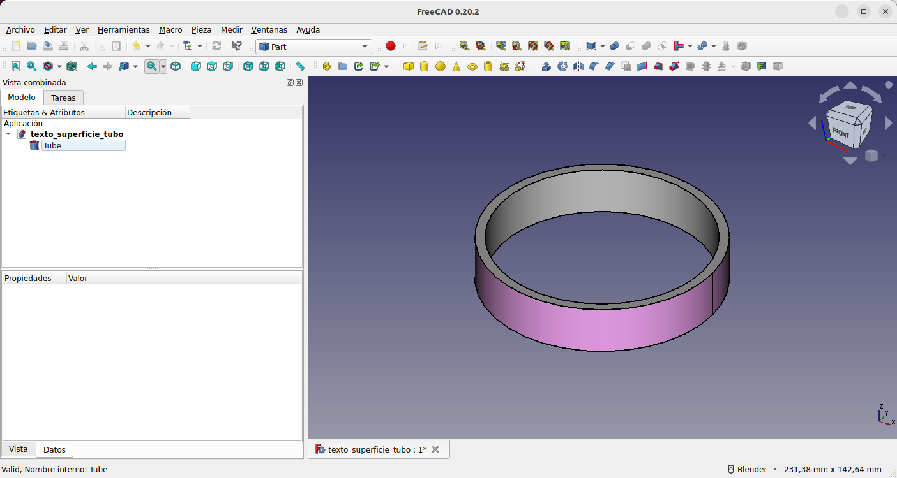  
*Solido en forma de tubo para colocar texto*

Vamos a ver las dos formas de preparar un texto para ponerlo perpendicular a una cara curva. El texto va a ser "Mis notas de FreeCAD" y la fuente LiberationSans-Bold.ttf

### Preparar con ShapeString
Creamos el texto con las propiedades de la figura siguiente.

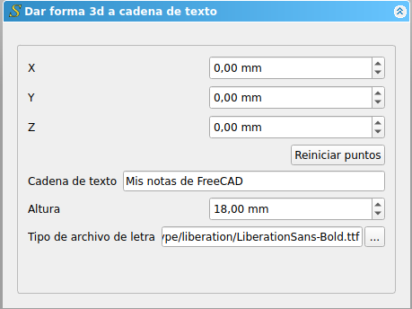  
*Texto a utilizar*

Si medimos la longitud (245mm) que ocupa el texto vemos que va a ser bastante inferior a la longitud de la superficie curva ($l = 2\cdot\pi\cdot r = 314,16 \space mm$). Lo que vamos a hacer para aproximar esas dos longitudes es escalar el texto respecto al eje X en un factor de 1,2. El proceso lo vemos en la animación siguiente.

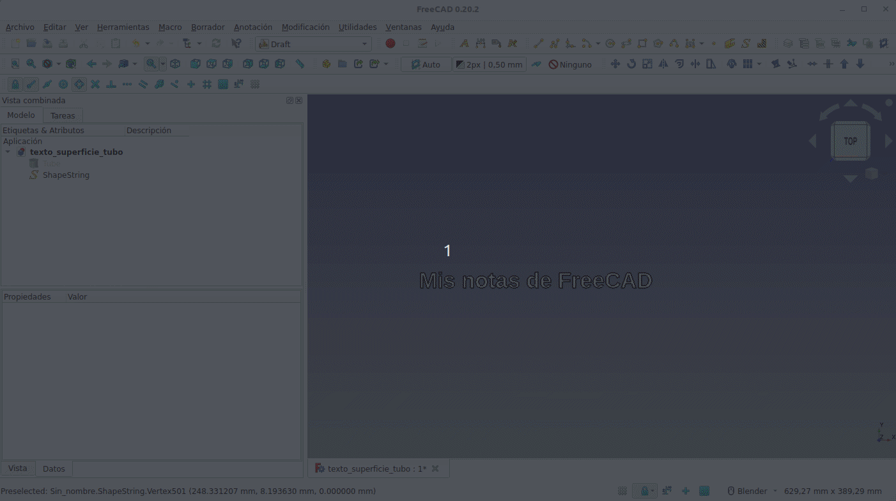  
*Escalado del texto a utilizar*

El paso siguiente va a ser convertir el ShapeString en un boceto utilizando la herramienta 'Borrador a croquis' que es una de las existentes en la barra 'Herramientas de modificación del borrador'. El proceso es muy sencillo y lo vemos en la animación siguiente.

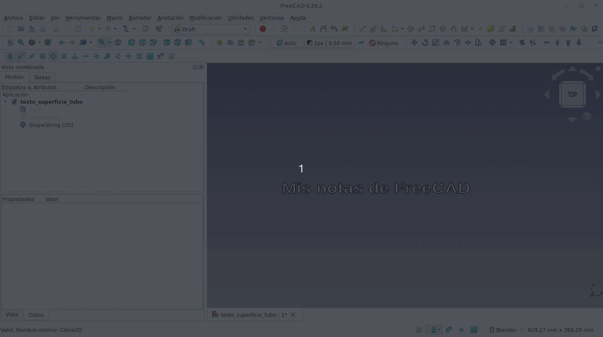  
*Convertir ShapeString a boceto*

### Preparar con Inkscape
Veamos ahora como preparar el texto a partir de algunas de las opciones que nos ofrece Inkscape, que además nos ofrece la posibilidad de aportar imágenes vectorizadas también. Para no trasladar información a FreeCAD que no sirva para nada lo primero que haremos, si es posible, es fijar el tamaño de nuestro documento aproximadamente al tamaño del boceto que finalmente vamos a crear. Lo podemos hacer dando un tamaño personalizado al formato estableciendo su altura y anchura o bien, si ya tenemos contenido, ajustando el tamaño del papel al contenido haciendo clic en el botón correspondiente. En la animación siguiente vemos como aplicar ambos para el texto que estamos trabajando.

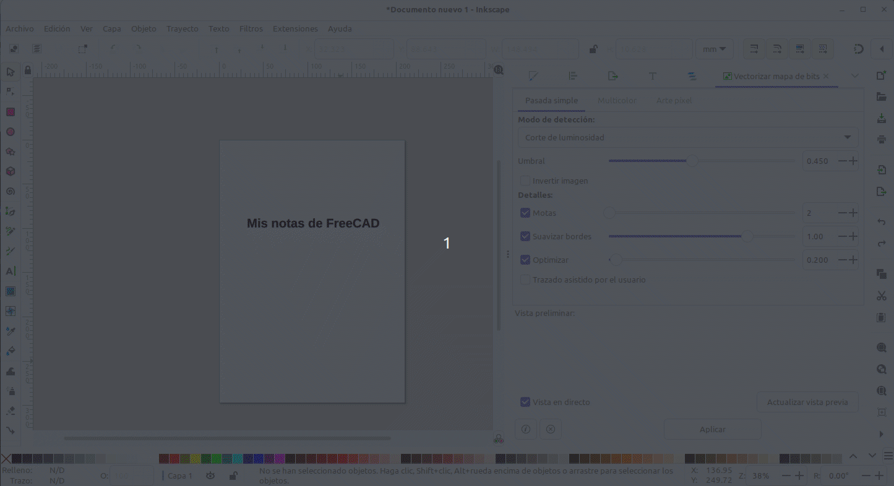  
*Establecer tamaño del formato en Inkscape*

La primera de las opciones que nos ofrece el programa es cambiar el tipo de fuente a cualquiera de las que tengamos en nuestro sistema, cambiarle sus atributos y establecer su tamaño de forma muy similar a como se hace en otros programas. En la animación siguiente vemos la forma de cambiar algunas de estas cosas.

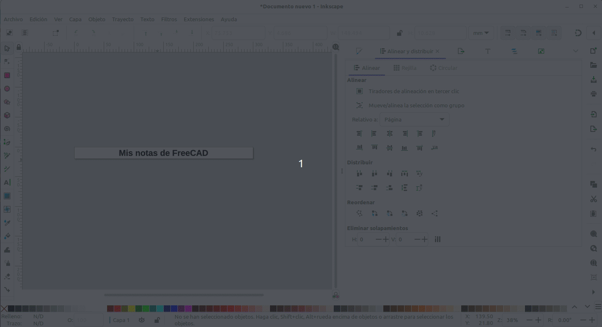  
*Establecer tipo y tamaño de fuente y sus atributos en Inkscape*

Si seleccionamos el modo edición podemos modificar el tamaño del objeto de texto y la posición libremente tal y como observamos en la animación siguiente.

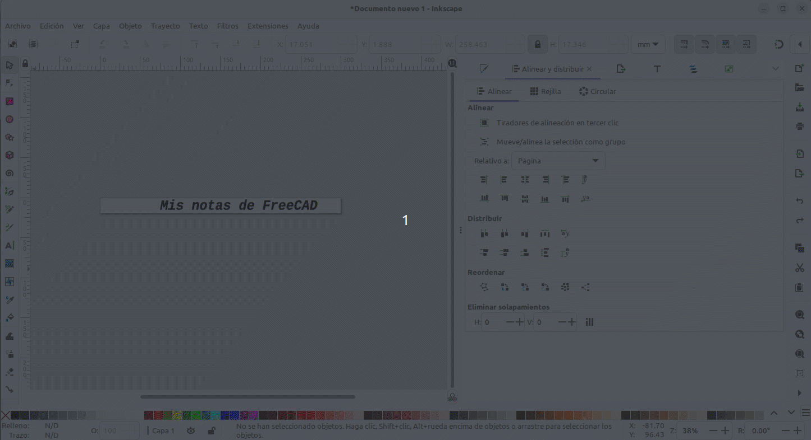  
*Cambiar posición y tamaño objeto de texto en Inkscape*

También podemos agragar algún objeto que no sea texto y activar o desactivar el relleno. Si trabajamos con capas estas tareas las podemos realizar para cada capa. En la animación siguiente vemos algunos elementos nuevos de los citados.

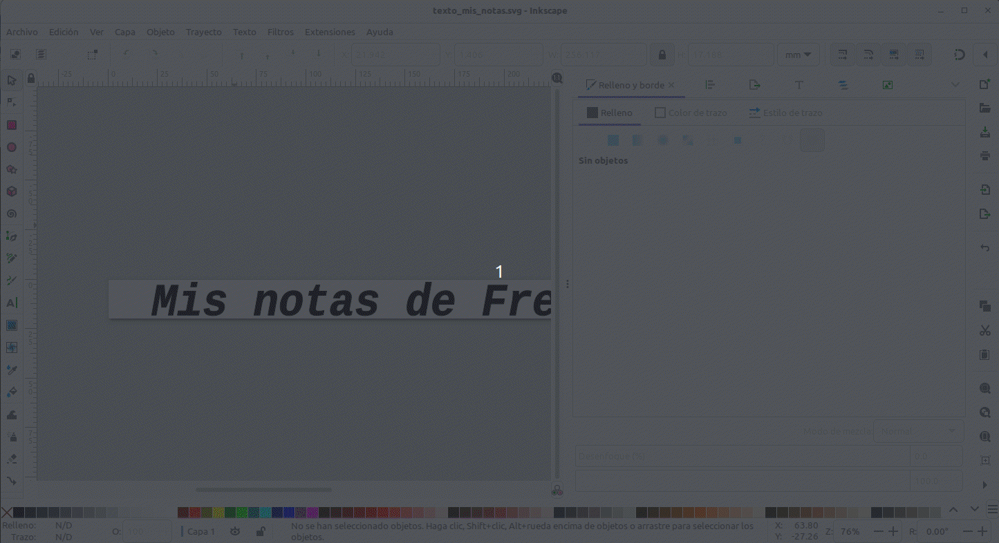  
*Capas, relleno y otros elementos*

Evidentemente hay muchas mas cosas que se pueden hacer con las capas y el resto de elementos, pero no es objeto de estas notas y simplemente damos unas pinceladas sobre Inkscape.

Otra ventaja de trabajar con Inkscape es que disponemos de mas opciones para el texto como son: tener texto en varias líneas y poder establecer el interlineado, la alineación del texto, establecer subindices y superindices, espaciado, dirección del texto horizontal o vertical o de izquierda a derecha o al contrario. Vemos diferentes opciones aplicadas al texto con el que estamos trabajando en la animación siguiente.

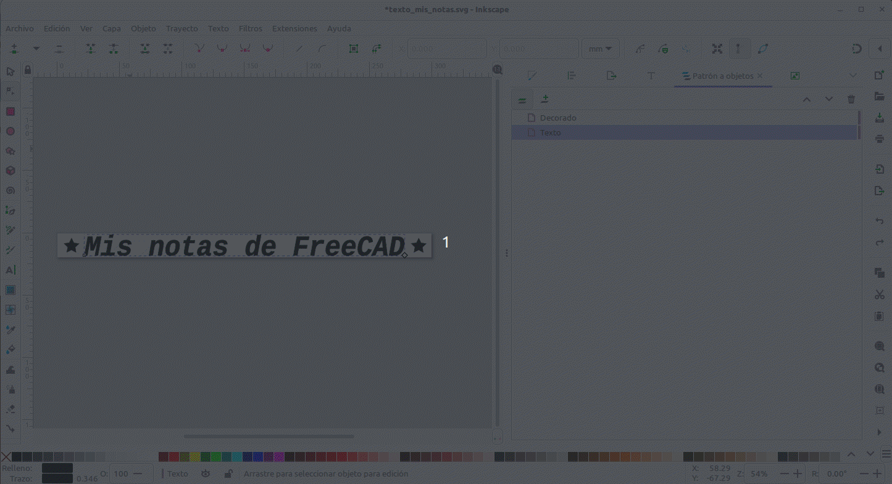  
*Opciones de texto en Inkscape*

Con esto es evidente la cantidad de opciones disponibles para confdigurar nuestro texto. Ya podemos convertir nuestros objetos a trayectos de la forma vista y guardar los cambios como SVG plano y dejarlos listos para importar desde FreeCAD.

Nos dirigimos a FreeCAD e importamos como geometria el diseño realizado en Inkscape, seleccionamos todos los path importados y los convertimos en un bloque utilizando el icono con la flecha hacia arriba y este lo convertimos en un boceto y ya tenemos el texto y las decoraciones listas para seguir trrabajando con ellas. En la figura siguiente vemos el estado actual del diseño con ambas opciones. Si observamos el árbol de objetos vemos que hemos utilizado grupos (carpetas) para organizar el trabajo.

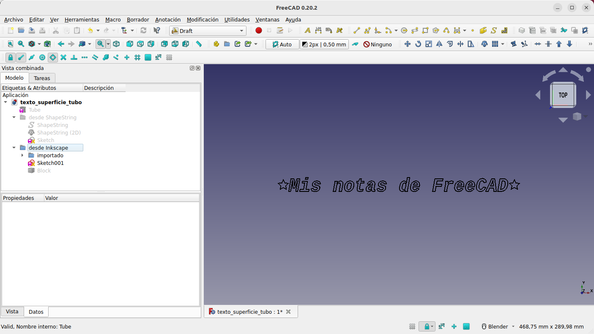  
*Estado del diseño con los bocetos creados*

### Como crear relieves y grabados
Siguiendo los procedimientos vistos en el apartado 9.3 sobre Boceto a superficie podemos seleccionar la cara a la que adosar el texto, el boceto manteniendo la tecla CTRL pulsada y hacer clic en el icono 'Sketch on Suface' de Curves. En primera instancia se crea el nuevo objeto, se oculta el boceto y aparentemente no pasa nada porque genera un error de generación del soporte para el texto (seguramente se arregalará en versiones posteriores de FreeCAD). Si entramos en el boceto creado dentro del nuevo objeto vemos que no se ha generado el rectángulo delimitador (ese es el error indicado), pero podemos arreglarlo de forma sencilla añadiendo manualmente la superficie que será el 'Support'. En la animación siguiente vemos como se aplican estos procesos y como finalmente el texto queda posicionado siguiendo la superficie. Además vemos como el tamaño del texto quizá resulte demasiado grande, pero para ejemplificar lo que queremos lo daremos por válido.

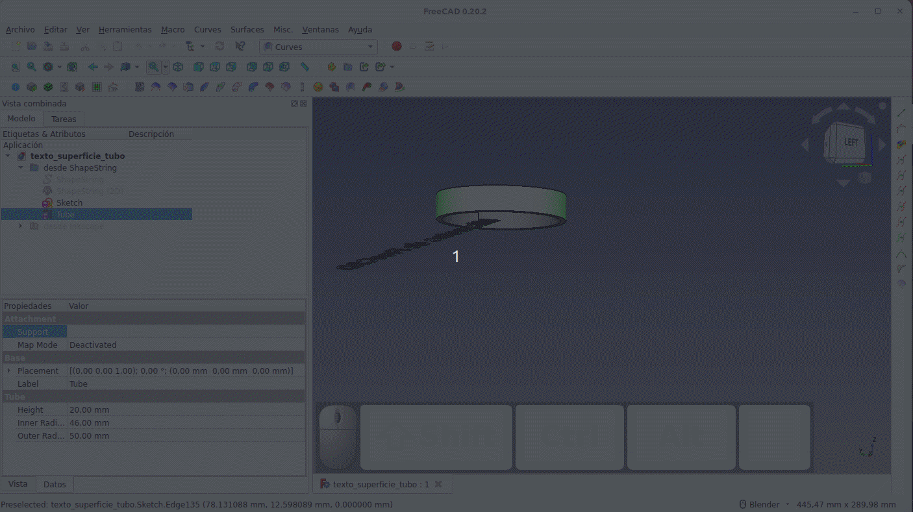  
*Posicionado del boceto en la superficie*

Una vez creado y configurado correctamente el objeto Sketch_On_Surface ya podemos crear, con las propiedades de este objeto, un extrusión en relieve o en grabado. Disponemos de la propiedad Tickness (espesor) para establecer la longitud de la extrusión si lo hacemos positivo y de grabado si lo hacemos negativo. La propiedad Fill faces permite que el relieve o el grabado sean con objetos sólidos. El cálculo del espesor se realiza a partir del valor de la propiedad Offset que nos va a permitir mover la posición de "pegado" del texto. Esto puede ser útil por ejemplo para que la unión del texto con el anillo no se realice justo desde la superficie sino que lo haga desde el interior, evitando así posibles puntos débiles de unión en la impresión futura, si es que ese es el objeto de nuestro diseño. En la animación siguiente vemos como realizar estas tareas.

  
*Creación del grabado y del relieve en Sketch_On_Surface*

Un proceso totalmente similar al anterior lo podemos seguir partiendo del texto elaborado con Inkscape y obtener resultados similares pereo aprovechando el potencial del programa para hacer cosas con el texto e incluso añadir bocetos de cosas que no sean texto.

En el enlace siguiente tenemos el Archivo fuente de FreeCAD conteniendo las dos opciones de crear texto y como ponerlo en una cara curva.

* [Enlace para descarga del archivo fuente de FreeCAD](../img/designs/10/texto_superficie_tubo.FCStd)

## **Texto circular**
Ahora vamos a ver como podemos colocar texto en forma de círculo sobre una cara que puede ser plano o curva. Vamos a crear para ello una especie de arandela a partir del boceto de la figura siguiente.

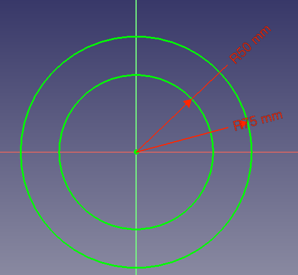  
*Boceto de partida para crear la arandela*

Salimos del boceto y desde el banco Part extruimos 3 mm. La idea es colocar texto en la cara verde de la figura siguiente de forma circular a la misma.

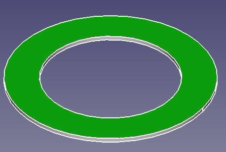  
*Cara donde color el texto en círculo*

Vamos a comenzar por crear un objeto Sketch_On_Surface desde el banco Curves seleccionando la cara sobre la que queremos trabajar antes de hacer clic en la herramienta. Si desplegamos el objeto creado, ocultamos el sólido 3D y entramos en editar el boceto mapeado que se crea veremos que la superficie de trabajo ha quedado delimitada por dos círculos auxiliares de idénticas dimensiones que los del boceto de partida. En la animación siguiente vemos el proceso.

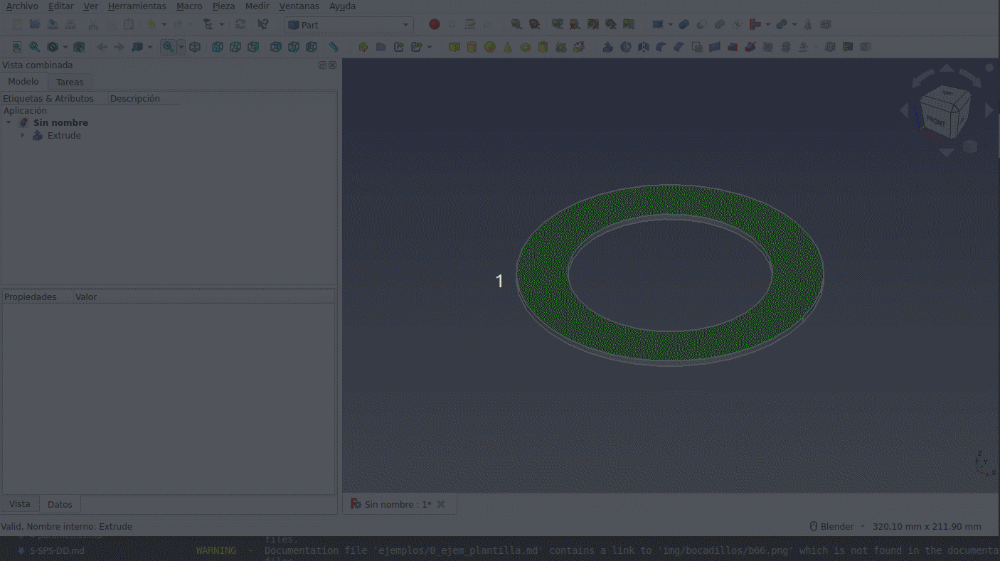  
*Creación del boceto mapeado*

Lo que obtenemos así es una geometría de construcción constituida por dos círculos que básicamente no tiene sentido porque inicialmente la delimitación debería ser un rectángulo. Luego este proceso, al menos en las versiones actuales de FreeCAD, no nos vale para nuestro propósito, así que eliminamos el objeto Sketch_on_Surface creado desde el árbol de objetos. Recordemos que no se puede usaar para este propósito la opción deshacer.

Podráimos pensar que eliminando esta geometría de construcción y creando nosotros el rectángulo también con líneas auxiliares y escribiendo el texto en el mismo lo podemos solucionar, pero si lo intentamos comprobaremos que el texto no se coloca de forma circular siguiendo la superficie del boceto de partida, así que este método tampoco nos vale. Es decir, que el método visto anteriormente funciona solamente sobre superficies curvas pero no sobre caras planas.

Una solución puede ser crear una superficie con cierta curvatura mínima que siga el anillo de la arandela y así poder situar el texto sobre la misma de forma conveniente. Vamos a ver el proceso para realizar esto.

Eliminados todos los objetos entramos en edición del boceto de partida y nos situamos en una vista frontal y desde el banco de trabajo Sketcher creamos un boceto perpendicular al de partida, es decir sobre el plano XZ. Para poder crear dos puntos auxiliares de referencia sobre el boceto de partida usaremos la herramienta 'Vista de sección' y marcaremos con la herramienta Geometri externa los puntos de corte con el eje X. En la animación siguiente podemos ver estos procesos para finalmente crear el boceto con una leve curvatura que definirá la superficie.

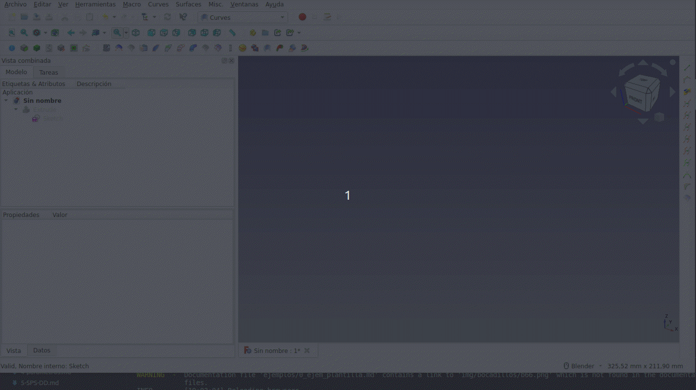  
*Creación del boceto para superficie curva*

Ya nos podemos dirigir al banco Part y crear una superficie curva a partir de este boceto con la herramienta Girar y lo haremos respecto al eje Z, tal y como se aprecia en la animación siguiente.

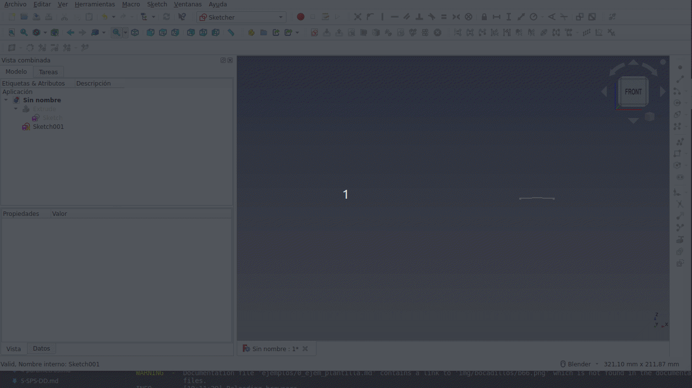  
*Creación de la superficie curva*

Ya tenemos la superficie curva, que sigue la cara plana de la arandela, creada sobre el plano XY, o lo que es lo mismo sobre la cara inferior de la extrusión. Si lo queremos sobre la cara superior podemos, por ejemplo, invertir la dirección de extrusión poniendo a true la propiedad Reversed, que es lo mas sencillo en este caso. En la animación siguiente vemos la arandela y la superficie finales creadas.

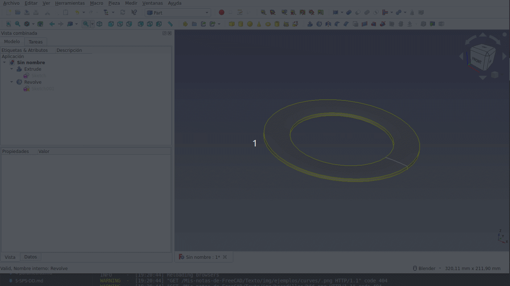  
*Arandela y superficie curva*

Ahora ya podemos crear nuestro objeto Sketch_On_Surface y el texto para que se coloque de forma circular. Nos dirigimos al banco Draft (también se puede hacer el texto desde Inkscape) y creamos nuestra cadena de texto con la fuente que mas nos guste. La idea es tener una situación similar a la que vemos en la figura siguiente.

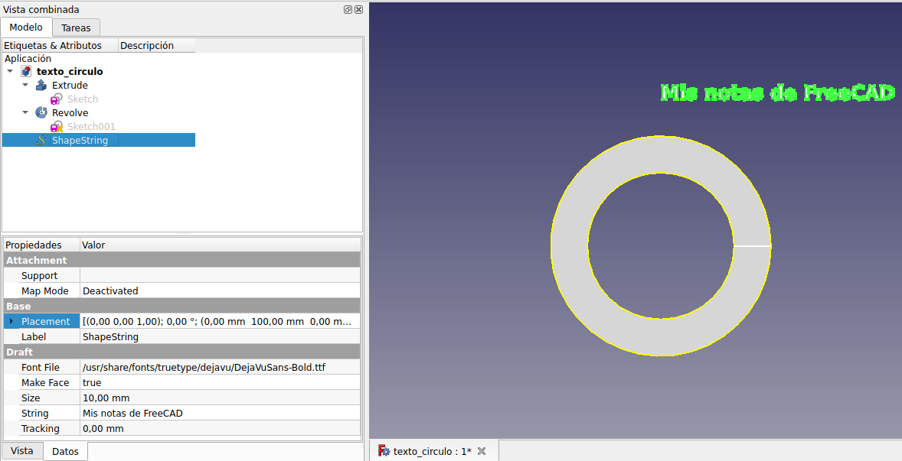  
*Cadena de texto creada*

En esta situación vamos a crear el objeto Sketch_On_Surface seleccionando la superficie curva y una vez creado entramos en el boceto mapeado donde podremos apreciar que las referencias creadas no lo están respecto a la cadena de texto ni a la superficie, sino algo un poco extraño que no nos va a servir para nuestros propósitos. En la animación siguiente vemos este proceso.

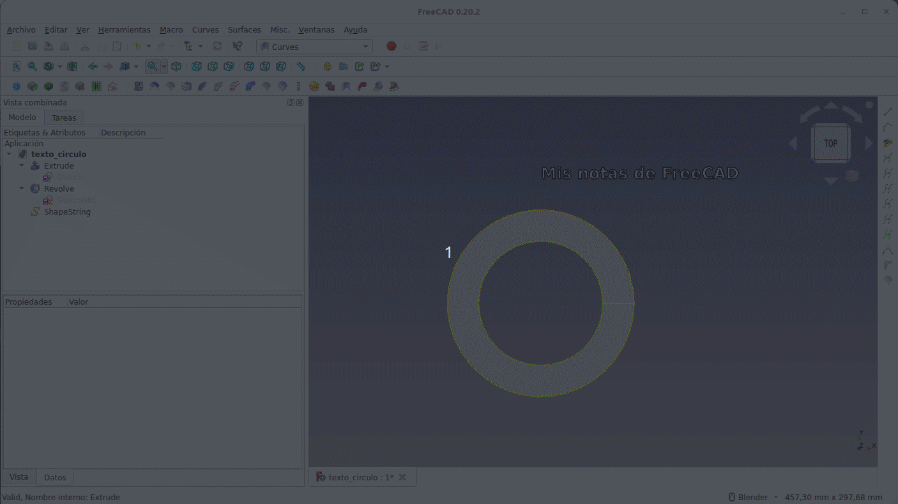  
*Boceto mapeado que se crea al crear Sketch_On_Surface*

Como el boceto creado no nos sirve vamos a borrarlo y crear, en el boceto mapeado, nuestra propia geometría de construcción a la que añadiremos unas líneas de referencia que enmarquen el texto. En la animación siguiente vemos el proceso a seguir para hacer esto.

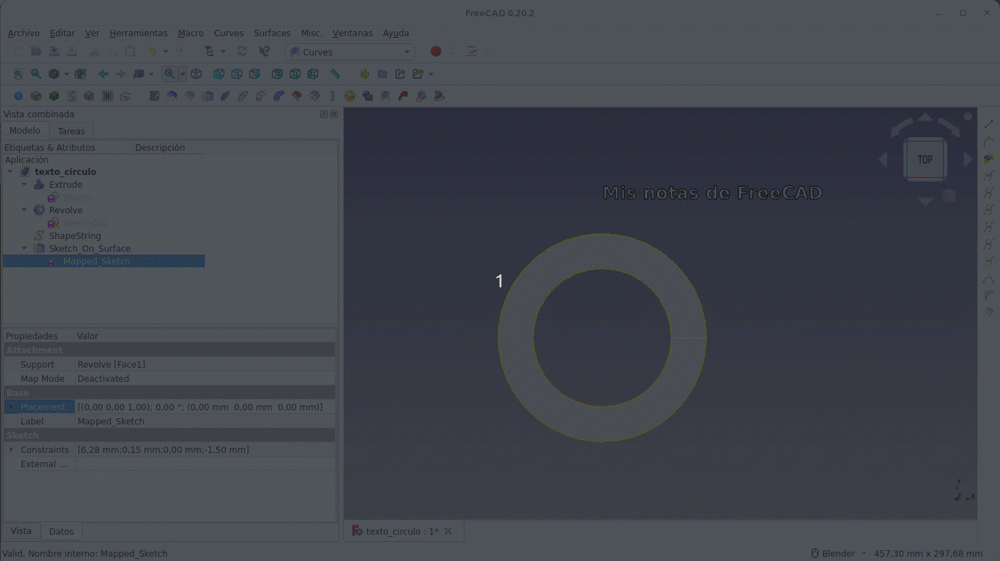  
*Borrado del contenido creado en el boceto mapeado y edición del mismo*

Ahora si podemos apreciar como las dos líneas creadas cubren el anillo que forma la superficie curva pero el texto no está. Necesitamos conocer la longitud del anillo externo, lo que podemos obtener mediante cálculo o con la herramienta de información de Curves. En cualquier caso su longitud es 471,24mm y la anchura del anillo es de 25mm. Procedemos a acotar el rectángulo de construcción con estas medidas para que nos quede algo similar a lo que vemos en la figura siguiente.

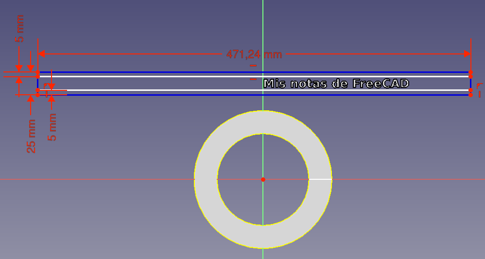  
*Acotación del boceto mapeado*

Cerramos el boceto y aún no aparece el texto en forma circular sobre la superficie. Nos queda ajustar una propiedad de Sketch_On_Surface y es asociar el ShapeString a Extra Object tal y como vemos en la animación siguiente.

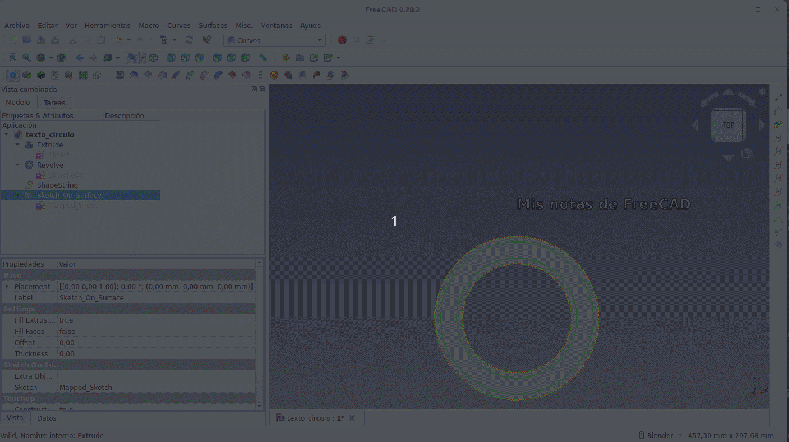  
*Ajuste de la propiedad Extra Object y sus efectos*

Si en estas condiciones ajustamos las propiedades de Sketch_On_Surface para relieve o grabado se va a extruir la superficie delimitada por las dos líneas, tal y como vemos en la figura siguiente.

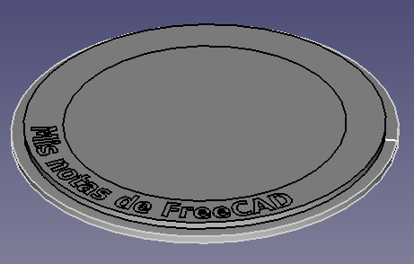  
*Relieve con las líneas presentes en el boceto mapeado*

Simplemente debemos convertir las líneas en auxiliares o eliminarlas directamente del boceto. En la figura siguiente vemos el resultado final incluida la edición del texto y la creación de la unión booleana. Antes de convertir las líneas nos aseguramos de que el texto editado esté dentro del rectángulo delimitador de la superficie a la que se tiene que aplicar.

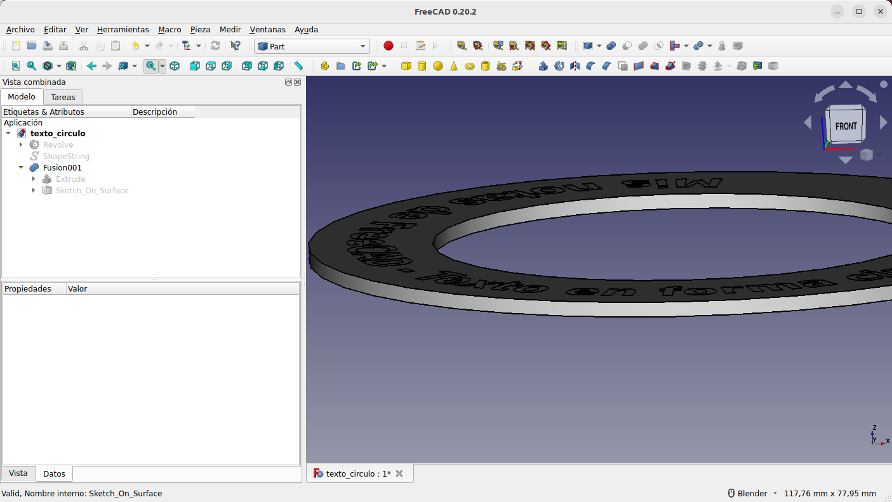  
*Fusión que aparentemente no ofrece el resultado deseado*

El resultado no es el deseado pero la fusión se ha realizado correctamente, simplemente ha ocurrido que las coordenadas de Placement de ambos objetos se han reseteado a 0,0,0 y por lo tanto hay que mover en Z uno de ellos. En la figura siguiente ya vemos esta fusión correctamente realizada tras mover en el eje Z uno de los objetos.

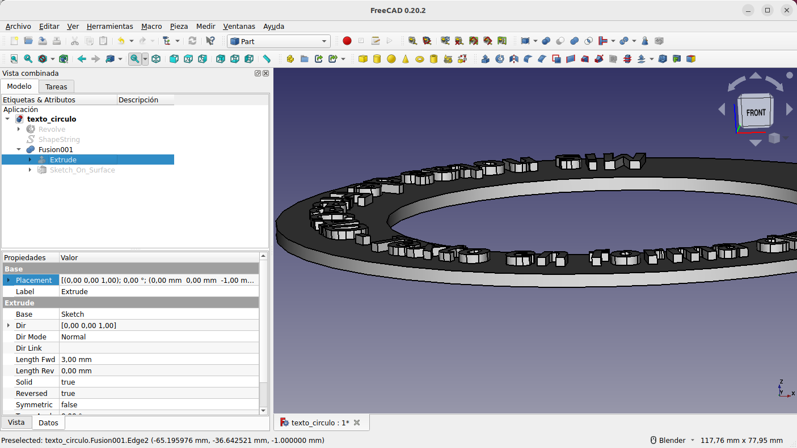  
*Objeto 3D con texto en forma circular*

En el enlace siguiente tenemos el Archivo fuente de FreeCAD final:

* [Enlace para descarga del archivo fuente de FreeCAD](../img/designs/10/texto_circulo.FCStd)
