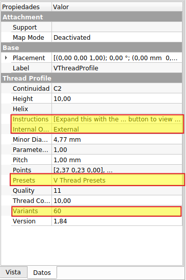
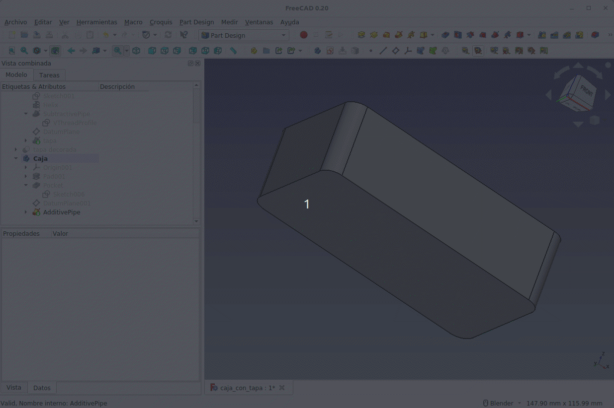
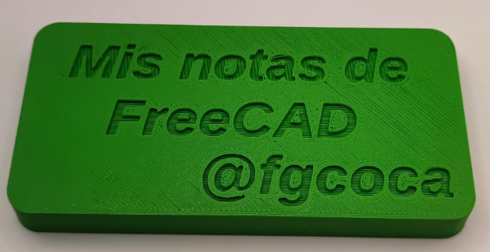

# Banco de trabajo ThreadProfile
Este banco de trabajo se utiliza exclusivamente para crear hilos de rosca a partir de un objeto de perfil 2D creado con el mismo a lo largo de una hélice de la altura y el paso apropiados. Es compatible para su uso en los bancos de trabajo Part y Part Design de FreeCAD y su barra de herramientas estará disponibles en ambos bancos como una mas de los mismos. Esto facilita el uso pues no hay necesidad de cambiar de banco de trabajo para trabajar con ThreadProfile. En el caso de usar en Part Design si hay un cuerpo activo, el objeto ThreadProfile se creará dentro de ese cuerpo. El proceso es crear el objeto ThreadProfile y después hacemos clic en el icono de la barra de herramientas 'Crear hélice' para crear una hélice que será dependiente del objeto ThreadProfile. Seleccionando ambos objetos se activa la herramienta barrido que nos creará el perfil de rosca ocultando los otros dos objetos. Se pueden crear tanto roscas externas como internas. En el banco de trabajo Part, se usaría la herramienta 'Barrido', que al final habría que realizar una booleana que cortarse (si es una rosca interna) a un objeto adecuado, como por ejemplo un hexágono extruido.

Antes de entrar en el uso y configuración de las herramientas veamos como usarlas en la animación de la Figura siguiente.

  
*Uso inicial del banco de trabajo ThreadProfile*

Vamos a describir cada una de las herramientas del banco de trabajo.

## **Crear perfil de rosca en V**
Se accede a la herramienta haciendo clic en el primero de los iconos de las barra de herramientas.

Este tipo de rosca se aplica para sujeción por fricción o ajuste y se suelen utilizar como roscas de precisión. Al hacer clic en el icono se crea el objeto ThreadProfile de hilo de rosca en V con unas propiedades predeterminadas que debemos establecer según nuestras propias necesidades a partir de la pestaña 'Datos' que vemos en la Figura siguiente, donde se han destacado las mas importantes en general.

  
*Pestaña datos para rosca en V*

### Instructions (instrucciones)
Esta propiedad nos da en inglés las instrucciones que debemos seguir para crear el hilo de rosca y que pongo aquí también traducidas.

|Originales en inglés|Traducidas|
|---|---|
|**1** Expand this with the ... button to view instructions   **2** Sweep this object along a helix of the same pitch to produce your thread.  **3** It is recommended to make the helix in the ThreadProfile workbench.  **4** If there is an active Body the ThreadProfile object will be put into it.,If not it can be dragged and dropped into the body later.  **5** If there is an active Body when the helix is made there will be made a ShapeBinder for it  **6** For internal threads you will need to cut the Sweep object out of a cylinder, or if using Part Design sweep it as a Subtractive Pipe.  **7** Always use Frenet mode.  **8** I have provided some presets, but it is possible there could be some errors.  Double check for mission critical applications.  **9** Also, the tolerances might be different from what you wish to have.  I believe the internal minor diameters are all minimum and the external are all maximum.|**1** Amplíe esto con el botón ... para ver las instrucciones   **2** Crear barrido de este objeto a lo largo de una hélice del mismo paso para producir su hilo.   **3** Se recomienda hacer la hélice en el banco de trabajo ThreadProfile.  **4** Si hay un cuerpo activo, el objeto ThreadProfile se colocará en él. Si no, se puede arrastrar y soltar en el cuerpo más tarde.  **5** Si hay un cuerpo activo cuando se crea la hélice, se creará un ShapeBinder para él.  **6** Para las roscas internas, deberá cortar el objeto de barrido de un cilindro o, si se usa PartDesign, barrerlo como una tubería sustractiva.  **6** Utilice siempre el modo Frenet.  **7** Hay algunos ajustes preestablecidos, pero es posible que haya algunos errores. Debemos verificar el resultado final.  **8** Además, las tolerancias pueden ser diferentes de las que queremos tener.|

### Internal or external
Propiedad que permite seleccionar si lo que queremos hacer es un hilo de rosca interno (tuerca) o externo (tornillo), pero esto debe adaptarse al proceso de diseño previo, como veremos posteriormente. Como hemos visto en el ejemplo inicial crear un hilo de rosca es sencillo, pero por ese método no se puede crear una rosca interna.

### Presets
Esta propiedad nos despliega una ventana con un gran número de tipos de hilos de rosca predefinidos para distintos tipos de roscas como: manguera de jardín NHR, hasta M100 gruesa y fina y roscas en pulgadas UNF (paso fino) y UNC (paso grueso) que son las dos principales categorías del Estándar Unificado del hilo de rosca utilizado en Estados Unidos.

### Variants
A partir de la versión v1.75 hay una propiedad Variants en los tipos de subprocesos V que permite 4 opciones:

* 60 -- es el subproceso v estándar
* 45 -- una variante experimental no estándar de 45 grados enfocada a impresión 3D
* 2-Start (Inicio) -- un hilo en V de 2 entradas
* 3-Start (Inicio) -- un hilo en V de 3 entradas

## **Crear perfil de rosca de contrafuerte**
Se accede a la herramienta haciendo clic en el segundo de los iconos de las barra de herramientas.

Son conocidos como [Buttress thread](https://en.wikipedia.org/wiki/Buttress_thread) y son formas de rosca de contrafuerte, también conocidas como formas de rosca de diente de sierra o formas de rosca de bloqueo de recámara. son perfiles roscados de forma asimétrica, con una cara cuadrada y la otra inclinada.

El método de utilización es totalmente similar al del hilo de rosca en V y vamos a omitir mas detalles sobre este tipo dado que normalmente se utiliza muy poco en nuestro pais.

## **Crear perfil de rosca de botella**
Se accede a la herramienta haciendo clic en el tercero de los iconos de las barra de herramientas.

Crea un objeto de tipo rosca de botella. Las especificaciones de una rosca de este tipo se basa en la definición de los parámetros de fabricación que vemos en la Figura siguiente.

  
*Especificaciones rosca botella*

La rosca se conoce como medida **T** y la altura en función del número de vueltas del hilo se le conoce como **H**.

La cantidad de vueltas de un hilo de rosca se suele especificar de la forma siguiente:

* 400 - 1 vuelta de hilo de rosca
* 410 - 1,5 vueltas de hilo de rosca
* 415 - 2 vueltas de hilo de rosca
* 425 - 2 vueltas de hilo de rosca fino

La medida **E** especifica el diámetro del cuello antes del hilo de rosca y la medida **I** hace referencia al diámetro interno del cuello.

## **Crear hélice**
Se accede a la herramienta haciendo clic en el cuarto de los iconos de las barra de herramientas.

El comando crea una hélice y establece su propiedad Pitch (paso) coincidente con la propiedad Pitch del objeto ThreadProfile de forma paramétrica. De esta forma cualquier cambio en la propiedad ThreadProfile.Pitch también hará que la propiedad Helix.Pitch se actualice.

También se establece la propiedad Helix.Height (altura de la hélice) como ThreadProfile.Pitch * ThreadProfile.ThreadCount, lo que garantiza que la propiedad Helix.Height sea tal que el hilo producido en el barrido tendrá ThreadProfile.ThreadCount hilos garantizando una buena entrada y salida del hilo de rosca. Esto también está vinculado paramétricamente.

Si existe un cuerpo activo cuando se crea la hélice, entonces la hélice se colocará en el cuerpo activo.

## **Barrido**
Se accede a la herramienta haciendo clic en el quinto de los iconos de las barra de herramientas. Solamente estará activo si tenemos previamente creados el perfil de rosca y la hélice y los tenemos seleccionados en el árbol de objetos.

## **Calculadora en línea**
El último de los iconos debería dar acceso a una calculadora en línea para los diferentes hilos de rosca, pero al menos para la versión 0.20 bajo Ubuntu 22.04 LTS no está disponible en ninguna de sus opciones.

Vamos a ver lo sencillo que es trabajar con esta herramienta a través de ejemplos de creación de tornillos y tuercas.

## **Ejemplos de uso**

### Tornillo y tuerca M10
Vamos a diseñar ambos a partir de las especificaciones vistas en el apartado 7.4. Tornillos y tuercas. Con estos parámetros dibujamos el boceto de la imagen siguiente para lo que, logicamente, hemos creado un body y un sketch en PartDesign. Es MUY importante que el diámetro del orificio central sea menor que el radio mínimo de la rosca, no importa cuanto sea su valor pero si que cumpla esta condición, en este caso menor que 8mm.

  
*Boceto tuerca M10*

Podemos ya crear el objeto VThreadProfile escogiendo como Presets la opción M10 Coarse 1.5 y tipo de rosca Internal. En la figura siguiente vemos el estado actual de nuestro diseño.

  
*Boceto tuerca M10 y objeto VThreadProfile*

Nos vamos a asegurar de que el objeto VThreadProfile y el orificio para la rosca creado en el boceto son concentricos. Para ello seguimos el procedimiento que vemos en la animación de la Figura siguiente.

  
*Boceto tuerca M10 y objeto VThreadProfile concentricos*

Ahora procedemos a extruir el boceto los 8mm requeridos. Con el objeto VThreadProfile seleccionado creamos la hélice correspondiente para tener la situación requerida para crear el barrido. En la animación de la Figura siguiente vemos el proceso final de creación de la rosca interna de la tuerca.

  
*Creación de la rosca de la tuerca M10*

Observamos como el proceso de creación y validación es un proceso que requiere mucha computación y por tanto puede ser lento.

Para finalizar el diseño nos resta crear el achaflanado de los vértices, que en el caso de las tuercas es en ambas caras de la misma. Nos situamos en una vista frontal y creamos un nuevo boceto en el plazo XZ. Establecemos como 'Estilo de dibujo' el 'modelos de alambres' y creamos un boceto como el que vemos en la Figura siguiente, donde vemos como la arista izquierda de la pieza se ha utilizado para crear una línea de construcción. En la figura vemos también el aspecto final del diseño.

  
*Boceto para achaflanado y aspecto final de la tuerca M10*

El desarrollo del tornillo es como vimos al principio pero estableciendo los datos requeridos y añadiendo la cabeza y el vástago no roscado. Nos basaremos en los mismos datos que los de la sección 7.3.1. Rosca exterior para crearlo.

Creamos un boceto que nos permita mantener centrado el objeto VThreadProfile de la misma forma que hicimos con la tuerca. En este caso los datos del objeto los configuramos como se destaca en la figura siguiente.

  
*Datos de VThreadProfile para la rosca del tornillo M10*

El siguiente paso es crear la hélice y hacer el barrido para obtener el resultado que vemos en la figura siguiente:

  
*Rosca del tornillo M10*

Ahora procedemos a extruir invertido el boceto inicial una longitud L-b = 40-32 = 8mm y sobre la cara inferior creamos el boceto hexagonal para hacer la cabeza del tornillo. El proceso es totalmente similar al seguido en la tuerca por lo que lo vamos a omitir y simplemente mostramos el resultado final que está disponible como fichero [M10.FCStd](../img/designs/7/M10.FCStd) para su descarga. El aspecto final del tornillo M10 y los últimos detalles de diseño los vemos en la figura siguiente.

  
*Tornillo final M10*

Es de destacar que el trabajo a nivel de ordenador puede resultar lento (depende del equipo que estemos utilizando) por el peso de los cálculos que el programa tiene que llevar a cabo y quizá un método de diseño haciendo primero todas las partes del tornillo nos roscadas y la cabeza y al final la rosca hubiese sido mas conveniente.

### Caja y tapa machihembradas
Vamos a diseñar una pequeña caja con su tapa que va a disponer de una guia de encaje machihembrada y en la que la tapa va a ir sujeta sujeta por un tornillo central metálico M4x30mm quedando la cabeza del mismo embutida en la base. Las dimensiones externas de la caja van a ser 100x50x30 y tendrá las esquinas redondeadas con un radio de 6mm y la tapa tendrá las mismas dimensiones pero con una altura de 10mm.

Vamos a comenzar haciendo la tapa de la caja que partiremos de dibujar un boceto como el de la figura siguiente que extruiremos 10mm.

  
*Boceto inicial para la tapa*

Observese la cota dependiente de la otro con nombre y las restricciones existentes. El rectángulo con esquinas redondeadas se ha dibujado utilizando la herramienta 'Crear rectángulo redondeado'.

Sobre el plano de la base inferior vamos a dibujar un boceto de un círculo de radio 1mm centrado en el origen (porque la tapa también lo está) que no servirá de guía para la rosca M4 que vamos a crear.

Creamos el objeto VThreadProfile y ajustamos sus propiedades de la siguiente forma:

* **Map Mode=** Concentrico con el boceto de 1mm de radio.
* **Map Reverse=** true
* **Height=** 5mm
* **Internal Or External=** Internal
* **Presets=** M4 Coarse 0.7
* **Quality=** 3

La propiedad **Map Reverse=** true hará que el sentido del hilo de rosca sea hacía arriba penetrando en la caja los 5mm establecidos en su altura.

La propiedad **Quality=** 3 establece en 3 la calidad de la rosca a crear. El nivel de calidad puede variar desde 1 = Calidad máxima hasta 12 = calidad mínima. Hay que tener precaución con el valor porque puede ralentizar bastante a nuestro ordenador.

Creamos la hélice y procedemos con el barrido de la forma habitual para obtener la tapa con agujero roscado que vemos en la Figura siguiente.

  
*Tapa con agujero roscado M4*

El siguiente paso va a consistir en crear una ranura para el sistema de machihembrado. Para hacerla vamos a utilizar la herramienta 'Tubo sustractivo' que necesitará de dos bocetos, uno con la forma del tubo y el otro para el recorrido. Comenzamos creando el recorrido sobre el plano de la base inferior con el boceto de la Figura siguiente.

  
*Boceto para la ranura en la tapa*

El boceto con la forma del tubo debe estar situado en un plano perpendicular a la trayectoria del barrido y lo vamos a situar en un punto, es decir, hacemos clic en la herramienta plano de referencia, seleccionamos el punto y la arista que vemos en la animación siguiente y hacemos que el plano sea perpendicular a dicha arista.

  
*Creación de un plano en un punto y normal a una arista*

Ahora procedemos a crear el boceto en el plano y hacer el barrido sustractivo tal y como vemos en la animación siguiente.

  
*Creación de un plano en un punto y normal a una arista*

Comenzamos por crear un boceto idéntico al de la tapa que vamos a extruir 30mm en sentido inverso. Sobre la cara superior del objeto 3D creamos el boceto de la Figura siguiente con el que hacemos un vaciado de 23mm y obtenemos la caja a falta del machihembrado y del orificio para el tornillo.

  
*Boceto para el vaciado de la caja*

Seleccionando la cara superior de la caja anterior como plano creamos el boceto que será la trayectoria de creación del tubo aditivo en esta ocasión.

  
*Boceto para la trayectoria del tubo aditivo de la caja*

En la animación siguiente vemos como crear el plano, el boceto y el tubo aditivo.

  
*Creación del tubo aditivo de la caja*

El siguiente paso es crear el orifico y el alojamiento del tornillo en la base de la caja. En la animación siguiente vemos el proceso para hacerlo.

  
*Base de la caja*

En la Figura siguiente vemos el aspecto de la caja con un plano de recorte colocado en Y donde se aprecia el tornillo M4x30 ISO7045 que hemos colocado desde el banco de trabajo Fastener.

  
*Plano de recorte de la base de la caja con tornillo*

A continuación tenemos los enlaces a los archivos de la caja.

- Archivo fuente de diseño: [caja_con_tapa.FCStd](../img/designs/7/caja_con_tapa.FCStd)
- Asrchivos STL: [caja.stl](../img/designs/7/caja.stl) y [tapa_decorada.stl](../img/designs/7/tapa_decorada.stl)
- Archivos STEP: [caja.step](../img/designs/7/caja.step) y [tapa_decorada.step](../img/designs/7/tapa_decorada.step)

A continuación vemos imágenes de ambas piezas en modo diseño y en modo real.

|Pieza|Diseño|Sección|Fotografía|
|:-:|:-:|:-:|:-:|
|Tapa||||
|Caja||||

En la imagen siguiente vemos la apariencia de la caja montada.

  
*Fotografía de la caja impresa en 3D con la tapa colocada*

### Bote con tapón
Vamos a utilizar la herramienta desde el banco de trabajo Part para crear un bote con tapa roscada. Nos situamos en el citado banco de trabajo y comenzamos a trabajar. Si por algún motivo no se activan las herramientas de ThreadProfiles las activamos desde su propio banco de trabajo.

Comenzamos por crear la tapa, para lo que seguimos el siguiente proceso:

* 1.- Creamos un objeto *Bottle_M_ThreadProfile* al que establecemos su propiedad 'Preset' a 100-SP400(M) 5.08, con rosca externa.
* 2.- Con *Bottle_M_ThreadProfile* creamos la hélice que se asocia al mismo.
* 3.- Con ambos objetos seleccionados en el árbol creamos el barrido y obtenemos la pieza que vemos en la Figura siguiente:

*Barrido para tapa de bote*

* 4.- Creamos un cilindro y lo configuramos con un radio de 52mm y una altura de 13mm. Dimensiones suficientes para crear las paredes con rosca de la tapa.
* 5.- Seleccionamos primero el cilindro y después el barrido y creamos un operación de corte o diferencia y tenemos la tapa en bruto.
* 6.- Con la arista circular superior seleccionada aplicamos una operación de Redondeo de 2mm de radio y obtenemos la tapa que vemos en la Figura siguiente.

*Aspecto final de la tapa*

Vamos a continuación a crear el bote, que en esta ocasión va a ser cuadrado con el cuello circular. Seguimos el siguiente proceso:

* 1.- Comenzamos por crear el cuello roscado del bote de forma totalmente similar a la tapa.
* 2.- Creamos un objeto *Bottle_M_ThreadProfile* al que establecemos su propiedad 'Preset' a 100-SP400(M) 5.08, con rosca externa y le damos una altura de 12mm
* 3.- Con *Bottle_M_ThreadProfile* creamos la hélice que se asocia al mismo.
* 4.- Con ambos objetos seleccionados en el árbol creamos el barrido y obtenemos la pieza que nos creará la rosca.
* 5.- Situamos un cilindro de radio 47mm y una altura de 18mm. La altura no importa cual sea siempre que sea mayor que la altura del objeto roscado. El cilindro lo vamos a mover -1mm en Z para asegurar que atraviesa a la pieza roscada y garantizar así el corte correcto de la misma.
* 6.- Seleccionamos la pieza roscada seguida del cilindro y creamos una operación de corte que nos genera lo que será el cuello del bote y que vemos en la Figura siguiente.

*Cuello del bote*

Vamos ahora a diseñar el cuerpo del bote del que iremos posicionando sus partes en coordenadas negativas en Z puesto que el cuello tiene una Z=0.

* 1.- Creamos un primer cilindro de 47mm de radio, una altura de 4mm y posicionado en Z=-2mm.
* 2.- Creamos un segundo cilindro de 54mm de radio, una altura de 2mm y posicionado en Z=-4mm.
* 3.- Creamo un cubo 120x120x50mm que posicionamos con X=60mm, Y=60mm Z=-54mm
* 4.- Unimos los tres elementos anteriores y seleccionando la cara superior del primer cilindro creamos un vaciado con la herramienta 'Espesor' al que damos 2mm y lo hacemos por Intersección. Si ocultamos la parte roscada en este momento debemos tener un diseño como el de la Figura siguiente.

*El cuerpo del bote en bruto*

* 5.- Aplicamos a las aristas superiores externas de los cilindros un redondeo de un milimetro.
* 6.- Aplicamos un redondeo de 2mm a todas las aristas del cubo excepto las inferiores.
* 7.- Para reforzar la unión entre los cilindros y el bote a la arista inferior externa de los círculos le aplicamos un chaflán de 1mm al superior y de 1,5mm al inferior.
* 8.+ El último paso para tener finalizado el bote consiste simplemente en unir la parte roscada que tenemos como no visible con el bocuerpote creado y tenemos el bote finbalizado y listo para exportar e imprimir.

En la figura siguiente vemos el aspecto del bote finalizado.

*Bote*

A continuación tenemos los enlaces a los ficheros de bote con tapa.

- Archivo fuente de diseño: [tarro.FCStd](../img/designs/7/tarro.FCStd)
- Asrchivos STL: [tapa.stl](../img/designs/7/tapa.stl) y [tarro.stl](../img/designs/7/tarro.stl)
- Archivos STEP: [tapa.step](../img/designs/7/tapa.step) y [tarro.step](../img/designs/7/tarro.step)
