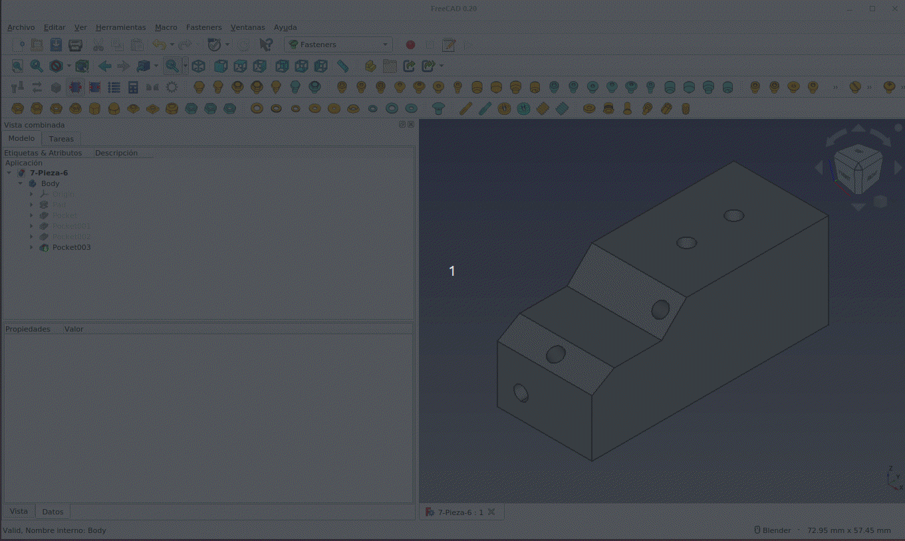

# Banco de trabajo Fastener
La documentación completa sobre su uso está en [este tutorial](https://fgcoca.github.io/Tornillos-en-FreeCAD/) que en su momento relicé y que que viene a resolver la mayoría de los problemas de crear y usar tornillos pasantes en FreeCAD. Pero resulta imprescindible hacer referencia al mismo dentro de esta sección tornillos.

Es aconsejable entrar en el 'Administrador de complementos' para comprobar si hay alguna actualización para el banco de trabajo.

Simplemente vamos a mostrar una animación como la de la Figura siguiente para recordar su uso básico. El ejemplo es sencillo y tan solo se coloca un tornillo M4 y su tuerca y un trozo de varilla roscada M3 con dos tuercas, aplicando propiedades que configuran su correcta visualización y configuración.

  
*Uso básico del banco de trabajo Fastener*

En el enlace a [7-Pieza-6.FCStd](../img/designs/7/7-Pieza-6.FCStd) tenemos el archivo de diseño por si queremos disponer del mismo para practicar.
