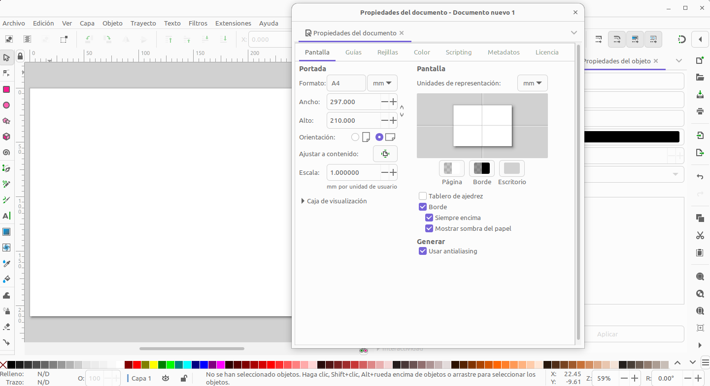

# Personalizar formatos y cajetin
FreeCAD incorpora toda una colección de formatos con diferentes cajetines que en la mayoría de las ocasiones nos podrán valer para documentar nuestros planos de dibujo, pero normalmente cuando hacemos planos es interesante que el cajetín de información esté personalizado con nuestras preferencias.

Todo se documenta para la versión siguiente:

* Inkscape 1.2.2 (732a01da63, 2022-12-09, custom) bajo OS version: Ubuntu Core 22

Vamos a comenzar por crear una plantilla de ejemplo para al final ver la creación de un formato DIN.

## **Tutorial TechDraw TemplateHowTo**
Nos vamos a basar en [TechDraw TemplateHowTo](https://wiki.freecad.org/TechDraw_TemplateHowTo) para aprender a crear un archivo svg que podamos usar como plantilla o formato para las páginas del banco TechDraw. Asumiremos que mas o menos se está familiarizado con el uso de Inkscape. Vamos a aprender a crear la plantilla resultado del tutorial de referencia que está disponible en:

* Si trabajamos con FreeCAD instalado: $INSTALL_DIR/Mod/TechDraw/Templates/HowToExample.svg, donde INSTALL_DIR es el directorio de instalación de FreeCAD
* Si trabajamos con APP: /tmp/.mount_FreeCAfE5sjB/usr/share/Mod/TechDraw/Templates/HowToExample.svg. En este segundo caso se trata de una ruta montada en el directorio temporal que solamente permanece activo si FreeCAD está en ejecución.

### Documento base
Abrimos un nuevo documento en Inkscape y nos dirigimos a Propiedades del Documento donde, vamos a seleccionar como tamaño de página A4 en orientación horizontal, establecemos todas las unidades en milímetros y establecemos las medidas de un DIN-A4, que son 210 y 297mm.

  
*Inkscape: documento con tamaño de página, orientación y unidades*

Ahora tenemos que utilizar el editor XML (Extensible Markup Language) del documento para agregar la siguiente cláusula Svg_Namespace de "freecad" al documento.

xmlns:freecad="[http://www.freecadweb.org/wiki/index.php?title=Svg_Namespace](http://www.freecadweb.org/wiki/index.php?title=Svg_Namespace)"

Sin entrar en mas detalles diremos que mediante el lenguaje de marcado definimos el conjunto de reglas o códigos que se van a aplicar al documento y que en el documento enlazado están especificados el uso y los atributos del Svg Namespace. Lo primero que debemos hacer es abrir XML desde el menú 'Edición' y se nos muestra una ventana como la que vemos en la figura siguiente.

  
*Editor XML*

Debemos tener en cuenta que los textos editables no funcionarán si usamos "https://...", aunque se acceda a la wiki a través de https. Se puede introducir la línea anterior en el archivo con un editor de texto.

La línea anterior tiene dos partes, que son:

~~~
xmlns:freecad
http://www.freecadweb.org/wiki/index.php?title=Svg_Namespace
~~~

Cuidado que en la segunda línea no estén incluidas las comillas que vemos. Estas dos líneas las vamos a tener que copiar en el editor XML de Inkscape para indicar a Inkscape donde identificar el contenido XML de FreeCAD. En el editor abierto en Inkscape seleccionamos la primera línea de la parte superior, añadimos abajo una nueva línea y pegamos la primera línea en el nombre y la segunda (sin comillas) en el valor pulsando la tecla Enter en cada caso. En la figura siguiente podemos ver como queda el editor.

  
*Indicar en Inkscape el contenido XML de FreeCAD*

### Dibujo del formato
Podemos

* dibujar contornos, números de zona, líneas centrales y otras geometrías.
* dibujar los recuadros y líneas para crear el cajetín o title block (bloque de título).
* agregar y colocar el texto que no se va a poder editar o estático.
* agregar y colocar el texto que será editable.

Para el ejemplo que estamos creando debería verse algo así:

  
*Inkscape: diseño de plantilla*

### Creación de los textos editables
Usaremos el editor XML para agregar una etiqueta *freecad:editable* a cada elemento de texto editable. Debemos asignar un nombre a cada campo de texto editable, es decir, tenemos que indicar al banco de trabajo TechDraw cuales son los textos editables. Para ello con el editor XML abierto seleccionamos uno de los textos y añadimos una etiqueta freecad:editable y su nombre.

  
*Inkscape: agregando la propiedad "freecad:editable" al texto deseado en el editor XML*

### Ajuste del tamaño del svg
En el editor XML debemos ajustar, si es necesario, el atributo *viewBox* para que coincida con el tamaño de la página en milímetros. El formato del atributo son cuatro valores expresados como "0 0 width height". En la figura siguiente vemos que en este caso los valores del atributo son correctos.

  
*Inkscape: atributo viewBox en el editor XML*

Se nos puede presentar una situación como la de la figura siguiente en la que la plantilla creada es más grande de lo deseado.

  
*Inkscape: diseño de plantilla que excede el tamaño de la página*

Necesitamos arreglar esta situación para lo que hacemos:

* Vamos a Editar → Seleccionar todo en todas las capas, o bien hacemos una selección con el ratón describiendo un rectángulo que lo seleccione todo.
* Ajustamos las dimensiones en los recuadros W y H para que coincidan con el tamaño adecuado del formato en milímetros.
* Ahora ajustamos el tamaño de nuestra plantilla al de la página restándole los márgenes aplicables, en nuestro caso todos los márgenes son de 10mm y la posición la hacemos teniendo en cuenta esos márgenes.
* La plantilla ahora debería estar correcta, tal como se ve en la imagen cuando la hemos diseñado.

Una vez finalizado estos ajustos ya podemos continuar con el proceso.

### Eliminar transformaciones en el svg
Para asegurar que el archivo de plantilla es válido debemos:

* Asegurarnos de que todos los textos editables estén desagrupados, para ello los seleccionamos y escogemos desagrupar del menú contextual o pulsamos Mayús+Ctrl+G.
* Seleccionamos todo en la página desde Editar → Seleccionar todo y luego hacemos un Editar → Copiar o Ctrl+C o también podemos hacer un Editar → Cortar o Ctrl+X. En cualquier caso se trata de tener en el portapapeles todo el contenido.
* Ahora eliminamos la capa actual, Capa → Eliminar capa actual con lo que perdemos todo el contenido del svg. Si en el panel de capas no aparece ninguna capa, este paso no es necesario.
* A continuación pegamos lo que hemos copiado antes, pero lo hacemos con Editar → Pegar en el sitio. Este comando evita que las posiciones de texto se almacenen en etiquetas de transformación. ¡Es importante NO usar el comando de pegar normal!
* Lu plantilla ahora debería verse bien y no debería tener transformaciones no deseadas.
* Guardamos la plantilla. En Inkscape es recomendable archivar como SVG plano porque FreeCAD solo puede manejar las características de la especificación SVG 1.1 y el SVG plano eliminará cualquier etiqueta XML específica de Inkscape.

### Prueba en FreeCAD
Desde el banco TechDraw insertamos página utilizando plantilla y obtenemos lo siguiente:

  
*FreeCAD: insertar página utilizando plantilla*

Si los textos aparecen desplazados en FreeCAD, debemos eliminar los atributos xml:space="preserve" en el archivo SVG.

Si no vemos los recuadros verdes de los textos editables es que hay algún problema con el svg por lo que debemos abrirlo y verificar todos los valores indicados.

  
*Inkscape: eliminar atributo xml:space="preserve"*

Se desaconseja la utilización de capas y grupos en Inkscape dado que pueden insertar automáticamente transformaciones no deseadas en el archivo svg.

## **Formato DINA4_vertical**
Personalizar el cajetín en nuestros planos se plantea como una necesidad que debemos resolver al menos para el conjunto de planos mas usuales, como son A4, A3, A2 y A1 tanto en formado apaisado como vertical. Aunque existe cierta normalización referida al cajetín, en nuestro caso la personalización la vamos a realizar para simplificarlo al máximo aunque, eso si, siempre mantendrá como posición la esquina inferior derecha y tendrá un aspecto como el que vemos en la figura siguiente.

  
*Formato A4 vertical y modelo de cajetín sin configurar*

La figura se corresponde con una imagen tomada de Inkscape en la que se han dibujado y escrito diferentes cosas para tener una configuración de inicio de la plantilla. No hay que ser un gran experto para hacer esto en el programa aunque en las descripciones siguientes se procurará hacer el paso a paso lo mas fiable y fácil posible para que se pueda seguir sin dificultad.

* Las dimensiones del rectángulo de márgenes son 185mm de ancho y 287 de alto y se posiciona en las coordenadas (20.0,5.0)
* Margen izquierdo 20mm y resto de márgenes 5mm.
* La fuente para las letras pequeñas es DejaVu Sans Normal de 4.5mm y las granbdes sans-serif Bold de 6mm.
* Las líneas tienen todas un grosor de 0.5mm

Los pasos siguientes que vamos a dar es ver como convertir ese formato con su cajetín en una plantilla válida para FreeCAD con los campos editables que sean necesarios. Abrimos la opciión 'Propiedades del documento' desde el menú 'Archivo' y configuramos como vemos en la imagen siguiente.

  
*Propiedades del documento*

Debemos verificar que todos los elementos dibujados y/o escritos están configurados en milímetros y que está todo desagrupado, o lo que es lo mismo, son todos elementos individuales. Este extremo lo podemos asegurar si vamos a 'Edición' -> 'seleccionar todo' y después a menú 'Objeto -> 'Desagrupar'.

El estado del archivo svg correspondiente a la situación mostrada lo tenemos en el enlace [estado 1: configuración plantilla](../ejemplos/img/A4V_estado1.svg).

El siguiente paso va a ser seleccionar todo de todas las capas y desde el menú 'Edición' escogemos cortar o copiar. Nos dirigimos al menú 'Capa' y eliminamos todas las capas que existan. Ahora nos dirigimos al menú 'Edición' y escogemos 'Pegar en el sitio'. Esta última acción es muy importante para que todo se pegue en su lugar sin ningún desplazamiento.

Respecto de los textos indicar, que además de ponerlos tal y como se ven, se ha trabajado el tema de Alineación de texto que está disponible cuando entramos en modo edición del texto, lo que se consigue haciendo doble clic sobre una línea, si estamos en modo selección o haciendo un clic sobre el icono texto y después sobre el texto. Estando en modo edición y sin tener seleccionado el texto se verá un tirador que indica la alineación del mismo. En la animación siguiente vemos el proceso descrito con indicación de la tecla que se ha pulsado.

  
*Alineación de texto*

El selector de alineación es importante porque será donde se colocará el cuadro verde selector que indica que el texto es editable en FreeCAD.

Visualmente apenas se han producido cambios pero estas tareas realizadas las tenemos disponibles en el enlace [estado 2: configuración plantilla](../ejemplos/img/A4V_estado2.svg).

Opcionalmente (no se aconseja si no se tiene experiencia) podemos colocar cada elemento en la capa que le corresponde, de forma que llevaremos a la capa bordes todo lo que no es editable tanto en dibujo como en texto y a la capa editable, lógicamente los textos editables. Esta tarea la podemos realizar o bien cortando y pegando en el sitio en la capa o bien mediante el menú contextual escogiendo 'Mover a la capa' y seleccionando la capa destino. Podemos comprobar que todo está correcto ocultando y mostrando la capa en cuestión, tal y como vemos en la animación siguiente, donde se cambian los elementos editables a su capa. Finalmente, y con el fin de evitar modificaciones no deseadas, lo adecuado es bloquear la capa bordes con el candado que está junto al ojo de mostrar/ocultar capa.

  
*Situar cada elemento en su capa*

El paso que resta es indicar en el archivo svg como queremos que se represente en el banco de trabajo TechDraw de FreeCAD.

  
*Editor XML*

Añadimos la el atributos son su nombre y su valor:

xmlns:freecad="http://www.freecadweb.org/wiki/index.php?title=Svg_Namespace"

Ya tenemos el documento base creado y hemos visto lo que tenemos que poner en XML por lo que podemos proceder con los pasos siguientes.

* Creamos los textos editables con la etiequeta "*freecad:editable*" y el nombre deseado.
* Ajustamos el tamaño del svg si es necesario
* Eliminamos las transformaciones en el svg. Sin olvidad "xml:space=preserve" y/o "xml:space=default" si los textos se desplazan.
* Probamos en FreeCAD

El estado del archivo svg correspondiente a la situación lo tenemos en el enlace [estado 3: configuración plantilla](../ejemplos/img/A4V_estado3.svg).

El formato listo para utilizar en FreeCAD lo tenemos en el enlace [Formato DIN A4 vertical](../ejemplos/formatos/A4_vertical.svg) y lo podemos ver en la figura siguiente recien cargado.

  
*Formato DIN A4 vertical personalizado cargado en FreeCAD*

Partiendo de este mismo cajetín podemos personalizar de forma sencilla otros tamaños de formatos realizando los ajustes necesarios en cuanto a líneas y posiciones.

A continuación enlazamos los principales formatos con el cajetín visto.

* [Formato DIN A4 vertical](../ejemplos/formatos/A4_vertical.svg)
* [Formato DIN A4 horizontal](../ejemplos/formatos/A4_horizontal.svg)
* [Formato DIN A3 vertical](../ejemplos/formatos/A3_vertical.svg)
* [Formato DIN A3 horizontal](../ejemplos/formatos/A3_horizontal.svg)
* [Formato DIN A2 vertical](../ejemplos/formatos/A2_vertical.svg)
* [Formato DIN A2 horizontal](../ejemplos/formatos/A2_horizontal.svg)
* [Formato DIN A1 vertical](../ejemplos/formatos/A1_vertical.svg)
* [Formato DIN A1 horizontal](../ejemplos/formatos/A1_horizontal.svg)

¡Crea tus formatos personalizados y tenlos a mano!

## **t**
