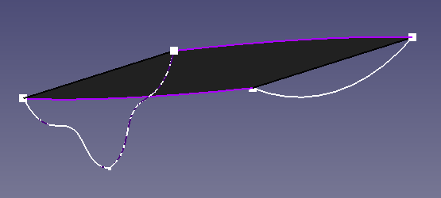
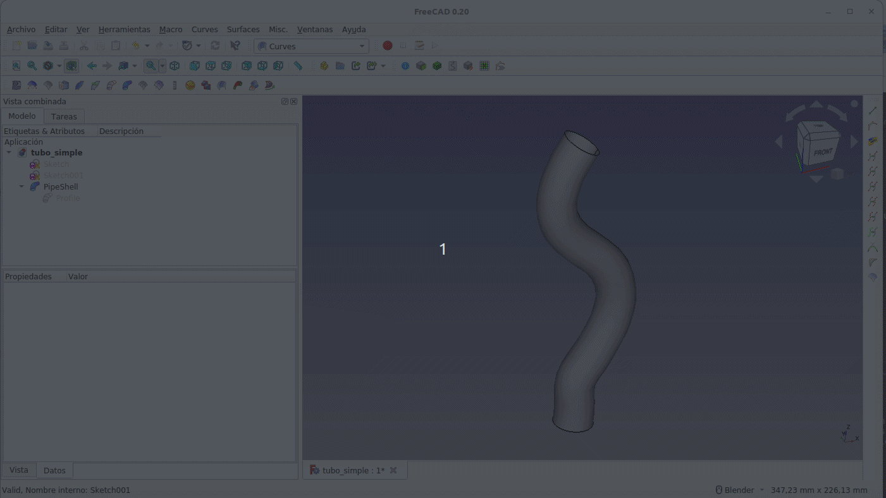
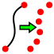
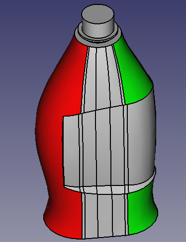
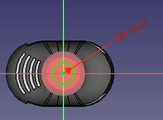

# Curves
Fundamentalmente se muestran ejemplos en los que intervienen elementos del banco de trabajo externo 'Curves' que se puede instalar desde el 'Administrador de complementos' de FreeCAD.

## **Diseño de una pala**
El desarrollo del ejemplo explica el funcionamiento de la herramienta *Barrido en 2 railes* del banco de trabajo 'Curves' y que aparece o bien en el menú Curves o en el icono siguiente de la barra de herramientas.

Se trata de crear el perfil de una pala basándonos en el video de [MangoJelly Solutions for FreeCAD](https://www.youtube.com/@MangoJellySolutions/featured) titulado [Learn FreeCAD Curves Workbench [01] Sweep Along 2 Rails, Join Curve, Nurbs surfaces Practical Guide](https://www.youtube.com/watch?v=8JO3kU3Lg-U), que además nos va a servir para ver el uso de algunas otras herramientas.

Utilizaremos el banco de trabajo PartDesign para tener disponibles herramientas del mismo como la simetria y el plano de referencia.

Comenzamos por crear un boceto sobre el plano XY para formar los laterales de la pala similar al que vemos en la Figura siguiente.

  

*Boceto de los laterales de la pala*

Para que resulte mas claro y sencillo el diseño vamos a cambiar el color de las líneas del boceto y el tamaño de los puntos de los vértices de las líneas, esto último hará mas fácil seleccionarlos posteriormente. En la animación de la siguiente vemos como hacerlo.

 

*Cambios en la visualización del boceto de los laterales de la pala*

El paso siguiente va a consistir en crear la forma de la parte posterior de la pala mediante una B-spline. Esto lo vamos a hacer en un nuevo boceto creado sobre el plano XZ perpendicular al XY y tomando como referencia los puntos situados sobre el eje X de las curvas anteriores, es decir, creamos una proyección auxiliar de los mismo en el nuevo boceto utilizando la herramienta 'Geometria externa'. En la Figura siguiente vemos el proceso.

 

*Creación de B-spline para la parte trasera de la pala*

Ahora vamos a crear una simetria de esta B-spline respecto al eje Z que, como ya hemos visto, quedará aparentemente bien colocada pero en realidad los puntos finales no están unidos a los puntos que necesitamos. Unas vez establecida la restricción de coincidencia de los puntos anteriores unimos en una sola ambas splines. Para unir ambas líneas nos dirigimos al banco de trabajo 'Curves', seleccionamos ambas curvas y hacemos clic en el icono 'joinCurves', tal y como podemos observar en la animación siguiente.

  

*Simetría de la B-spline, restricción y unión de ambas curvas*

***

> **- Consejo:**

***

Para crear la parte delantera de la pala vamos a necesitar de un plano auxiliar paralelo al plano XZ pero situado en los puntos finales de las primeras líneas. La creación del plano la vemos en la animación siguiente.

*Plano de referencia paralelo a Z que pasa por un punto*

Sobre este plano de referencia creamos un arco de círculo que tenga como puntos inicial y final los finales de las curvas laterales de la pala y le damos la curvatura deseada. Debemos obtener algo similar a lo que vemos en la figura siguiente.

  

*Perfil de pala completado*

Nos dirigimos al banco de trabajo Part y vamos a crear una 'Superficie reglada' entre las dos líneas curvas laterales. La situación será la que vemos en la Figura siguiente.

  

*Superficie reglada entre alambres*

El siguiente paso es crear el barrido en dos railes y para ello procedemos como vemos en la animación de la Figura siguiente. Observamos como se crea una nube de puntos que sigue el contorno de la pala según las curvas creadas.

 

*Creamos el barrido en dos railes*

En la animación siguiente vemos algunos de los valores de los datos del nuevo objeto creado y como están definidos esos puntos como vectores.

  

*Datos de la nube de puntos*

Para crear la superficie de referencia de la pala vamos a utilizar la herramienta 'Aproximar' para lo que manteniendo seleccionado el objeto Sweep_2_rails en el árbol de objetos hacemos clic en el icono de la herramienta y veremos como aparece la superficie curva que se adapta a nuestros perfiles de diseño y que podemos ver en la Figura siguiente.

  

*Superficie curva de la pala*

Podemos dar un determinado grosor a la pala mediante la herramienta extruir del banco de trabajo Part, pero vamos a hacerlo utilizando la herramienta Offset o desplazamiento, tal y como vemos a continuación.

  

*Dando espesor a la superficie curva de la pala*

En este momento es conveniente ocultar la superficie generadora ya que no lo hace de forma automática y nos puede originar alguna confusión.

Para finalizar la pala tenemos que añadir un punto de conexión con el mango. Desde el banco de trabajo Part creamos un tubo de longitud 100mm con radio exterior 20mm e interior 12mm. Posicionamos el tubo para que esté colocado en su lugar y lo unimos a la superficie curva, teniendo así la pala final que vemos en la Figura siguiente.

  

*Figura 9.3.21. Pala*

En el enlace siguiente tenemos el Archivo fuente de FreeCAD:

* [Enlace para descarga del archivo fuente de FreeCAD](../img/designs/9/pala.FCStd)

## **Diseño de un tubo sencillo**
El desarrollo del ejemplo introduce el funcionamiento de las herramientas *PipeShell* del banco de trabajo 'Curves' y que aparece o bien en el menú Curves o en los iconos siguiente de la barra de herramientas.

 

Vamos a comenzar por crear un tubo sencillo que va a recorrer una trayectoria fijada por una B-spline. Comenzamos seleccionando el banco de trabajo Sketcher y vamos a dibujar un círculo en un boceto creado en el plano XY y una B-spline creada sobre el plano XZ. El boceto del círculo puede contener otros objetos. En la Figura siguiente vemos la situación incial.

  

*Bocetos iniciales para crear un tubo sencillo*

El siguiente paso es convertir el círculo en un perfil, que lo hacemos seleccionando el círculo y desde Curves hacemos clic en el icono Perfil y veremos como el boceto original se oculta y aparece el objeto Profile (Perfil) en color azul sin que aparezca el resto del boceto. Además, como vemos en la animación siguiente los cambios en los objetos utilizados del boceto inicial se reflejan en el Profile creado. Se pueden crear varios objetos Profile para realizar un barrido.

  

*Creación del objeto Profile*

Realizamos el barrido haciendo la selección de objetos en el siguiente orden: primero seleccionamos el Profile desde el arbol de objetos y después el boceto de la trayectoria desde la ventana gráfica mientras mantenemos pulsada la tecla Ctrl, para finalizar hacemos clic en el icono de barrido y se nos crean una serie de objetos siguiendo la trayectoria. En la animación siguiente vemos como hacer esto, como modificar el número de objetos creado y finalmente como crear el tubo.

  

*Creación del tubo*

Ahora podemos realizar cambios tanto en el boceto origen del Profile como en el del barrido y quedarán reflejados en el tubo final, tal y como se observa en la animación siguiente.

  

*Modificaciones en el tubo*

Si en lugar de un tubo queremos crear un sólido lo único que tenemos que hacer es poner a 'True' la propiedad 'Solid' del objeto PipeShell.

A la superficie creada en forma tubular le podemos dar un espesor con la herramienta Ofsset del menú Part.

Un primer potencial de estas herramientas es que el boceto inicial puede ser un B-spline de la que podemos realizar un barrido. En la animación siguiente vemos como funciona lo dicho.

  

*Barrido de un boceto con B-spline*

En el enlace siguiente tenemos el Archivo fuente de FreeCAD:

* [Enlace para descarga del archivo fuente de FreeCAD](../img/designs/9/tubo_simple.FCStd)

## **Diseño de una máscara facial**
El desarrollo del ejemplo introduce el funcionamiento de la herramienta *Discretizar curvas/superficies* del banco de trabajo 'Curves' y que aparece o bien en el menú Curves o en el icono siguiente de la barra de herramientas.

### Discretizar e interpolar

Vamos a comenzar por crear un par de curvas desde el banco de trabajo Sketcher en un nuevo documento. La primera la creamos sobre el plano XY utilizando la herramiento B-spline para obtener algo similar a lo que vemos en la Figura siguiente.

 

*Boceto de curva con B-spline sobre plano XY*

La segunda curva la podemos crear a partir de la primera rotandola o creando otra en el plano XZ que es como lo vamos a hacer para obtener una curva similar a la de la Figura siguiente que es un poco diferente a la primera.

 

*Boceto de curva con B-spline sobre plano XZ*

El siguiente paso va a ser crear un desplazamiento negativo en el eje Y de la nueva curva de 60mm y vamos a rotar la primera curva 50º respecto al eje X. En la animación siguiente vemos como hacer estas tareas.

 

*Reposicionando los bocetos*

La idea va a ser crear una superficie entre estas dos curvas. Pero antes de acometer la tarea vamos a utilizar la herramienta discretizar sobre las curvas comenzando por la primera de ellas que sabemos que va a ser un flanco o arista. Al utilizar la herramienta rompemos la curva en un determinado número de puntos. En la animación siguiente vemos el uso y como configurar para ver mas claramente esos puntos ocultando el boceto generador. En la misma también vemos como modificar el número de puntos y como hacerlos de mayor tamaño.

  

*Discretización de la primera curva*

El algoritmo matemático de cálculo de los puntos se puede cambiar en la propiedad 'Algorithm' de la discretización realizada siendo las opciones posibles las siguientes:

* **Number:** Establecemos el número de puntos de la discretización.
* **QuasiNumber:** Establecemos el número de puntos. Establezcamos que un número perfecto es un entero positivo que es igual a la suma de sus divisores propios (que no sean el propio número) positivos (es amigo de si mismo). Por ejemplo 6 es perfecto porque sus divisores 1, 2 y 3 suman 6. Los siguientes números prefectos son 28, 496 y 8128. Un número cuasi perfecto es el que al sumar todos sus divisores menos el mismo nos da como resultado un número que es una unidad menor que el propio número. Por ejemplo, los divisores de 8 son 1, 2 y 4 que sumados dan 7, uno menos que 8. Finalmente un número es cuasi perfecto si la suma de sus divisores propios es uno mas que el propio número. Hasta el momento no se ha encontrado ninguno de estos números.
* **Distance:** La propiedad 'Number' cambia a 'Distance' para establecer la distancia entre los puntos. Según sea menor la distancia entre puntos se colocarán mayor número de los mismos. Cuando cambiamos de algoritmo se conservan las configuraciones de cada tipo.
* **Deflection:** Establece el número de puntos según el valor de la desviación establecido, proporcionando una secuencia de puntos de acuerdo con el grado de desviación de la curva original. En el foro de FreeCAD [Deviation and Angular deflection](https://forum.freecad.org/viewtopic.php?style=4&p=389881#p389881) hay mas información al respecto.
* **QuasiDeflection:** Similar a 'Deflection'.
* **Angular-Curvature:** Crea una secuencia de puntos con los parámetros Angular (Angular), Curvature (Curvatura) y Mínimum (Mínimo).

Dejamos finalmente la primera curva discretizada a 20 puntos y discretizamos la segunda a 10 puntos, aumentando también el tamaño de los mismos, y tendremos la situación que vemos en la Figura siguiente.

  

*Las dos curvas discretizadas*

La siguiente tarea que vamos a realizar es interpolar puntos y para ello procedemos a seleccionar los puntos en el siguiente orden: marcamos tres puntos sobre la primera curva realizando la selección de izqueirda a derecha y posteriormente seleccionamos otros tres de derecha a izquierda en la segunda curva. El orden de selección establece la trayectoria de la interpolación. En la animación siguiente vemos el proceso y el resultado.

  

*Interpolación*

Creamos otra interpolación como la de la animación siguiente.

  

*Interpolación*

Ahora nos movemos al banco de trabajo Part y seleccionamos ambas interpolaciones manteniendo la tecla Ctrl pulsada para crear una superficie reglada como la que vemos en la Figura siguiente.

  

*Superficie reglada entre las interpolaciones*

### Máscara facial
Comenzamos por crear, sobre el plano XY, los seis bocetos que vemos en la Figura siguiente para que mantengan la forma aproximada que vemos. Los números asociados a los ejes que aparecen en la figura son las posiciones establecidas para los bocetos.

 

*Bocetos iniciales máscara facial*

Ahora procedemos a discretizarlos a 15 puntos todos ellos y lo podemos hacer de una sola vez teniendo seleccionados todos los bocetos, tal y como vemos en la animación siguiente.

  

*Discretización y número de puntos*

**Es MUY IMPORTANTE que todos los bocetos tengsan el mismo número de puntos o la superficie de aproximación a los mismos no va a tener éxito.**

Si ocultamos los bocetos vemos una nube de puntos que es la que nos va a permitir crear una aproximación, pero para hacerlo necesitamos que todos los puntos sean un único objeto, lo que conseguimos facilmente creando un grupo y moviendo todos los objetos discretizados al mismo. En la animación siguiente se observa este proceso.

  

*Ocultar bocetos, mover las discretizaciones a un grupo y crear la aproximación*

Por ahora podemos dejar visibles los bocetos para que nos ayude a seguir el perfil de la superficie.

El siguiente paso es dirigirnos al banco de trabajo Part y crear un offset de la superficie para tener una primera versión de la máscara en 3D.

Ahora nos dirigimos la banco de trabajo Part y creamos dos elipsoides desde 'Crear primitivas...'. Las posicionamos en el lugar deseado para crear el orificio de los ojos, creamos una unión entre ambas alipsoides y posteriormente una operación de corte entre el objeto ofsett y la unión de las elipsoides. El resultado final, que es muy mejorable, lo vemos en la Figura siguiente.

  

*Máscara final*

En el enlace siguiente tenemos el Archivo fuente de FreeCAD:

* [Enlace para descarga del archivo fuente de FreeCAD](../img/designs/9/mascara.FCStd)

## **Combinación de superficies**
Vamos a comenzar por un conjunto de 6 bocetos con una disposición similar a la de la figura siguiente.

  

*Boceto de partida*

### Primeros pasos
Nos movemos a Part y creamos superficies regladas entre aristas para cada boceto de forma que cada uno de ellos se convierta en una superficie plana. En la animación siguiente vemos el final de este proceso y la ocultación de los bocetos originales.

 

*Creación de superficies regladas*

Ahora nos movemos a Curves y vamos a crear superficies que se combinen con las anteriores utilizando la herramietna BlendSurface. En la animación siguiente vemos como se realiza el proceso entre algunas de ellas.

 

*Creación de superficies combinadas entre las regladas*

### Propiedades de BlendSurface
Antes de continuar vamos a ver algunas propiedades de la superficies combinadas y como afectan al resultado final.

* **Continuity:** establece mediante un número entero la continuidad entre la cara y la arista. En la animación siguiente observamos como se puede establecer la continuidad a 0 o ninguna y como al aumentar uno de los valores aumenta el grado de continuidad de la curva con la arista que le corresponde.

  

*Propiedad Continuity*

Con esta propiedad podemos adaptar significativamente la curva a nuestras necesidades. También observamos que a partir de un determinado valor los incrementos ya no afectan al resultado, dependiendo esto se la curva concreta.

* **Scale:** valores de la escala para cada arista en función del tipo de escalado y el número de muestras que establezcamos. Si ponemos a cero el número de muestras el resultado es el mismo que poner ambos valores de continuidad a cero. Las opciones de autoescalado son minimizar la curvatura, establecer el número de polos y manual.

El siguiente paso lo vamos a dar desde el banco de trabajo Surface por lo que nos movemos al mismo y procedemos a rellenar el hueco central utilizando la herramienta Infill (relleno). En la siguiente animación vemos el proceso.

 

*Infill del banco de trabajo Surface*

En el enlace siguiente tenemos el Archivo fuente de FreeCAD:

* [Enlace para descarga del archivo fuente de FreeCAD](../img/designs/9/combinar.FCStd)

### Herramientas extraer caras y textura de cebra
En un ejemplo similar partimos de una serie de cubos distribuidos según vemos en la figura siguiente. En estos se ha marcado una cara de cada cubo para extraerla mediante la herramienta 'Extraer subforma' de la barra de herramientas 'Miscelanea' del banco de trabajo 'Curves'.

  

*Distribución de cubos*

Para marcar las caras de un color se utiliza la herramienta 'Color por cara' de Part.

Una vez extraidas las caras se les ha vuelto a dar color para establecer la correspondencia con su cubo y el resultado lo vemos en la figura siguiente que es una situación equivalente a la de las superficies regladas.

  

*Caras extraidas de los cubos*

El paso siguiente es crear y configurar las superficies combinadas. En el ejemplo resuelto que se da más adelante podemos consultar las configuraciones establecidad para cada una de ellas. En la figura siguiente vemos el resultado al finalizar esta tarea.

  

*Caras extraidas de los cubos y superficies combinadas*

En esta ocasión antes de hacer un relleno desde Surface vamos a crea una superficie combinada pero esta vez entre dos de las superficies creadas anteriormente. En la animación siguiente vemos el proceso completo para obtener una curiosa forma curvada.

 

*Superficie combinada creada entre superficies combinadas*

A continuación creamos dos rellenos desde el Surface y los configuramos para obtener la figura final que vemos en la animación siguiente.

  

*Objeto final obtenido*

En el enlace siguiente tenemos el Archivo fuente de FreeCAD:

* [Enlace para descarga del archivo fuente de FreeCAD](../img/designs/9/combinar1.FCStd)

A continuación vemos una animación en la que se utiliza la herramienta 'Textura de cebra' que nos permite apreciar las diferentes curvaturas de las partes de la pieza final.

  

*Uso de textura de cebra*

## **Diseño de una botella de detergente líquido**
Lo haremos siguiendo el tutorial de Mariana Badea [Make a Bottle Part Design Curves](https://www.youtube.com/watch?v=Gmu3y9XtXpU&t=182s) y aprenderemos el manejo de la herramienta Isocurva.

### Inicio
El proceso comienza por crear cuatro planos paralelos al plano XY a las siguientes distancias: 55, 105, 140 y 170mm que vamos a etiquetar indicando esas distancias en el eje Z. En la figura siguiente tenemos el aspecto final de estos planos y se ha destacado la etiqueta del último creado.

  

*Creación de planos paralelos al plano XY*

Por el momento podemos ocultar los planos y ejes de referencia así como los planos creados. Comenzamos por crear el boceto de la figura siguiente sobre el plano de referencia XY.

  

*Creación de boceto en el plano XY*

Mostramos el plano con z=55 y sobre el mismo creamos un boceto similar al anterior con la única diferencia en su cota entre centros que ahora será de 35mm, tal y como se aprecia en la figura siguiente.

  

*Creación de boceto en el plano z=55*

Repetimos el proceso en el plano con Z=105 y creamos el boceto de la figura siguiente, que es exactamente igual que el anterior.

  

*Creación de boceto en el plano z=105*

Continuamos creando el boceto de la figura siguiente sobre el plano situado en z=140.

  

*Creación de boceto en el plano z=140*

Ahora creamos el boceto de la imagen siguiente en el plazo z=170.

 

*Creación de boceto en el plano z=170*

Vamos a proceder a crear una proyección aditiva de la forma que vemos en la animación siguiente.

  

*Creación de proyección aditiva*

Seleccionamos el plano superior del objeto creado para crear un boceto centrado en el origen consistente en un círculo de radio 12mm, cerramos la tarea y extruimos 18mm, teniendo el aspecto que vemos en la figura siguiente.

 

*Creación de la boca de la botella, paso 1*

Sobre el mismo plano que el boceto anterior vamos a crear otro boceto que será un círculo de radio 15mm. Lo que pretendemos es crear una anilla alrededor del cilindro anterior separada del plano sobre el que se ha creado el boceto, por lo que debemos desactivar la propiedad 'Map Mode' y después elevar en z el boceto hasta la altura requerida, en este caso será 173mm. Una vez realizadas las tareas anteriores extruimos el boceto 1,5mm y tendremos el aspecto que vemos al final de la animación siguiente.

 

*Creación de la boca de la botella, paso 2*

El estado actual del diseño lo vemos en la figura siguiente.

  

*Botella sólida inicial finalizada*

### Zona de agarre lateral
Comenzamos por crear un plano paralelo al XY desplazado en el eje Z 80 mm y hacemos visibles los planos a 55, 105 y 140 mm. Mediante la herramienta 'Slice apart' del banco de trabajo Part vamos a crear diferentes secciones de la botella para llegar a obtener lo que vemos en la animación siguiente.

 

*Aplicación de la herramienta 'Slice apart'*

Ahora creamos un alambre a partir de las aristas creadas por el corte del plano z=80mm, tal y como vemos en la animación siguiente, donde utilizamos la herramienta 'Generador de forma' de Part.

  

*Creación de alambre en z=80*

Algunos de los elementos de los grupos 'Explode Slice' ya no son necesarios por lo que los vamos a eliminar tal y como vemos en la animación siguiente, donde podemos ver como la sección intermedia desaparece aunque permanece el elemento alambre en su posición.

  

*Eliminación de elementos*

El paso siguiente va a consistir en crear una Isocurva a partir de la superficie curva del Slice central. En la animación siguiente vemos como hacerlo además de ver la configuración de la Isocurva (aplicamos 8 divisiones verticales) y como crear dos nuevos alambres a partir de dos de estas divisiones.

  

*Creación de Isocurva y nuevos alambres*

Procedemos a ocultar la isocurva y a crear nuevos elementos Slice a partir de los alambres. En la animación siguiente vemos el proceso de creación y se destaca el trozo final de alambre que nos queda.

 

*Creación de elementos Slice a partir de alambres*

Ocultamos el Slice que no nos interesa y creamos un nuevo alambre con los trozos nuevos y siguiendo todo el contorno de la botella como vemos en la animación siguiente.

  

*Creación de un nuevo alambre*

Todos los elementos Exploded Slice creados así como los alambres anteriores ya no van a sernos de utilidad por lo que podemos proceder a eliminarlos para simplificar el árbol de objetos.

Ahora vamos a crear una serie de planos que nos permitan colocar los bocetos que definirán el perfil del rebaje que realizaremos en la botella para facilitar el agarre de la misma.

* El primer plano lo vamos a colocar normal al alambre creado y lo situaremos en el vértice final del mismo, tal y como se aprecia en la animación siguiente.

  

*Primer plano de referencia*

* El segundo plano lo colocaremos de forma similar al anterior pero en el otro extremo del alambre, tal y como vemos en la animación siguiente.

  

*Segundo plano de referencia*

* El tercer plano de referencia lo colocamos en uno de los trozos de alambre de la parte curva opuesta y de forma similar a los anteriores, tal y como se puede apreciar en la animación siguiente.

  

*Tercer plano de referencia*

Seleccionamos el tercer plano que hemos creado y sobre el mismo dibujamos el boceto que vemos en la figura siguiente. Hemos puesto el Estilo de dibujo en modelo de alambres y la imagen se toma sobre una vista frontal del boceto.

 

*Boceto sobre el tercer plano de referencia*

Sobre el primer y el segundo plano dibujamos un boceto que sea igual en ambos y como el que vemos en la figura siguiente.

 

*Boceto sobre el primer y segundo plano de referencia*

En la versión con la que se ha realizado el ejercicio presenta continuos errores de conexión en los planos de referencia que tendremos que ir arreglando con las opciones de conexionado que nos deja pero siempre trabajando sobre el mismo alambre, es decir, ocultando las copias que se van creando o mejor aún, aliminando las copias que se crean. Al final debemos tener un boceto en cada plano en una situación como la que vemos en la figura siguiente, donde podemos ver el árbol de objetos en el estado que tiene en este momento del diseño.

 

*Vista con los tres bocetos creados*

El siguiente paso va a consistir en crear un vaciado mediante la herramienta 'Tubo sustractivo' que nos permita definir la zona que estamos trabajando. Para ello iniciamos la herramienta con una arista del boceto del primer plano seleccionada para que se nos muestre la ventana de 'Parámetros del tubo' donde indicaremos que el recorrido del barrido se hará según marca el alambre y añadiendo los dos bocetos restantes para realizar una 'Transformación de la sección' de tipo Multisección. En la animación siguiente vemos el proceso completo y el resultado que se obtiene.

  

*Creación de la zona de agarre*

### Sistema antigoteo
A estas alturas del diseño la situación actual es que las divisiones horizontales han desaparecido, seguramente porque se han eliminado, pero no importa demasiado porque es bastante fácil recuperar el estado que teniamos al princicipio. En la figura siguiente vemos como la cara curva de la izquierda ya es un sola (la destacada en rojo) y no tiene divisiones horizontales (las destacadas en verde).

 

*Superficie sin divisiones horizontales*

Vamos a proceder a crear de nuevo las divisiones perdidas y para ello desde el menú Part vamos a crear planos utilizando la herramienta 'Crear primitivas' que vamos a situar a la misma altura que tenian los de partida, es decir cuatro planos paralelos al plano XY a las siguientes distancias: 55, 105, 140 y 170mm. En la animación siguiente vemos como crear estos planos.

 

*Creación de nuevos planos para dividir en vertical el objeto 3D*

El siguiente paso es crear las divisiones utilizando la herramienta Slice del menú pieza, tal y como observamos en la animación siguiente, dejando preparado de nuevo el objeto 3D para continuar con nuestro diseño.

  

*Creación de las divisiones con Slice*

Ahora vamos a diseñar sobre la superficies curvas que vemos destacadas en la figura siguiente, que convertiremos en Isocurvas.

  

*Superficies a convertir en Isocurvas*

Creamos las Isocurvas en ambas superficies y las configuramos con 7 divisiones verticales. Posteriormente nos dirigimos al banco de trabajo Part desde donde creamos los alambres que vemos en la animación siguiente. En horizontal corresponde con las divisiones 4, 6, 8 y 10 y las verticales las que quedan a izquierda y derecha de la central.

  

*Creación de los alambres*

Seguidamente vemos en la animación como crear cortes entre los alambres anteriores eliminando los que no nos interesan para quedarnos solamente con los trozos que vamos a utilizar. Se muestran solamente las dos últimas instancias dado que el método de creación es el mismo para las dos superiores.

 

*Creación de cortes en los alambres*

A partir de los trozos obtenidos volvemos a crear alambres de cada uno de ellos y procedemos a eliminar todos los Slices y las Isocurvas que ya no nos sirven para nada. En la animación siguiente vemos el proceso y como se eliminan los elementos que aún permanecen tras el primer borrado.

 

*Creación de alambres y eliminación de operaciones*

Seleccionando cada alambre creamos un plano de referencia desde Partdesign que sea normal a la arista y que esté atado al punto final del alambre. Sobre este plano dibujamos un círculo de radio 3mm con el que creamos un vaciado mediante la herramienta 'Tubo sustractivo'. En la animación siguiente vemos el proceso seguido para el alambre superior. El resto de vaciados se han obtenido siguiendo exactamente el mismo procedimiento.

 

*Vaciados antigoteo a parti de alamabres*

En la figura siguiente vemos el estado actual de la botella, que por ahora sigue siendo sólida.

 

*Botella sólida final sin remates*

### Creación del recipiente
El siguiente paso que vamos a dar es vaciar la botella por dentro para así crear el recipiente. Comenzamos por crear tres planos paralelos al plano de referencia XY y colocados a una distancia de 6, 105 y 167mm del mismo en Z. En la figura siguiente vemos los tres planos creados.

  

*Planos para crear el vaciado interno*

Sobre el primer y segundo planos creamos el boceto que vemos en la figura siguiente.

 

*Boceto sobre el primer y segundo planos para crear el vaciado interno*

Sobre el tercero de los planos creamos el boceto de la figura siguiente.

 

*Boceto sobre el tercer plano para crear el vaciado interno*

En la figura siguiente vemos los bocetos creados mostrados sobre en modelo de alambres como estilo de dibujo para poder verlos.

 

*Bocetos para crear el vaciado interno*

El siguiente paso es crear una 'Proyección sustractiva' utilizando como perfil los tres bocetos creados. El proceso a seguir lo vemos en la animación siguiente.

 

*Proyección sustractivas para crear el vaciado interno*

Lógicamente el vaciado se crea en el volumen comprendido entre el primer plano y el tercer plano. Para vaciar la boca vamos a crear el bocedto de la figura siguiente sobre el plano situado a 167mm, que coincide con la parte superior del vaciado anterior.

 

*Boceto para crear el vaciado de la boca*

Creamos un vaciado invertido a través de todos y ocultamos todos los elementos anteriores y obtenemos la botella. Las operaciones finales van a consistir en aplicar operaciones de redondedo a diferentes aristas para obtener un mejor resultado.

En el enlace siguiente tenemos el Archivo fuente de FreeCAD:

* [Enlace para descarga del archivo fuente de FreeCAD](../img/designs/9/botella.FCStd)

En la figura siguiente vemos el aspecto final que se ha dado al diseño.

*Botella final*

