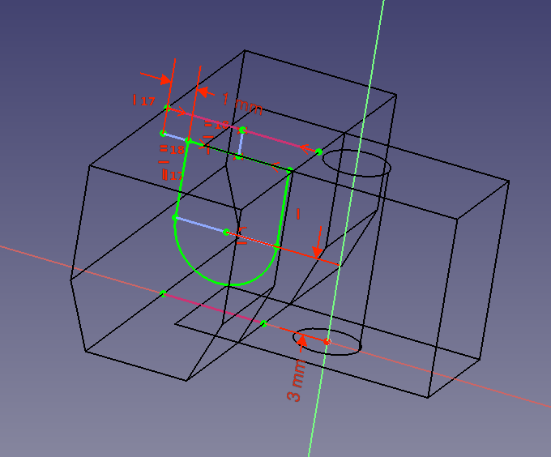
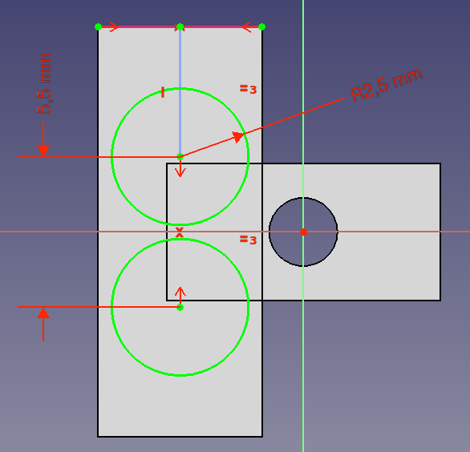

# Ficha de empalme
Vamos a realizar el diseño de una ficha de empalme o bornera para cables eléctricos siguiendo el tutorial de [este canal](https://www.youtube.com/@FreeCADdesign/featured) de Youtube.

La idea es crear el diseño 3D de algo como lo que vemos en la figura siguiente.

*Fichas de empalme*

Comenzamos por crear el boceto de la figura siguiente, creado en PartDesign sobre el plano XY. Una vez finalizado lo extruimos 7mm.

*Boceto de inicio*

Creamos un nuevo boceto, esta vez sobre el plano XZ, como el de la figura siguiente.

*Boceto*

Cuando acabamos el boceto salimos del mismo y realizamos una extrusión simétrica al plano de 15mm de longitud. Ahora vamos a realizar el orificio por donde entran los cables. Creamos otro boceto en el plano XZ, esta vez como el de la figura siguiente.

*Boceto*

Salimos del boceto y creamos un vaciado a través de todos.

Ahora vamos a crear los orificios superiores o de los tornillos. Realizamos el boceto de la figura siguiente, tomando como referencia el plano de la cara superior. Una vez finalizado extruimos una longitud de 5mm

*Boceto*

Ahora tenemos que realizar los orificios de estos dos últimos cilindros creados. Seleccionamos la cara superior de uno de ellos, creamos un nuevo boceto, bucamos el centro de los cilindros creando una arista auxiliar con su contorno y desde ese centro dibujamos dos círculos de radio 2mm. Cerramos el boceto y creamos un vaciado hasta una cara, tal y como vemos en la animación siguiente.

*Vaciado hasta cara*

El siguiente paso sería crear una simetria del objeto final obtenido, pero esto solamente nos genera una ficha con dos tomas y normalmente estos elementos vienen con doce elementos. Vamos entonces a crear repeticiones de los elementos utilizando patrones lineales. Comenzamos por el centro para crear dos elementos y posteriormente añadimos el resto para crear tres. El proceso es el que vemos en la animación siguiente.

*Creación de ficha de 3 elementos*

Cambiando las distancias y el número de elementos de los dos patrones lineales podemos obtener el número de elementos que necesitemos. En la figura siguiente vemos la ficha con 12 elementos cuyos datos se pueden consultar en el ejemplo.

*Ficha de empalme con 12 elementos*

En el enlace siguiente tenemos el archivo fuente de FreeCAD:

* [Enlace para descarga del archivo fuente de FreeCAD](../img/designs/bornera/bornera.FCStd)
