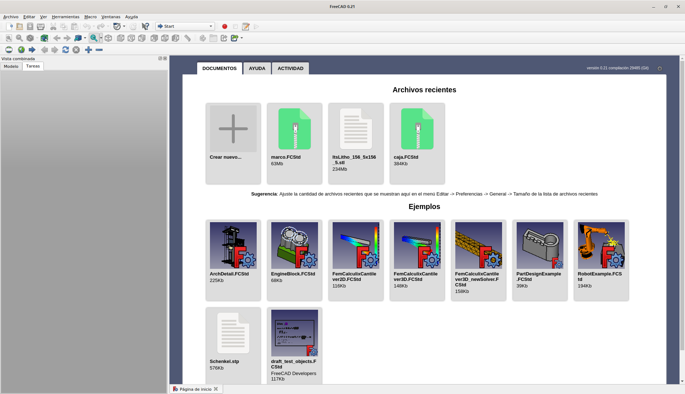
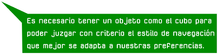
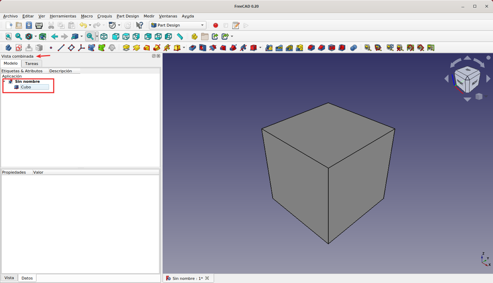
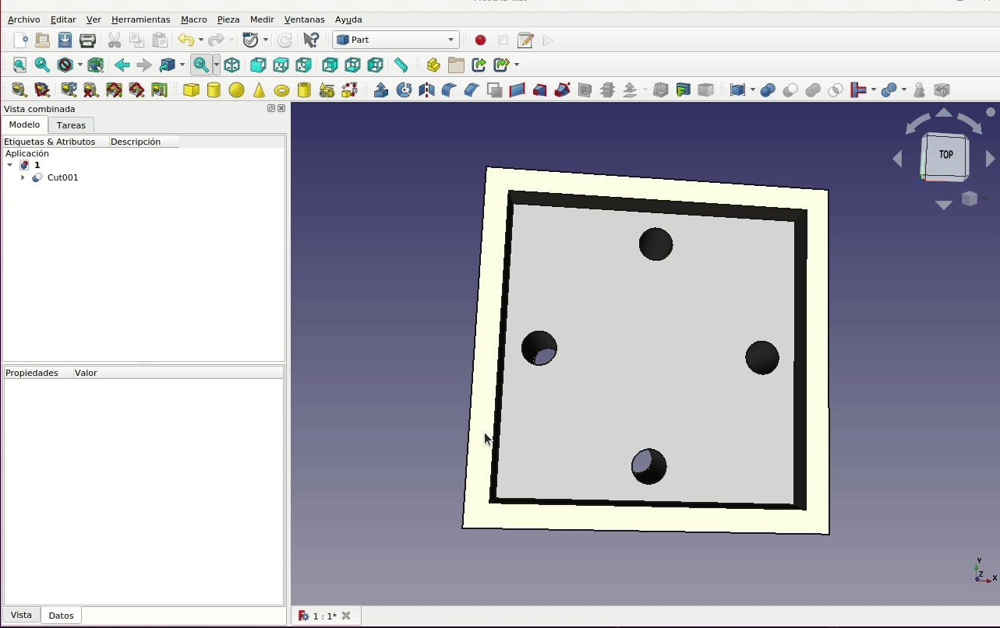

#  1. Introducción 
Antes de nada debemos dirigirnos a la [web de descarga de FreeCAD](https://www.freecadweb.org/) para descargarnos una copia del programa para nuestro sistema operativo. Cuando abrimos FreeCAD la primera vez, por defecto se inicia en el banco de trabajo 'Start' que tiene muy pocas herramientas pero a cambio muestra los archivos recientes y archivos de ejemplo en la ventana de vista 3D del lado derecho, como vemos en la Figura 1.1.

*Figura 1.1. Inicio por primera vez de FreeCAD. Banco de trabajo Start*

FreeCAD utiliza "Bancos de trabajo" o "Escenarios" o en inglés "Workbench" entre los que nos podemos cambiar según necesidades. Si hacemos clic en el menú desplegable donde dice 'Start', podremos ver todos los bancos de trabajo instalados, como se aprecia en la animación de la Figura 1.2.

*Figura 1.2. Despliegue de los bancos de trabajo*

La idea de los bancos de trabajo se entiende fácilmente si imaginamos una nave taller con varios bancos de herramientas, conteniendo cada banco una colección diferente de herramientas relacionadas con el tema que propone el mismo. FreeCAD tiene bancos de trabajo con herramientas especializadas para fabricar piezas, arquitectura, ensamblajes, colecciones de piezas en ensamblajes, creación de trayectorias para CNC, dibujo técnico y mucho más.

Lo mas importante de estos bancos de trabajo es que FreeCAD (la nave taller) mantiene el entorno de trabajo mientras nos movemos entre ellos.

A medida que avanzamos en el manejo de FreeCAD, utilizaremos más bancos de trabajo e incluso instalaremos otros bancos de trabajo adicionales que descubramos en la comunidad FreeCAD.

##  1.1. Primer diseño 
Para comenzar, hacemos clic en "crear nuevo" y se creará un proyecto vacío en una nueva pestaña. A continuación, vamos a cambiar del banco de trabajo de 'Star' al banco de trabajo de 'Part' usando el menú desplegable del banco de trabajo. Este es un banco de trabajo de piezas ya creadas que es un buen lugar para empezar a trabajar y explorar una de las formas más sencillas de crear piezas.

Pero antes de nada, exploremos cómo navegamos por las partes del programa, como hacemos zoom y movemos objetos, en la ventana de vista 3D o vista previa.

Si hemos actuado correctamente debemos poder ver una serie de iconos en color amarillo con formas de un cubo, cilindro, esfera, cono, toro, etc. Si hacemos clic con el botón izquierdo del ratón en el icono del cubo debería aparecer un cubo en la ventana 3D. Si no tenemos una vista en perspectiva correcta posiblemente sea porque hemos establecido una visualización concreta diferente Hay muchas formas de cambiar el punto de vista en FreeCAD. Las dos mas usuales van a ser utilizando los iconos de color azul celeste de "vista" o usando el cubo del lado superior derecho de la ventana 3D. En la animación de la Figura 1.3 podemos ver el uso de estas dos herramientas. Se han colocado las figuras de un cilindro y un cono simplemente para hacer mas visuales los movimientos.

***

> **- Consejo:**

***

*Figura 1.3. Vistas y zoom*

Si tenemos establecido el sistema de navegación Blender con el botón de la rueda del ratón podemos girar libremente la vista. Haciendo clic con el botón secundario del ratón podemos establecer el estilo de navegación que mas nos interese.

En la animación de la Figura 1.4 vemos con mas detalle el uso de dos de las opciones asociadas al cubo de la vista 3D. La primera de ellas es la de hacer un zoom que ajuste la vista al tamaño de la ventana 3D, cosa que también se puede hacer con el icono de la lupa o desde el menú ver. La segunda es el punto situado en la parte superior derecha que nos mueve la vista actual como si en un espejo se reflejase.

*Figura 1.4. Zoom todo y espejo de la vista 3D*

## 1.2. Navegacion
La forma mas común en FreeCAD de navegar por las vistas 3D y de seleccionar elementos y piezas es hacerlo en la propia ventana del visor 3D, teniendo varios estilos de navegación diferentes disponibles para elegir. Si situamos el cursor sobre la ventana del visor 3D y hacemos clic con el botón derecho, nos podemos desplazar hasta "estilos de navegación" y nos aparece una lista desplegable como la que vemos en la Figura 1.5.

*Figura 1.5. Estilos de navegación*

Algunos de los estilos de navegación se basan en entornos CAD, como por ejemplo Blender que hará que el ratón funcione igual que en esa aplicación. Este estilo es muy recomendable si vamos a trabajar con el programa Blender. Si preferimos un estilo como 'gesture' el funcionamiento del ratón será: clic izquierdo para rotar en la ventana del documento, clic derecho para mover la vista y el botón de la rueda central para hacer zoom. Por supuesto, debemos elegir el que mejor se adapte a nuestras necesidades.

***

> **- Consejo:**

***

## 1.3. Propiedades en nuestro banco de trabajo
El banco de trabajo 'Part' se utiliza principalmente para crear piezas mediante la combinación de objetos primitivos sólidos como el cubo o el cilindro. Este banco de trabajo es un buen lugar para comenzar con FreeCAD, pero seguramente a medida que aprendas más interesarán otras formas de crear piezas usando diferentes bancos de trabajo, y se usará menos este banco de trabajo.

Retomando el cubo que creamos, podemos ver que en la parte izquierdo de la pantalla hay una ventana de nombre 'Vista combinada' con una parte del tipo árbol de archivos con una etiqueta 'Sin nombre', donde podemos ver que aparece 'Cubo', (Figura 1.6). Podemos hacer clic con el botón izquierdo en esta etiqueta de Cubo para seleccionar el objeto, o podemos hacer clic en las diversas caras del cubo en la ventana del documento para seleccionarlas.

*Figura 1.6. Vista combinada*

Al hacer clic en la etiqueta, debajo aparece un nuevo cuadro de diálogo con detalles sobre las dimensiones y la posición del cubo. Inicialmente, lo primero que se puede cambiar aquí son las dimensiones del cubo. En la animación de la Figura 1.7 se aprecian todos estos detalles.

*Figura 1.7. Cambiando dimensiones al cubo*

## 1.4. Agujeros pasantes
Vamos ahora a hacer clic en la herramienta de cilindro y aparecerá un cilindro en la vista de árbol de archivos y en la vista 3D. Vamos a cambiar las dimensiones del cilindro a 1,5 mm y ajustar la altura para que sea algo mayor que la del cubo (Figura 1.8).

*Figura 1.8. Ponemos un cilindro*

## 1.5. Cortando y rebanando
Como en la mayoría de los programas CAD, podemos combinar objetos de diferentes formas para así crear nuevos objetos. En la barra de herramientas hay un grupo de herramientas booleanas en el que casi todos los iconos son círculos y en algunos de ellos son azules, que se superponen de diferentes maneras. Vamos a proceder a realizar un agujero de 1,5 mm de radio en el cubo utilizando el cilindro, y para ello debemos localizar el icono que describe su tarea como 'Cortar'. En el árbol de objetos seleccionamos primero el cubo y luego manteniendo pulsadas la tecla **MAYÚSCULAS** o **CTRL** seleccionamos el cilindro. Una vez que ambos objetos estén seleccionados, hacemos clic en el ícono de la herramienta 'Cortar' y debería aparecer un agujero pasante en el cubo. En la animación de la Figura 1.9 vemos el proceso.

*Figura 1.9. Realizando un taladro*

En el árbol de objetos ahora aparece un nuevo objeto que se denomina 'Cut'. Haciendo clic en la flecha a la izquierda de 'Cut' podemos ver un desplegable que contiene los dos objetos originales que se muestran en color gris difuminado indicando que son objetos que tienen la propiedad de visibilidad en estado 'False' o no visible. Una de las características principales de FreeCAD es que estos objetos, que son parte de una operación de corte, aún pueden ser modificados. Por ejemplo, si quisiéramos cambiar el radio de nuestro agujero a 3 mm en lugar del actual de 1,5 mm, podemos hacerlo sin tener que rehacer la operación de corte. Seleccionamos el cilindro y presionamos la barra espaciadora. Esto debería hacer que el cilindro que hizo el agujero se haga visible en la ventana 3D. Usando el cuadro de diálogo cambiamos el radio del cilindro y luego volvemos a presionar la barra espaciadora para desactivar la visibilidad del objeto. Estas operaciones hacen que se actualice la pieza final 'Cut' a las nuevas características. El uso de la barra espaciadora no es imprescindible, pero ayuda a seguir mejor las operaciones. En la animación de la Figura 1.10 vemos el proceso.

*Figura 1.10. Modificando propiedades de objetos en un corte*

## 1.6. Duplicar, corte y unión de objetos
Vamos a trabajar un poco el diseño del cubo inicial antes de hacer el taladro. Lo primero que vamos a hacer es eliminar la operación 'Cut' para lo que simplemente hacemos un clic sobre la misma y pulsamos la tecla suprimir, veremos como se recuperan los dos objetos anteriores haciéndose además visibles. Ahora vamos a crear un hueco cuadrado que provoque un rebaje en el cubo actual de 3 mm dejando una pared de 2 mm en todo el perímetro. Las dimensiones del cubo son 30x30x15mm, luego debemos crear un cubo de 26x26x10 (la altura debe ser mayor que 3mm pero no importa su valor, por lo que la podemos dejar en 10 mm). Ahora hacemos doble clic sobre el nuevo objeto en el árbol de objetos y se nos abrirá una nueva ventana donde podemos modificar las dimensiones del objeto, su posición e incluso rotarlo en torno al eje deseado. En la imagen 1.11 vemos los datos ya ajustados a sus valores. Una vez establecidos los valores hacemos clic sobre el botón OK para aplicar los cambios y cerrar la ventana.

*Figura 1.11. Modificando propiedades y posicionando un objeto*

A continuación, realiza un corte entre el cubo original y el nuevo para crear el nuevo objeto 'Cut'. Volvemos a poner el radio del cilindro en 1,5 mm y con el mismo seleccionado, nos dirigimos al menú 'Editar' para escoger la entrada 'Duplicar la selección' y repetimos la operación dos veces mas. Debemos tener cuatro objetos cilindro idénticos posicionados exactamente en  el mismo lugar. Vamos a desplazar, de forma similar a la vista, tres de los cilindros para que queden dispuestos a la misma distancia del perímetro que el primero y en ángulos de 90º de unos respecto de otros de forma que tengamos la disposición que vemos en la Figura 1.12.

*Figura 1.12. Los 4 cilindros posicionados*

Un proceso para crear los cuatro taladros puede ser ir haciendo un corte entre el objeto 'Cut' y el primer cilindro, sobre el nuevo objeto creado repetir el corte con el segundo cilindro y así sucesivamente, pero hay una forma mas eficaz de hacer lo mismo. Seleccionamos los cuatro cilindros y buscamos el icono de la operación 'Unión' sobre el que hacemos clic. Se crea un nuevo objeto denominado 'Fusion' y ahora simplemente hacemos un corte entre 'Cut' y 'Fusion' seleccionando los objetos en ese orden para obtener el objeto final que vemos en la Figura 1.13 donde el objeto final obtenido tiene de nombre 'Cut001'.

*Figura 1.13. Objeto final con cuatro taladros*

## 1.7. Retoques
A estas alturas es muy posible que hayas apreciado que en la vista 3D se resaltan las caraas, aristas y vértices de los objetos al pasar el ratón por ellos lo que nos va a permitir seleccionarlos. En el banco de trabajo 'Part' disponemos de dos herramientas para agregar filetes o chaflanes a los bordes de los objetos. Aparecen como dos iconos en la barra de herramientas: la herramienta 'Redondeo...' que crea un área curva entre dos superficies planas y la herramienta 'Chaflán...' que crea una superficie plana en ángulo. En la ventana 3D vamos a ir seleccionando cada una de las aristas internas del hueco cuadrado manteniendo para ello pulsada la tecla **CTRL** y hacemos clic en la herramienta 'Redondeo...'. Podemos ajustar el radio en el cuadro de diálogo. En nuestro caso ajustamos el radio a 0,6 mm. Ahora repetimos el proceso con las aristas exteriores del cubo para aplicarles un redondeo que dejaremos en 1 mm. En la animación de la Figura 1.14 vemos como se aplican estas operaciones de redondeo.

*Figura 1.14. Redondeo de aristas*

Vamos ahora a aplicar la herramienta de hacer chaflanes a una cara del objeto, concretamente a la cara inferior, para lo que movemos la vista 3D hasta tener la cara visible y la seleccionamos con un clic para aplica un chaflan de 1 mm. Se nos muestra una ventana donde aparecen todas las aristas en la que debemos seleccionar la opción 'Seleccione caras' que nos permite seleccionar la cara que queremos quedando seleccionadas todas sus aristas. Veremos (animación de la Figura 1.15) como el chaflan se aplica a todas las aristas y bordes de la cara.

*Figura 1.15. Aplicando chaflanes a una cara*

Estas operaciones también son aplicables a aristas o bordes internos. En la Figura 1.16 vemos el resultado de aplicar esta operación en nuestra pieza.

*Figura 1.16. Aplicando chaflanes a aristas internas*

## 1.8. Renombrar objetos
Si desplegamos todos los elementos de nuestro diseño en el árbol de objetos observamos que cada objeto tiene un nombre diferente del resto pero que resulta poco significativo para nosotros. En un diseño tan sencillo como este no es complicado localizar lo que nos interesa, pero si el diseño es mas complejo si puede resultar una tarea bastante mas tediosa. Es una práctica que se aconseja la de poner nombres que nos indiquen que es el objeto dentro de nuestra pieza, y esto es lo que vamos a aprender a hacer en este apartado. FreeCAD dispone de una herramienta denominada 'Gráfico de dependencias' (disponible en el menú 'Herramientas') que nos muestra el árbol de objetos de una forma mucho mas clara. En la Figura 1.17 tenemos ambas cosas para el diseño que estamos haciendo.

*Figura 1.17. Arbol de objetos y gráfico de dependencias*

Téngase presente que esta nueva herramienta nos abre una nueva pestaña de archivo en la parte inferior de la ventana de FreeCAD.

En nuestro caso el objeto final se llama 'Chanfer001' y se corresponde con una operación de chaflanado. Está claro que podemos hacer clic sobre el objeto para seleccionarlo, si hacemos doble clic en él, se vuelve a abrir el cuadro de diálogo para la operación 'Chaflan...'.

Para ayudarnos a mantener las cosas en orden, haz clic con el botón derecho en 'Chanfer001', selecciona 'Renombrar' y llámalo 'Pieza-1'. En la animación de la Figura 1.18 vemos estos procesos.

*Figura 1.18. Cambiar nombre y mostrar gráfico de dependencias*

## 1.9. Copias simples de objetos
Para crear copias de piezas, hacemos clic con el botón izquierdo del ratón en "Pieza-1" en la vista de árbol de objetos para seleccionar nuestra pieza y luego vamos al menú "Pieza"; escogemos 'Crear una copia', y 'Crear una copia simple' (Figura 1.19). Al hacer clic en esta opción, se creará una nueva 'Pieza-002'. Si hacemos doble clic en esta nueva pieza, podemos ver que ahora no se despliega la ventana de propiedades del chaflán pero si unos ejes de colores que nos van a permitir mover la nueva pieza como un elemento separado. Se denomina copia simple porque no contiene la jerarquía de operaciones y los objetos que tiene la pieza original y tampoco está vinculada dinámicamente al objeto original. Esto último significa que si hacemos cambios en la pieza original, estos no se verán reflejados en la copia simple. Si necesitamos la copia debemos tras hacer cambios, debemos eliminar la primera, hacer los cambios, y volver a realizar la copia.

*Figura 1.19. Copias simples de un objeto*

Para mover 'Pieza-002' vamos a hacer doble clic sobre su nombre. Ahora deberíamos ver a la izquierda un cuadro de diálogo llamado "Incrementos", y en la ventana 3D, sobre la pieza se resaltan unas flechas roja, verde y azul. Estas flechas corresponden a los ejes x, y y z respectivamente, y al hacer clic en sus puntas con el botón izquierdo y arrastrar el ratón, la pieza se moverá en la dirección de la flecha escogida. La distancia que se moverá la pieza la determina el valor establecida en "Incremento de Traslación" (Figura 1.20). Por defecto, el valor es un milímetro, pero podemos configurarlo al valor prefiramos. Por ejemplo, en nuestro caso, si establecemos el incremento de traslación en 15 mm, podemos arrastrar la flecha roja tres pasos, haciendo que nuestra Pieza-002 quede a la derecha de Pieza-1.

*Figura 1.20. Mover copias simples*

Esta misma operación la podemos llevar a cabo sobre la pieza original, pero en lugar de hacer doble clic debemos seleccionarla con un clic y del menú contextual escoger 'Transformar', lo que nos lleva a la misma situación que el doble clic sobre la copia simple.

Si bien ahora mismo no lo necesitamos, vale la pena que comprobemos el efecto de hacer clic y arrastrar las esferas roja, verde y azul que están sobre las líneas arqueadas.  La pieza gira alrededor del eje escogido. Se puede establecer en el cuadro de diálogo el 'Incremento de rotación' al valor en grados que se desee.

## 1.10. Apariencia de objetos
Cuando seleccionamos elementos en el árbol de objetos estos se resalta en la ventana del visor 3D y, aunque esto es útil a veces, es conveniente configurar algunas propiedades para que, por ejemplo, tengan diferentes colores o ajustar su transparencia. Esto último puede ayudarnos a ver la geometría interna de las piezas y puede permitirnos verificar las posiciones internas de algunas partes. Para acceder a estas opciones disponemos de diferentes formas pero creo que una de las mejores es la que se ilustra en la animación de la Figura 1.21. Consiste en seleccionar la pieza y hacer clic con el botón derecho del ratón, localizamos y seleccionamos 'Apariencia' y vemos como configurar algunas opciones.

*Figura 1.21. Apariencia de piezas*

Observamos como se puede configurar el tipo de material y también la forma y el color de la línea, así como configurar la transparencia.

## 1.11. Exportación de objetos
La idea principal de nuestros diseños 3D va a ser imprimirlo para hacer que sean objetos tangibles. Lo que debemos hacer es dirigirnos a 'archivo - exportar' para crear un archivo de malla de las piezas para, desde el software de laminación que usemos, proceder al laminado de la misma que la prepara para ser impresa en 3D. La forma mas usual es exportar a un archivo STL aunque existen otros formatos como los que vemos a continuación. En la Figura 1.22 vemos todas las opciones disponibles en la versión 0.20.

*Figura 1.22. Formatos de exportación*

### Formato STL
Un archivo con formato STL (siglas provenientes del inglés **ST** ereo **L** ithography​) es un archivo CAD que define la geometría de un objeto 3D. Este formato no incluye información relativa a colores, texturas o propiedades físicas del objeto.

Un archivo STL en realidad es una versión simplificada del archivo CAD que lo genera pero con menos cantidad de información. La simplificación consiste en descomponer las geometrias originales en triángulos de diferentes formas y tamaños de forma que se adapten a la geometría del objeto.

### Formato AMF
El formato AMF (del inglés Additive Manufacturing file Format) es un formato de archivo estándar abierto de fabricación aditiva que sirve para describir objetos para procesos de fabricación aditiva como la impresión 3D. Se trata de un formato XML diseñado para que cualquier diseño CAD permita describir la forma y composición de cualquier objeto 3D para su fabricación en una impresora 3D. A diferencia de su formato predecesor, el STL, el formato AMF si incluye información relativa a colores, texturas o propiedades físicas del objeto.

### Formato STEP
Este formato corresponde al título oficial de **ISO 10303** que normalmente se conoce como **STEP** (acrónimo de STandard for the Exchange of Product model data) o Estándar del modelo de datos para intercambio de productos. Se trata de un estándar internacional para el intercambio de archivos entre CAD, CAM y CAE.

## **1.12. Archivos y resultados finales**
En la tabla siguiente tenemos los enlaces para descargar el archivo del diseño que hemos realizado como ejemplo de la sección, otros formatos de archivo, capturas de pantalla y una imagen del resultado impreso de la pieza diseñada.

| Archivos | Captura del laminador | Imagen del resultado final |
|-:-|-:-|-:-|
|  [Diseño](../img/designs/1/1.FCStd)  [STL](../img/designs/1/1-Pieza-1.stl)  [3MF](../img/designs/1/1-Pieza-1.3mf)  [STEP](../img/designs/1/1-Pieza-1.step)  |  |  |

