# 11. Árbol por defecto, Macro y Script
La idea es aprender a crear de forma sencilla estructuras en árbol para que por defecto ya nos aparezca el árbol de objetos con una serie de carpetas encaminadas a mantener organizado todo el trabajo que desarrollemos.

Se entiende que lo mas apropiado podría ser tener varias de estas plantillas de forma que estén especializadas según lo que vamos a diseñar. Vamos en principio a crear plantillas de ejemplo no completas para al final si crear una que nos sirva para los proyectos mas usuales.

La creación de la plantilla se puede hacer de diferentes maneras que vamos a ver seguidamente.

## **Grabando una macro**
Antes de nada tenemos que tener activa la barra de herramientas Macros de FreeCAD para poder continuar con los siguientes pasos. En la figura siguiente vemos donde se puede comprobar si está activa y el aspecto de la barra de herramientas.

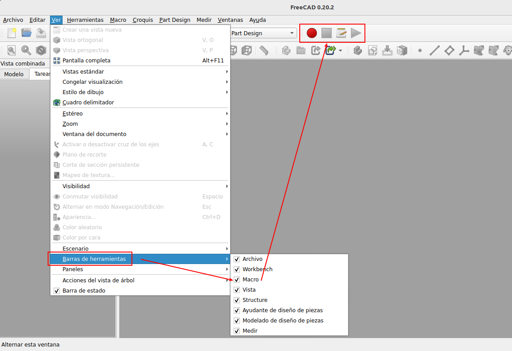  
*Ver barra de herramientas macros*

A continuación ya crear una macro y podemos poner en marcha la grabación de la macro (el botón rojo se pone inactivo y se activa el verde) y crear nuestro árbol de grupos o carpetas con los nombres que consideremos. Cuando acabemos hacemos clic en el botón de deterner (cuadrado verde en este momento) de la grabación. En la animación siguiente vemos este proceso.

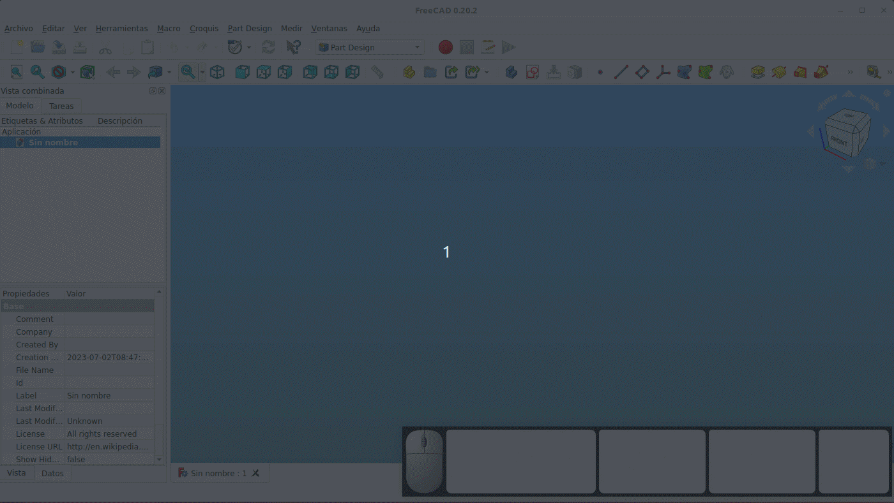  
*Crear, grabar y detener grabación de una macro*

Ya tenemos creada la macro y podemos ver todo el código que se ha generado para ello. En la siguienter animación vemos como acceder al código Python generado para la macro.

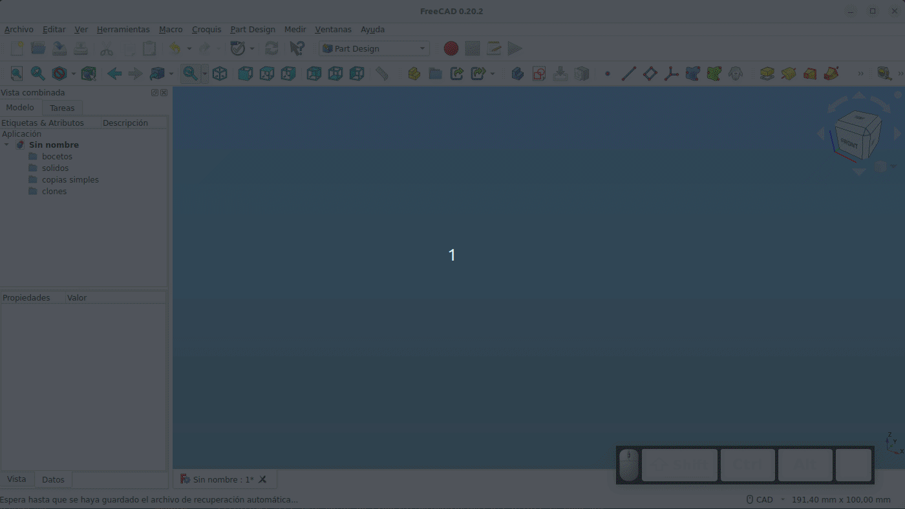  
*Acceso al código Python de la macro*

Podemos observar que se crean los grupos, que existen muchos comentarios y que renombrar los grupos no lo ha tenido en cuenta. Si ejecutamos la macro tal y como se ha creado sobre un documento nuevo podemos observar que se nos crea el árbol de grupos con cuatro elementos pero sin los nombres que se habian establecido. En la figura vemos el resultado de ejecutar la macro.

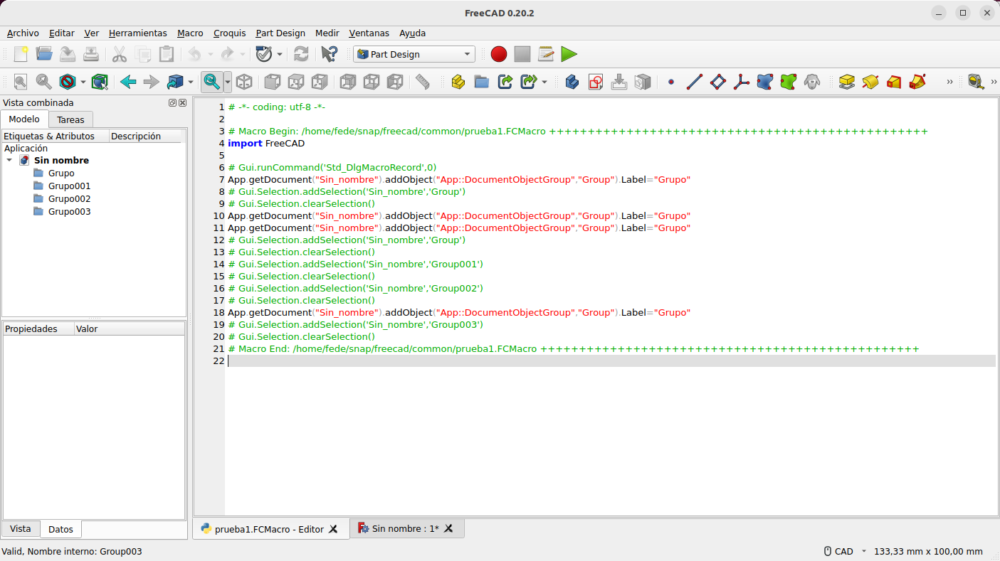  
*Ejecución de la macro*

Podemos editar la macro para poner los valores correctos de los Label y arreglar el tema, e incluso podemos eliminar todos los comentarios para acortar el código, pero es evidente que esta no parece la mejor forma de trabajar con macros. En la figura siguiente vemos la macro editada y el efecto de ejecutarla.

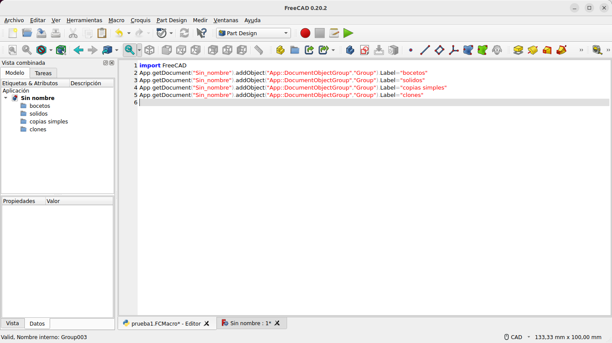  
*Edición y ejecución de la macro*

La macro también tiene un problema menor añadido y es que cuando la ejecutamos sin tener creado documento alguno de diseño nos va a devolver un error y no va a funcionar, cuando lo esperable es que se crease dicho documento.

Si queremos archivar los cambios en la macro basta con que la cerremos y confirmar que si queremos guardar esos cambios.

Es evidente que si guardamos el archivo de FreeCAD con la plantilla del árbol de grupos que queremos podemos abrir ese archivo y grabar la macro con lo que se va a crear el árbol de directorios. Pero este tampoco parece ser un método muy correcto de hacerlo si, por ejemplo, queremos modificar algo en esa estructura de árbol, tendremos que volver a grabar la macro. Pero el sistema si va a ser funcional si directamente desde la macro llamamos a la platilla y creamos un nuevo archivo, tal y como vamos a hacer en el apartado siguiente.

## **Creando código Python**
Vamos a crear una plantilla de aŕbol de grupos básica con las carpetas vistas. Para ello creamos un archivo de FreeCAD con la estructura de árbol vista y lo guardamos en un directorio específico donde siempre lo tengamos a mano. En mi caso lo voy a colocar en un directorio de nombre "Macros_FreeCAD" en la carpeta personal y le vamos a poner como nombre "PlantillaGrupos.FCStd".

Abrimos el cuadro de diálogo 'Macros' de FreeCAD y creamos una nueva plantilla de nombre 'FCArbolGrupos' (o el que creamos mas apropiado) y se nos crea una macro vacía o en blanco. En esta consola de Python vamos a escribir las dos líneas de código siguiente:

~~~
FreeCAD.openDocument('/home/fede/Macros_FreeCAD/PlantillaGrupos.FCStd')
Gui.SendMsgToActiveView("SaveAs")
~~~

La primera línea lo que hace es indicar que se abra un nuevo documento a partir del documento de FreeCAD que está en la ruta especificada. La segunda línea indicamos a la interfaz gráfica de usuario de FreeCAD, conocida también como GUI (del inglés graphical user interface), que abra la ventana de diálogo de Guardar como...

En la figura siguiente vemos el aspecto de la consola de Python en FreeCAD.

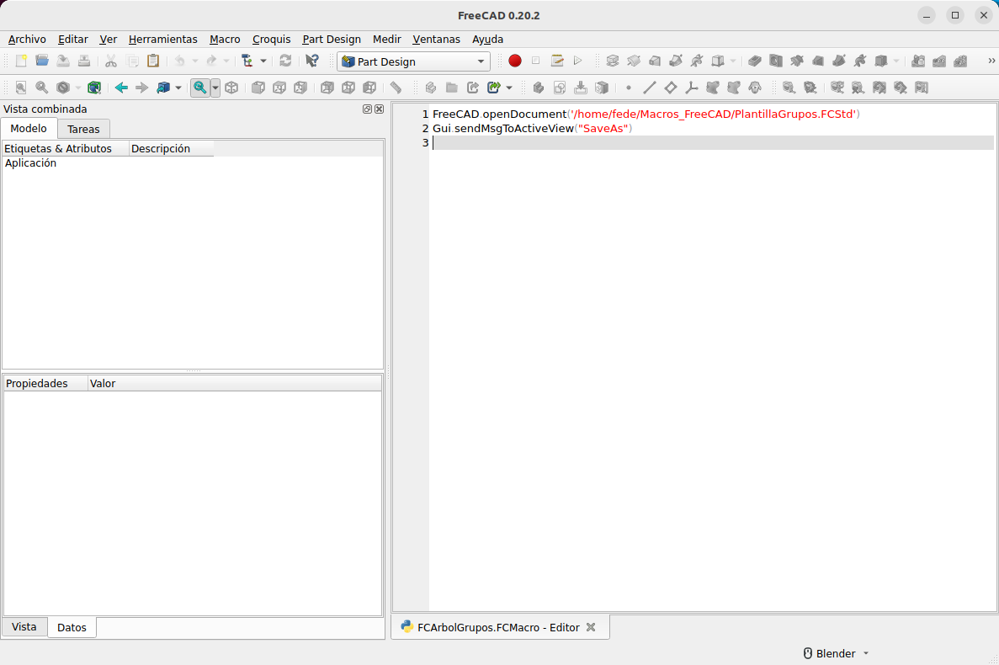  
*Consola de Python en FreeCAD para la plantilla FCArbolGrupos*

Cerramos y archivamos la macro y desde la ventana de FreeCAD si ningún archivo creado vamos al menú de macros y la ejecutamos para comprobar como se crea un proyecto sin nombre y con los grupos vistos. En la animación siguiente vemos la macro en funcionamiento.

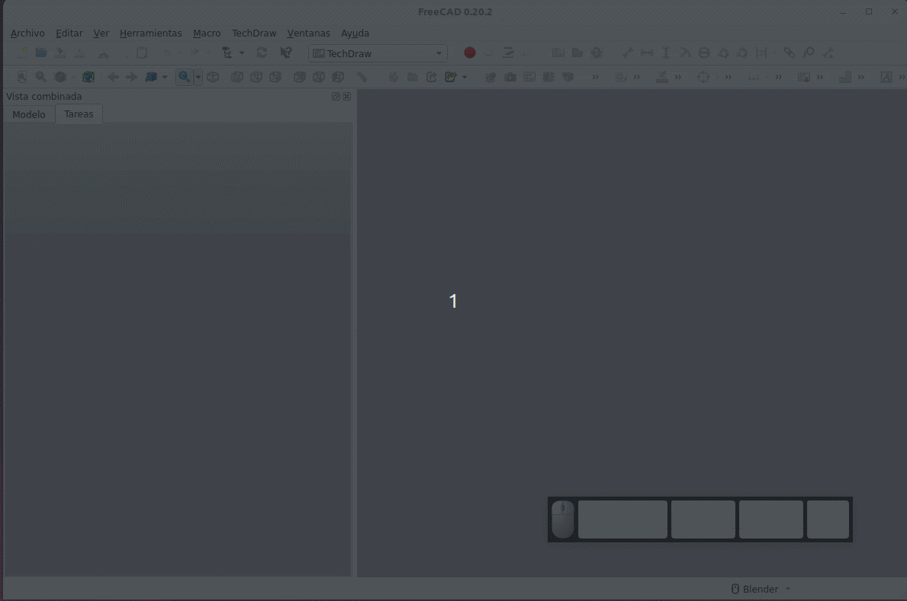  
*Macro FCArbolGrupos en funcionamiento*

Es evidente que ahora las modificaciones que hagamos en el árbol de grupos se verán reflejadas cuando ejecutemos la macro a partir de dicha de modificación.

## **Ponemos icono a la macro**
El siguiente proceso que vamos a realizar con esta macro de ejemplo es ponerle un icono y crearle su propia barra de herramientas para así tenerla disponible en un clic.

Al abrir el cuadro de diálogo 'Macro' vemos una ventana con las macros existentes y su localización y al seleccionar una de ellas se ponen activos los botones y nos interesa en particular el que pone 'Barra de herramientas'. Si no lo hemos desactivado previamente hacer clic en este botón nos inicia un tutorial de como poner la macro en una barra de herramientas global.

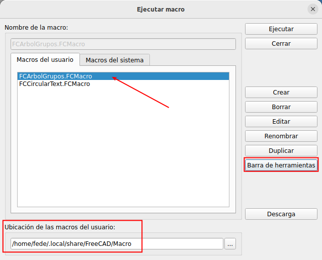  
*Cuadro de diálogo Macro con FCArbolGrupos seleccionada*

Hemos destacado el directorio donde se ubican las macros de usuario en Ubuntu 22.04 (*/home/fede/.local/share/FreeCAD/Macro*) y es aquí donde finalmente situaremos la definitiva que crearemos. La parte */home/fede* nos va a dirigir a la Carpeta personal para posteriormente marcar una ruta que comienza por el directorio oculto *.local* seguido del resto de nombres.

Al hacer clic en el botón 'Barra de herramientas' se nos muestra la ventana de la figura siguiente, donde podemos ver como evitar que esta ventana y las sucesivas vuelvan a aparecer. En mi opinión particular siempre es interesante mantener activo el tutorial dado que esta no es una tarea que realicemos muy habitualmente.

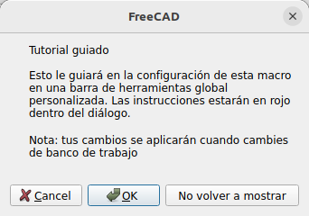  
*Inicio del tutorial guiado*

Al hacer clic en OK se muestra la ventana de la figura siguiente.

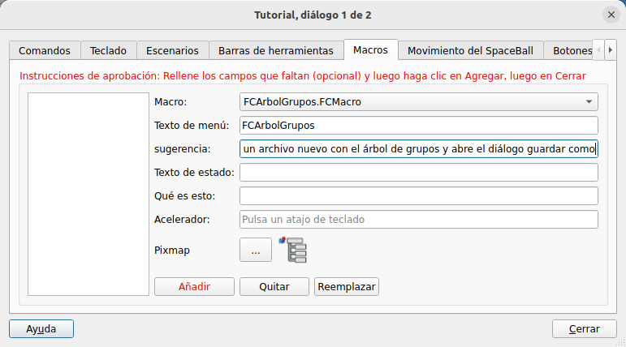  
*Inicio del tutorial guiado, diálogo 1 de 2*

En la figura observamos que tenemos disponible la posibilidad de seleccionar la macro, configurar el texto que queremos que aparezca en el menú Macros, la sugerencia o texto de ayuda que aparece al dejar el cursor sobre el icono. Opcionalmente podemos también añadir un Texto de estado, un texto para Que es esto y una combinación de teclas para acceso rápido desde teclado.

En esa imagen también observamos que hemos asignado un nuevo icono a la macro. Este icono se ha creado a partir del existente para PartDessign de nombre

'PartDesign_MoveFeatureInTree.svg'

que está disponible en [Artwork Part](https://wiki.freecad.org/Artwork_Part) de la wiki de FreeCAD. El icono nuevo se ha nombrado como 'AutomaticTree.svg' y está disponible en [este enlace](../img/macros/iconos/AutomaticTree.svg).

Una vez cumplimentados los campos de la ventana hacemos clic en 'Añadir' y veremos la siguiente ventana.

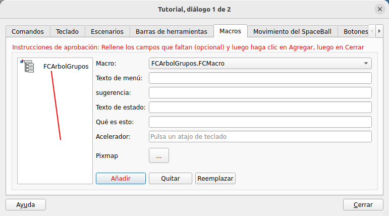  
*Inicio del tutorial guiado, diálogo 1 de 2 tras clic en Añadir*

Ya podemos cerrar la ventana anterior para que se nos abra la ventana Tutorial, diálogo 2 de 2 que vemos en la figura siguiente.

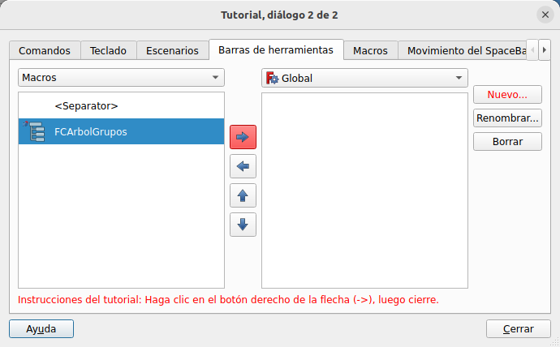  
*Tutorial guiado, diálogo 2 de 2*

En esta ventana, de la pestaña barra de herramientas, podemos optar por añadir la macro de la izquierda a 'Global', lo que hará que el icono aparezca esté en el banco de trabajo que esté o por crear mi propia Barra de herramientas con 'Añadir' y llevar la macro a esa nueva barra. Lógicamente también están disponibles el resto de opciones que no requieren, a mi juicio, mayor explicación. En mi caso voy a crear una nueva barra de herramientas y añadir la macro a la misma. Así si en el futuro tengo que añadir mas macros o enlaces lo podré hacer en esta barra de herramientas. En la figura siguiente vemos el estado final creado y volvemos a la ventana de FreeCAD.

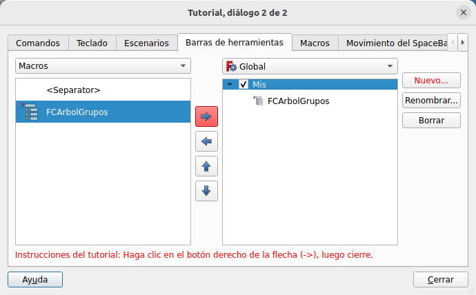  
*Tutorial guiado, diálogo 2 de 2 configurado*

Si cambiamos de banco de trabajo veremos como nuestra nueva barra de herramientas aparece junto al resto de barras tal y como vemos en la animación siguiente, donde se puede apreciar com aparece el nombre dado a la barra, el texto de ayuda rápida creado y el icono.

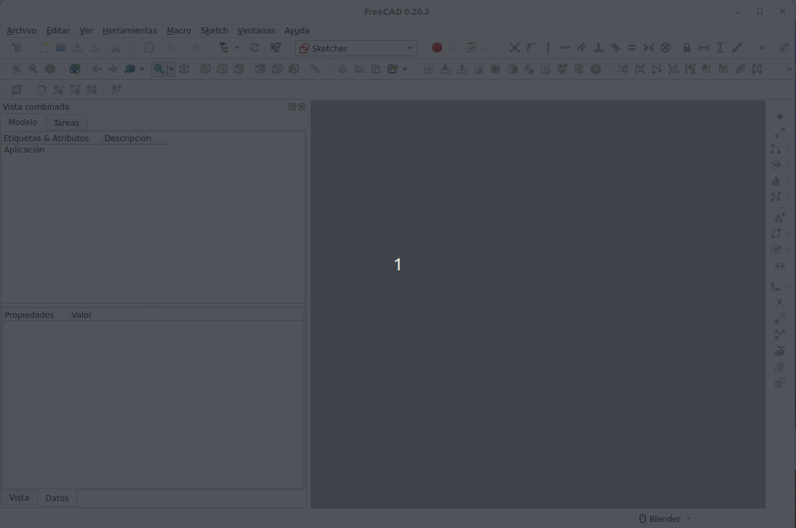  
*Barra de herramientas Mis con figurada*

## **Macro ampliada**
En este apartado lo que vamos a ver es como añadir opciones interesantes a la macro y crear una macro mas definitiva que permita simplificar el trabajo cuando comenzamos con un proyecto. Comenzamos por poner la macro en modo edición en una consola de Python para, además de abrir el archivo plantilla y llamar a guardar como, añadir una hoja de cálculo o Spreadsheet y un archivo de texto donde poder realizar anotaciones relativas al diseño en cuestión. El código Python de la macro queda finalmente de la siguiente forma:

~~~
#Abrimos la plantilla de carpetas o grupos
FreeCAD.openDocument('/home/fede/Macros_FreeCAD/PlantillaGrupos.FCStd')
#Abre el módulo Spreadsheet desde la macro
import Spreadsheet
#Añade una hoja con el nombre Datos
App.activeDocument().addObject('Spreadsheet::Sheet','Datos')
#Añade un archivo de texto con el nombre Leeme
App.ActiveDocument.addObject("App::TextDocument","Text document").Label="Leeme"
#Recalculo la aplicación
App.ActiveDocument.recompute()
#Llamamos a guardar como de GUI
Gui.SendMsgToActiveView("SaveAs")
~~~

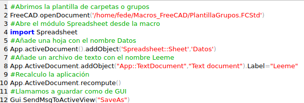  
*Código Python de la macro*

El aspecto de un archivo recien creado con la macro reformada lo vemos en la figura siguiente.

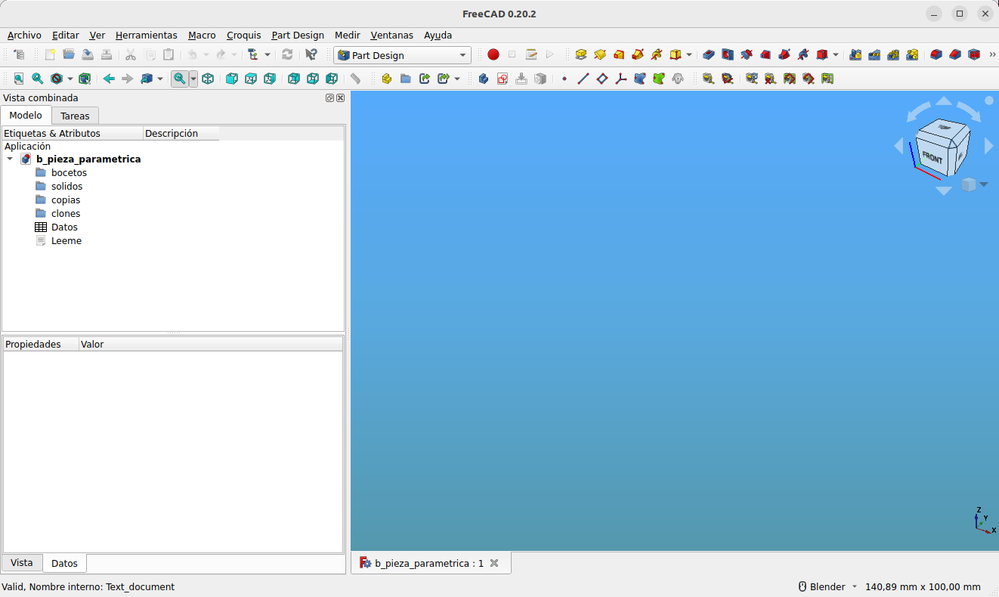  
*Archivo creado con la macro*

